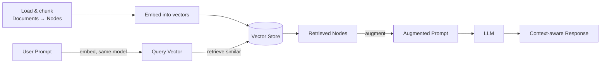
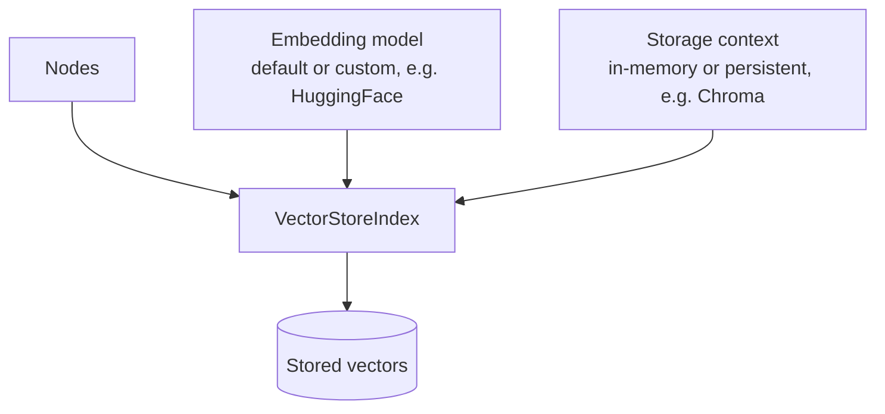
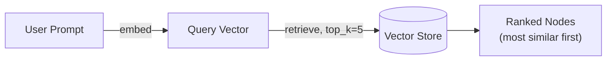
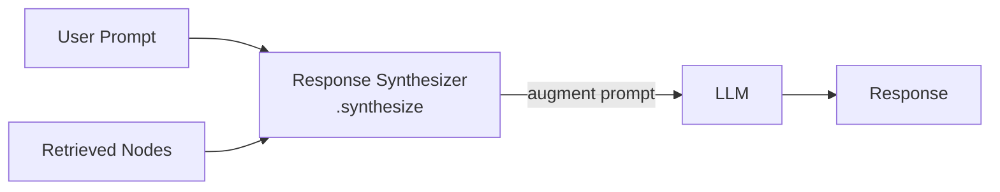
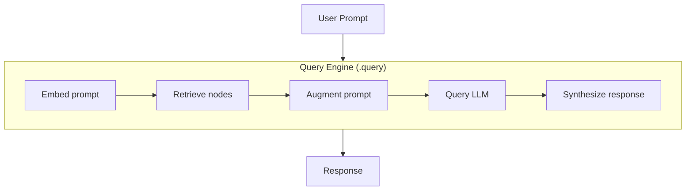
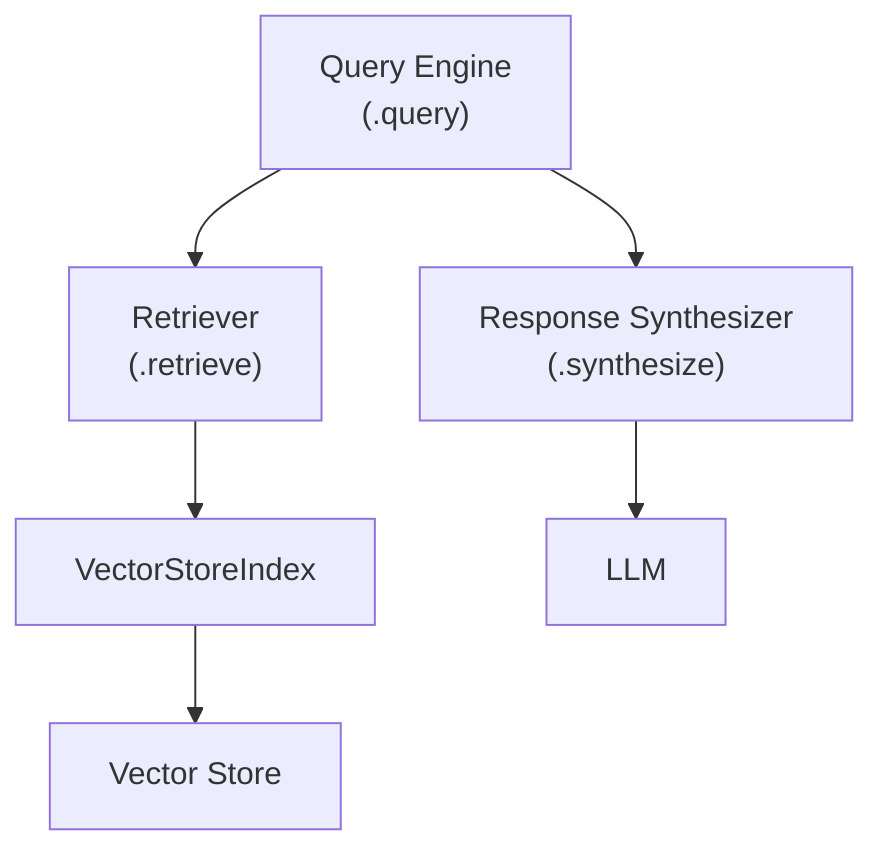

# LlamaIndex: from vector stores to query engines

Continues from [llama-index-for-rag.md](llama-index-for-rag.md) (loading
documents, chunking into nodes). This note covers the rest of the RAG
pipeline: embedding nodes into a vector store, retrieval, and the
higher-level abstractions — response synthesizer and query engine — that
combine the later RAG steps into one call.

## RAG, recap



This note picks up after "load & chunk" — embedding, storage, retrieval,
and everything downstream.

## Embedding and storing nodes: `VectorStoreIndex`

LlamaIndex uses the **`VectorStoreIndex`** class to both generate
embeddings for a set of nodes and store the resulting vectors.

### Simple case: default model, in-memory storage

```python
from llama_index.core import VectorStoreIndex

index = VectorStoreIndex(nodes)
```

Passing just the `nodes` embeds them with a default embedding model and
keeps the vectors in memory — good enough for quick experiments.

### More control: custom embedding model, persistent storage

```python
import chromadb
from llama_index.vector_stores.chroma import ChromaVectorStore
from llama_index.embeddings.huggingface import HuggingFaceEmbedding
from llama_index.core import VectorStoreIndex, StorageContext

# 1. Embedding model
embed_model = HuggingFaceEmbedding(model_name="all-MiniLM-L6-v2")

# 2. Vector store + storage context
chroma_client = chromadb.PersistentClient(path="./chroma_db")
chroma_collection = chroma_client.get_or_create_collection("my_docs")
vector_store = ChromaVectorStore(chroma_collection=chroma_collection)
storage_context = StorageContext.from_defaults(vector_store=vector_store)

# 3. Build the index: embed nodes, persist vectors
index = VectorStoreIndex(
    nodes,
    embed_model=embed_model,
    storage_context=storage_context,
)
```

Either way — default/in-memory or custom/persistent — `VectorStoreIndex`
handles both embedding the text chunks and storing the resulting vectors.



## Retrieval: `as_retriever`

Given a `VectorStoreIndex`, retrieval — embedding the user's prompt and
pulling back similar nodes — is two calls:

```python
retriever = index.as_retriever(similarity_top_k=5)
results = retriever.retrieve("What did I write about deadlines?")
```

- `as_retriever()` builds a retriever from the index. `similarity_top_k`
  sets **k**, the max number of nodes to retrieve (default shown here:
  5).
- `retriever.retrieve(prompt)` embeds the prompt with the same model used
  for the nodes, searches the vector store, and returns a **ranked list**
  of the k most similar nodes — most similar first.



## Response synthesizer

The **response synthesizer** combines the remaining RAG steps — prompt
augmentation, querying the LLM, and generating the response — into one
call.

```python
from llama_index.core.response_synthesizers import get_response_synthesizer

synthesizer = get_response_synthesizer()
response = synthesizer.synthesize(
    query="What did I write about deadlines?",
    nodes=results,  # retrieved nodes from the retriever
)
```

Given the original prompt and the retrieved nodes, `.synthesize()`
augments the prompt with the retrieved text, sends it to the LLM, and
returns the response — all in the background. If the first batch of
context doesn't fit in one call, the synthesizer can refine the answer
using leftover nodes across multiple LLM calls. You can customize its
behavior with a different LLM or a custom prompt template.



## Query engine: the whole pipeline in one call

The **query engine** goes a step further: it combines prompt embedding,
retrieval, prompt augmentation, LLM querying, and response generation
into a single object, so you never manually call a retriever or a
response synthesizer.

```python
query_engine = index.as_query_engine(similarity_top_k=5)
response = query_engine.query("What did I write about deadlines?")
print(response)
```

One `.query()` call does everything — embed the prompt, retrieve top-k
nodes, augment the prompt, call the LLM, synthesize the response.



### How the abstractions stack



Each layer wraps the one below it with less code and less manual wiring —
`VectorStoreIndex` → `Retriever` → (`Retriever` + `Response Synthesizer`)
→ `Query Engine`.

### Customizing a query engine

A query engine has sensible defaults, but every piece is swappable:

- **LLM** — pass a different model than the default.
- **Prompt template** — supply a custom template for how retrieved text
  augments the prompt.
- **Retriever** — pass a custom retriever (e.g. different `top_k`,
  hybrid search, a custom index type) instead of the default one.

```python
from llama_index.llms.anthropic import Anthropic

query_engine = index.as_query_engine(
    llm=Anthropic(model="claude-sonnet-5"),
    similarity_top_k=3,
)
```

## Recap

- **`VectorStoreIndex`** embeds nodes and stores the vectors — in-memory
  with a default model for simple cases, or with a custom embedding model
  and a persistent vector store (e.g. Chroma via a `StorageContext`) for
  production cases.
- **Retrieval**: `index.as_retriever(similarity_top_k=k)` builds a
  retriever; `.retrieve(prompt)` embeds the prompt and returns the k most
  similar nodes, ranked by similarity.
- **Response synthesizer**: `.synthesize(query, nodes)` combines prompt
  augmentation, LLM querying, and response generation into one call,
  refining the answer across leftover nodes if needed.
- **Query engine**: `index.as_query_engine()` + `.query(prompt)` combines
  *everything* — embedding, retrieval, augmentation, LLM call, and
  synthesis — into a single call. It's customizable via a different LLM,
  a custom prompt template, or a custom retriever.

See also: [llama-index-for-rag.md](llama-index-for-rag.md) for loading and
chunking, and [what-is-llama-index.md](what-is-llama-index.md) for the
broader framework overview and LlamaIndex-vs-LangChain comparison.
