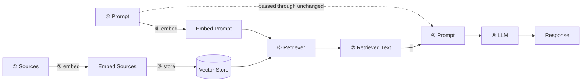
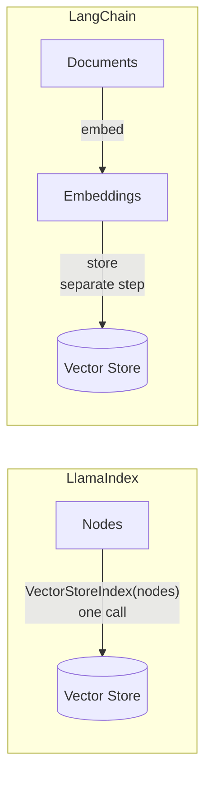
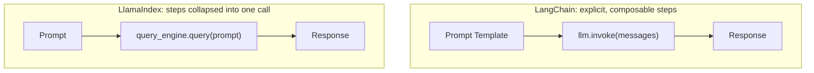

# LangChain vs. LlamaIndex (in the context of RAG)

Both LangChain and LlamaIndex are frameworks for LLM-powered context
augmentation, used to build RAG applications, chatbots, and
document-understanding/data-extraction tools. Since most of those other
use cases lean on the same building blocks as RAG (a chatbot is often
"RAG + multi-turn"), comparing the two frameworks stage-by-stage through
a RAG pipeline gives a comprehensive picture of how they differ.

See also: [what-is-llama-index.md](what-is-llama-index.md),
[llama-index-for-rag.md](llama-index-for-rag.md), and
[from-vector-stores-to-query-engine.md](from-vector-stores-to-query-engine.md)
for LlamaIndex-only deep dives on these same steps.

## A very brief review of RAG



The eight stages:

1. Load and chunk the source documents.
2. Embed the chunks/documents — text → numerical vectors.
3. Store the vectors, typically in a vector database.
4. Accept the user's original prompt.
5. Embed the prompt with the *same* model used for the source documents.
6. Retrieve the most similar chunks by comparing the prompt embedding
   against the stored embeddings.
7. Augment the prompt with the retrieved information.
8. Pass the augmented prompt to the LLM to get a context-aware response.

## 1. Loading and chunking source documents

### Document loading

**LangChain** — many small, dedicated loaders, composed as needed:

- `TextLoader` — plain text
- `CSVLoader` — CSV
- `JSONLoader` — JSON
- `WebBaseLoader` — web pages (via BeautifulSoup4)
- `DoclingLoader` — PDF, DOCX, PPTX, HTML, etc. via Docling
- `UnstructuredLoader` — many formats, via the `unstructured` library
- `DirectoryLoader` — loads a whole directory; uses `UnstructuredLoader`
  under the hood by default, but this is swappable

Plus integrations for SQL databases, cloud storage (e.g. S3), and
specific app files (e.g. Figma).

**LlamaIndex** — one powerful default, plus a hub:

- `SimpleDirectoryReader` (core library) — natively handles markdown,
  PDF, Word, PowerPoint, and more. Loads a single file, a whole
  directory (optionally recursive), or files matching specific
  extensions.
- **LlamaHub** — a registry of additional data connectors:
  `DatabaseReader` (SQL), `JSONReader`, `RssReader`, and many more.

**Comparison** — LlamaIndex's `SimpleDirectoryReader` gives a stronger
out-of-the-box experience for common formats. LangChain's `DirectoryLoader`
is more flexible — it can be configured to use any of LangChain's many
loaders. This reflects a general design difference: **LlamaIndex favors
native, built-in solutions**, reaching for external libraries only when
needed; **LangChain leans on integrations and a modular design**, with
much of its core functionality depending on external packages.

### Document chunking

**LangChain** offers several chunking strategies:

- **Length-based**: `CharacterTextSplitter` (splits on a character
  sequence, e.g. `\n\n`, capped by character length — or by token count
  when used as a token-based splitter) and `TokenTextSplitter`
  (encode → split tokens by length → decode).
- **`RecursiveCharacterTextSplitter`** — splits on a list of characters in
  order (e.g. `["\n\n", "."]`): split on the first, and recursively
  re-split any still-too-long chunk on the next.
- **Document-structured**: splits based on a file's own structure, e.g.
  `MarkdownHeaderTextSplitter` (splits on `#`, `##`, ...). Also available
  for code, HTML, and JSON (recursive).
- **`SemanticChunker`** — splits where similarity between adjacent
  sentences drops below a threshold, finding natural conceptual breaks.

**LlamaIndex** calls a chunk a **node**, and offers:

- **`SentenceSplitter`** — the basic-use default; similar to
  `RecursiveCharacterTextSplitter`, but token-based (chunk size is a
  token count).
- **File-based node parsers** — for HTML, JSON, markdown (LangChain's
  document-structured splitters, equivalent). Also a code splitter — but
  unlike LangChain's, LlamaIndex's code splitter is text-based, not
  file-based.
- **`SemanticSplitterNodeParser`** — same idea as LangChain's
  `SemanticChunker`.
- **`LangChainNodeParser`** — a wrapper that lets you use *any* LangChain
  text splitter inside LlamaIndex.

**Comparison** — for basic usage, LlamaIndex's `SentenceSplitter` ships
with a more comprehensive default separator list than LangChain's
`RecursiveCharacterTextSplitter`, so it tends to work better out of the
box. Both frameworks otherwise offer comprehensive splitting coverage,
and LlamaIndex even wraps LangChain's splitters if you want to mix and
match.

## 2. Embed the chunks or documents

Both frameworks offer many embedding-model integrations (HuggingFace,
OpenAI, etc.), and LlamaIndex also wraps LangChain embedding models so
you can reuse any LangChain-compatible model.

**Key design difference**: in **LlamaIndex**, embedding generation and
vector-store storage typically happen **in one command**. In
**LangChain**, embeddings are generated first, then stored in a separate
step.



## 3. Store vectors in a vector store

**LangChain** has no single, all-encompassing vector store class. Its
core library ships only `InMemoryVectorStore`; everything else is an
integration:

- `Chroma` — Chroma DB
- `FAISS` — Facebook AI Similarity Search
- `Milvus` — Milvus
- `PGVector` — pgvector-extended PostgreSQL

**LlamaIndex**'s `VectorStoreIndex` stores vectors in memory by default,
but can be backed by a full vector database (Chroma, FAISS, ...) — and
because it's one class regardless of backend, you can **swap the vector
store without changing downstream code**. Embedding + storing is one
command:

```python
index = VectorStoreIndex(nodes)  # nodes from a LlamaIndex chunker
```

**Metadata**: LlamaIndex automatically creates and stores chunk metadata
inside `VectorStoreIndex`. LangChain often requires manual metadata
setup, and — because of its modular design — the mechanics vary by which
vector store backend you're using. The flip side: LangChain's
per-backend integrations (not hidden behind one class) expose each
vector store's unique features with more granular control.

## 4. Accept the user's original prompt

Neither framework has a specific implementation for this — both assume
the prompt arrives from some other part of your application/workflow.

## 5. Embed the user's original prompt

Both frameworks typically embed the prompt via a **retriever** built from
the vector store object, for two reasons:

- The prompt must be embedded with the *same* model used for the stored
  chunks, and that model is already attached to the vector store object.
- The prompt embedding exists only to drive retrieval, so combining
  "embed" with "retrieve" is natural.

No meaningful implementation difference between the two frameworks here.

## 6. Retrieve relevant chunks

For the common case — top-k similarity retrieval — LangChain and
LlamaIndex offer comparable functionality. Both also support advanced
retrieval patterns. E.g. LangChain's **parent document retriever**
retrieves the full parent document that contains a matching chunk, rather
than just the chunk — which requires *two* vector stores (one for chunks,
one for parent documents).

Advanced retrieval patterns are framework- and use-case-specific enough
that it's worth checking both frameworks' retriever options directly if
your project needs something beyond plain top-k.

## 7. Augment the user's original prompt

Both use **prompt templates** with placeholders filled in by the original
prompt and the retrieved text — but they differ in how augmentation
composes with the surrounding steps.

**LangChain**: prompt augmentation is a **standalone step**, not merged
with what comes before or after — which makes template customization
straightforward.

**LlamaIndex**: augmentation is **combined** with later steps —
with a *response synthesizer*, it's merged with LLM response generation;
with a *query engine*, it's merged with query embedding, retrieval, *and*
response generation too. Default templates work well for most cases, but
customizing them is a bit harder precisely because the step isn't
isolated.

## 8. Pass the augmented prompt to the LLM

**LangChain** — manual, explicit call:

```python
messages = prompt_template.invoke({...})
response = llm.invoke(messages)
```

**LlamaIndex** — combined with prompt augmentation, via one of:

- A **response synthesizer** — takes the original prompt + retrieved
  nodes, augments internally, and returns the LLM's response.
- A **query engine** — derived from the vector store index, takes just
  the original prompt, and internally performs query embedding,
  retrieval, prompt augmentation, *and* LLM response generation.



## Step-by-step summary

| Step | LangChain | LlamaIndex |
|---|---|---|
| Load docs | Many small loaders (`TextLoader`, `CSVLoader`, ...) + `DirectoryLoader` | `SimpleDirectoryReader` handles most formats natively; LlamaHub for more |
| Chunk | `CharacterTextSplitter`, `RecursiveCharacterTextSplitter`, structure-based splitters, `SemanticChunker` | `SentenceSplitter` (token-based), file-based node parsers, `SemanticSplitterNodeParser`, or wrap any LangChain splitter |
| Embed | Separate step from storage | Combined with storage (one call) |
| Store | No unified class; integrations (Chroma, FAISS, Milvus, PGVector) or `InMemoryVectorStore` | Unified `VectorStoreIndex`, swappable backend, auto metadata |
| Accept prompt | App-defined | App-defined |
| Embed prompt | Via retriever, same model as source docs | Via retriever, same model as source docs |
| Retrieve | Top-k + advanced patterns (e.g. parent document retriever) | Top-k + advanced patterns |
| Augment prompt | Standalone step, easy to customize | Merged into response synthesizer / query engine |
| Query LLM | Manual `llm.invoke(messages)` | Merged into response synthesizer / query engine |

## Conclusion

Both frameworks handle most typical RAG workflows well.

- **LangChain** — strong in integrations, modular design, and granular
  access/customization of each component. Trade-off: more manual setup
  (e.g. metadata configuration varies by vector store backend).
- **LlamaIndex** — strong in simplicity and speed of development, with
  sensible defaults and native solutions for common tasks (
  `SimpleDirectoryReader` handling many file types out of the box,
  `VectorStoreIndex` abstracting the vector-store backend so downstream
  code doesn't care which one you use). Trade-off: customization is
  somewhat harder since more steps are bundled together (e.g. prompt
  augmentation merged into the query engine).

Rule of thumb: reach for **LlamaIndex** when you want RAG working
quickly with minimal wiring; reach for **LangChain** when you need
fine-grained control over each step or want to mix in a broad range of
integrations and advanced orchestration (LangGraph).
