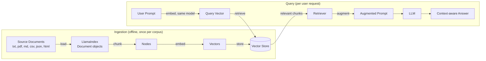
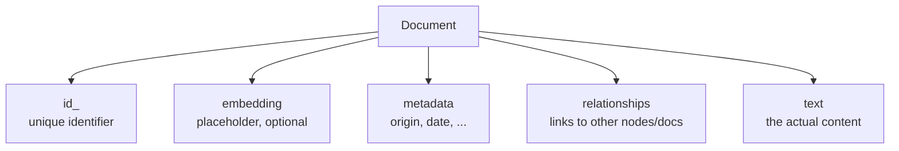
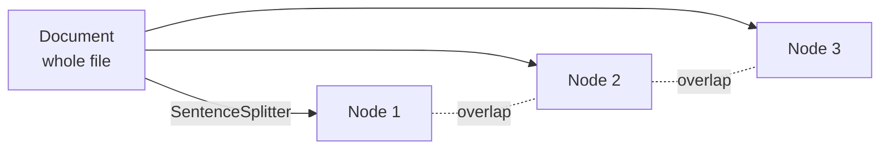
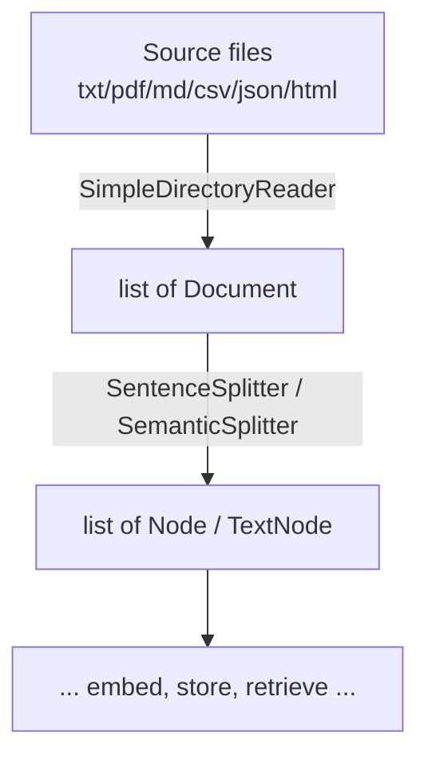

# LlamaIndex for RAG: document ingestion and chunking

Notes on how LlamaIndex loads source documents and splits them into chunks
as the first step of a RAG pipeline. See [what-is-llama-index.md](what-is-llama-index.md)
for the broader LlamaIndex overview.

## What is LlamaIndex, again

LlamaIndex is a framework for building LLM-powered **context
augmentation** — making your own data available to an LLM so it can
ground its responses in that data instead of relying only on what it
learned during training.

Typical use cases:

- **Question answering with RAG** — the focus of this note.
- **Chatbots** — RAG extended with multi-turn back-and-forth, so the LLM
  can ask clarifying questions or answer follow-ups.
- **Document understanding / data extraction** — reading unstructured or
  structured text and pulling out specific details (names, dates,
  addresses, figures).

Most other LlamaIndex use cases build on the same components used in RAG,
so understanding the RAG pipeline covers most of the framework.

## The RAG pipeline, end to end



Walking through it:

1. **Load and chunk** the source documents.
2. **Embed** each chunk with an embedding model — every chunk becomes a
   fixed-size vector.
3. **Store** the vectors in a vector store, a database built for storing
   and searching vectors.
4. At query time, **embed the user's prompt** with the *same* embedding
   model used for the documents, so the two live in the same vector space.
5. A **retriever** searches the vector store for the chunks most similar
   to the prompt vector.
6. The retrieved text **augments** the original prompt.
7. The augmented prompt goes to the **LLM**, which answers grounded in the
   retrieved context.

This note covers step 1 — loading documents and splitting them into
chunks. Embedding, storage, and retrieval are covered elsewhere.

## Step 1a: loading documents

LlamaIndex's generic container for any piece of source data is the
**`Document`** class. LlamaIndex can load text out of a wide range of
formats:

- Plain text
- PDF
- Markdown
- CSV
- JSON
- HTML

It also ships connectors for loading from databases and cloud storage, on
top of local files.

### The `Document` class

```python
from llama_index.core import Document

doc = Document(text="Hello LlamaIndex")
print(doc.dict())
```

Inspecting a `Document` shows its key components:

- **`id_`** — a unique ID for the document.
- **`embedding`** — a placeholder, populated only if you choose to embed
  the whole document (as opposed to embedding its chunks).
- **`metadata`** — a dict for anything about the document itself, e.g.
  origin, author, creation date.
- **`relationships`** — a dict linking this document/node to related
  items, e.g. the next/previous chunk.
- **`text`** — the actual text content.



### Loading local files with `SimpleDirectoryReader`

`SimpleDirectoryReader` is LlamaIndex's built-in loader for local files —
it handles plain text, Markdown, CSV, PDF, and more, and returns a list of
`Document` objects.

```python
from llama_index.core import SimpleDirectoryReader

# Load every file in a directory
documents = SimpleDirectoryReader("./notes").load_data()
```

Variants:

```python
# Include subdirectories
documents = SimpleDirectoryReader("./notes", recursive=True).load_data()

# Load specific files only
documents = SimpleDirectoryReader(
    input_files=["./notes/a.md", "./notes/b.pdf"]
).load_data()

# Restrict to specific file types
documents = SimpleDirectoryReader(
    "./notes", required_exts=[".md", ".pdf"]
).load_data()
```

`SimpleDirectoryReader.load_data()` always returns a `list[Document]`.

## Step 1b: chunking documents into nodes

A **`Node`** is simply a chunk of text — a `Document` split into smaller
pieces. Chunking matters because it keeps each embedded piece focused on a
specific, local context, which leads to more precise and relevant
embeddings at retrieval time than embedding whole (long) documents.



### `SentenceSplitter`

LlamaIndex's default, effective text chunker. It's a **recursive**
splitter: it tries to split on higher-level boundaries first (like
paragraph/newline breaks), then falls back to finer ones (like sentence
periods) until chunks fit the target size.

```python
from llama_index.core.node_parser import SentenceSplitter

splitter = SentenceSplitter(chunk_size=500, chunk_overlap=50)
nodes = splitter.get_nodes_from_documents(documents)
```

- **`chunk_size`** — max chunk size, in tokens.
- **`chunk_overlap`** — max tokens shared between consecutive chunks, so
  context isn't lost at a chunk boundary.

`get_nodes_from_documents` returns a `list` of LlamaIndex `TextNode`
objects — structurally similar to `Document` (same `id_` / `embedding` /
`metadata` / `relationships` / `text` shape), just smaller and linked to
their source document and neighboring nodes.

### Other splitters

- **`SemanticSplitter`** — splits wherever semantic similarity between
  adjacent sentences drops below a threshold, instead of a fixed size.
  Chunk boundaries follow meaning rather than token count.
- **LangChain splitter wrapper** — LlamaIndex ships a wrapper that lets
  you plug in any LangChain text splitter if you already have one you
  like.

## Recap



- LlamaIndex = framework for LLM context augmentation; RAG, chatbots, and
  document understanding/data extraction are its main use cases.
- **Loading**: `SimpleDirectoryReader` turns files (txt, pdf, md, csv,
  json, html, + cloud/DB connectors) into `Document` objects, each with an
  id, optional embedding, metadata, relationships, and text.
- **Chunking**: `SentenceSplitter` (recursive, separator-based) turns
  `Document`s into `Node`s, controlled by `chunk_size` and
  `chunk_overlap`. `SemanticSplitter` and a LangChain-splitter wrapper are
  available alternatives.
- Nodes are what actually get embedded and stored in the next step of the
  RAG pipeline.
