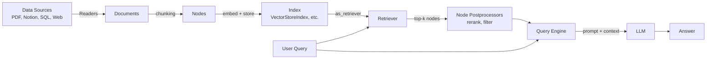
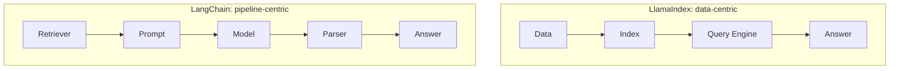

# What is LlamaIndex

LlamaIndex is a Python/TS framework built specifically around **indexing and
retrieving data for LLMs** — i.e. RAG. Where LangChain is a general-purpose
toolkit for chaining LLM calls together, LlamaIndex is opinionated and
optimized for one job: get your data into a form an LLM can query well, and
query it efficiently.

## Core components

### Documents / Nodes
A `Document` is a raw piece of data (a file, a DB row, a web page). LlamaIndex
splits each `Document` into `Node`s — the atomic chunk of text (plus
metadata and relationships to neighboring nodes) that actually gets
embedded and retrieved.

### Data Connectors (Readers)
Load data from a source into `Document`s. LlamaHub has hundreds of readers
(PDF, Notion, Slack, SQL, Google Drive, ...) — this is LlamaIndex's biggest
ecosystem strength over LangChain's loaders.

### Indexes
The core abstraction. An index organizes `Node`s for efficient retrieval:
- `VectorStoreIndex` — embeds nodes, retrieves by similarity (the default,
  most common choice).
- `SummaryIndex` — retrieves by iterating/summarizing all nodes (good for
  small corpora or "summarize everything" queries).
- `KeywordTableIndex` — retrieves by keyword match.
- `TreeIndex` — builds a hierarchical summary tree, good for long documents.

### Retrievers
Given a query, pull the relevant `Node`s out of an index. Each index type
has a matching retriever, and you can customize retrieval strategy
(top-k, hybrid search, auto-merging, etc.) independently of the index.

### Node Postprocessors
Filter/rerank/transform retrieved nodes before they reach the LLM —
e.g. a reranker model, a similarity-score cutoff, or deduplication.

### Query Engines
Wrap a retriever + an LLM into a single `.query()` call: retrieve →
(optionally postprocess) → synthesize an answer. This is the main
user-facing abstraction for "ask a question over my data."

### Chat Engines
Like a query engine, but stateful across turns — maintains conversation
history so you can have a multi-turn RAG conversation.

### Agents
LlamaIndex also has agents (`FunctionAgent`, `ReActAgent`, etc.) that can
call tools, including query engines exposed *as* tools — so an agent can
decide which index/source to query.

## How the pieces fit together



## Installation

```bash
pip install llama-index
# provider-specific packages, e.g.:
pip install llama-index-llms-anthropic llama-index-embeddings-huggingface
```

## A very simple example

The minimal LlamaIndex RAG pattern: load → index → query.

```python
from llama_index.core import VectorStoreIndex, SimpleDirectoryReader
from llama_index.llms.anthropic import Anthropic
from llama_index.core import Settings

Settings.llm = Anthropic(model="claude-sonnet-5")

# 1. Load documents from a folder
documents = SimpleDirectoryReader("./notes").load_data()

# 2. Build an index (chunks, embeds, and stores automatically)
index = VectorStoreIndex.from_documents(documents)

# 3. Query it
query_engine = index.as_query_engine()
response = query_engine.query("What did I write about deadlines?")
print(response)
```

Compare this to the LangChain RAG example in [langchain.md](../langchain.md)
step 2-6 — LlamaIndex collapses loading, splitting, embedding, storing, and
retrieval into two lines (`SimpleDirectoryReader` + `VectorStoreIndex`).
That's the core trade-off: less code for standard RAG, less visibility into
each step.

## Step-by-step: build a simple RAG Q&A app (with more control)

### 1. Install dependencies

```bash
pip install llama-index llama-index-llms-anthropic llama-index-embeddings-huggingface
```

### 2. Load and chunk explicitly

```python
from llama_index.core import SimpleDirectoryReader
from llama_index.core.node_parser import SentenceSplitter

documents = SimpleDirectoryReader("./notes").load_data()

splitter = SentenceSplitter(chunk_size=500, chunk_overlap=50)
nodes = splitter.get_nodes_from_documents(documents)
```

### 3. Embed and index

```python
from llama_index.core import VectorStoreIndex
from llama_index.embeddings.huggingface import HuggingFaceEmbedding

embed_model = HuggingFaceEmbedding(model_name="all-MiniLM-L6-v2")
index = VectorStoreIndex(nodes, embed_model=embed_model)
```

### 4. Build a query engine with a custom retriever

```python
from llama_index.core.retrievers import VectorIndexRetriever
from llama_index.core.query_engine import RetrieverQueryEngine
from llama_index.llms.anthropic import Anthropic

retriever = VectorIndexRetriever(index=index, similarity_top_k=3)
query_engine = RetrieverQueryEngine.from_args(
    retriever=retriever,
    llm=Anthropic(model="claude-sonnet-5"),
)
```

### 5. Ask a question

```python
response = query_engine.query("What did I write about deadlines?")
print(response)
print(response.source_nodes)  # inspect which chunks were used
```

## LlamaIndex vs. LangChain

Both wrap the same underlying pieces (loaders, chunkers, embeddings, vector
stores, LLM calls) — the difference is what's the *primary* abstraction and
how much is automated vs. exposed.

| | **LlamaIndex** | **LangChain** |
|---|---|---|
| Primary abstraction | Index / Query Engine | Chain (LCEL, `\|`) |
| Best at | RAG, data indexing/retrieval | General LLM app orchestration |
| Data connectors | LlamaHub — very broad | Document loaders — broad, less RAG-specific |
| Agents | Built-in, tool-using | Use LangGraph for non-trivial agents |
| Multi-turn chat | Chat Engine | Memory + chain |
| Composability | Less granular by default | Very granular (every step is a `Runnable`) |
| Learning curve | Lower for "just do RAG" | Lower for "just chain two things" |
| Ecosystem | RAG-focused integrations | Broadest general integrations (LCEL, LangGraph, LangSmith) |

### Conceptually



### Rule of thumb

- **Mostly RAG, many data sources, want retrieval to "just work"** →
  LlamaIndex.
- **Need fine-grained control over every step, or building multi-step
  agents/workflows beyond retrieval** → LangChain (+ LangGraph).
- **Both can interoperate** — LlamaIndex has LangChain adapters
  (`llama-index-llms-langchain`) and you can use a LlamaIndex query engine
  as a LangChain `Tool`, or vice versa. Many real projects mix them: RAG
  layer in LlamaIndex, agent orchestration in LangGraph.

See also: [langchain.md](../langchain.md),
[langchain-ecosystem.md](../langchain-ecosystem.md).
