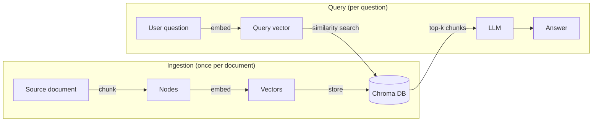

# Step 0 — Overview and Concepts

> [Back to index](README.md) · Next: [Environment Setup](02-environment-setup.md)

## Goal

Build a mental model of what "chunking" actually controls in a RAG pipeline, and get a name and a one-line description for each of the six strategies this walkthrough builds — before writing a single line of code.

## Why this matters

Every RAG app in this repo's series follows the same two-phase shape (load → chunk → embed → store, then embed the question → retrieve → generate):

[../rag-with-LlamaIndex/simple-rag-example-chromadb-walkthrough](../rag-with-LlamaIndex/simple-rag-example-chromadb-walkthrough/01-overview-and-concepts.md) already covers this whole pipeline and builds one working version of it. This walkthrough zooms into exactly one box in that diagram — the "chunk" arrow — because it turns out that box is not a solved problem with one right answer. *How* you cut a document into nodes changes what gets embedded, which changes what a similarity search can possibly find, which changes whether the LLM ever sees the fact it needs to answer correctly. A perfectly-tuned vector index cannot fix a chunk that cut the answer in half.

The six scripts you'll build here run the same document and the same two questions through six different chunking strategies, so you can see — not just read about — how the boundaries differ and how that changes retrieval.

## The six strategies, at a glance

| # | Script | Strategy | One-line idea |
| --- | --- | --- | --- |
| 1 | `01_fixed_size_chunking.py` | Fixed-size | Cut every N tokens, ignore structure entirely |
| 2 | `02_sentence_splitter.py` | Recursive / sentence-aware | Prefer paragraph/sentence breaks, fall back to a hard cut |
| 3 | `03_sentence_window.py` | Sentence-window | Embed one sentence, but retrieve a window of surrounding context |
| 4 | `04_semantic_chunking.py` | Semantic | Cut where embedding similarity between sentences actually drops |
| 5 | `05_hierarchical_parent_child.py` | Hierarchical / parent-child | Search small chunks, auto-merge into a larger parent for context |
| 6 | `06_markdown_structure_aware.py` | Structure-aware | Cut along the document's own Markdown headers |

If you want the conceptual deep-dive behind each of these — including pitfalls and a decision framework for picking one in a real project — read [../vector-dbs/chunking.md](../vector-dbs/chunking.md). This walkthrough is the hands-on companion: each script docstring points back at the specific section of that document.

## Vocabulary you'll need

| Term | Meaning in this app |
| --- | --- |
| `Document` | The one loaded source file (`data/employee_handbook.md`), as a LlamaIndex object |
| Node parser / splitter | The component that turns a `Document` into a list of `Node`s — this is "the chunker" |
| `Node` | A chunk — the actual unit that gets embedded and searched |
| Leaf node | In hierarchical chunking, the smallest node in a parent/child tree — the one that actually gets embedded |
| Docstore | Where node objects (and their parent/child relationships) are kept — separate from the vector store, which only holds vectors |
| Collection | Chroma's term for a named group of vectors, similar to a table |

## What "done" looks like

By the end of this walkthrough you will have six independent scripts, sharing one `common.py`, each of which:

1. Parses `data/employee_handbook.md` with its own strategy and prints every resulting chunk, so you can see the actual boundaries.
2. Ingests those chunks into its own Chroma collection — skipping re-ingestion if the collection already has data, the same idempotent pattern used in [simple-rag-example-chromadb](../rag-with-LlamaIndex/simple-rag-example-chromadb/README.md).
3. Answers the same two test questions and prints which chunks the answer was grounded in.

Running all six against the same document is what makes the comparison real: you'll see, concretely, that `01`'s chunks can start mid-sentence while `02`'s never do, that `03` trades retrieval precision for a context window that can still miss detail, that `04`'s boundaries ignore the document's own headers, that `05` visibly merges small chunks into a parent at query time, and that `06` produces exactly one chunk per policy section.

Next: **[Environment Setup](02-environment-setup.md)** — get Ollama and Chroma running, and scaffold the project.
