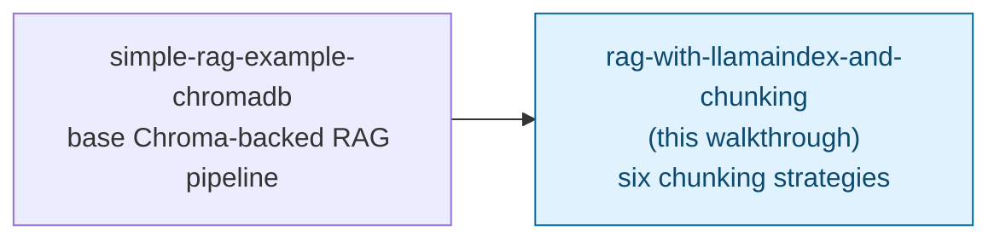

# RAG with LlamaIndex + Chroma DB: Chunking Strategies — Trainer Walkthrough

> A step-by-step build guide for [../rag-with-llamaindex-and-chunking](../rag-with-llamaindex-and-chunking/README.md). Follow it live in a workshop, or work through it solo — by the end you will have hand-built six different chunking strategies against the same document and seen, concretely, how their boundaries and retrieval quality differ, instead of only reading about the trade-offs.

## What you'll build

Starting from an empty folder, you will incrementally build a shared `common.py` module and six independent scripts (`01_fixed_size_chunking.py` through `06_markdown_structure_aware.py`), each parsing the same multi-section employee handbook with a different LlamaIndex chunking strategy, storing the result in its own Chroma DB collection, and answering the same two test questions. Both the embedding model and the LLM run locally through [Ollama](https://ollama.com), so no API key is involved anywhere.

## Who this is for

- **Instructors** demonstrating, live, how different chunking strategies produce visibly different chunks — and sometimes visibly different answers — from the exact same source document.
- **Trainees** typing the code themselves, one strategy at a time, rather than reading six finished files top to bottom.

## Prerequisites

- Comfortable with basic Python: functions, dicts, `if`/`else`, `for` loops.
- [`uv`](https://docs.astral.sh/uv/) and Docker Desktop (or another local Docker runtime) installed.
- [Ollama](https://ollama.com) installed and reachable at `http://localhost:11434`.
- Familiarity with the Chroma-backed RAG pipeline this walkthrough builds on is recommended but not required — [../rag-with-LlamaIndex/simple-rag-example-chromadb-walkthrough](../rag-with-LlamaIndex/simple-rag-example-chromadb-walkthrough/README.md) covers the base pipeline (Ollama + Chroma + the idempotent-ingestion pattern) in full; this walkthrough links to it rather than repeating it, and covers only what's new for chunking.
- No prior chunking-strategy experience assumed — [Step 0](01-overview-and-concepts.md) covers the vocabulary, and [../vector-dbs/chunking.md](../vector-dbs/chunking.md) has the full conceptual reference if you want more depth than this walkthrough's inline explanations.
- About 2-2.5 hours end to end, given six scripts instead of one.

## How this walkthrough is organized

Each step builds one script (or, for Step 2, the shared module every script depends on) and explains **why** that strategy behaves the way it does before showing **how** to build it. Every step ends with a **Checkpoint**: the complete file as it should look at that point.

| Step | File | What you'll add | Est. time |
| --- | --- | --- | --- |
| 0 | [01-overview-and-concepts.md](01-overview-and-concepts.md) | Mental model: why chunking is its own decision, the six strategies at a glance | 15 min |
| 1 | [02-environment-setup.md](02-environment-setup.md) | Ollama + Chroma running, project scaffolded, the sample handbook created | 15 min |
| 2 | [03-shared-scaffolding.md](03-shared-scaffolding.md) | `common.py` — models, Chroma collection helper, print helpers | 15 min |
| 3 | [04-fixed-size-chunking.md](04-fixed-size-chunking.md) | `01_fixed_size_chunking.py` — `TokenTextSplitter` | 15 min |
| 4 | [05-sentence-aware-chunking.md](05-sentence-aware-chunking.md) | `02_sentence_splitter.py` — `SentenceSplitter` | 15 min |
| 5 | [06-sentence-window-chunking.md](06-sentence-window-chunking.md) | `03_sentence_window.py` — `SentenceWindowNodeParser` + postprocessor | 20 min |
| 6 | [07-semantic-chunking.md](07-semantic-chunking.md) | `04_semantic_chunking.py` — `SemanticSplitterNodeParser` | 20 min |
| 7 | [08-hierarchical-parent-child-chunking.md](08-hierarchical-parent-child-chunking.md) | `05_hierarchical_parent_child.py` — `HierarchicalNodeParser` + `AutoMergingRetriever` + persisted docstore | 30 min |
| 8 | [09-structure-aware-chunking.md](09-structure-aware-chunking.md) | `06_markdown_structure_aware.py` — `MarkdownNodeParser` | 15 min |
| 9 | [10-recap-and-exercises.md](10-recap-and-exercises.md) | Quick-reference card, gotchas, exercises | 15 min |

## Relationship to the reference implementation

The finished code you arrive at matches every file in [../rag-with-llamaindex-and-chunking/](../rag-with-llamaindex-and-chunking/) exactly: `common.py` and all six numbered scripts. This walkthrough builds them in the same order they're numbered — unlike some walkthroughs in this repo, the reference implementation's file order already *is* the right teaching order, since each script is independently complete and increases in sophistication from Step 3 through Step 7. Step 3 of this skill's verification process (see below) confirms every final checkpoint matches the real source byte-for-byte.

## Suggested demo flow (for instructors)

- Run `01` and `02` back to back and put their `print_nodes` output side by side — chunk `[1]` starting mid-sentence in `01` versus starting cleanly in `02` is the single clearest "aha" moment in this whole walkthrough, and it costs nothing to demonstrate.
- For Step 5 (sentence-window), don't skip printing the "embedded sentence vs. stored window" comparison — trainees who only see the final answer miss *why* a postprocessor is doing anything at all.
- Step 5's alcohol-clause omission and Step 7's `Merging N nodes` log lines are both real, unforced model behavior from building these examples — not scripted for the demo. Let trainees see the raw output rather than summarizing it, especially for Step 7's merge logging.
- Step 7 (hierarchical) is the one place where skipping the "why this matters" discussion of the docstore genuinely costs understanding — trainees who don't grasp that Chroma only stores vectors will be confused why this script needs a persistence step no other script does.
- If running short on time, Steps 3-4 and 6 can be compressed (they follow one obvious pattern each); spend the saved time on Steps 5 and 7, which introduce genuinely new mechanisms (postprocessors, auto-merging retrieval).

## Where this fits

This walkthrough assumes the base pipeline from [simple-rag-example-chromadb-walkthrough](../rag-with-LlamaIndex/simple-rag-example-chromadb-walkthrough/README.md) and specializes into one part of it — the chunking step — in much more depth than that walkthrough covers.

Start here: **[01-overview-and-concepts.md](01-overview-and-concepts.md)**.
