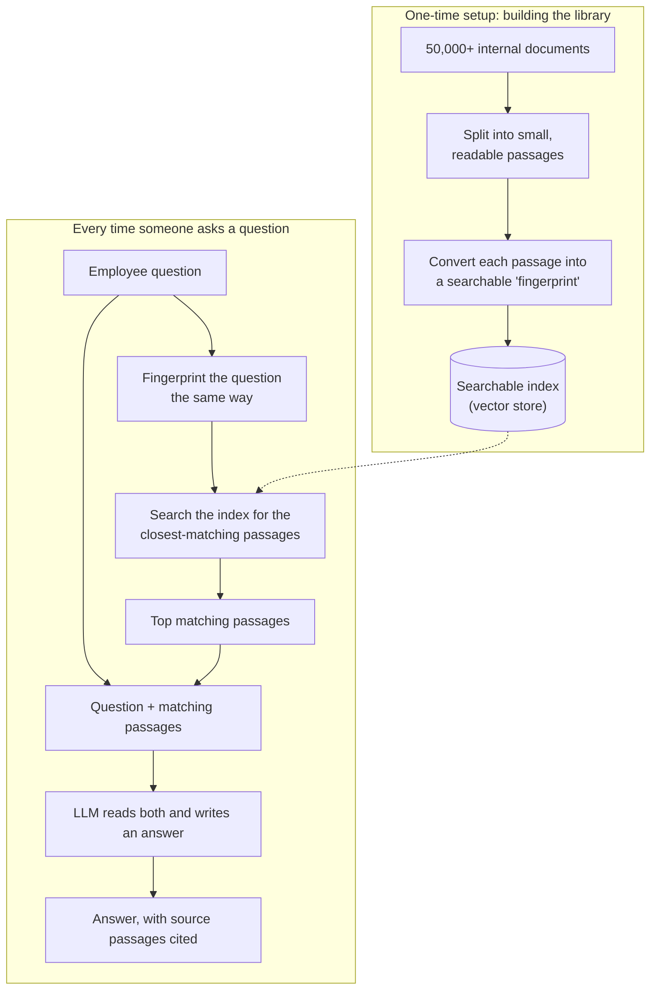

# Case Study: Explaining RAG Architecture to Priya Sharma (Senior PM)

Context: prototype RAG-based Q&A system over 50,000+ internal documents. Priya is
non-engineering, technically curious, and burned before by an AI hallucination incident. She
needs enough understanding to justify further investment to the VP of Engineering.

Below is a consultation script you can adapt live, followed by a quick-reference cheat sheet.

---

## Opening: Why not just use a chatbot / plain LLM?

**You:** "Before I show you the architecture, let me explain the problem it solves. A general
LLM — like the base model behind ChatGPT — only knows two things: whatever it memorized during
training, which has a cutoff date, and whatever you type into the chat box. It has never read
our internal wiki, our HR policies, or last week's product spec. So if an employee asks it a
company-specific question, it has two options: say 'I don't know,' or — worse — guess
confidently and make something up. That guessing is exactly what caused the hallucination issue
on the earlier project."

**Analogy — the new hire:** "Think of a raw LLM as a brilliant new hire on day one, with no
access to the company intranet. They're smart and well-read, but if you ask 'what's our current
PTO policy,' they'll either admit ignorance or confidently invent a plausible-sounding answer.
RAG is the equivalent of handing that new hire a badge that lets them search the company
intranet *before* they answer — and requiring them to actually check it."

---

## The building blocks, in plain language

**You:** "There are two things happening in this system: a one-time *library setup*, and a
*lookup* that happens every time someone asks a question."

1. **Document loading** — "We take every document — policy PDFs, wikis, specs — and load them
   into the system. Think of this as bringing every book into the library."
2. **Splitting (chunking)** — "A 40-page policy document is too big to search efficiently, so we
   break it into small passages, like index cards, each covering one self-contained idea."
3. **Embeddings** — "Each passage gets converted into a numeric 'fingerprint' that captures its
   *meaning*, not just its keywords. Two passages about the same topic get similar fingerprints
   even if they use completely different words."
4. **Vector storage** — "All those fingerprints go into a specialized, searchable index — our
   library's card catalog, but one that can be searched by *meaning* instead of exact title."

---

## The retrieval + generation flow

**You:** "When an employee asks a question, we don't send it straight to the LLM. First we
fingerprint the *question* the same way, and use it to search the index for the handful of
passages whose meaning most closely matches. Those passages — usually 3 to 5 — get attached to
the question and handed to the LLM together. The LLM's job shrinks from 'know everything about
our company' to 'read these specific paragraphs and answer this specific question.' That's a
much narrower, safer task."

**Analogy — open-book exam:** "It's the difference between a closed-book exam, where a student
has to recall everything from memory and might misremember a fact, and an open-book exam, where
they're handed the exact three relevant pages and asked to answer based on those. RAG turns
every query into an open-book exam for the model."

---

## Addressing Priya's concerns

### "How do I know it won't hallucinate again?"

- The model is instructed to answer **only from the retrieved passages**, not from general
  knowledge — we can show this in the prompt itself.
- Every answer comes with **citations** back to the source document and section, so any employee
  (or Priya) can click through and verify it in seconds — this was the missing piece in the
  failed project.
- We can add a guardrail: if no passage is a good enough match, the system says "I couldn't find
  this in our documents" instead of guessing.
- It's not a *guarantee* against error — the model can still misread a passage — but the
  failure mode changes from "invents a fake policy" to "worst case, misquotes a real,
  checkable one." That's a fundamentally lower-risk failure.

### "What about documents that change or go stale?"

- This is actually where RAG is *stronger* than a fine-tuned or trained model: updating the
  system doesn't require retraining anything. We just re-index the changed document — swap the
  old passages for new ones in the searchable library — and the very next question picks up the
  update.
- We can set this to run on a schedule (e.g., nightly) or trigger it automatically whenever a
  document is edited in its source system, so freshness is an operational SLA we control, not an
  AI limitation.
- Versioning: old passages can be retired rather than deleted, so we retain an audit trail of
  what the system "knew" at any point in time — useful if a bad answer is ever traced to a
  since-corrected document.

### "Why should the VP fund this over just buying an off-the-shelf chatbot?"

- Off-the-shelf assistants either don't know our internal content at all, or require sending our
  documents to a third party for training — a data governance risk.
- This architecture keeps our documents in our own index, answers are traceable to source, and
  the system scales to all 50,000 documents without retraining a model — only re-indexing, which
  is cheap and fast.

---

## Cheat sheet (quick reference during the call)

| Priya's concern | One-line answer |
|---|---|
| "Will it make things up?" | Answers must cite a real source passage; unmatched questions say "not found" instead of guessing. |
| "What if a doc changes?" | Re-index that doc — no retraining, updates apply to the next question asked. |
| "How is this different from ChatGPT?" | ChatGPT doesn't know our documents at all; this system looks them up before answering. |
| "Can we trust it enough to scale?" | Every answer is verifiable and traceable — the property the earlier project lacked. |
