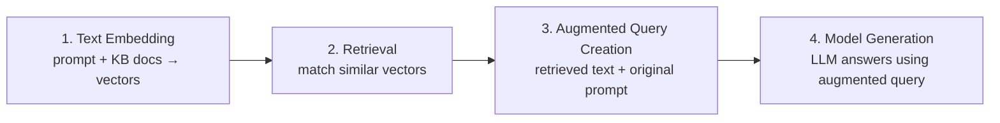
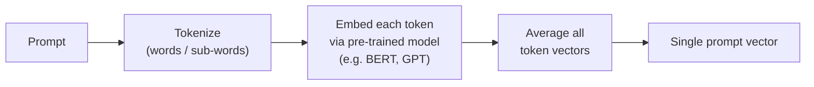
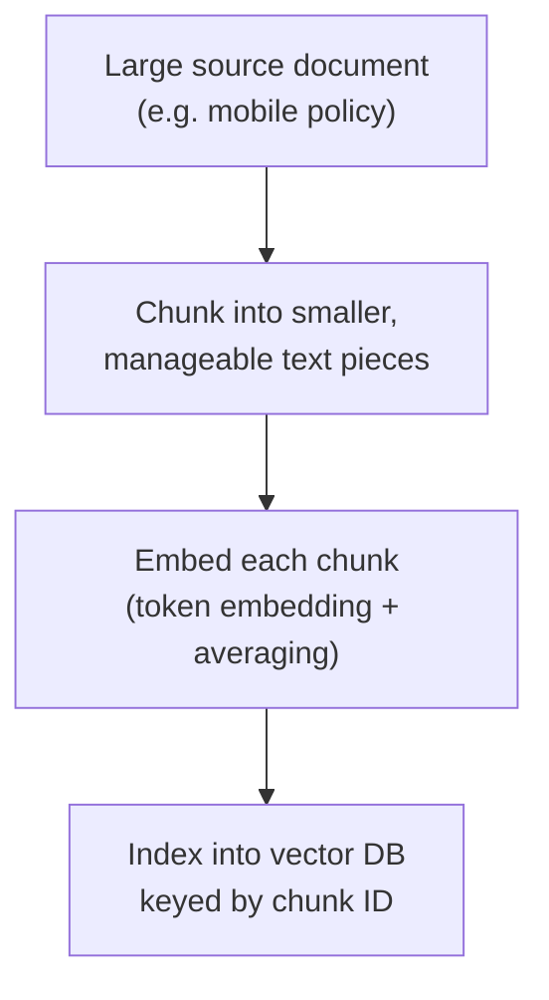
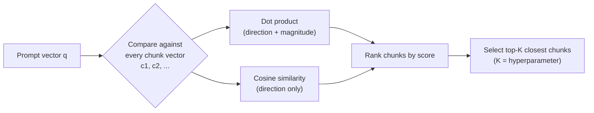
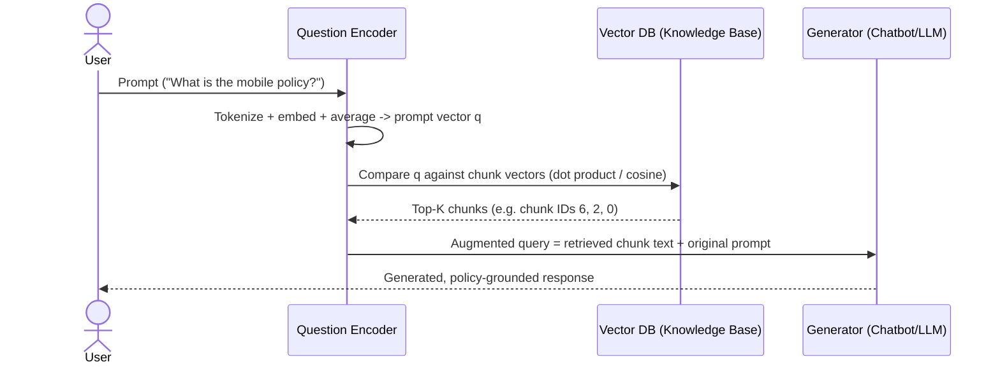
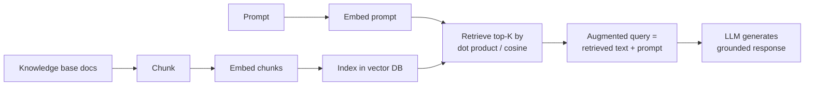

# RAG in Detail — the Retrieval, Embedding & Generation Pipeline

Notes on how RAG actually works under the hood (embeddings, chunking, distance
metrics, top-K retrieval). Companion to [what-is-rag.md](what-is-rag.md).

## Why domain-specific knowledge needs RAG

Pre-trained LLMs are strong at general tasks but weak on **specialized /
private knowledge** they were never trained on — e.g. a company's internal
mobile device policy. That data is confidential and not on the public
internet, so the base model simply doesn't know it.

RAG fixes this **without retraining the model**: it plugs an external
knowledge base (trained chatbot data, internal policies, large documents,
etc.) into the generation process at query time.

## The two components of RAG

- **Retriever** — the core of RAG. Finds the knowledge-base content relevant
  to the user's prompt.
- **Generator** — functions as the chatbot. Takes the retrieved content plus
  the original prompt and produces the natural-language answer.

## The four-step RAG pipeline

1. **Text embedding** — the prompt is converted into a high-dimensional
   vector via a *question encoder*; knowledge-base documents are separately
   converted into vectors via a *context encoder* (the two encoders can also
   be the same model — simpler, but usually less effective).
2. **Retrieval** — the system compares the prompt's vector against the
   knowledge base's vectors and finds the closest matches.
3. **Augmented query creation** — the text behind the retrieved vectors is
   combined with the original prompt into one augmented query.
4. **Model generation** — the LLM generates the final response from that
   augmented query, grounded in the retrieved knowledge-base content.

## Step 1a: Encoding the prompt

The prompt is encoded using **token embedding + vector averaging**:

Each token gets embedded into a high-dimensional vector using a pre-trained
token-embedding model (e.g. **BERT**, **GPT**). Averaging all token vectors
produces one vector that concisely captures the meaning of the whole prompt.

## Step 1b: Encoding the knowledge base

Large source documents (e.g. the company's mobile policy) are too big to feed
directly to a chatbot, so they go through a **chunk → embed → index**
pipeline:

- The document is broken into smaller chunks for targeted, efficient
  retrieval.
- Each chunk is tokenized, each token embedded, then averaged into a single
  chunk-level vector — the same technique used for the prompt.
- Chunk vectors are stored in a **vector database**, keyed by **chunk ID**,
  which is what distance operations use to look up matches later.

## Step 2: Retrieval via distance metrics

To find relevant chunks, the system compares the **prompt vector `q`**
against every **context/chunk vector** (`c1`, `c2`, ...) using a distance
metric.

Two common metrics, and they can disagree:

| Metric | What it measures | Notes from the example |
| --- | --- | --- |
| **Dot product** | Both direction *and* magnitude — rewards overall alignment | Found `c2` slightly closer than `c1` |
| **Cosine similarity** | Only the angular direction | Also favored `c2` |

Rule of thumb: dot product is preferable when vector **magnitude** matters;
cosine distance is preferable when only **direction** matters.

### Top-K selection

- `K` is a hyperparameter — the video's example selects **3–5** context
  chunks to bring in as relevant grounding.
- Worked example: out of 7 chunks in the mobile policy, chunk IDs **6, 2, 0**
  are chosen as the top-K most relevant to the query.
- In production, this search runs over a large chunk library, so vector
  databases use approximate-nearest-neighbor indexing to keep it fast.

## Step 3 & 4: Augment and generate

The selected chunk text and the original query are inserted together into
the chatbot, which generates a response grounded in the company's actual
policy content — something the pre-trained model alone could never produce,
since that data was never part of its training set.

## TL;DR pipeline

