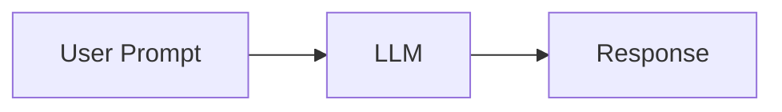
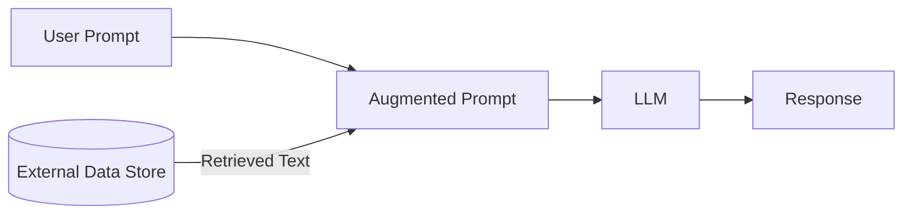
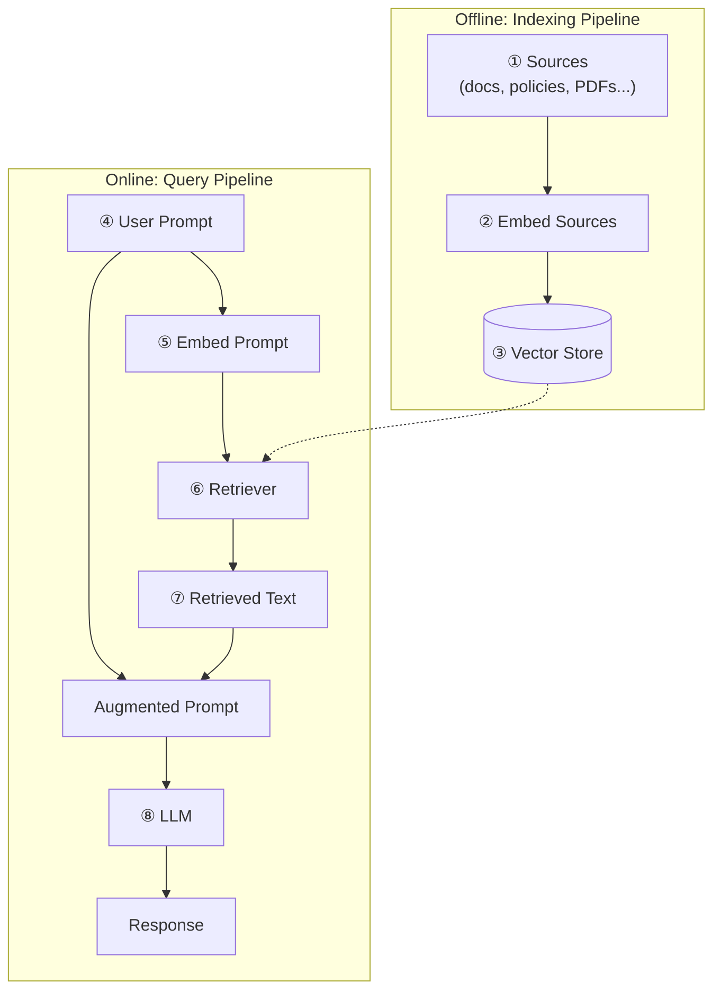

# Retrieval-Augmented Generation (RAG)

## What is RAG

RAG is a technique that combines information retrieval with generative AI (LLMs) to produce
accurate, context-aware responses. It gives an LLM access to external data sources at query
time, instead of relying only on what the model memorized during training.

## Why RAG? The problem with plain LLMs

An LLM used on its own only has two sources of knowledge:

- What was baked into it during training (static, goes stale)
- What the user types into the prompt

This leads to well-known failure modes:

- **Inaccurate** or **outdated** answers (knowledge frozen at training cutoff)
- **Hallucinations** — fabricated facts stated with confidence
- **No traceable sources** — hard to verify where an answer came from

### The RAG fix

RAG inserts a retrieval step between the prompt and the LLM. Relevant text is pulled from an
external store, merged with the user's prompt into an **augmented prompt**, and only then sent
to the LLM.

Benefits:

| Problem | How RAG helps |
|---|---|
| Response quality | Grounds answers in real retrieved data |
| Stale knowledge | External store can be updated independently of the model |
| No sources | Retrieved chunks can be cited back to their origin document |

## What about long-context models?

Modern LLMs support very large context windows (128k+ tokens, ~96k words). Doesn't that make
retrieval unnecessary? Not really — long context alone still has issues:

- **Input dependency** — the user must already have and paste in the source material
- **Limited capacity** — still not enough for very large corpora (e.g. *War and Peace* alone is ~560k words)
- **Redundancy / "needle in a haystack"** — irrelevant text dilutes the model's attention
- **Processing time** — more tokens = slower responses
- **Cost** — more tokens = higher $ per call

RAG mitigates every one of these by retrieving only the small, relevant slice of data needed for
a given prompt, rather than stuffing everything into context.

## How RAG works — end to end

### Step-by-step

1. **Gather Sources** — collect docs, policies, wikis, etc. Often requires preprocessing
   (e.g. PDF → plain text) before the data is usable.
2. **Embed Sources** — split large documents into **chunks**, then run each chunk through an
   **embedding model** to get a fixed-length numeric vector capturing its semantic meaning.
   - *Tokenization*: text → tokens → numeric token IDs
   - *Neural network*: token IDs → embedding vector
3. **Store Vectors** — persist the embeddings in a **vector store** (e.g. ChromaDB, FAISS,
   Milvus). Small systems can get away with a simple matrix.
4. **Obtain a User's Prompt** — the incoming query, optionally combined with prior conversation
   history (via memory tools like LangChain/LlamaIndex).
5. **Embed the Prompt** — run the *same* embedding model used on the sources over the prompt, so
   the vectors are directly comparable.
6. **Retrieve Relevant Data** — the **retriever** compares the prompt embedding against the
   vector store and pulls back the most relevant chunk(s) — could be one chunk, a whole
   document, or several documents.
7. **Create an Augmented Prompt** — merge retrieved text with the original prompt, either by:
   - simple concatenation, or
   - a structured prompt template with dedicated slots for user input / retrieved context / instructions
8. **Obtain a Response** — the augmented prompt goes to the LLM, which generates the final
   answer (optionally passed through a response template for consistent formatting).

## Key takeaway

RAG's core idea: **don't rely on the LLM's memory or a giant pasted context — retrieve exactly
the right, current, relevant information at query time, and let the model reason over that.**
Many production RAG variants exist (re-ranking, hybrid search, multi-hop retrieval, agentic
RAG, etc.), but they all build on this same retrieve → augment → generate pattern.
