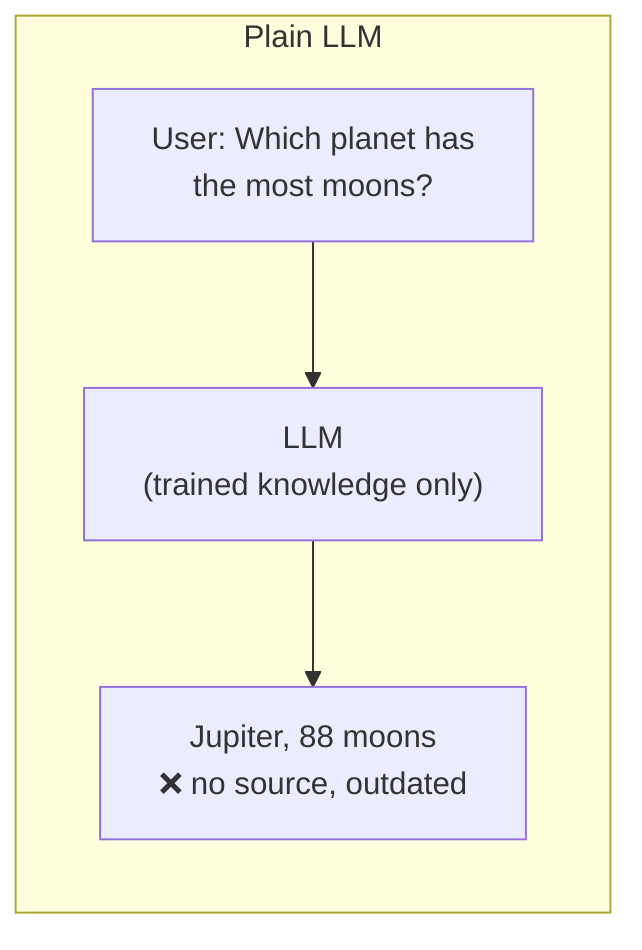
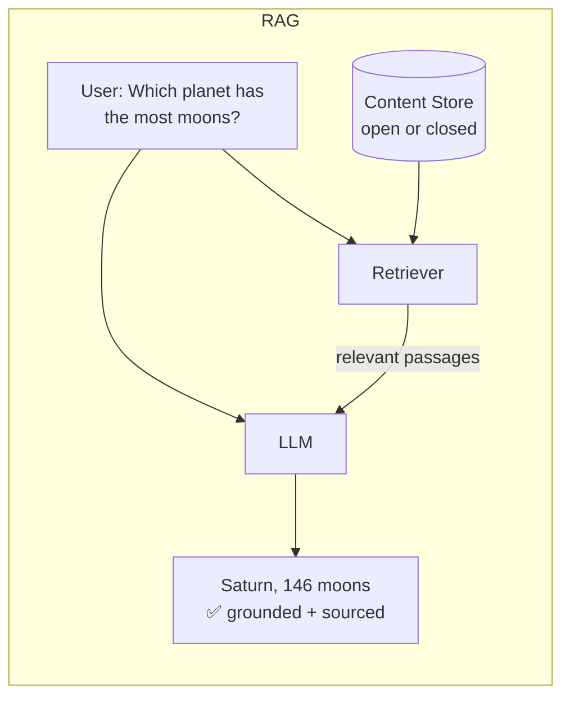
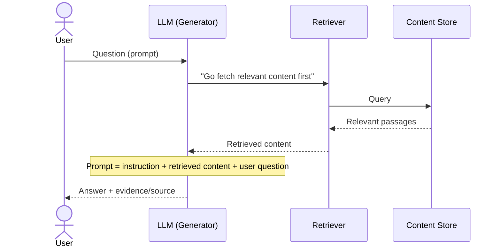
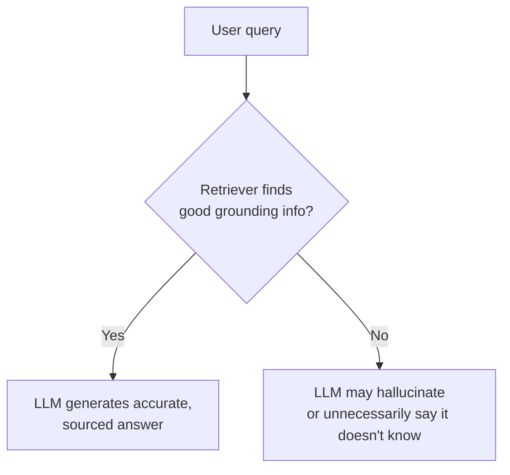

# What is RAG (Retrieval Augmented Generation)?

## The problem with plain LLM generation

LLMs are the "generation" part of RAG — models that produce text in response to a
user query (a **prompt**). Left on their own, they show two recurring failure modes:

1. **No source** — the model answers confidently but can't point to where the
   answer came from. It's just "recalled" from training, not grounded in any
   verifiable document.
2. **Out of date** — the model's knowledge is frozen at training time, so facts
   that change after that point (new discoveries, updated policies, etc.) are
   wrong or stale.

### Illustration: "Which planet has the most moons?"

- **Off-the-cuff answer** (like relying on memory alone): "Jupiter, 88 moons" —
  no source, and outdated.
- **Looked up on a reputable source (NASA)**: "Saturn, 146 moons" — grounded,
  current, and traceable to a source.

This is exactly the gap RAG closes for LLMs.

## Adding the "Retrieval Augmented" part

RAG adds a **content store** that the LLM consults *before* answering:

- **Open** store — e.g., the public internet.
- **Closed** store — e.g., a private collection of documents, policies, manuals.

Instead of answering purely from trained parameters, the LLM first retrieves
relevant content, then generates an answer grounded in that content.

## How the prompt changes

Without RAG, the generative model just answers the user's question directly.
With RAG, the prompt sent to the LLM has **three parts**:

1. An **instruction** to pay attention to retrieved content.
2. The **retrieved content** (combined with the user's question).
3. The **user's question** itself.

The model is then instructed to generate a response — and can cite the
retrieved content as evidence.

## Why this helps

| LLM challenge | How RAG addresses it |
| --- | --- |
| **Out of date** | No retraining needed — just update/augment the content store with new information. Next query retrieves the latest facts. |
| **No source / hallucination** | The model is instructed to ground its answer in retrieved primary-source data and can present that source as evidence, making it less likely to hallucinate or leak memorized training data. |

RAG also enables a valuable behavior: **knowing when to say "I don't know."**
If the content store has nothing that reliably answers the question, the model
should decline rather than fabricate a plausible-sounding but wrong answer.

## The catch: retriever quality matters

If the retriever fails to surface good grounding information, two things can
go wrong:

- The LLM may still hallucinate (bad input in → bad output out).
- A question that *is* answerable from the data might get no answer, because
  the retriever didn't find the right passage.

This is why RAG research pushes on **both halves of the pipeline**:

- **Retrieval side** — improve search/ranking so the LLM gets the best possible
  grounding content.
- **Generation side** — improve the LLM's ability to synthesize a rich, correct,
  well-cited answer from whatever it's given.

## TL;DR

RAG = **Retrieval** (pull relevant, current info from a content store) +
**Augmented** (inject that info into the prompt) + **Generation** (LLM answers
using that grounded context instead of relying solely on frozen training
knowledge).
