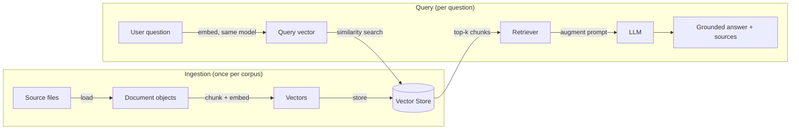

# Step 0 — Overview and Concepts

> [Back to index](README.md) · Next: [Environment Setup](02-environment-setup.md)

## Goal

Build a mental model of what a RAG (Retrieval-Augmented Generation) pipeline does, and specifically why swapping an in-memory vector index for a real vector database server changes the shape of the code — before writing a single line.

## Why this matters

Every RAG app in this series answers questions by grounding an LLM's reply in a small set of local documents instead of relying purely on what the model memorized during training. The pipeline is always the same two phases:

Walking through it:

1. **Load** the source documents (`data/company_policy.txt`, `data/onboarding_faq.txt`) into LlamaIndex `Document` objects.
2. **Chunk** each document into smaller `Node`s and **embed** each chunk into a vector — a fixed-length list of numbers capturing its meaning.
3. **Store** those vectors somewhere searchable — a **vector store**.
4. At query time, **embed the question** with the same embedding model, so it lives in the same vector space as the stored chunks.
5. **Retrieve** the chunks whose vectors are closest to the question's vector (similarity search).
6. **Augment** the question with that retrieved text and send the combined prompt to the **LLM**, which answers grounded in the retrieved context instead of guessing.

If you want more depth on loading/chunking specifically, see [../llama-index-for-rag.md](../llama-index-for-rag.md); this walkthrough covers what's needed for each step inline.

## Why an in-memory vector store isn't always enough

[../simple-rag-example](../simple-rag-example/README.md) keeps step 3 (the vector store) as an in-memory Python object — `VectorStoreIndex.from_documents(documents)`, no database involved. That's the simplest possible thing that works, and it's genuinely fine for a handful of documents in a short-lived script. It falls short in three ways this walkthrough's app fixes:

- **No persistence.** Every process restart re-loads, re-chunks, and re-embeds every document from scratch. Fine for 2 files; wasteful (and slow) for thousands.
- **No sharing across processes.** An in-memory index lives inside one Python process. A real server can be queried by multiple app instances, or inspected independently with its own tools.
- **No separation of concerns.** The vector store is tangled into whatever process is running the app. A dedicated server can be scaled, backed up, and operated independently of the application code.

[Chroma DB](https://www.trychroma.com/) is a **vector database purpose-built for this** — see [../../vector-dbs/chroma-db-intro.md](../../vector-dbs/chroma-db-intro.md) for its full architecture. The two facts about it that matter for this walkthrough:

- It can run in **client-server mode**: the database is its own long-lived process (here, a Docker container), and your Python script is just a client connecting over HTTP.
- Because the server is a separate process with its own storage volume, data **survives your script exiting** — and even surviving the container being recreated, as long as the volume isn't deleted.

## Vocabulary you'll need

| Term | Meaning in this app |
| --- | --- |
| `Document` | One loaded source file, as a LlamaIndex object (text + metadata) |
| `Node` | A chunk of a `Document` — what actually gets embedded |
| Embedding | A fixed-length vector representing a chunk's (or question's) meaning |
| Vector store | Where embeddings are stored and searched — Chroma, here |
| Collection | Chroma's term for a named group of vectors, similar to a table |
| Retriever | The component that runs similarity search against the vector store |
| Query engine | LlamaIndex's bundle of retriever + LLM call, exposed as `.query(question)` |
| Source nodes | The specific chunks a given answer was retrieved from — used for grounding/traceability |

## What "done" looks like

By the end of this walkthrough, running `uv run main.py` twice in a row will behave differently each time:

- **First run**: Chroma's collection is empty, so the script loads the two sample files, embeds them, and stores the vectors in Chroma. This takes a few seconds.
- **Second run**: Chroma's collection already has vectors, so the script skips re-ingesting entirely and queries the existing data directly. This is near-instant and makes zero new embedding calls.

Both runs answer the same three onboarding questions and print which source file each answer came from.

Next: **[Environment Setup](02-environment-setup.md)** — get Ollama and Chroma running so there's something to connect to.
