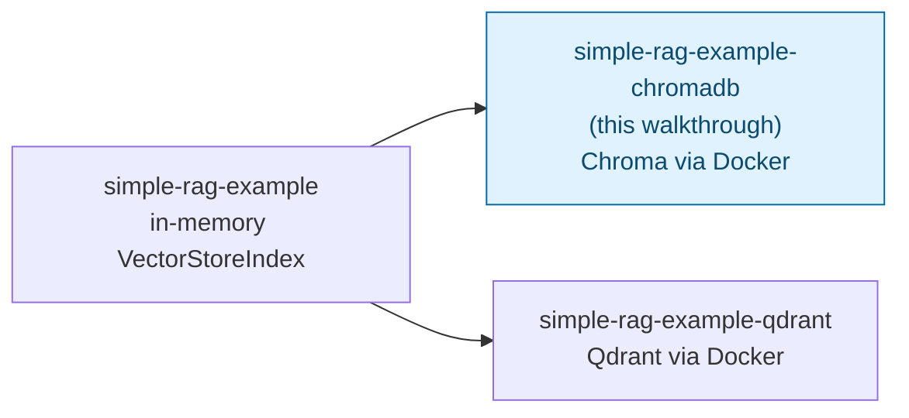

# RAG with LlamaIndex + Chroma DB — Trainer Walkthrough

> A step-by-step build guide for [../simple-rag-example-chromadb](../simple-rag-example-chromadb/README.md). Follow it live in a workshop, or work through it solo — by the end you will have hand-built a persistent, Chroma-backed RAG pipeline and understand every line of it, instead of having copy-pasted a finished script.

## What you'll build

Starting from an empty folder, you will incrementally build `main.py`: a script that answers questions about a small onboarding document set by retrieving relevant chunks from a **Chroma DB** vector store and asking a local LLM to answer grounded in them. Unlike the plainer [../simple-rag-example](../simple-rag-example/README.md), which keeps vectors in memory and re-embeds every run, this version:

- Runs Chroma as its own server via `docker compose`, persisting embeddings to a Docker volume.
- Detects, on startup, whether the collection is already populated — and skips re-ingesting if so.
- Survives process restarts: run the script twice and the second run reuses the first run's vectors instead of re-embedding from scratch.

Both the embedding model and the LLM run locally through [Ollama](https://ollama.com), so no API key is involved anywhere.

## Who this is for

- **Instructors** demonstrating, live, how a real vector-store-backed RAG pipeline differs from an in-memory one.
- **Trainees** typing the code themselves, one capability at a time, rather than reading a finished file top to bottom.

## Prerequisites

- Comfortable with basic Python: functions, dicts, `if`/`else`, `for` loops.
- [`uv`](https://docs.astral.sh/uv/) and Docker Desktop (or another local Docker runtime) installed.
- [Ollama](https://ollama.com) installed and reachable at `http://localhost:11434` (covered in [Step 1](02-environment-setup.md)).
- No prior LlamaIndex or vector-database experience assumed. If you want deeper background on what a vector database actually is, [../../vector-dbs/vector-dbs-intro.md](../../vector-dbs/vector-dbs-intro.md) and [../../vector-dbs/chroma-db-intro.md](../../vector-dbs/chroma-db-intro.md) cover it; this walkthrough explains what you need inline.
- About 60–75 minutes end to end.

## How this walkthrough is organized

Each step adds exactly one capability and explains **why** it's needed before showing **how** to add it. Every step ends with a **Checkpoint**: the complete file as it should look at that point, so nobody falls out of sync with the group.

| Step | File | What you'll add | Est. time |
| --- | --- | --- | --- |
| 0 | [01-overview-and-concepts.md](01-overview-and-concepts.md) | Mental model: the RAG pipeline, and why a real vector store changes things | 10 min |
| 1 | [02-environment-setup.md](02-environment-setup.md) | Ollama models pulled, Chroma running via Docker, project scaffolded | 10 min |
| 2 | [03-configure-ollama-settings.md](03-configure-ollama-settings.md) | Global `Settings.llm` / `Settings.embed_model`, smoke-tested in isolation | 10 min |
| 3 | [04-connecting-to-chroma.md](04-connecting-to-chroma.md) | Chroma client, collection, and `ChromaVectorStore` wrapper | 5 min |
| 4 | [05-loading-documents.md](05-loading-documents.md) | `SimpleDirectoryReader` — load the sample onboarding docs | 5 min |
| 5 | [06-first-ingestion.md](06-first-ingestion.md) | `VectorStoreIndex.from_documents` — embed and store into Chroma (naive version) | 10 min |
| 6 | [07-persistence-and-reuse.md](07-persistence-and-reuse.md) | The empty-collection check + `from_vector_store` — fix the naive version | 10 min |
| 7 | [08-query-engine-and-sources.md](08-query-engine-and-sources.md) | `as_query_engine`, the question loop, and printing grounding sources | 10 min |
| 8 | [09-recap-and-exercises.md](09-recap-and-exercises.md) | Quick-reference card, gotchas, exercises | 10 min |

## Relationship to the reference implementation

The finished code you arrive at matches [../simple-rag-example-chromadb/main.py](../simple-rag-example-chromadb/main.py) exactly by the end of Step 7. This walkthrough sequences the *build order* differently from the finished file (settings before Chroma, Chroma before documents, naive ingestion before the persistence fix) because that's a better teaching order — not because the underlying app is different. Step 3 of this skill's verification process confirms the final checkpoint matches the real source byte-for-byte.

## Suggested demo flow (for instructors)

- Live-type each step rather than pasting — trainees follow typos and fixes better than a perfect paste.
- Step 5 (first ingestion) is deliberately naive and buggy: running it twice **duplicates every vector** in the collection. Let trainees actually see the count double before Step 6 fixes it — that's the whole point of the persistence step, and skipping the demonstration guts the lesson.
- After Step 5's duplication demo, reset with `docker compose down -v && docker compose up -d` before continuing to Step 6, so the collection starts clean again.
- Step 6 is easiest to *prove* by running the script twice in a row and pointing out that the second run produces no new Ollama embedding traffic (watch `ollama ps` or the Ollama server logs) yet still answers correctly.
- Step 8's exercises work well as a 10–15 minute independent lab if you're running a longer session.

## Where this fits in the series

All three examples ask the same three questions over the same two documents and share the same `build_query_engine()` shape — only how vectors are stored (and whether they persist) differs. Once you've built this one, [../simple-rag-example-qdrant/](../simple-rag-example-qdrant/README.md) will look almost identical, just with Qdrant's client API in place of Chroma's.

Start here: **[01-overview-and-concepts.md](01-overview-and-concepts.md)**.
