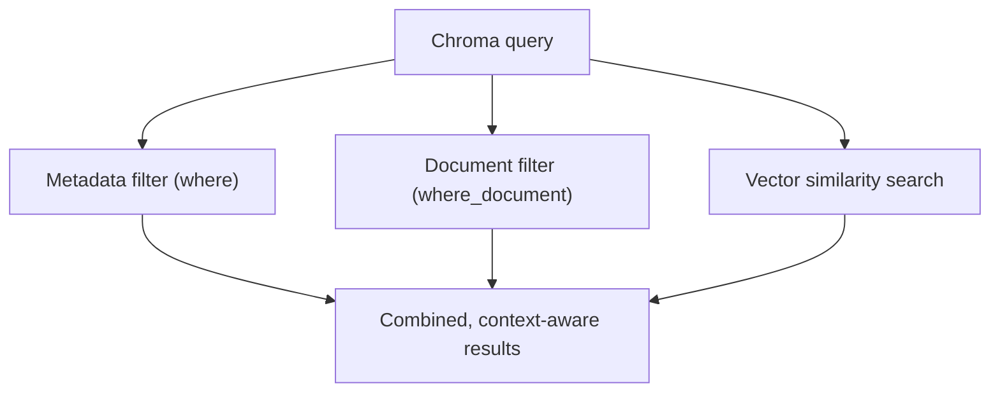
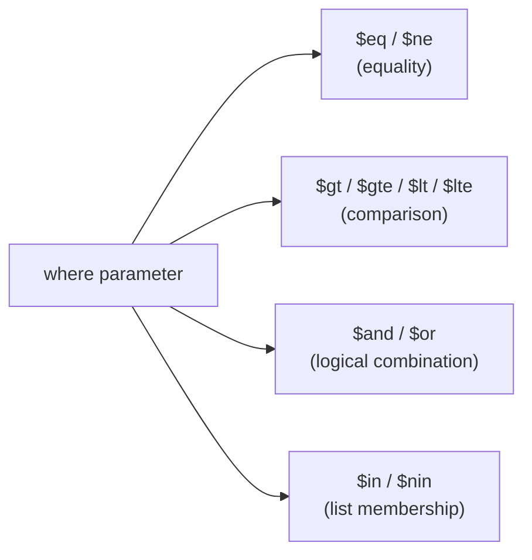
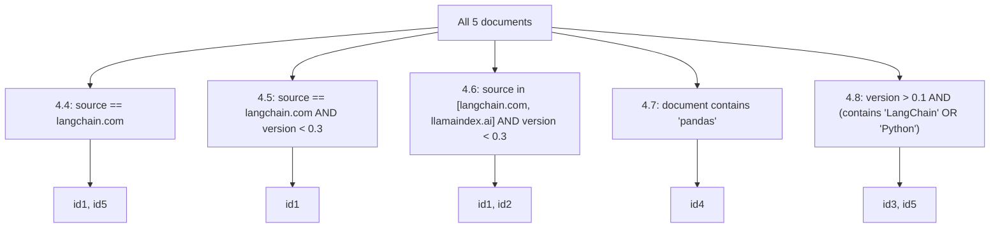

# Chroma DB Filtering

## 1. Filtering vs. Traditional SQL

Chroma DB filtering fundamentally differs from SQL-based filtering:

- **SQL:** structured schemas, declarative logic, exact matches
- **Chroma DB:** unstructured data + semantic search, built for AI-driven applications

Chroma DB supports **two primary filter types**, which can be combined with vector similarity search:

| Filter Type | Description | Comparison to SQL |
|---|---|---|
| **Metadata Filtering** | Filters on document metadata, e.g. `"topic": "history"` | Like SQL `WHERE`, but more flexible and combinable with vector search |
| **Document Filtering** | Filters on document content via keyword presence (`$contains`, `$not_contains`) | Like SQL `CONTAINS`/`LIKE`, but more powerful with vector search |

> Document filtering is also called **full text search**.



---

## 2. Metadata Filtering

Applied via the `where` parameter inside `.query()`, `.get()`, or `.delete()`.

### 2.1 Basic Equality

```python
where={"key": "value"}
```

Finds documents where metadata `key` is exactly equal to `value`.

### 2.2 Comparison Operators

| Operator | Meaning | Applies to |
|---|---|---|
| `$eq` | equal to | string, int, float |
| `$ne` | not equal to | string, int, float |
| `$gt` | greater than | int, float |
| `$gte` | greater than or equal to | int, float |
| `$lt` | less than | int, float |
| `$lte` | less than or equal to | int, float |

```python
where={"key": {"$eq": "value"}}
```

> `where={"key": "value"}` is shorthand for `where={"key": {"$eq": "value"}}` — omitting the operator implies `$eq`.

### 2.3 Logical Operators — `$and` / `$or`

```python
collection.get(
    where={
        "$and": [
            {"key": {"$eq": "value1"}},
            {"key": {"$ne": "value2"}}
        ]
    }
)
```

Gets documents where `key == value1` **and** `key != value2`. `$or` works the same way. Both work across `.get()`, `.query()`, and `.delete()`.

### 2.4 List Membership — `$in` / `$nin`

```python
where={"key": {"$nin": ["value1", "value2"]}}
```

Finds documents where `key` is **not** equal to either `value1` or `value2`. `$in` is the inverse — matches any value in the list.



---

## 3. Document Filtering

Applied via the `where_document` parameter inside `.query()`, `.get()`, or `.delete()`.

```python
where_document={"$contains": "value"}
```

Finds all documents whose text **contains** `value`. The inverse is `$not_contains`.

- Multiple document filters can be combined with `$and` / `$or`, same as metadata filters.
- ⚠️ **Document filtering is case-sensitive** — searching `"Pandas"` won't match `"pandas"`.

---

## 4. Full Worked Example

### 4.1 Setup

```python
import chromadb
from chromadb.utils import embedding_functions

ef = embedding_functions.SentenceTransformerEmbeddingFunction(
    model_name="all-MiniLM-L6-v2"
)
```

### 4.2 Create a Collection

```python
client = chromadb.Client()
collection = client.create_collection(
    name="filter_demo",
    metadata={"description": "Used to demo filtering in ChromaDB"},
    configuration={"embedding_function": ef}
)
# Output: Collection created: filter_demo
```

### 4.3 Add Documents

```python
collection.add(
    documents=[
        "This is a document about LangChain",
        "This is a reading about LlamaIndex",
        "This is a book about Python",
        "This is a document about pandas",
        "This is another document about LangChain"
    ],
    metadatas=[
        {"source": "langchain.com", "version": 0.1},
        {"source": "llamaindex.ai", "version": 0.2},
        {"source": "python.org", "version": 0.3},
        {"source": "pandas.pydata.org", "version": 0.4},
        {"source": "langchain.com", "version": 0.5},
    ],
    ids=["id1", "id2", "id3", "id4", "id5"]
)
```

| id | document | source | version |
|---|---|---|---|
| id1 | This is a document about LangChain | langchain.com | 0.1 |
| id2 | This is a reading about LlamaIndex | llamaindex.ai | 0.2 |
| id3 | This is a book about Python | python.org | 0.3 |
| id4 | This is a document about pandas | pandas.pydata.org | 0.4 |
| id5 | This is another document about LangChain | langchain.com | 0.5 |

### 4.4 Filter by Metadata — Simple Equality

```python
collection.get(where={"source": {"$eq": "langchain.com"}})
```

**Result:** `id1`, `id5` (both `source == "langchain.com"`).

### 4.5 Filter by Metadata — `$and` with Comparison

```python
collection.get(
    where={
        "$and": [
            {"source": {"$eq": "langchain.com"}},
            {"version": {"$lt": 0.3}}
        ]
    }
)
```

**Result:** `id1` only (`langchain.com` **and** version < 0.3 — `id5` excluded since its version is 0.5).

### 4.6 Filter by Metadata — `$in` + `$and`

```python
collection.get(
    where={
        "$and": [
            {"source": {"$in": ["langchain.com", "llamaindex.ai"]}},
            {"version": {"$lt": 0.3}}
        ]
    }
)
```

**Result:** `id1`, `id2` (source is LangChain or LlamaIndex, version < 0.3).

### 4.7 Filter by Document Content

```python
collection.get(where_document={"$contains": "pandas"})
```

**Result:** `id4` only (`"This is a document about pandas"`).

### 4.8 Combine Metadata + Document Filters

```python
collection.get(
    where={"version": {"$gt": 0.1}},
    where_document={
        "$or": [
            {"$contains": "LangChain"},
            {"$contains": "Python"}
        ]
    }
)
```

**Result:** `id3`, `id5` — version > 0.1 **and** (contains "LangChain" **or** "Python").



---

## 5. Key Takeaways

- Chroma DB filtering combines **structured metadata filtering** (`where`) with **content-based document filtering** (`where_document`), and both can layer on top of vector similarity search.
- Metadata filters support equality (`$eq`/`$ne`), comparisons (`$gt`/`$gte`/`$lt`/`$lte`), logical combination (`$and`/`$or`), and list membership (`$in`/`$nin`); omitting an operator defaults to `$eq`.
- Document filters use `$contains` / `$not_contains`, are **case-sensitive**, and also support `$and`/`$or` combination.
- Filters apply consistently across `.get()`, `.query()`, and `.delete()`.
- Combining metadata and document filters enables precise, context-aware retrieval well beyond what plain vector search or plain SQL `WHERE` clauses can do alone.
