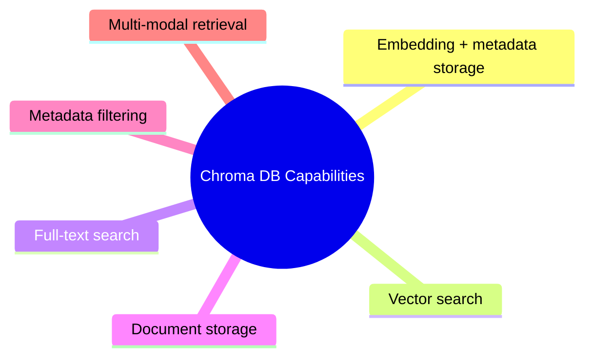
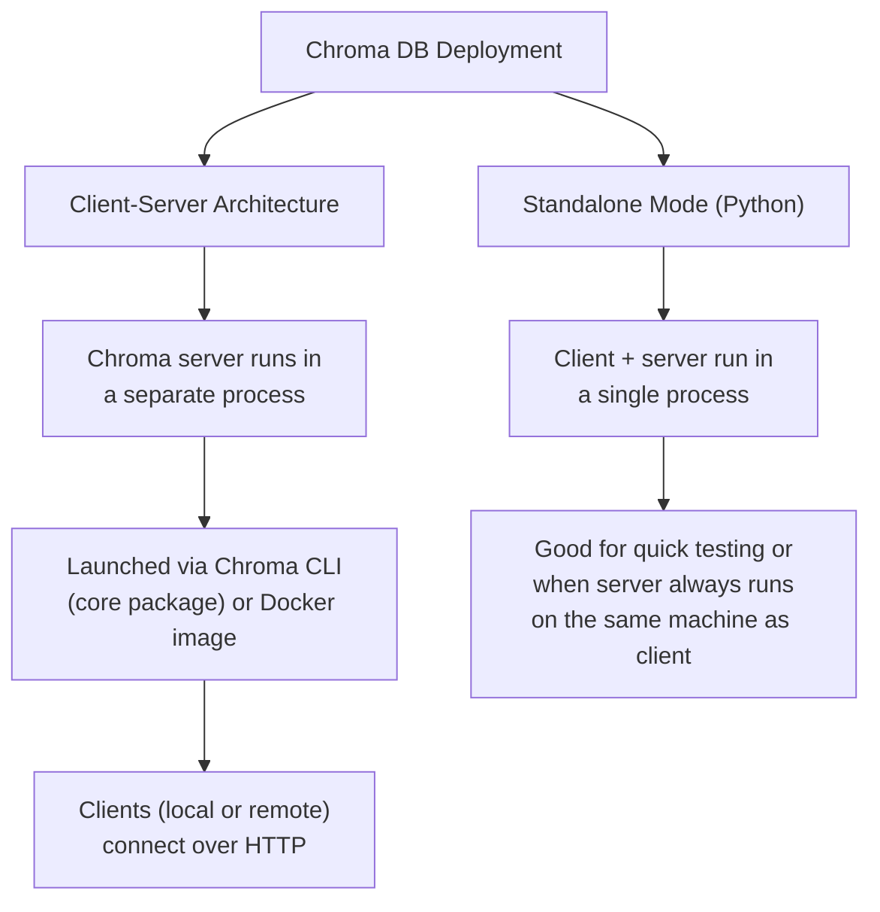
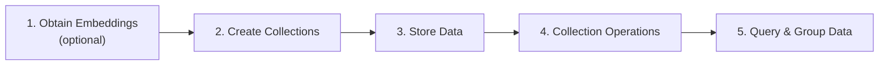
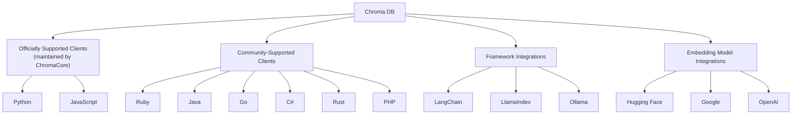
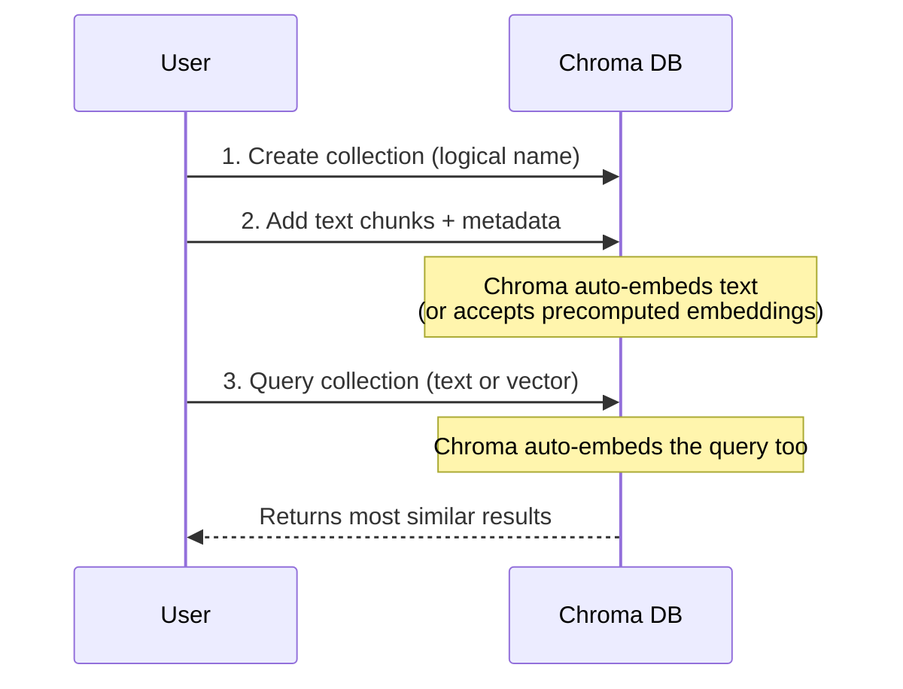
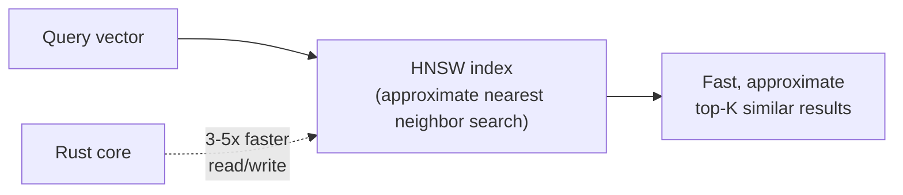
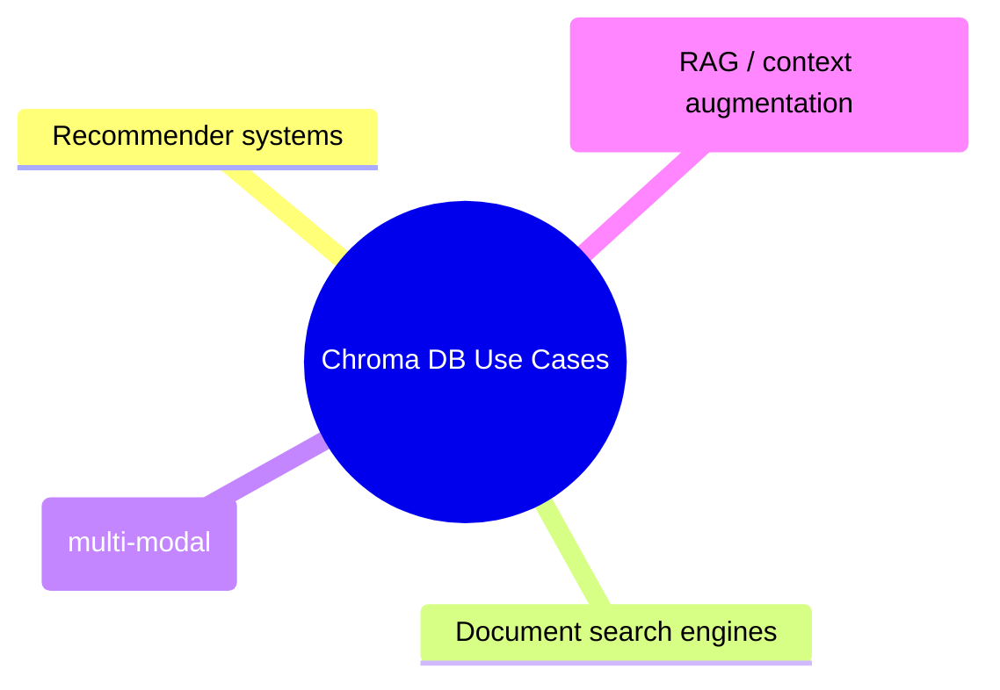

# Chroma DB: Key Concepts and Architecture

## 1. What Is Chroma DB?

Chroma DB is a **vector database purpose-built for retrieval tasks** — storing, searching, and managing vector embeddings alongside the original data and metadata.

## 2. Core Capabilities

| Capability | Description |
|---|---|
| Storage of embeddings + metadata | Efficiently stores and manages vector representations of data |
| Vector search | Compares embeddings for semantic similarity using distance metrics (e.g., cosine distance) |
| Full-text search | Finds relevant documents based on lexical/spelling similarity |
| Data storage | Stores entire documents, not just their embeddings |
| Metadata filtering | Narrows search results using metadata to improve retrieval accuracy |
| Multi-modal retrieval | Manages images, audio, and text in a unified manner |

---

## 3. Deployment Options

| Mode | How it works | Best for |
|---|---|---|
| Client-Server | Server runs separately (CLI or Docker); clients connect via HTTP | Production, remote/shared access |
| Standalone (Python only) | Client and server logic in one process | Quick testing, local-only use |

---

## 4. Architecture and Workflow

Chroma DB's data pipeline works in four phases:

1. **Obtain embeddings (optional):** convert text/images/data into vector representations using an embedding model — optional because Chroma DB can compute embeddings itself.
2. **Create collections:** like tables in a relational database, collections are Chroma's top-level storage unit.
3. **Store data:**
   - If embeddings were created externally, pass them to Chroma DB at this step.
   - Otherwise, Chroma DB computes and stores embeddings from the documents automatically.
4. **Collection operations:** delete, update, or rename collections to organize data.
5. **Query and group data:** query via text or vector, retrieve results grouped by semantic meaning or textual similarity; filter by metadata and document contents.

---

## 5. Clients and Integrations

> Full details on community clients and their supported features: Chroma Cookbook → Chroma Ecosystem Clients page.

---

## 6. Typical Chroma DB Workflow (Example)

- Default distance metric: **Euclidean distance**
- Also supports: **cosine distance**, **dot product**

---

## 7. Performance Features

- **Approximate Nearest Neighbor (ANN) search:** optimized for fast similarity search over large vector sets.
- **HNSW (Hierarchical Navigable Small World):** the algorithm Chroma uses internally to efficiently find approximate nearest neighbors for the chosen distance metric.
- **Rust-based core:** Chroma DB's core is written in Rust, giving **3–5x speed improvement** in querying and writing compared to a Python-based core.

---

## 8. Common Use Cases

- **Recommender systems** — personalized recommendations based on user preferences
- **Document search engines** — using vector and/or full-text search
- **Image retrieval** — retrieving images from text queries via multi-modal retrieval
- **AI chatbots** — semantic search and retrieval for context augmentation (RAG)

---

## 9. Key Takeaways

- Chroma DB is a vector database built for retrieval — supporting vector search, full-text search, metadata filtering, and multi-modal data.
- It can be deployed as **client-server** (via CLI or Docker, connected over HTTP) or **standalone** (single process, Python only).
- Its workflow: (optional) embed → create collections → store data → manage collections → query & filter.
- Officially supports **Python** and **JavaScript**; community clients cover Ruby, Java, Go, C#, Rust, PHP; integrates with **LangChain**, **LlamaIndex**, **Ollama**, and embedding providers like Hugging Face, Google, and OpenAI.
- Default distance metric is **Euclidean**, with **cosine** and **dot product** also supported.
- Uses **HNSW** for approximate nearest-neighbor search and a **Rust core** for 3–5x performance gains over Python.
- Well suited for recommenders, document search, image retrieval, and RAG-based chatbots.
