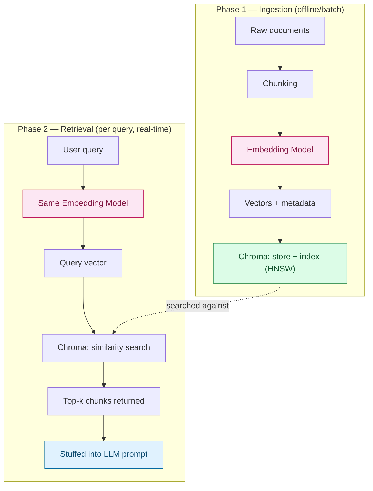

Let's walk through the complete flow end to end — from raw documents to final retrieval — connecting every piece we've discussed (chunking, embedding models, Chroma's storage/indexing) into one concrete pipeline.

## The two phases

Every Chroma workflow splits into two distinct phases that happen at different times:

- **Ingestion (indexing)** — done once, or whenever documents change. Slow, batch-oriented.
- **Retrieval (querying)** — done on every user request. Fast, single-query.



## Phase 1: Ingestion — step by step

### Step 1: Load and chunk your documents

Split raw documents into smaller pieces — this is the chunking decision from our production checklist. Chunk size directly affects retrieval quality.

```python
document_text = """
Kubernetes pods can enter a CrashLoopBackOff state for several reasons...
[full document content]
"""

# Simple example — production code uses a proper splitter
# (e.g. LangChain's RecursiveCharacterTextSplitter)
chunks = [
    "Kubernetes pods can enter a CrashLoopBackOff state when the container repeatedly crashes after starting.",
    "Common causes include OOM (out-of-memory) kills, misconfigured liveness probes, and missing environment variables.",
    "To debug, run 'kubectl logs <pod> --previous' to see the crash reason from the last failed attempt.",
]
```

### Step 2: Set up the Chroma client and collection

```python
import chromadb

client = chromadb.HttpClient(host="localhost", port=8000)

# Create (or get, if it exists) a collection — think "table"
collection = client.get_or_create_collection(
    name="k8s_docs",
    metadata={"hnsw:space": "cosine"}  # similarity metric for this collection
)
```

### Step 3: Generate embeddings and store them

This is where the embedding model actually runs — either you call it yourself, or Chroma calls a configured embedding function for you.

**Option A — you embed manually (most explicit, recommended for production):**

```python
from sentence_transformers import SentenceTransformer

model = SentenceTransformer("all-MiniLM-L6-v2")
embeddings = model.encode(chunks).tolist()  # list of vectors, one per chunk

collection.add(
    ids=["chunk1", "chunk2", "chunk3"],
    embeddings=embeddings,
    documents=chunks,  # Chroma stores the original text alongside the vector
    metadatas=[
        {"source": "k8s-troubleshooting.md", "section": "CrashLoopBackOff"},
        {"source": "k8s-troubleshooting.md", "section": "CrashLoopBackOff"},
        {"source": "k8s-troubleshooting.md", "section": "Debugging"},
    ],
)
```

**Option B — let Chroma embed for you (convenience wrapper, calls the same models under the hood):**

```python
from chromadb.utils import embedding_functions

openai_ef = embedding_functions.OpenAIEmbeddingFunction(
    api_key="sk-...", model_name="text-embedding-3-small"
)
collection = client.get_or_create_collection(name="k8s_docs", embedding_function=openai_ef)

# Chroma embeds internally — you just pass raw text
collection.add(ids=["chunk1", "chunk2", "chunk3"], documents=chunks, metadatas=[...])
```

> **Gotcha, tying back to what we covered:** Whichever option you pick, that embedding function is now **locked to this collection**. If you later query with a different model than what was used here, you get the silent mismatch problem — no error, just meaningless results. Chroma doesn't stop you from doing this; it's your responsibility to keep it consistent.

At this point, `k8s_docs` contains three records, each with: an ID, a vector, the original text, and metadata. Chroma has built (or updated) its HNSW index over these vectors internally — you don't manage that part yourself.

## Phase 2: Retrieval — step by step

### Step 4: Embed the user's query — same model as ingestion

```python
user_query = "why does my pod keep restarting"

query_embedding = model.encode([user_query]).tolist()  # SAME model as Step 3
```

If you used Option B (Chroma's built-in embedding function), you skip this — Chroma re-embeds the query text automatically using the same function the collection was created with.

### Step 5: Run the similarity search

```python
results = collection.query(
    query_embeddings=query_embedding,
    n_results=3,
    where={"source": "k8s-troubleshooting.md"},  # optional metadata filter
)
```

Chroma runs approximate nearest-neighbor search (HNSW) against every stored vector in the collection and returns the closest ones by cosine similarity — this is the ANN search from §2 of your notes, not a linear scan.

### Step 6: Inspect what comes back

```python
print(results)
# {
#   "ids": [["chunk1", "chunk2"]],
#   "documents": [["Kubernetes pods can enter a CrashLoopBackOff...", "Common causes include OOM..."]],
#   "metadatas": [[{"source": "...", "section": "..."}, {...}]],
#   "distances": [[0.12, 0.19]]   # lower = more similar (for cosine distance)
# }
```

Notice `"why does my pod keep restarting"` retrieved chunks about `CrashLoopBackOff` and `OOM kills` — zero exact word overlap, which is exactly the semantic-similarity behavior we discussed back when covering how embedding models learn meaning.

### Step 7: Feed retrieved chunks into the LLM

```python
retrieved_context = "\n".join(results["documents"][0])

prompt = f"""Answer the question using only the context below.

Context:
{retrieved_context}

Question: {user_query}
"""

# Send to your LLM (Claude, Llama 3, Gemma, etc.) as usual
```

The LLM never touches Chroma directly — retrieval and generation are two separate steps you orchestrate in your application code.

## Full flow, compressed

| Step | Phase | What happens |
| --- | --- | --- |
| 1. Chunk documents | Ingestion | Split into retrievable pieces |
| 2. Create collection | Ingestion | Chroma "table" setup |
| 3. Embed + `add()` | Ingestion | Vectors stored, HNSW index built |
| 4. Embed query | Retrieval | Same model as Step 3, mandatory |
| 5. `query()` | Retrieval | ANN search returns top-k |
| 6. Inspect results | Retrieval | Documents, metadata, distances |
| 7. Prompt the LLM | Retrieval | Retrieved chunks become context |

