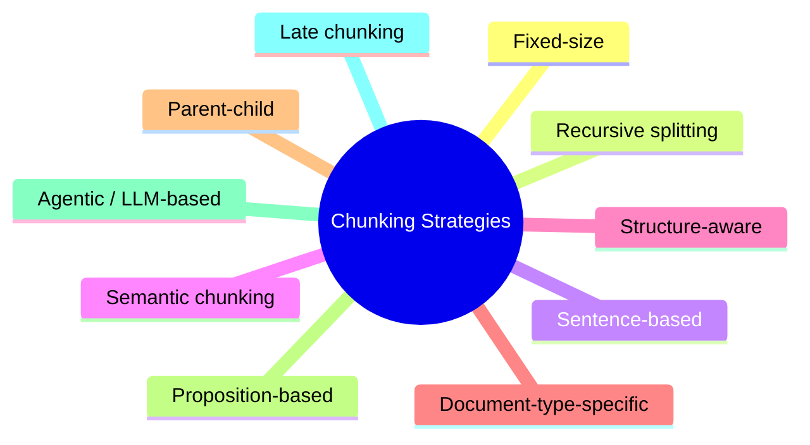
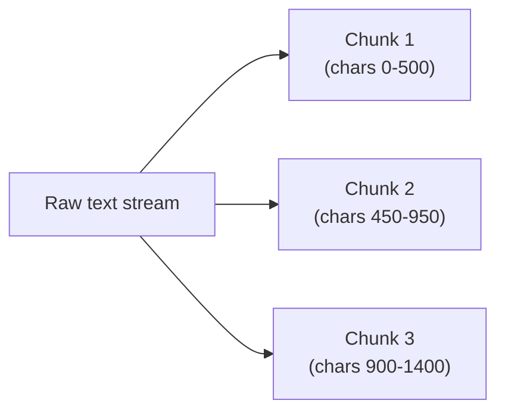
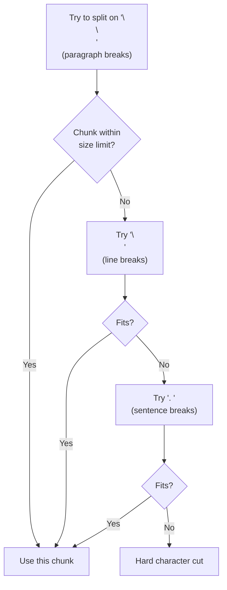
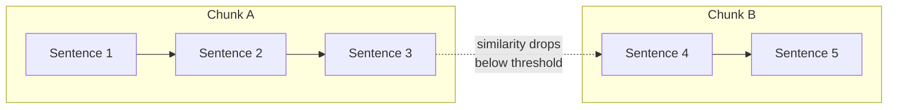
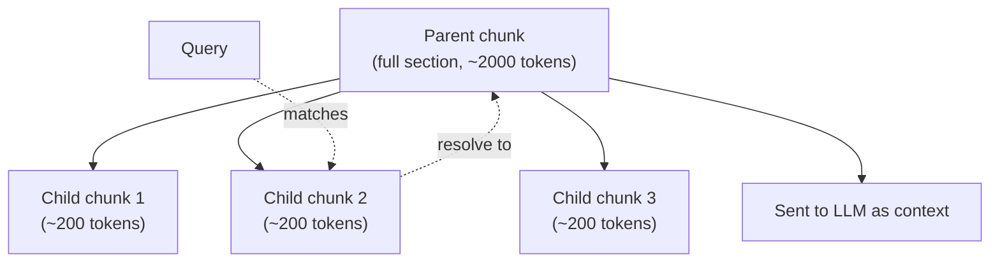
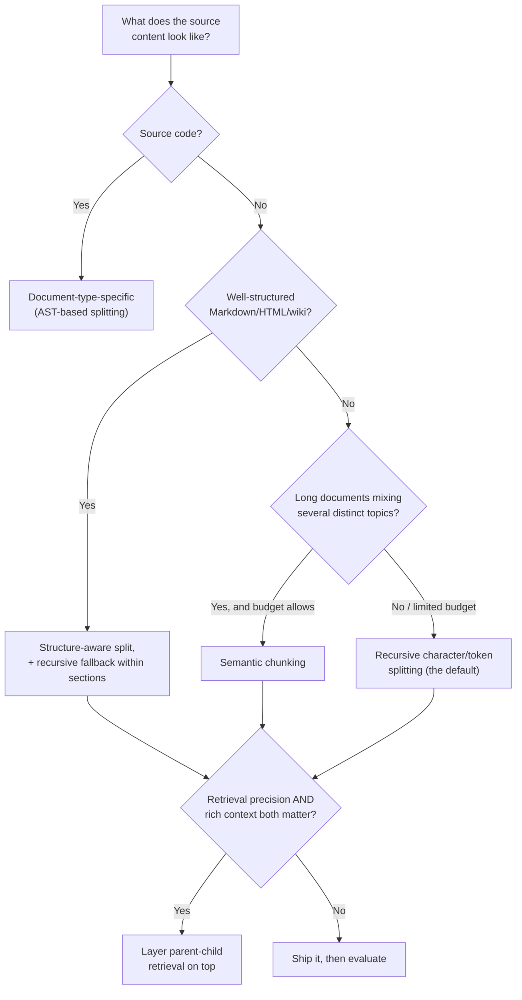
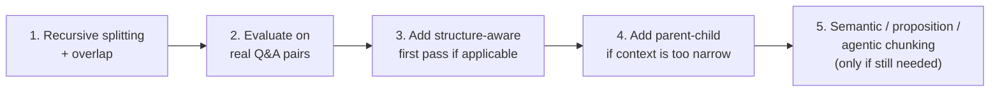

# Chunking Strategies for RAG

## Overview

Chunking is how a document gets split into the pieces that actually get embedded and retrieved. It has more influence on RAG quality than almost any other single design choice — see [scaling-rag-with-chroma-db.md](scaling-rag-with-chroma-db.md) for where chunking sits in the wider optimization picture, and [semantic-search-limits-knn-vs-ann.md](semantic-search-limits-knn-vs-ann.md) for how bad chunking causes semantic search to fail (Step 6 there).

---

## 1. Fixed-Size Chunking

Split text every N characters or tokens, usually with some overlap.

**Pitfalls:**

- Cuts mid-sentence, mid-table, or mid-code-block — the boundary is arbitrary and ignores content structure.
- A chunk boundary can split a fact from the context that gives it meaning (e.g., a number separated from the sentence defining what it measures).
- Overlap partially compensates but adds redundant embedding cost and duplicate/near-duplicate chunks in results.

**When it's fine:** quick prototypes, highly uniform text with no real structure (e.g., transcripts with no punctuation).

---

## 2. Recursive Character/Token Splitting

Try to split on a prioritized list of separators (e.g., `\n\n` → `\n` → `. ` → `" "`), falling back to a harder cut only when a higher-priority separator isn't available within the target chunk size. This is the most common "default" chunker (e.g., LangChain's `RecursiveCharacterTextSplitter`).

**Pitfalls:**

- Still has no real understanding of meaning — it's better than fixed-size, but two adjacent paragraphs about unrelated topics can still land in the same chunk if they fit the size budget.
- Choosing the right `chunk_size`/`chunk_overlap` is still manual, dataset-specific tuning.
- When it falls through to a hard character cut (common with unusual formatting), it's no better than fixed-size chunking.

**When it's fine:** the strong default for most prose/markdown when you don't have a specific reason to do something fancier — good starting point before optimizing further.

---

## 3. Sentence-Based Chunking

Split strictly on sentence boundaries (using an NLP sentence tokenizer), then group a few sentences per chunk.

**Pitfalls:**

- A single sentence is often not self-contained ("It was approved the following week." — approved by whom? what was?) — too-small chunks lose the context needed to be useful on their own.
- Many small chunks increase the total number of embeddings and vector-index entries, raising both ingestion cost and query-time candidate volume — see [scaling-rag-with-chroma-db.md](scaling-rag-with-chroma-db.md).
- Sentence tokenizers can mis-split on abbreviations, decimal numbers, code snippets, or non-English text.

**When it's fine:** highly factual, dense text where each sentence really is a self-contained claim (e.g., regulatory clauses, glossary entries).

---

## 4. Semantic Chunking

Embed individual sentences (or small windows), then cut a new chunk boundary wherever the similarity between consecutive sentence embeddings drops below a threshold — i.e., split where the *topic* actually changes.

**Pitfalls:**

- Expensive at ingestion — requires embedding at the sentence level *before* you even decide on final chunks, effectively doubling embedding work.
- Highly sensitive to the similarity threshold: too strict → chunks are too small and numerous; too loose → boundaries barely differ from recursive splitting.
- Boundaries are non-deterministic across similar documents if the underlying embedding model or threshold changes — makes chunk sizes unpredictable, complicating downstream tuning.

**When it's fine:** long-form content that mixes several distinct topics per document (e.g., meeting transcripts, long reports) where topic-based boundaries genuinely matter more than structural ones.

---

## 5. Structure-Aware Chunking

Split along the document's own structure: Markdown headers, HTML tags, slide boundaries, or table rows — rather than raw character counts.

**Pitfalls:**

- Completely dependent on the source having *real* structure — garbage-in-garbage-out on scanned PDFs, poorly formatted text, or inconsistent heading usage.
- Sections are often wildly uneven: a "## Overview" header might cover one sentence while another section runs for pages — you still need a size-based fallback within large sections.
- Structure boundaries (e.g., a Markdown header) don't always align with semantic boundaries — a section can still cover multiple loosely related sub-topics.

**When it's fine:** well-authored Markdown/HTML/technical docs, wikis, or docs with consistent heading conventions — very high value for its implementation cost when the structure is reliable.

---

## 6. Document-Type-Specific Chunking

Use a parser tailored to the content type: AST-based splitting for source code (functions/classes as units), row/table-aware splitting for tabular data, slide-aware splitting for presentations.

**Pitfalls:**

- Requires a different parser per content type — meaningfully more engineering and maintenance than a single generic splitter.
- Brittle to malformed or unusual input (e.g., code with syntax errors breaks AST parsing; irregular table layouts break row-based logic).
- Mixed-content documents (e.g., a Markdown file with embedded code blocks and tables) need a router that dispatches each region to the right chunker — added complexity.

**When it's fine:** codebases (chunk by function/class, not by line count), spreadsheets/CSVs, and any corpus dominated by one clearly structured content type.

---

## 7. Parent-Child (Hierarchical) Chunking

Embed small "child" chunks for precise retrieval matching, but store a pointer to a larger "parent" chunk (or the whole section/document) that gets sent to the LLM as context once a child chunk is retrieved.

**Pitfalls:**

- Doubles the indexing complexity: you need to store/track the child→parent mapping and fetch parents at query time (extra storage and a lookup step, not just a single vector search).
- Two more parameters to tune (child size, parent size) instead of one.
- If the parent is too large, you're back to the "long chunk dilutes relevance" problem in the context sent to the LLM — it doesn't eliminate the size trade-off, just moves it to a different stage.

**When it's fine:** almost always a good upgrade over flat chunking once precision-in-retrieval and richness-in-context both matter — the standard choice for production RAG once basic chunking is validated.

---

## 8. Proposition-Based Chunking

Use an LLM to rewrite the document into a list of atomic, self-contained factual statements ("propositions"), each embedded as its own chunk.

**Pitfalls:**

- Requires an LLM call per document at ingestion time — meaningfully more expensive and slower than any text-splitter-based approach.
- Can lose original phrasing, nuance, or hedging language present in the source ("may," "in most cases") if the rewrite over-simplifies.
- Over-atomizing can strip away useful surrounding context that a human (or the generation LLM) would have used to correctly interpret the proposition.

**When it's fine:** high-precision fact retrieval use cases (e.g., compliance Q&A, structured knowledge extraction) where the cost of LLM-based preprocessing is justified by retrieval precision requirements.

---

## 9. Agentic / LLM-Based Chunking

Ask an LLM to directly decide where chunk boundaries should go, given the whole document (or a sliding window of it), based on its understanding of topic shifts.

**Pitfalls:**

- Most expensive option — an LLM call (or several) per document, scaling poorly with corpus size.
- Non-deterministic: the same document can get chunked differently across runs or model versions, making the pipeline harder to reproduce/debug.
- Slower ingestion pipeline, which compounds badly with the incremental-ingestion practices recommended for scaling (see [scaling-rag-with-chroma-db.md](scaling-rag-with-chroma-db.md)).

**When it's fine:** small, high-value corpora where chunking quality directly drives business outcomes and the ingestion cost is a rounding error against that value (e.g., legal contract review).

---

## 10. Late Chunking (Contextual Chunking)

Embed the **entire document** first using a long-context embedding model, then pool/derive per-chunk embeddings from that full-document representation — so every chunk's embedding still "knows about" the rest of the document, instead of being computed in isolation.

**Pitfalls:**

- Requires an embedding model that supports long context windows — not all embedding models qualify, and options are more limited than for standard chunk-then-embed.
- More complex pipeline (embed-whole-document → derive-chunk-embeddings) than "split then embed each piece independently."
- Still relatively new/less battle-tested compared to the other strategies here — fewer production war stories to draw tuning guidance from.

**When it's fine:** documents where later chunks depend heavily on earlier context (e.g., "as discussed above, the exception applies..."), and you're using an embedding model that supports it.

---

## 11. Comparison of Pitfalls

| Strategy | Main Risk | Ingestion Cost | Determinism |
|---|---|---|---|
| Fixed-size | Cuts mid-thought | Very low | High |
| Recursive splitting | Still boundary-blind at fallback | Low | High |
| Sentence-based | Chunks too small to be self-contained | Low | High |
| Semantic chunking | Threshold-sensitive, unpredictable sizes | Medium-high | Low |
| Structure-aware | Breaks on poorly structured input | Low | High (if structure is clean) |
| Document-type-specific | Brittle to malformed input | Medium | High |
| Parent-child | Extra indexing/lookup complexity | Low-medium | High |
| Proposition-based | Loses nuance, expensive | High | Medium |
| Agentic/LLM-based | Most expensive, non-deterministic | Very high | Low |
| Late chunking | Needs long-context embedding model | Medium | Medium |

---

## 12. How to Choose the Best Strategy

### Decision Factors

1. **Document structure** — code needs AST-aware splitting; well-formed Markdown/HTML rewards structure-aware splitting; unstructured prose defaults to recursive splitting.
2. **Query patterns** — narrow factual Q&A benefits from smaller/precise chunks (or propositions); broad summarization needs larger chunks or parent-child context.
3. **Embedding model context window** — chunk size should stay well within the model's effective context, not just its hard token limit (quality degrades before the limit is hit).
4. **Ingestion budget and latency** — semantic, proposition-based, and agentic chunking all cost meaningfully more at ingestion time; only pay for them where the eval numbers justify it.
5. **Determinism/reproducibility needs** — if you need stable, debuggable chunk boundaries across re-ingestion, avoid embedding- or LLM-based boundary decisions.

### The Practical Recipe

1. **Start simple:** recursive character/token splitting with ~10–15% overlap. This is a strong baseline for most text.
2. **Build an evaluation set:** a handful of real questions with known correct source passages. Measure retrieval hit rate (is the right chunk in the top-k?) — not just "it looks reasonable."
3. **Layer structure-awareness** if your source documents have reliable headers/sections — split by structure first, then recursively within each section as a second pass (hybrid, and the most common real-world setup).
4. **Add parent-child retrieval** once basic chunking is validated and you notice retrieved chunks are accurate but too narrow for the LLM to generate a full answer.
5. **Reach for semantic, proposition-based, or agentic chunking only if evaluation shows a specific, persistent gap** the simpler strategies can't close — these are the most expensive options, not the default starting point.

---

## 13. Key Takeaways

- No single chunking strategy is universally "best" — the right choice depends on document structure, query patterns, and budget, not a fixed rule.
- **Recursive character/token splitting with overlap** is the right default starting point for most prose/markdown corpora.
- **Structure-aware chunking** is high-value when documents have reliable headers/sections, but degrades badly on poorly structured input.
- **Semantic, proposition-based, and agentic chunking** all trade significant ingestion cost and/or determinism for potentially better boundaries — reserve them for cases where simpler methods measurably fall short.
- **Parent-child chunking** is a near-universal upgrade once basic chunking works, since it decouples retrieval precision (small chunks) from generation context (larger parent).
- Always validate chunking choices against a real evaluation set of questions and known-correct sources — chunking quality is easy to guess wrong and cheap to measure.
