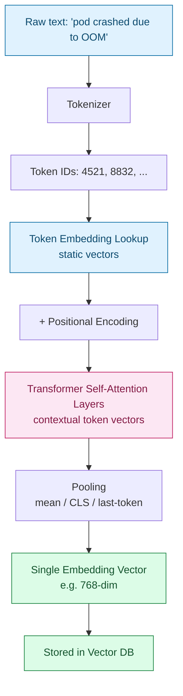

# Embeddings — Embedding Models vs LLMs


## 1. Core Difference: Generative vs Representational

Both are neural networks trained on text, but they solve different problems:

- **LLM** — a *generative* model. Predicts the next token, one at a time. Output: fluent text.
- **Embedding model** — a *representational* model. Compresses a piece of text into a fixed-length vector that captures its meaning. Output: a vector, never text.

```python
# LLM: continues text
llm("The pod crashed due to an OOM error.")
# → "This typically happens when the container's memory limit..."

# Embedding model: converts to a vector, nothing else
embed("The pod crashed due to an OOM error.")
# → [0.021, -0.183, 0.774, ...]   (e.g. 768 or 1536 dims)
```

Two differently-worded sentences with the same meaning land close together in vector space:

```python
embed("The pod crashed due to an OOM error.")
embed("The container ran out of memory and was killed.")
# → high cosine similarity, despite zero shared words
```

## 2. Why This Split Matters in RAG

| Task | Model used | Why |
| --- | --- | --- |
| Convert documents into searchable vectors | Embedding model | Cheap, fast, purpose-built for similarity |
| Find relevant chunks for a query | Embedding model (cosine similarity) | Comparing meaning, not generating |
| Synthesize the final answer | LLM | Needs to reason and generate fluent text |

> **Gotcha:** An embedding model is not a smaller/cheaper LLM you can also use for generation — it has no generative head at all. Don't reach for an embedding model when you need text output, even for something "simple."

## 3. Both Are Neural Networks — Same Family, Different Training

Many embedding models are literally Transformer *encoders* (BERT-style), and some newer ones are repurposed decoder-only LLMs (Mistral, Llama) fine-tuned to output a vector instead of generating tokens. The architecture is often identical; the training objective and final layer are what diverge.

| Aspect | LLM | Embedding model |
| --- | --- | --- |
| Base architecture | Transformer (usually decoder-only) | Transformer (often encoder-only) |
| Training objective | Predict next token | Contrastive learning |
| Output | Probability distribution → sampled token | Single fixed-length dense vector |
| Typical size | Billions of parameters | Millions to low billions |
| Can it generate text? | Yes | No |

## 4. How Semantic Similarity Is Learned

No one labels "these two words are similar." The model learns it from **contrastive training**:

1. Gather **positive pairs** — question + correct answer, query + clicked document, paraphrases, adjacent sentences.
2. Gather **negative pairs** — unrelated text, usually sampled randomly from the same batch.
3. Train with a **contrastive loss**: pull positive pairs' vectors together, push negative pairs' vectors apart.

```python
# Simplified intuition, not real training code
anchor   = embed("How do I fix a CrashLoopBackOff in Kubernetes?")
positive = embed("Restart the pod after checking the container logs.")
negative = embed("The stock market rallied on Tuesday.")

similarity(anchor, positive)  # loss pushes this UP
similarity(anchor, negative)  # loss pushes this DOWN
```

Repeated over millions of pairs, the model's weights reorganize so that real-world semantic closeness maps to geometric closeness (cosine similarity) in vector space. The individual vector dimensions are **latent** — not hand-labeled concepts — but empirically capture consistent structure:

```text
vector("king") - vector("man") + vector("woman") ≈ vector("queen")
```

> **Gotcha:** Older methods (Word2Vec, GloVe) give every word one *static* vector regardless of context — `"bank"` gets the same vector in "river bank" and "savings bank." Transformer-based embeddings fix this via self-attention (see §5), producing *contextual* embeddings instead.

## 5. Token Vectors vs the Final Embedding — Full Workflow

"Token vector" and "embedding" are related but not the same thing. Token vectors are an intermediate step; the pooled sentence/document embedding is the final output you store and search.



**Step by step:**

1. **Tokenization** — text is split into subword tokens: `["pod", "crash", "##ed", "due", "to", "OO", "##M"]`.
2. **Token embedding lookup** — each token ID maps to a static vector from a learned embedding matrix. Same word, same vector, regardless of context (this is where Word2Vec/GloVe stopped).
3. **Positional encoding** — added to each token vector so the model knows word order.
4. **Self-attention layers** — every token's vector is updated based on every other token in the sentence. This is where context enters — the output is now *contextual* token vectors.
5. **Pooling** — the per-token vectors are collapsed into one fixed-size vector for the whole input:

   | Method | How it works |
   | --- | --- |
   | Mean pooling | Average all token vectors, element-wise |
   | CLS token | Use a special `[CLS]` token trained to summarize the whole input (BERT-style) |
   | Last token | Use the final token's vector (common in LLM-based embedding models) |

```python
# Mean pooling, simplified
token_vectors = [v1, v2, v3, v4, v5, v6, v7]
sentence_embedding = average(token_vectors)   # → ONE vector
```

> **Gotcha:** "I embedded my document" refers to the final pooled vector (Step 5), not the intermediate per-token vectors from Step 4. Mixing these two up is a common source of confusion when reading embedding-model documentation.

## Quick Reference Card

| Task | Syntax / Concept |
| --- | --- |
| Generate text | LLM, autoregressive next-token prediction |
| Produce a searchable vector | Embedding model, contrastive training |
| Compare two texts for meaning | Cosine similarity between their embeddings |
| Fix "same word, different meaning" | Self-attention → contextual token vectors |
| Collapse per-token vectors into one | Pooling (mean / CLS / last-token) |
| Combine both in a pipeline | Embedding model for retrieval, LLM for generation → RAG |

