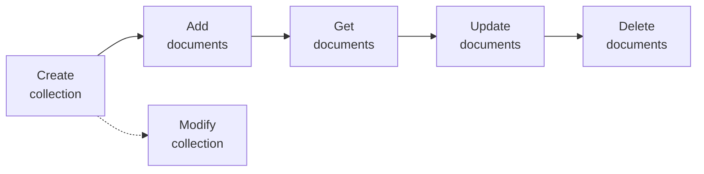
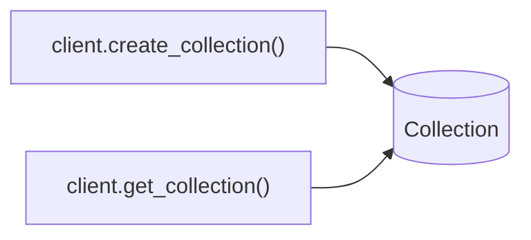
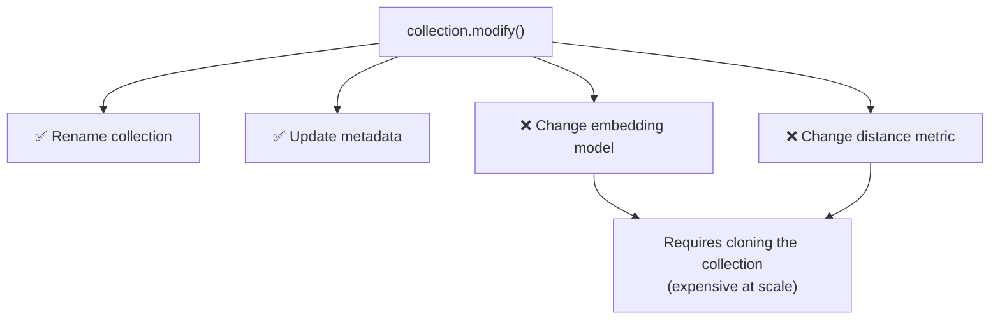
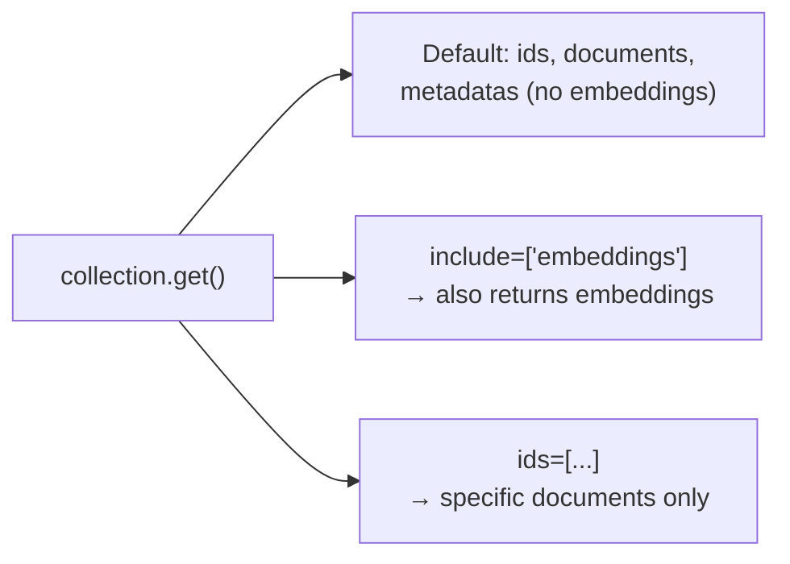
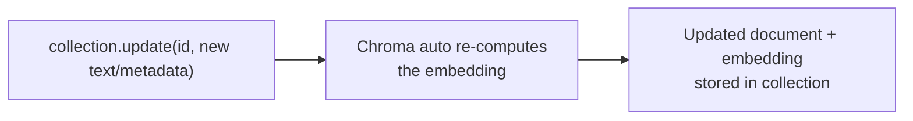
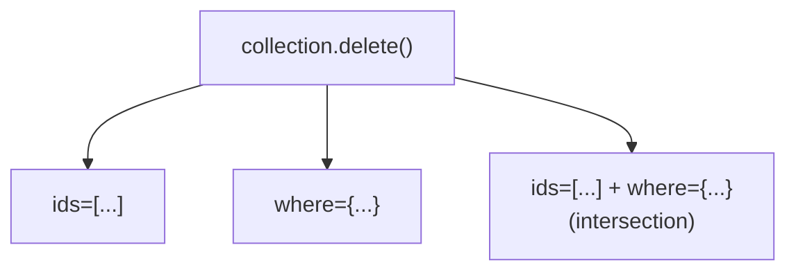

# Essential Database Operations in Chroma DB

## Overview

Collections are how Chroma DB organizes data. The core operations that form the foundation of any Chroma DB application:



---

## 1. Creating Collections

**Setup — import and define an embedding model:**

```python
import chromadb
from chromadb.utils import embedding_functions

ef = embedding_functions.SentenceTransformerEmbeddingFunction(
    model_name="all-MiniLM-L6-v2"
)
```

**Create the client and collection:**

```python
client = chromadb.Client()
collection = client.create_collection(
    name="my_collection",
    metadata={"description": "..."},
    configuration={"embedding_function": ef}
)
print(collection.name)
# Output: my_collection
```

- **Metadata** on the collection itself helps track its purpose and contents.
- `create_collection` returns the new collection object.

### 1.1 Connecting to an Existing Collection

```python
collection = client.get_collection(name="my_collection")
print(collection.metadata)
# Output: {'description': '...'}
```

Use `get_collection` to reconnect to a collection created earlier, without recreating it.



---

## 2. Modifying Collections

```python
collection.modify(
    name="new_collection_name",
    metadata={"key": "value"}
)
print(collection.metadata)
# Output: {'key': 'value'}
```

`modify()` can change a collection's **name** and **metadata**.

> ⚠️ **Limitation:** the **embedding model** or **distance metric** of an existing collection **cannot** be changed via `modify()`. To change these, you must **clone the collection** — an operation that can be computationally expensive for collections with substantial data.



---

## 3. Adding Documents

```python
collection.add(
    documents=["...", "..."],
    metadatas=[
        {"source": "...", "version": 0.1},
        {"source": "...", "version": 0.2},
    ],
    ids=["id1", "id2"]
)
```

- `documents`: list of text documents to insert
- `metadatas` (optional): list of dictionaries, one per document — **no restrictions** on metadata content
- `ids`: **required** — a unique ID for each document

---

## 4. Getting Documents

```python
collection.get()
```

- Returns a **Python dictionary**.
- By default, **embeddings are not included** in the output (to keep it clean) — but they *are* stored.
- To include embeddings: `collection.get(include=['embeddings'])`
- To retrieve specific documents: `collection.get(ids=["id1", "id2"])`



---

## 5. Updating Documents

```python
collection.update(
    ids=["id1"],
    documents=["Updated text about LangChain..."],
    metadatas=[{"source": "langchain.com", "version": 0.2}]
)
```

- Modifies one or more records **by ID**.
- Can update the document text and/or its metadata.
- Chroma DB automatically **re-embeds** the document in the background as soon as the update is submitted — no manual re-embedding needed.



---

## 6. Deleting Documents

```python
collection.delete(ids=["id2"])
# or
collection.delete(where={"topic": "llamaindex"})
# or combine both
collection.delete(ids=["id2"], where={"topic": "llamaindex"})
```

- Delete by **list of IDs**, by a **`where` metadata filter**, or a **combination of both**.
- When combined, only documents matching **both** the given IDs *and* the `where` condition are deleted.



---

## 7. HNSW Distance Function Configuration

Chroma DB uses **HNSW (Hierarchical Navigable Small World)** for approximate nearest neighbor search. The `space` parameter defines the distance function used:

| Value | Distance Function | Default? |
|---|---|---|
| `l2` | Squared L2 (Euclidean) norm | ✅ Yes |
| `cosine` | Cosine distance | No |
| `ip` | Inner product (dot product) distance | No |

Set at **collection creation time**:

```python
collection = client.create_collection(
    name="my_collection",
    configuration={
        "hnsw": {"space": "cosine"},
        "embedding_function": ef
    }
)
```

---

## 8. Key Takeaways

- **Collections** organize data in Chroma DB, each tied to an embedding function defined via `embedding_functions`.
- `create_collection()` makes a new collection; `get_collection()` connects to an existing one.
- `modify()` can rename a collection or change its metadata — but **not** its embedding model or distance metric (those require cloning).
- `add()` inserts documents (with optional metadata) — an `ids` list is mandatory.
- `get()` retrieves documents as a dict; embeddings are hidden by default (`include=['embeddings']` reveals them); can filter by `ids`.
- `update()` modifies documents/metadata by ID and **auto re-embeds** in the background.
- `delete()` removes documents by `ids`, by `where` metadata filter, or both combined.
- The **HNSW `space` parameter** (`l2` default, `cosine`, `ip`) controls the distance function used for nearest-neighbor search, set at collection creation.
