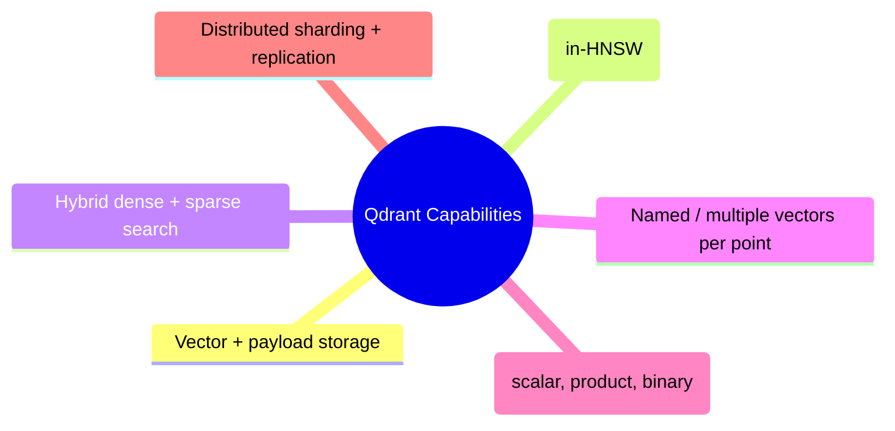
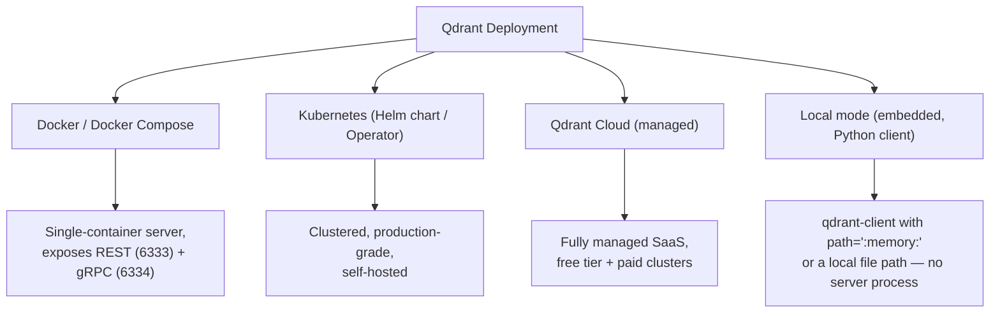
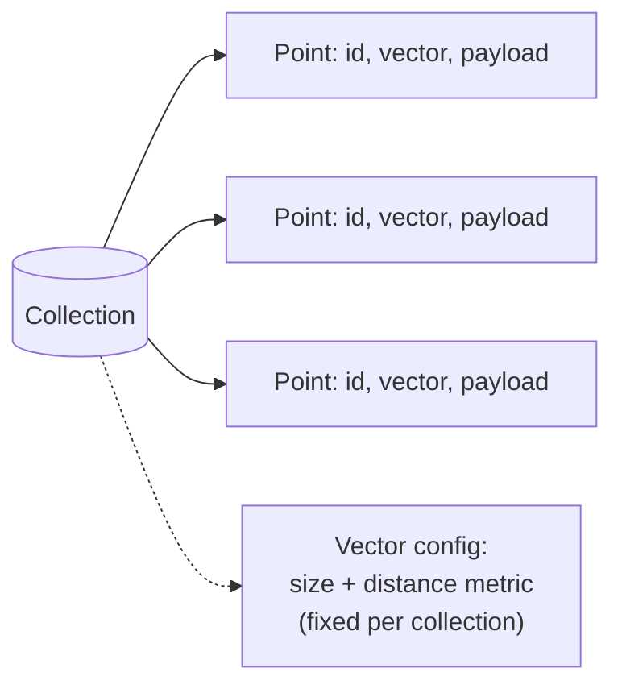
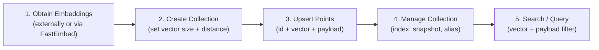
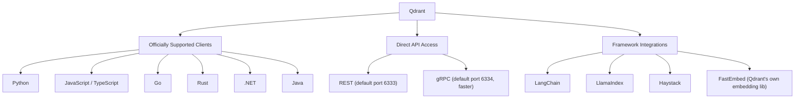
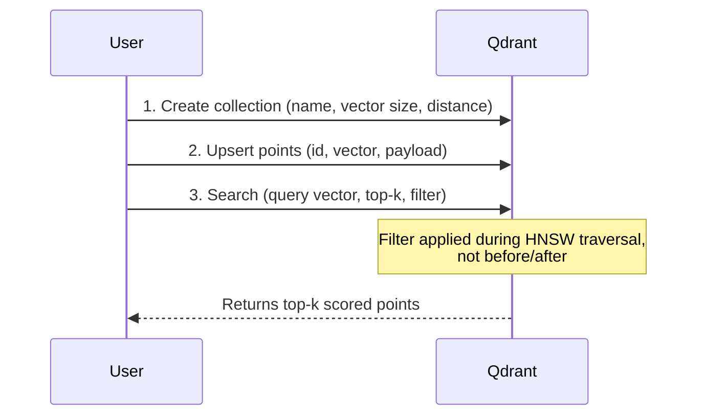
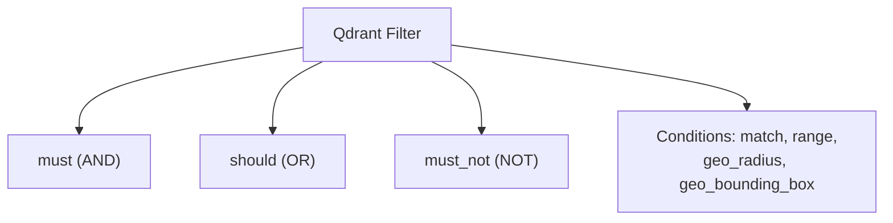
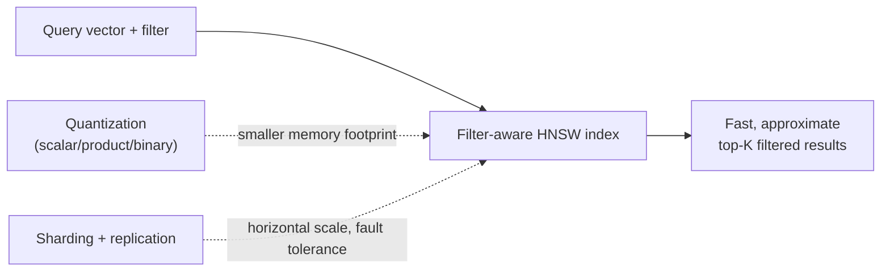
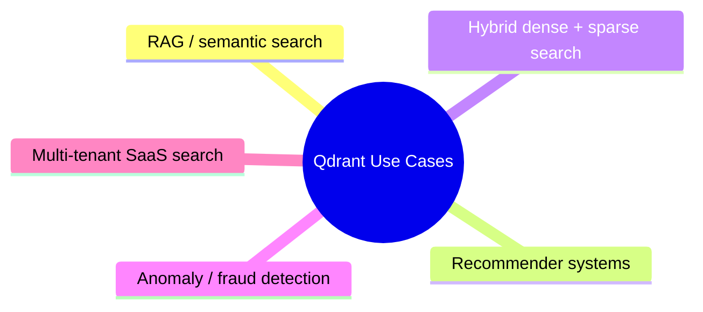

# Qdrant: Key Concepts and Architecture

## 1. What Is Qdrant?

Qdrant ("quadrant") is an **open-source vector database and similarity search engine**, written in **Rust**, built for storing, indexing, and querying high-dimensional vector embeddings alongside structured **payload** (metadata) — with **filtering as a first-class part of the search itself**, not a bolt-on step.

## 2. Core Capabilities

| Capability | Description |
|---|---|
| Storage of vectors + payload | Stores each vector as a **point** with an ID and an arbitrary JSON **payload** |
| Vector search | ANN search over embeddings using cosine, dot product, Euclidean, or Manhattan distance |
| Filtered vector search | Payload filters are woven directly into the HNSW graph traversal — not applied before/after search |
| Hybrid (dense + sparse) search | Combine dense embeddings with sparse vectors (e.g., BM25/SPLADE) for keyword + semantic search |
| Multiple/named vectors per point | Store several vector representations (e.g., text + image) on the same point |
| Quantization | Scalar, product, and binary quantization to shrink memory footprint |
| Distributed operation | Sharding + replication across nodes for scale and fault tolerance |



---

## 3. Deployment Options



| Mode | How it works | Best for |
|---|---|---|
| Docker / Compose | Server runs as a container, clients connect via REST/gRPC | Local dev, self-managed prod |
| Kubernetes | Helm chart / Qdrant Operator manages clustered nodes | Production, horizontal scale |
| Qdrant Cloud | Fully managed clusters, hosted by Qdrant | Production without ops overhead |
| Local (embedded) | `QdrantClient(":memory:")` or a local path, in-process | Quick prototyping, unit tests |

---

## 4. Core Concepts

| Concept | Chroma DB equivalent | Description |
|---|---|---|
| **Collection** | Collection | Top-level container for points that share the same vector configuration (size, distance metric) |
| **Point** | Document (+ embedding) | A single record: `id` + `vector(s)` + `payload` |
| **Payload** | Metadata | Arbitrary JSON attached to a point — filterable, indexable |
| **Payload index** | (no direct equivalent) | Optional index on a payload field to speed up filtering at scale |



> Unlike Chroma DB, Qdrant does **not** auto-generate embeddings by default — vectors are typically computed by the caller (or via Qdrant's optional **FastEmbed** integration) and passed in explicitly.

---

## 5. Architecture and Workflow



1. **Obtain embeddings:** compute vectors yourself (any embedding model) or use Qdrant's FastEmbed helper library.
2. **Create a collection:** declare vector size and distance metric up front — these are fixed for the collection's lifetime (analogous to Chroma's inability to change embedding model/distance metric without cloning).
3. **Upsert points:** insert or update points by ID; re-upserting an existing ID overwrites it.
4. **Manage the collection:** create payload indexes, take snapshots, set up collection aliases for zero-downtime swaps.
5. **Search/query:** run nearest-neighbor search with an optional payload filter applied natively during graph traversal.

---

## 6. Clients and Integrations



---

## 7. Typical Qdrant Workflow (Example)



```python
from qdrant_client import QdrantClient
from qdrant_client.models import Distance, VectorParams, PointStruct, Filter, FieldCondition, MatchValue

client = QdrantClient(url="http://localhost:6333")

client.create_collection(
    collection_name="docs",
    vectors_config=VectorParams(size=384, distance=Distance.COSINE),
)

client.upsert(
    collection_name="docs",
    points=[
        PointStruct(id=1, vector=[0.1, 0.2, ...], payload={"source": "langchain.com", "version": 0.1}),
        PointStruct(id=2, vector=[0.05, 0.9, ...], payload={"source": "python.org", "version": 0.3}),
    ],
)

results = client.query_points(
    collection_name="docs",
    query=[0.1, 0.25, ...],
    limit=5,
    query_filter=Filter(
        must=[FieldCondition(key="source", match=MatchValue(value="langchain.com"))]
    ),
)
```

- **Default/available distance metrics:** `Cosine`, `Dot`, `Euclid`, `Manhattan` — chosen per collection at creation time (comparable to Chroma's HNSW `space` parameter: `l2`, `cosine`, `ip`).

---

## 8. Filtering — Qdrant's Key Differentiator

| Filter Clause | Meaning | Chroma DB equivalent |
|---|---|---|
| `must` | All conditions must match (AND) | `$and` |
| `should` | At least one condition should match (OR) | `$or` |
| `must_not` | None of the conditions may match (NOT) | `$ne` / negation |
| `match` | Exact value / any-of match on a field | `$eq` / `$in` |
| `range` | Numeric/date range (`gt`, `gte`, `lt`, `lte`) | `$gt`/`$gte`/`$lt`/`$lte` |
| `geo_radius` / `geo_bounding_box` | Geospatial filtering | *(not available in Chroma)* |



> **Key architectural difference from Chroma DB:** Chroma applies metadata filtering either before or alongside vector search as a largely separate step. Qdrant integrates the payload filter **into the HNSW graph traversal itself**, so it can skip filtered-out candidates while walking the graph instead of over-fetching and filtering afterward — this keeps recall high even with very selective filters at scale. Indexing a payload field (`create_payload_index`) further speeds this up.

---

## 9. Performance Features

- **HNSW (Hierarchical Navigable Small World):** same core ANN algorithm family as Chroma, but with **native filter-aware traversal**.
- **Rust core:** like Chroma's core, built in Rust for low-latency reads/writes.
- **Quantization:** scalar, product, and **binary quantization** compress vectors in memory/disk with a tunable accuracy/speed trade-off — no direct Chroma equivalent.
- **Sharding & replication:** collections can be split into shards across nodes and replicated for fault tolerance — built for horizontal, distributed scale (Chroma's client-server mode is single-node by comparison).



---

## 10. Common Use Cases

- **RAG / semantic search** — context retrieval for LLM applications
- **Recommender systems** — user/item embedding similarity
- **Hybrid search** — combining sparse (keyword) and dense (semantic) retrieval in one query
- **Anomaly / fraud detection** — nearest-neighbor distance as an outlier signal
- **Multi-tenant SaaS search** — payload-based partitioning to isolate tenant data within shared collections



---

## 11. Qdrant vs. Chroma DB — Quick Comparison

| | Chroma DB | Qdrant |
|---|---|---|
| Core language | Rust (core), Python API | Rust |
| Auto-embedding | Yes, built-in embedding functions | No by default (bring your own, or use FastEmbed) |
| Filtering model | Metadata (`where`) + document (`where_document`), largely separate from vector search | Payload filters integrated directly into HNSW traversal |
| Distributed/clustering | Client-server, single-node focus | Native sharding + replication for multi-node clusters |
| Quantization | Not built-in | Scalar, product, binary quantization |
| Geospatial filters | No | Yes (`geo_radius`, `geo_bounding_box`) |
| Best fit | Fast local/dev retrieval, simple RAG pipelines | Production-scale, filter-heavy, distributed vector search |

---

## 12. Key Takeaways

- Qdrant is a Rust-based, open-source vector database centered on **points** (`id` + `vector` + `payload`) grouped into **collections** with a fixed vector size and distance metric.
- It can be run via **Docker**, **Kubernetes**, **Qdrant Cloud** (managed), or **embedded/local mode** for quick prototyping — no server required for the last option.
- Its standout feature versus Chroma DB is **filter-aware HNSW search**: payload filters (`must`/`should`/`must_not`, `match`, `range`, geo filters) are applied *during* graph traversal, not as a separate pre/post step.
- Supports **cosine, dot, Euclidean, and Manhattan** distance metrics, set at collection creation.
- Adds capabilities Chroma lacks out of the box: **quantization** (scalar/product/binary) for memory efficiency, **native sharding + replication** for distributed scale, **geospatial filters**, and first-class **hybrid dense+sparse search**.
- Officially supports **Python, JavaScript/TypeScript, Go, Rust, .NET, and Java** clients, plus REST and gRPC APIs; integrates with **LangChain**, **LlamaIndex**, and **Haystack**.
- Well suited for production-scale RAG, recommenders, hybrid search, anomaly detection, and multi-tenant search where filter-heavy queries at scale matter most.
