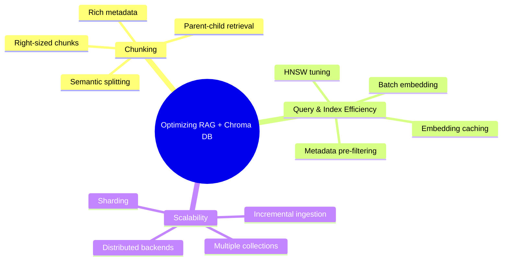
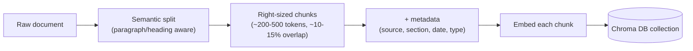
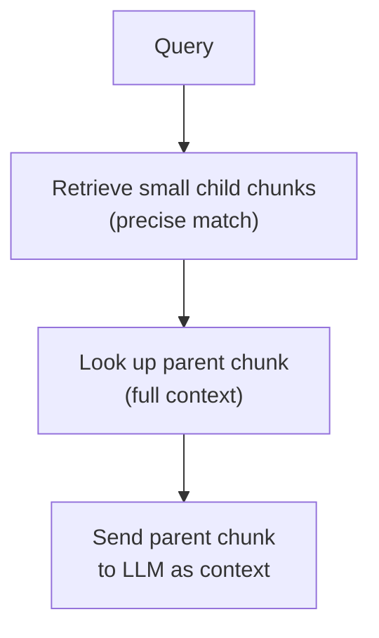
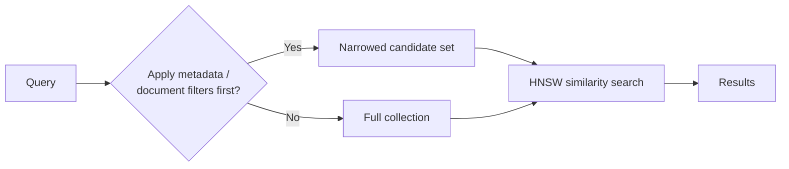
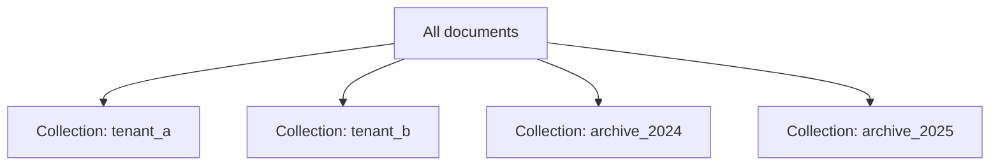
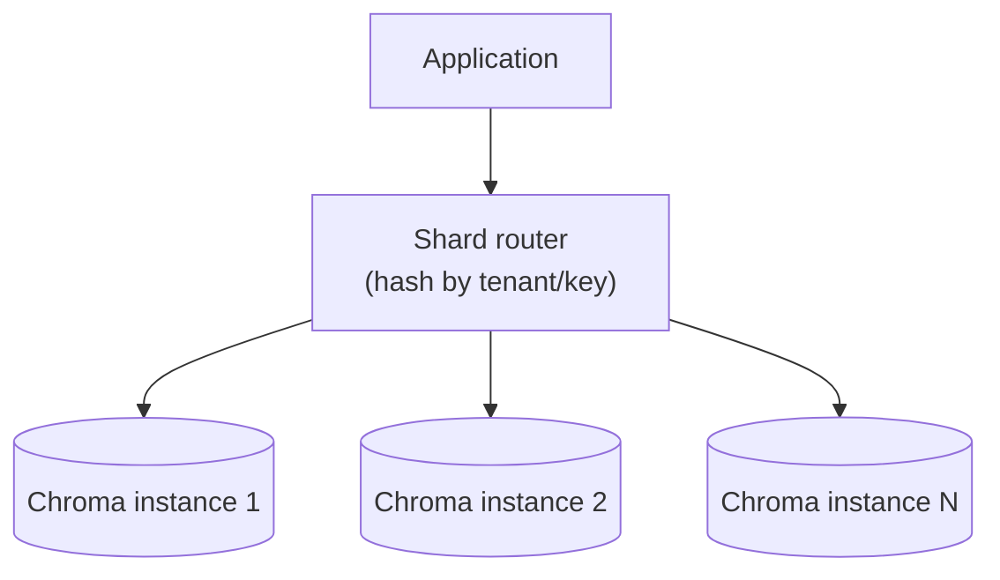

# Scaling and Optimizing a RAG System with Chroma DB

## Overview

A RAG system built on Chroma DB has three independent levers to optimize: **chunking** (what gets embedded), **query/indexing efficiency** (how fast/accurate retrieval is), and **scalability** (how the system behaves as data grows into the millions/billions of vectors).

---

## 1. Chunking Strategies

Chunking quality is usually the single biggest lever on retrieval quality — a perfectly tuned index can't fix badly-cut chunks.

| Strategy | What it does | Why it matters |
|---|---|---|
| Semantic/recursive splitting | Break at paragraph/heading/sentence boundaries instead of a fixed character count | Prevents a chunk from straddling two unrelated ideas |
| Right-sized chunks (~200–500 tokens) | Balance chunk size against embedding model's effective context | Too small → loses context; too large → dilutes the embedding, hurting relevance |
| Overlap (~10–15%) | Repeat a small window of text between adjacent chunks | Preserves continuity across a chunk boundary |
| Rich per-chunk metadata | Tag each chunk with source, section, doc type, date, etc. | Enables metadata filtering (`where`) to prune the search space before vector search runs |
| Parent-child (hierarchical) chunking | Embed small chunks for precise retrieval, but return the larger parent chunk to the LLM | Balances retrieval precision with generation context |

---

## 2. Query and Indexing Efficiency

### 2.1 Tune HNSW Parameters

Chroma DB's only index is **HNSW** — see [similirity-serarch-hsnw.md](similirity-serarch-hsnw.md) for the full mechanics. The two categories of levers:

| Parameter | Controls | Trade-off |
|---|---|---|
| `ef_search` | Candidate list size at query time | ↑ recall & accuracy, ↓ query speed |
| `ef_construction` | Candidate list size when building the index | ↑ index quality, ↓ build speed, ↑ memory |
| `max_neighbors` | Max graph connections per node | ↑ search quality, ↑ memory & build time |

### 2.2 Batch and Cache Embeddings

- **Batch embedding calls** at ingestion time instead of embedding one chunk at a time — the embedding call (to Ollama, OpenAI, etc.) is almost always the actual bottleneck, not Chroma's write path.
- **Cache embeddings by content hash** — if a document hasn't changed, don't re-embed it on the next ingestion run.

### 2.3 Filter Before You Search

Combine `where` (metadata) and `where_document` (full-text) filters with vector search — see [chroma-db-filtering.md](chroma-db-filtering.md). Filtering narrows the HNSW candidate set *before* similarity ranking, which is often a bigger win than tuning the vector search itself.

### 2.4 Cache Frequent Queries

For repeat/high-traffic queries, cache the retrieved chunks (or even the final LLM response) keyed by a normalized query — a semantic cache avoids re-running retrieval + generation for near-duplicate questions.

---

## 3. Scalability for Huge Data Volumes

### 3.1 Single-Node Ceiling

Chroma DB in client-server mode (persistent volume) comfortably holds millions of vectors — but it runs as **one process**, so it eventually hits that node's CPU/memory ceiling.

### 3.2 Partition by Collection

Split data into multiple collections by domain, tenant, or time window:

- Shrinks the per-query candidate set (query only the relevant collection).
- Enables independent scaling, backup, or archival of each partition.

### 3.3 Sharding Beyond a Single Node

Chroma DB does **not** natively shard a single collection across multiple nodes. Past a single node's limits:

- Build an **application-side shard router**: hash or route by tenant/key to the correct Chroma instance, query the relevant shard(s), and merge results.
- Or migrate to a **distributed-by-design vector database** (e.g., Milvus, Qdrant) — this is the actual ceiling of Chroma DB, not a configuration knob.

### 3.4 Incremental Ingestion

- Track a **content hash or version** per document; only re-embed and `update()` documents that actually changed.
- Use `add()` / `update()` / `delete()` surgically (see [essential-db-operations.md](essential-db-operations.md)) instead of wiping and rebuilding the whole collection on every ingestion run.
- Parallelize ingestion workers, since embedding generation — not Chroma's write path — is typically the throughput bottleneck.

---

## 4. Key Takeaways

- **Chunking** quality (semantic boundaries, right size, metadata, parent-child retrieval) has outsized impact on retrieval quality — fix this before tuning the index.
- **Efficiency** comes from HNSW parameter tuning (`ef_search` for query-time recall/speed, `ef_construction`/`max_neighbors` for index quality/build cost), batched + cached embeddings, and filtering before searching.
- **Scalability** beyond a single Chroma node requires partitioning into multiple collections, an application-side shard router, or eventually a distributed vector database — Chroma alone doesn't shard automatically.
- Always **ingest incrementally** — re-embedding unchanged data is pure waste at scale.
