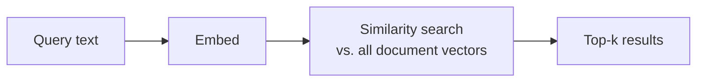
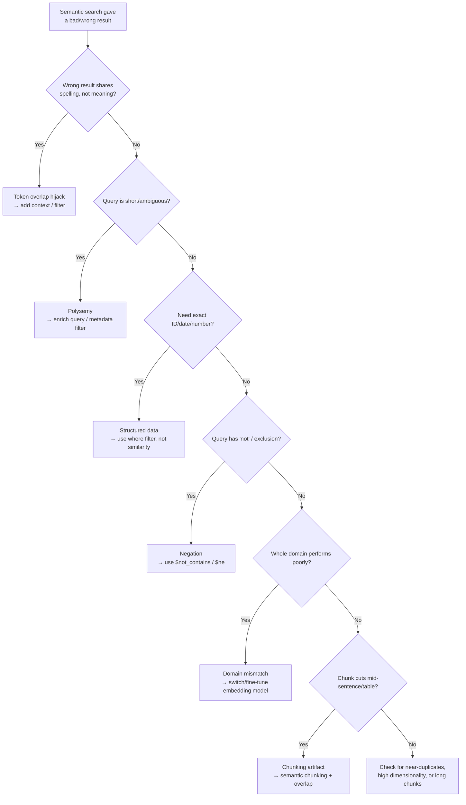
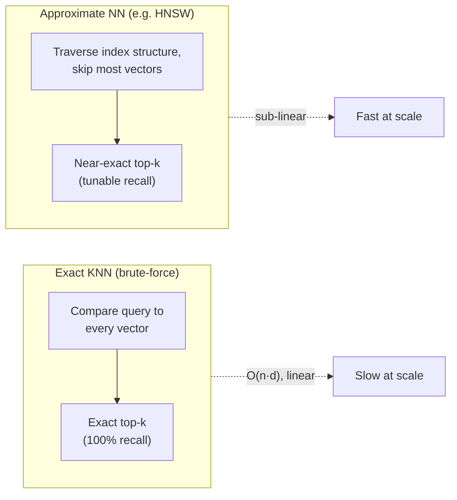
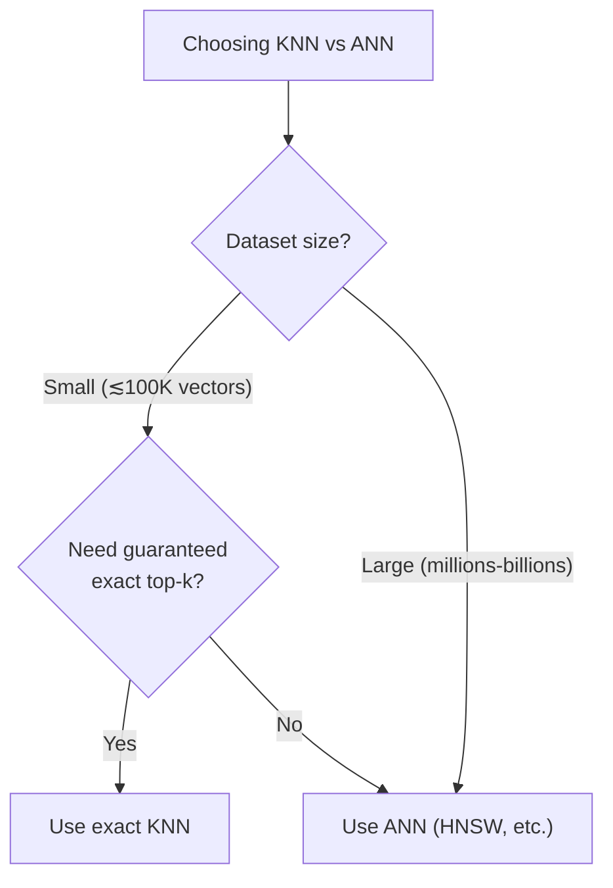

# When Semantic Search Fails, and KNN vs. ANN

## 1. What "Regular" Semantic Search Does

1. Embed the query into a vector using an embedding model.
2. Compute similarity (cosine, dot product, or L2 — see [similarity-search.md](similarity-search.md)) between the query vector and every stored document vector.
3. Return the top-k most similar vectors.

This works well when the embedding model captures the *intended meaning* of the query and documents equally. The failure modes below are all cases where that assumption breaks.

---

## 2. Step-by-Step: When Semantic Search Performs Poorly

### Step 1 — Surface/Token Overlap Hijacks Meaning

**Symptom:** the wrong document wins because it shares a *spelling*, not a *meaning*, with the query.

> Example (from [similirity-serarch-hsnw.md](similirity-serarch-hsnw.md)): querying `"polar bear"` returned a document about the **`polars`** Python library, because the embedding model was pulled toward the surface-level similarity between "polar" and "polars" rather than the animal.

- **Why:** embedding models can weight sub-word/character-level similarity, especially for rare or out-of-vocabulary terms.
- **Fix:** add more context to the query, or apply metadata/full-text filters (`where`, `where_document`) to exclude the wrong domain.

### Step 2 — Ambiguous, Context-Free Queries (Polysemy)

**Symptom:** a short query has multiple valid meanings, and semantic search silently picks one.

> Example: querying `"cats"` against a corpus where "pandas" appears both as an *animal* and as a *Python library* returns the animal-related documents — reasonable, but only because nothing disambiguated the query.

- **Why:** the query embedding lands in whichever region of vector space is closest on average — it can't ask "which sense did you mean?"
- **Fix:** enrich the query with context, or scope the search with a metadata filter (e.g., `topic: animals`) before running similarity search.

### Step 3 — Exact-Match / Structured Data Needs

**Symptom:** semantic search can't reliably find an exact ID, code, date, or number.

> Example: "find the document with ID `INV-2024-0517`" or "the invoice dated 2024-05-01" — nearby embeddings are not the same as an exact match on a structured field.

- **Why:** embeddings encode *meaning*, not exact tokens — two different invoice numbers can embed as "similar" text.
- **Fix:** store structured fields as **metadata** and query them with `where` (`$eq`, `$gt`, etc.) instead of relying on vector similarity.

### Step 4 — Negation and Logical Constraints

**Symptom:** "documents that do **not** mention Python" returns documents that *do* mention Python.

- **Why:** embeddings generally don't encode negation well — "not Python" embeds close to "Python," since the words dominate the vector.
- **Fix:** use document/metadata filters (`$not_contains`, `$ne`) for logical exclusion rather than trusting the embedding to understand "not."

### Step 5 — Domain-Mismatched Embedding Model

**Symptom:** retrieval quality is uniformly weak across an entire specialized corpus (legal, medical, source code).

- **Why:** general-purpose embedding models are trained on broad web text; domain-specific jargon may not be well separated in that model's vector space.
- **Fix:** evaluate retrieval recall on a domain test set; switch to (or fine-tune) a domain-specific embedding model if general-purpose models underperform.

### Step 6 — Chunking Artifacts (Context Fragmentation)

**Symptom:** relevant content exists in the corpus, but the retrieved chunk is a poor match because it was cut mid-sentence or mid-table.

- **Why:** an embedding represents *the chunk it was given* — a badly-cut chunk produces a badly-representative embedding.
- **Fix:** semantic-aware chunking with overlap, or parent-child retrieval — see [scaling-rag-with-chroma-db.md](scaling-rag-with-chroma-db.md).

### Step 7 — Near-Duplicate / Low-Diversity Corpora

**Symptom:** top-k results all look nearly identical, and ranking between them feels arbitrary.

- **Why:** when many documents are near-duplicates, small embedding noise — not real relevance — decides the ranking.
- **Fix:** deduplicate the corpus, or add distinguishing metadata to break ties meaningfully.

### Step 8 — Curse of Dimensionality

**Symptom:** in very high-dimensional embeddings, "everything looks equally similar" and rankings lose discriminative power.

- **Why:** as dimensionality grows, the gap between nearest- and farthest-neighbor distances shrinks — this hits magnitude-sensitive metrics (L2) harder than direction-only metrics.
- **Fix:** prefer **cosine similarity** for high-dimensional text embeddings (more robust to this effect); consider dimensionality reduction or a better-suited embedding model.

### Step 9 — Long Queries or Long Chunks Dilute the Vector

**Symptom:** a long chunk covering multiple topics retrieves poorly for a query about just one of those topics.

- **Why:** pooling a long text into a single fixed-size vector averages away fine-grained signal — one vector can't cleanly represent several distinct ideas.
- **Fix:** keep chunks focused (see chunking notes); for long queries, extract the key phrase/intent before embedding.

---

## 3. KNN vs. ANN

### 3.1 Exact K-Nearest Neighbors (KNN / Brute-Force)

Compares the query vector against **every** vector in the dataset, computes the exact distance/similarity, and returns the true top-k.

- **Guarantees:** 100% recall/precision relative to the chosen metric — no approximation error.
- **Cost:** $O(n \times d)$ per query ($n$ = number of vectors, $d$ = dimensionality) — scales **linearly** with corpus size.
- **Use case:** small collections, exact-answer requirements (audits, compliance), or as a ground-truth baseline to measure an ANN index's recall.

### 3.2 Approximate Nearest Neighbors (ANN)

Uses a specialized **index structure** — graph-based (HNSW), tree-based (Annoy), cluster-based (IVF), hashing-based (LSH), or quantization-based (PQ) — to avoid scanning every vector.

- **Guarantees:** near-exact, tunable results — typically 90–99%+ recall depending on configuration, not 100%.
- **Cost:** scales **sub-linearly** — this is what makes million-to-billion-scale vector search practical.
- **Tunable:** trades recall for speed via search-time parameters (e.g., HNSW's `ef_search`).
- **Use case:** production RAG systems, real-time search, large-scale collections — this is what **Chroma DB uses by default** (HNSW is its only supported index; see [chroma-db-intro.md](chroma-db-intro.md)).

### 3.3 Comparison

| Dimension | Exact KNN | ANN (e.g. HNSW) |
|---|---|---|
| Accuracy | 100% exact | Near-exact, tunable (~90–99%+) |
| Speed at scale | Slow — linear in dataset size | Fast — sub-linear |
| Memory | Lower (raw vectors only) | Higher (index/graph overhead) |
| Build cost | None (no index) | Index construction cost (`ef_construction`, etc.) |
| Tunability | None | Recall vs. speed, via search-time parameters |
| Scalability | Practical up to ~100K–1M vectors (hardware-dependent) | Scales to billions |
| Best for | Small datasets, exact-answer requirements | Large-scale, latency-sensitive production search |

### 3.4 Decision Guide

> **Note:** Chroma DB always uses HNSW (ANN) — it has no built-in exact-KNN mode. If you need guaranteed exact results on a small dataset, you'd compute similarity manually outside Chroma's indexed search path.

---

## 4. Key Takeaways

- Semantic search fails predictably: token-overlap hijacking, ambiguous/short queries, structured-data needs, negation, domain-mismatched embeddings, chunking artifacts, near-duplicate corpora, high dimensionality, and overly long chunks/queries.
- Most of these failures are fixed the same way: **combine vector search with metadata/full-text filtering** rather than expecting the embedding alone to handle everything.
- **Exact KNN** guarantees correctness but scales linearly — fine for small data or as a recall benchmark.
- **ANN** (what Chroma DB and most production vector databases use) trades a small, tunable amount of accuracy for search that scales to massive datasets.
- Chroma DB is ANN-only (HNSW) by design — there's no exact-KNN fallback built in.
