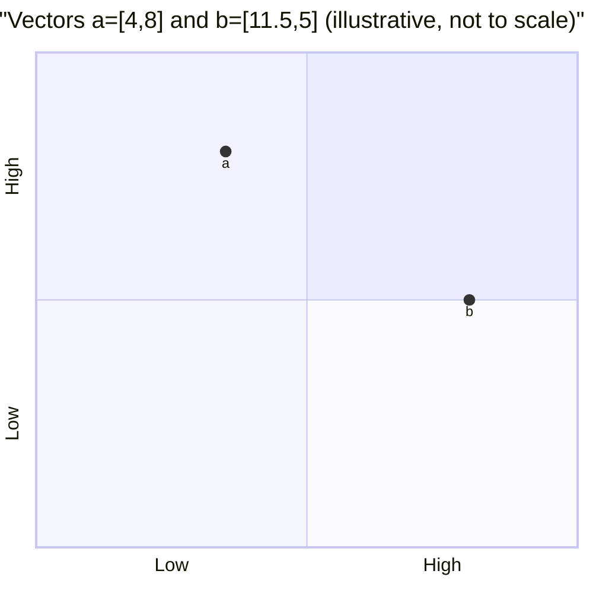
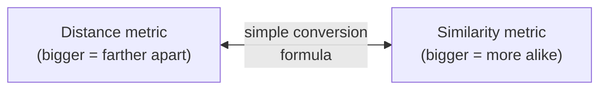
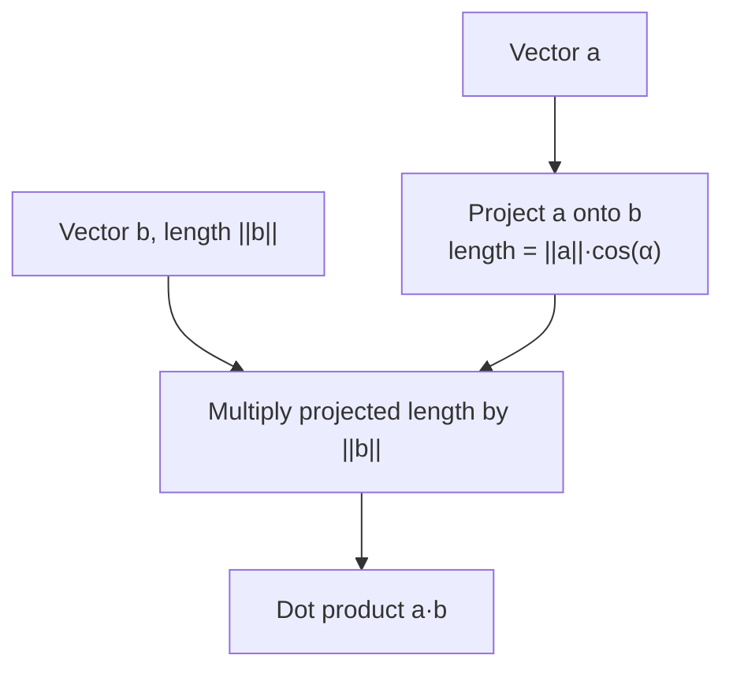
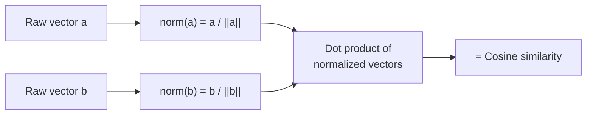
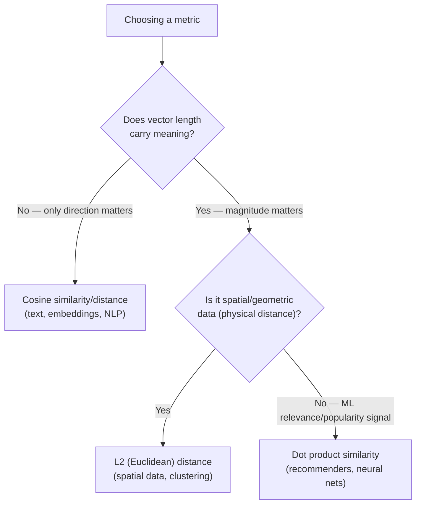

# Similarity Search

## 1. What Is Similarity Search?

**Similarity search** is the process of finding items in a dataset that are most similar to a given query item. At its core is a **distance or similarity metric** that quantifies how alike two data points are — the right choice depends on the nature of the data and the application.

**Common applications:**

- Recommendation systems (e.g., suggesting similar movies)
- Image and video retrieval
- Natural language processing (e.g., finding similar documents/sentences)
- Biometrics (e.g., face recognition)

---

## 2. Background Math

### 2.1 Vectors

A **vector** is a geometric object with **length** (magnitude) and **direction**. A vector with $n$ components can be represented on an $n$-dimensional Cartesian plane as an arrow from the origin.

Example: $a = [4, 8]$ is a 2-component vector, plotted as an arrow from the origin to the point $(4, 8)$.

> $a$ itself is a vector, not a length — the arrow, not a number.

### 2.2 Magnitude (L2 Norm / Euclidean Norm)

The magnitude of vector $a$ with $n$ components:

$$
||a|| = \sqrt{\sum_{k=1}^{n} a_k^2}
$$

For a 2D vector, this reduces to the Pythagorean theorem:

$$
||a|| = \sqrt{x^2 + y^2}
$$

**Example:** for $a = [4, 8]$:

$$
||a|| = \sqrt{4^2 + 8^2} \approx 8.94
$$

> **Embeddings note:** when vectors represent embeddings, **direction** typically encodes semantic meaning/topic, while **magnitude** can reflect intensity, confidence, or salience (e.g., how popular a product is, how authoritative a source is).

### 2.3 Cosine of an Angle

For a right triangle, $\cos(\alpha) = \dfrac{\text{adjacent}}{\text{hypotenuse}}$. If the hypotenuse has length $||a||$ and the adjacent side has length $||c||$:

$$
\cos(\alpha) = \frac{||c||}{||a||} \quad \Longrightarrow \quad ||c|| = ||a|| \cos(\alpha)
$$

This relationship — projecting one vector's length onto another using the angle between them — is the key building block behind the **dot product**.

### 2.4 Plotting Multiple Vectors

Multiple vectors can share the same Cartesian plane. Example: $a = [4, 8]$ and $b = [11.5, 5]$ plotted from the same origin, pointing in different directions.

---

## 3. Distance vs. Similarity

- A **distance function** returns a number indicating how *far apart* two vectors are — larger = farther apart.
- A **similarity function** returns a number indicating how *alike* two vectors are — larger = more similar.
- The two are often interconvertible with a simple formula (e.g., `distance = -similarity`, or `distance = 1 - similarity`).

---

## 4. Common Distance and Similarity Metrics

### 4.1 L2 Distance (Euclidean Distance)

**Definition** — square root of the sum of squared differences between corresponding elements:

$$
L2(a, b) = \sqrt{\sum_{i=1}^{n} (a_i - b_i)^2}
$$

**Example** ($a = [4, 8]$, $b = [11.5, 5]$):

$$
L2(a,b) = \sqrt{(4-11.5)^2 + (8-5)^2} \approx 8.08
$$

**Example (3D)** ($q = [1,2,3]$, $r = [4,5,6]$):

$$
L2(q,r) = \sqrt{(1-4)^2+(2-5)^2+(3-6)^2} \approx 5.20
$$

Geometrically, this is the straight-line distance between the tips of the two vectors.

**Properties:**

- Straight-line distance in Euclidean space (Pythagorean theorem)
- Sensitive to **both magnitude and direction**
- Common in spatial/geometric data: image analysis, computer vision, geographic mapping

**Use case:** finding the closest point to a given location in 2D/3D space (e.g., nearest feature/object in computer vision).

---

### 4.2 Dot Product (Inner Product) Similarity

**Definition:**

$$
a \cdot b = \sum_{i=1}^{n} a_i b_i
$$

**Example** ($a = [4, 8]$, $b = [11.5, 5]$):

$$
a \cdot b = 4 \times 11.5 + 8 \times 5 = 86
$$

**Example (3D)** ($q = [1,2,3]$, $r = [4,5,6]$):

$$
q \cdot r = 1\times4 + 2\times5 + 3\times6 = 32
$$

> Dot product is a **similarity** metric — bigger = more similar. To use it as a distance, negate it: `distance = -(a · b)`.

**Alternative (geometric) calculation** — project one vector onto the other and multiply lengths:

$$
a \cdot b = ||b||\,||c|| \quad \text{where } ||c|| = ||a|| \cos(\alpha)
$$

$$
\Rightarrow\quad a \cdot b = ||a||\,||b||\cos(\alpha)
$$

**Verification example** ($||a|| \approx 8.94$, $||b|| \approx 12.54$, $\alpha = 39.94°$, $\cos(39.94°)\approx 0.767$):

$$
a \cdot b \approx 8.94 \times 12.54 \times 0.767 \approx 85.99 \;\; (\approx 86 \text{, matching the direct calc})
$$

**Properties:**

- Can be positive, negative, or zero, depending on the angle between vectors
- Larger dot product ⇒ higher similarity (especially when pointing in similar directions)
- Negative dot product ⇒ used as a distance-like measure (more negative = more dissimilar)
- Sensitive to **both magnitude and direction**
- Widely used in ML: neural network activations, matrix factorization for recommenders

**Use case:** when vector *length* is meaningful (e.g., relevance, confidence, popularity). In recommenders, direction ≈ topic, magnitude ≈ popularity — dot product favors items that are both on-topic **and** popular.

---

### 4.3 Cosine Similarity and Distance

**Definition** — cosine of the angle between two vectors:

$$
\text{cosine\_similarity}(a, b) = \frac{a \cdot b}{||a||\,||b||}
$$

**Convert to distance:**

$$
\text{cosine\_distance}(a, b) = 1 - \text{cosine\_similarity}(a, b)
$$

**Normalization** — dividing a vector by its L2 norm gives a **unit vector**:

$$
\text{norm}(a) = \frac{a}{||a||}
$$

Example: for $a = [4, 8]$, $||a|| \approx 8.94 \Rightarrow \text{norm}(a) \approx [0.448, 0.895]$

A normalized vector's squared components always sum to 1: $\sum_i \text{norm}(a)_i^2 = 1$.

Once normalized, cosine similarity is just a **dot product**:

$$
\text{cosine\_similarity}(a,b) = \text{norm}(a) \cdot \text{norm}(b)
$$

> This is why many embedding models normalize vectors by default — it makes cosine comparisons as cheap as a dot product.

**Properties:**

- Measures **orientation** only — ignores magnitude
- Well-suited for **high-dimensional, sparse data** (text embeddings, term-frequency vectors)
- **Invariant to vector length** — scaling a vector up/down doesn't change the similarity score

**Use case:** document similarity in NLP — identifies texts with similar content regardless of length.

---

## 5. Choosing the Right Metric

| Metric | Sensitive to Magnitude | Normalized | Best For |
|---|---|---|---|
| L2 Distance | ✅ Yes | ❌ No | Spatial data, clustering |
| Cosine Distance | ❌ No | ✅ Yes | Text, embeddings, NLP |
| Dot Product | ✅ Yes | ❌ No | Neural networks, recommender systems |

---

## 6. Practical Considerations

- **Normalization:** normalize vectors upfront if you'll mainly need cosine similarity — the default for many NLP/text-embedding pipelines.
- **High-dimensional data:**
  - L2 distance can suffer from the **curse of dimensionality** — consider another metric or dimensionality reduction.
  - Cosine distance tends to perform better in high dimensions and is the default for many NLP/text tasks.
  - Dot product is efficient via matrix operations, and doubles as cosine similarity when vectors are normalized.

---

## 7. Key Takeaways

- Similarity search finds the most similar items to a query using a distance/similarity metric — choice of metric depends on the data and task.
- **L2 distance**: straight-line distance; sensitive to magnitude & direction; best for spatial/geometric data.
- **Dot product**: similarity metric combining magnitude and direction; best when vector length (popularity, confidence) matters, e.g., recommenders.
- **Cosine similarity**: measures angle only, ignoring magnitude; best for high-dimensional sparse data like text embeddings; cheap to compute via dot product when vectors are normalized.
- Normalization bridges dot product and cosine similarity — a normalized vector's dot product with another normalized vector *is* their cosine similarity.
