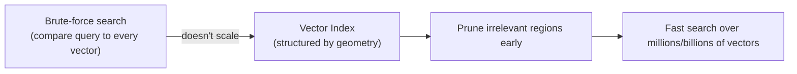
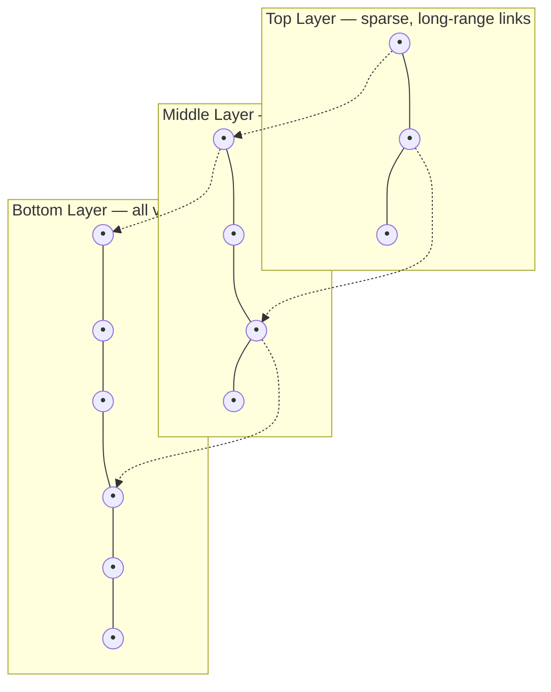
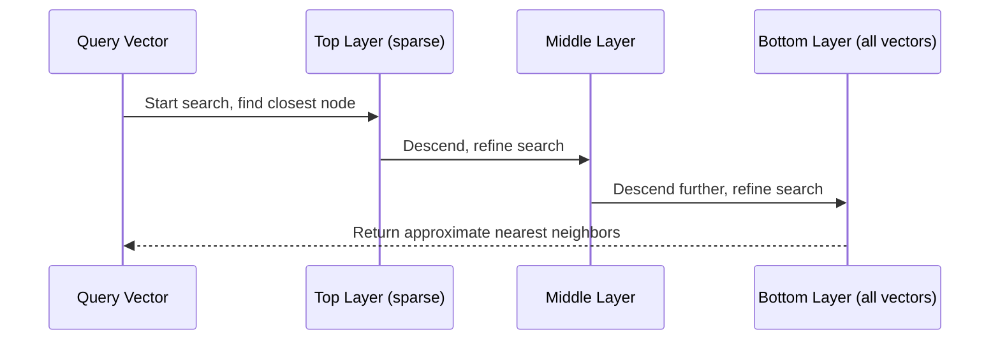
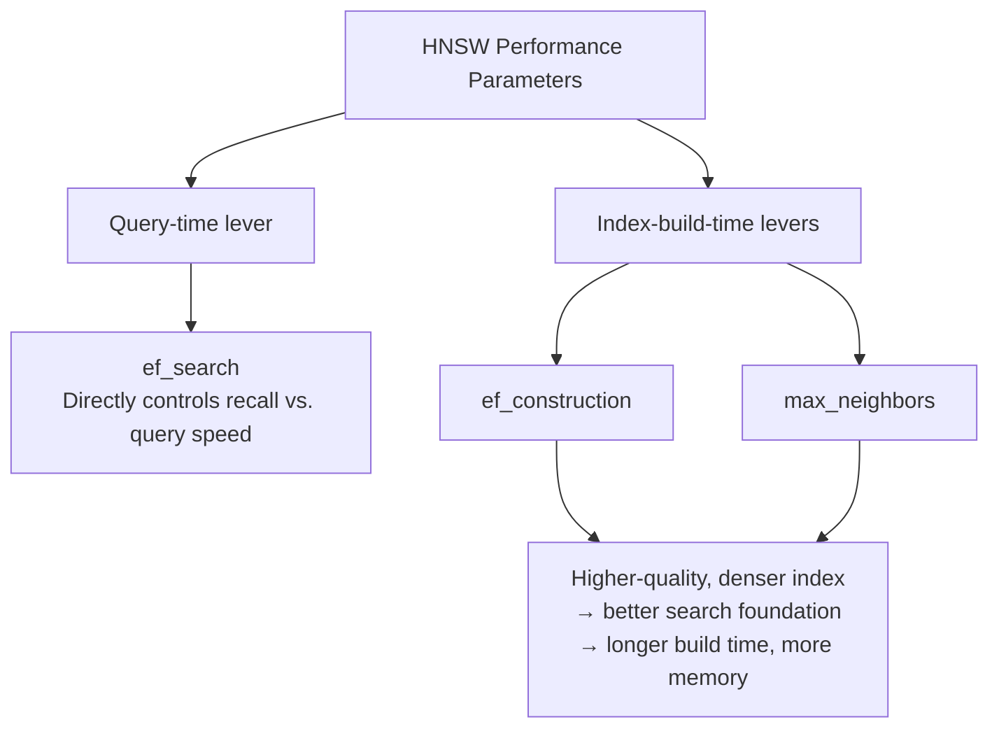
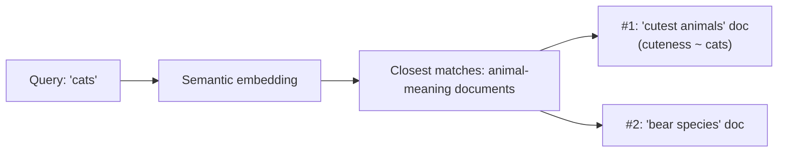
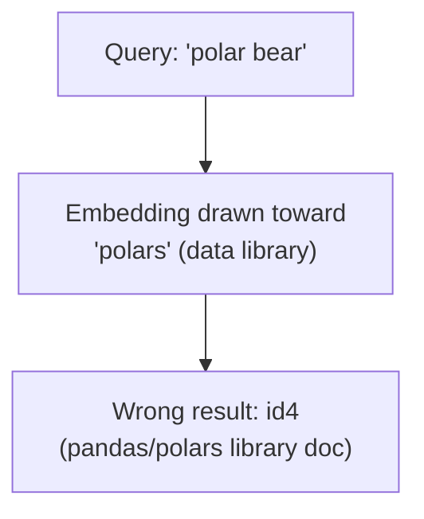
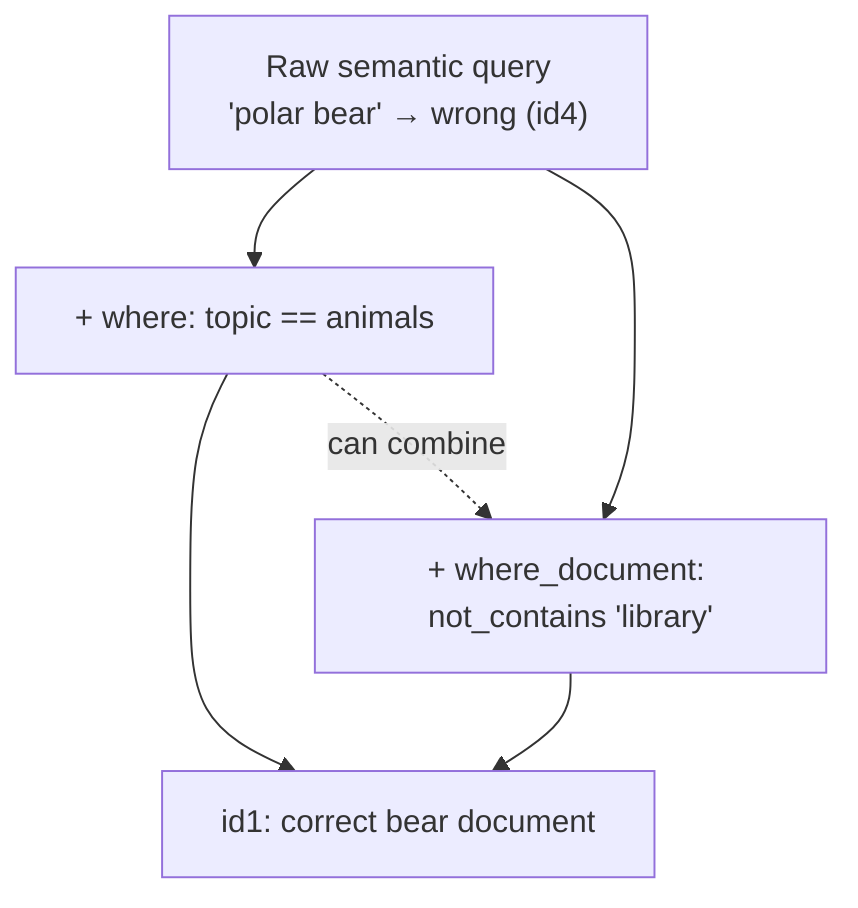

# Similarity Search and HNSW in Chroma DB

## 1. What Is a Vector Index?

**Brute-force similarity search:** normalize all embeddings, compute the dot product of the query against every document embedding (= cosine similarity), then pick the highest score.

- **Problem:** requires comparing the query against *every* vector — slow at scale.
- **Solution — vector index:** a specialized data structure that organizes embeddings so only a small, promising subset needs to be compared, while still returning exact or near-optimal results.

A vector index reflects the **geometry** of the vector space (clustering similar vectors, linking via proximity graphs) instead of treating data as a flat list — this lets the search algorithm **prune** large portions of the dataset early.



---

## 2. Hierarchical Navigable Small World (HNSW)

HNSW is a **fast, scalable, graph-based vector index** for **approximate nearest neighbor (ANN)** search in high-dimensional spaces.

- It is the **sole indexing method supported by Chroma DB**.
- Widely adopted across other vector databases for its performance and reliability.

### 2.1 How It Works

HNSW builds a **multi-layered graph**:

- **Upper layers:** sparse overview of the data — enable fast, long-range navigation.
- **Bottom layer:** holds *all* vectors — used for fine-grained/detailed search.
- Each vector connects to a few nearby neighbors, forming a **"small world" network** — most vectors reachable in just a few hops.



### 2.2 Search Process

1. Start at the **top layer**.
2. Move toward the region closest to the query vector.
3. **Descend** layer by layer, refining the search at each level.
4. Result: most of the dataset is skipped, yet highly similar vectors are still found quickly.



### 2.3 Why Use HNSW?

- **Fast** — avoids scanning the entire dataset
- **Accurate** — delivers near-exact results
- **Scalable** — handles millions to billions of vectors
- **Versatile** — works with various similarity metrics

---

## 3. Configuring HNSW in Chroma DB

HNSW is configured at **collection creation** time via the `hnsw` key.

```python
import chromadb
from chromadb.utils import embedding_functions

ef = embedding_functions.SentenceTransformerEmbeddingFunction(
    model_name="all-MiniLM-L6-v2"
)

client = chromadb.Client()
collection = client.create_collection(
    name="my_collection_name",
    metadata={"topic": "query testing"},
    configuration={
        "hnsw": {
            "space": "cosine",
            "ef_search": 100,
            "ef_construction": 100,
            "max_neighbors": 16
        },
        "embedding_function": ef
    }
)
```

### 3.1 Key Parameters

| Parameter | Meaning | Default | Trade-off |
|---|---|---|---|
| `space` | Distance metric: `l2` (squared Euclidean, default), `ip` (inner/dot product), `cosine` | `l2` | Choice depends on data/embedding model |
| `ef_search` | Candidate-list size when **searching** for nearest neighbors | 100 | ↑ improves accuracy/recall, ↓ query speed |
| `ef_construction` | Candidate-list size when selecting neighbors during **index build** | 100 | ↑ improves index quality/accuracy, ↓ build speed, ↑ memory |
| `max_neighbors` | Max connections per node during construction | 16 | ↑ denser graph → better search performance, but ↑ memory & build time |

### 3.2 Two Categories of Performance Parameters



- **`ef_search`** — the most direct lever for **recall vs. query speed** at search time.
- **`ef_construction` + `max_neighbors`** — control the **quality of the built index** itself: a denser, higher-quality index (higher values) improves the foundation for accurate search, at the cost of longer build times and higher memory use.

---

## 4. Performing Similarity Searches

### 4.1 Add Data

```python
collection.add(
    documents=[
        "Giant pandas are a bear species that lives in mountainous areas.",
        "A pandas DataFrame stores two-dimensional, tabular data",
        "I think everyone agrees that pandas are some of the cutest animals on the planet",
        "A direct comparison between pandas and polars indicates that polars is a more efficient library than pandas.",
    ],
    metadatas=[
        {"topic": "animals"},
        {"topic": "data analysis"},
        {"topic": "animals"},
        {"topic": "data analysis"},
    ],
    ids=["id1", "id2", "id3", "id4"]
)
```

All four documents mention "pandas" — but `id1`/`id3` mean the *animal*, `id2`/`id4` mean the *Python library*. This ambiguity is deliberately used to test whether semantic search can distinguish meaning by context.

### 4.2 Basic Query

```python
collection.query(
    query_texts=["cats"],
    n_results=10,
)
```

`query_texts` takes a list of query strings; `n_results` caps how many results come back (here 10, exceeding the 4 stored docs, so all are returned, ranked by similarity).

**Result (ranked by ascending cosine distance = descending similarity):**

| Rank | id | Document | Topic | Distance |
|---|---|---|---|---|
| 1 | id3 | "...pandas are some of the cutest animals..." | animals | 0.738 |
| 2 | id1 | "Giant pandas are a bear species..." | animals | 0.835 |
| 3 | id2 | "A pandas DataFrame stores..." | data analysis | 0.863 |
| 4 | id4 | "...polars is a more efficient library than pandas." | data analysis | 0.930 |

**Why this ranking?** The query "cats" (an animal, with no other context) semantically aligns with the *animal* meaning of "pandas" — so `id1`/`id3` rank above `id2`/`id4`. `id3` ranks first because it discusses pandas' **cuteness**, which aligns closely with cats (also commonly described as cute).



### 4.3 Where Semantic Search Can Go Wrong

```python
collection.query(
    query_texts=["polar bear"],
    n_results=1,
)
```

**Result:** `id4` — "...polars is a more efficient library than pandas." (distance 0.624) ❌

**What went wrong:** the word **"polar"** in the query got matched to **"polars"** (the Python library), not "polar bear" the animal — a false semantic match caused by surface-level token similarity.



### 4.4 Fixing It: Metadata Filtering

```python
collection.query(
    query_texts=["polar bear"],
    n_results=1,
    where={'topic': 'animals'}
)
```

**Result:** `id1` — "Giant pandas are a bear species that lives in mountainous areas." (distance 0.710) ✅ — correctly narrowed to the `animals` topic.

### 4.5 Fixing It: Full-Text (Document) Filtering

```python
collection.query(
    query_texts=["polar bear"],
    n_results=1,
    where_document={'$not_contains': 'library'}
)
```

**Result:** `id1` again ✅ — excludes any document containing the word "library".

### 4.6 Combining Metadata + Document Filters

```python
collection.query(
    query_texts=["polar bear"],
    n_results=1,
    where={'topic': 'animals'},
    where_document={'$not_contains': 'library'}
)
```

**Result:** `id1` ✅ — same correct result, filters can be freely combined.



### 4.7 Other Ways to Fix Semantic Mismatches

- Refine the query with more context (e.g., "polar bear animal")
- Try a different embedding model that better captures intended meaning
- Apply **metadata filters** and/or **full-text constraints** (often the simplest, most effective fix)

---

## 5. Key Takeaways

- Brute-force similarity search doesn't scale — **vector indexes** organize embeddings by geometric proximity to prune the search space.
- **HNSW** (Hierarchical Navigable Small World) is Chroma DB's only supported index: a multi-layer graph where upper layers give sparse, fast navigation and the bottom layer holds all vectors for detailed search.
- HNSW is configured via `hnsw: {space, ef_search, ef_construction, max_neighbors}` at collection creation.
  - `ef_search` — query-time lever, trades recall for query speed.
  - `ef_construction` / `max_neighbors` — build-time levers, trade index quality for build time/memory.
- Semantic search can be fooled by surface-level token overlap (e.g., "polar" → "polars"), causing wrong results despite correct embeddings machinery.
- **Metadata filters** (`where`) and **document/full-text filters** (`where_document`) — used alone or combined — are simple, effective ways to correct semantic mismatches and sharpen retrieval relevance, including for RAG applications.
