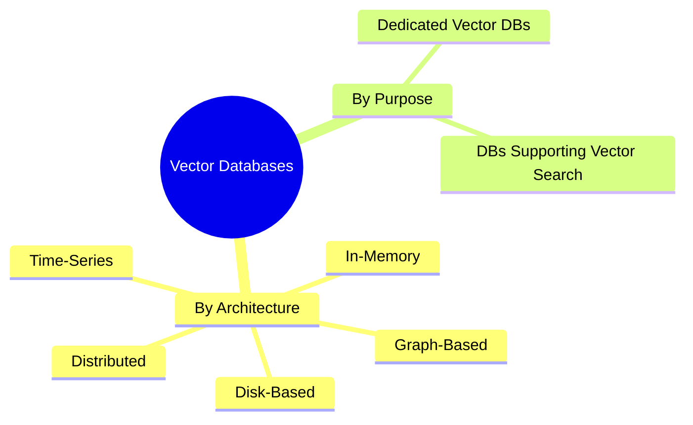
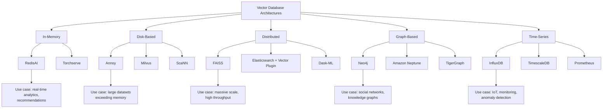
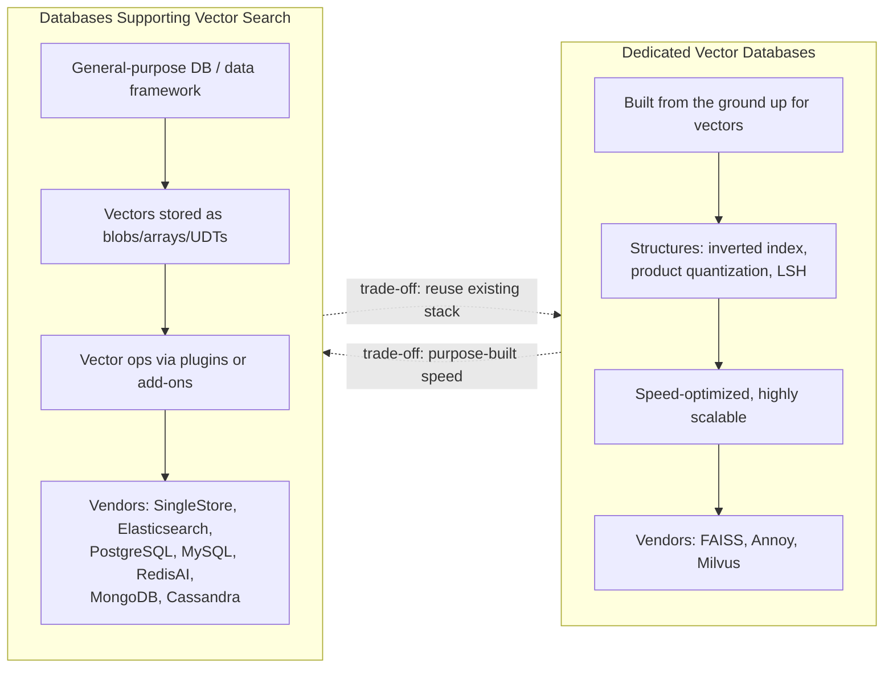

# Types of Vector Databases

## Overview

Vector databases can be categorized in two ways:

1. **By storage/architecture type** — in-memory, disk-based, distributed, graph-based, time-series
2. **By purpose** — dedicated vector databases vs. general-purpose databases that support vector search

---

## 1. Categorization by Architecture

### 1.1 In-Memory Vector Databases

Store vectors directly in memory (RAM) for swift read/write operations.

- **Best for:** real-time analytics, recommendation systems — anything needing rapid access
- **Vendors:** RedisAI, Torchserve
- **Example:** RedisAI supports storing and querying vectors for similarity search, classification, and clustering.

### 1.2 Disk-Based Vector Databases

Store vectors on disk, using indexing and compression techniques for efficient storage/retrieval.

- **Best for:** large datasets that exceed memory capacity
- **Vendors:** Annoy, Milvus, ScaNN
- **Example:** Annoy (Approximate Nearest Neighbors Oh Yeah) stores vectors on disk and builds indexes for fast approximate nearest-neighbor search — used in recommendation systems and information retrieval.

### 1.3 Distributed Vector Databases

Spread vector data across multiple nodes/servers for horizontal scalability and fault tolerance.

- **Best for:** massive datasets, high-throughput workloads
- **Vendors:** FAISS, Elasticsearch (with vector plugin), Dask-ML
- **Example:** FAISS (Facebook AI Similarity Search) partitions data across nodes to achieve scalable, speedy similarity search in high-dimensional spaces.

### 1.4 Graph-Based Vector Databases

Model data as graphs — nodes and edges represent vector attributes/embeddings.

- **Best for:** capturing complex relationships, graph analytics
- **Vendors:** Neo4j, Amazon Neptune, TigerGraph
- **Example:** Neo4j stores vectors as node properties/attributes and supports queries combining vector data with graph context — used for social network analysis, recommendation systems, and knowledge graphs.

### 1.5 Time-Series Vector Databases

Manage data collected over time intervals, represented as vectors — used to analyze temporal patterns and anomalies.

- **Best for:** IoT, monitoring, anomaly detection
- **Vendors:** InfluxDB, TimescaleDB, Prometheus
- **Example:** InfluxDB stores vectors alongside timestamped data, enabling pattern detection, trend forecasting, and system-metric monitoring.

---

## 2. Dedicated Vector Databases vs. Databases That Support Vector Search

### 2.1 Dedicated Vector Databases

Purpose-built systems optimized specifically to store, index, query, and analyze large volumes of vector data — enabling fast, accurate similarity search, clustering, and classification.

**Key characteristics:**

- Use specialized data structures: **inverted indexes**, **product quantization**, **locality-sensitive hashing (LSH)**
- Support native vector operations: nearest-neighbor search, similarity search, distance calculations
- Built for **horizontal scalability** across clusters/distributed systems
- **Speed-first** design — optimized algorithms even for high-dimensional data
- Tunable indexing/search parameters to optimize for specific use cases

**Popular vendors:** FAISS, Annoy, Milvus

### 2.2 Databases That Support Vector Search

Regular database systems or data-processing frameworks that have added the *ability* to store/query vectors — not purpose-built for it.

**Key characteristics:**

- Vector data stored as blobs, arrays, or user-defined types (UDTs)
- May use standard or custom index structures for similarity/distance retrieval
- Rely on **add-ons/plugins/integrations** for vector-specific operations
- Generally **less optimized** for speed/scale than dedicated vector databases
- Users must weigh functionality, performance, and scalability against dedicated alternatives

**Popular vendors:**

| Vendor | Notes |
|---|---|
| SingleStore | Vector database processing; works with IBM watsonx.ai |
| Elasticsearch | Vector search add-on |
| PostgreSQL | pgvector-style / PostGIS add-on for spatial vectors |
| MySQL | Native indexes for vector search |
| RedisAI | In-memory vector functions |
| MongoDB | Vector search with flexible schema |
| Cassandra | Vector search with flexible schema |

---

## 3. Comparison Table

| Type | Storage Location | Strength | Example Vendors |
|---|---|---|---|
| In-Memory | RAM | Speed for real-time access | RedisAI, Torchserve |
| Disk-Based | Disk | Scale beyond memory limits | Annoy, Milvus, ScaNN |
| Distributed | Multiple nodes | Horizontal scale, fault tolerance | FAISS, Elasticsearch, Dask-ML |
| Graph-Based | Graph (nodes/edges) | Relationship-aware analytics | Neo4j, Amazon Neptune, TigerGraph |
| Time-Series | Time-stamped store | Temporal pattern/anomaly detection | InfluxDB, TimescaleDB, Prometheus |

| | Dedicated Vector DB | DB Supporting Vector Search |
|---|---|---|
| Design intent | Purpose-built for vectors | General-purpose, vectors added on |
| Performance | Highly optimized | Good, but less optimized |
| Data structures | Inverted index, PQ, LSH | Blobs/arrays/UDTs + plugin indexes |
| Scalability | Native, cluster-first | Depends on host DB |
| Examples | FAISS, Annoy, Milvus | SingleStore, Elasticsearch, PostgreSQL, MySQL, RedisAI, MongoDB, Cassandra |

---

## 4. Key Takeaways

- Vector databases fall into 5 architectural types: **in-memory, disk-based, distributed, graph-based, time-series** — each suited to different performance/scale needs.
- **Dedicated vector databases** (FAISS, Annoy, Milvus) use specialized structures (inverted indexes, product quantization, LSH) for maximum speed and scalability on vector workloads.
- **Databases that support vector search** (SingleStore, Elasticsearch, PostgreSQL, MySQL, RedisAI, MongoDB, Cassandra) bolt vector capability onto existing general-purpose systems via add-ons — convenient, but typically less optimized.
- Choice depends on requirements: raw vector-search performance → dedicated DB; reuse of existing data stack/schema → supporting DB.
