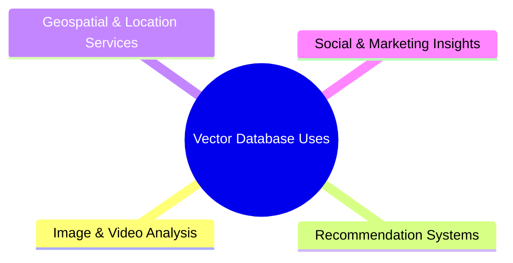
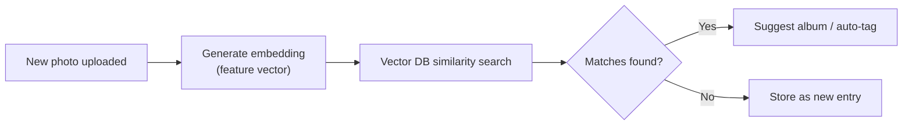
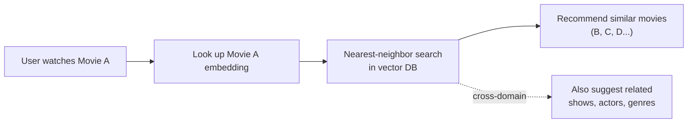
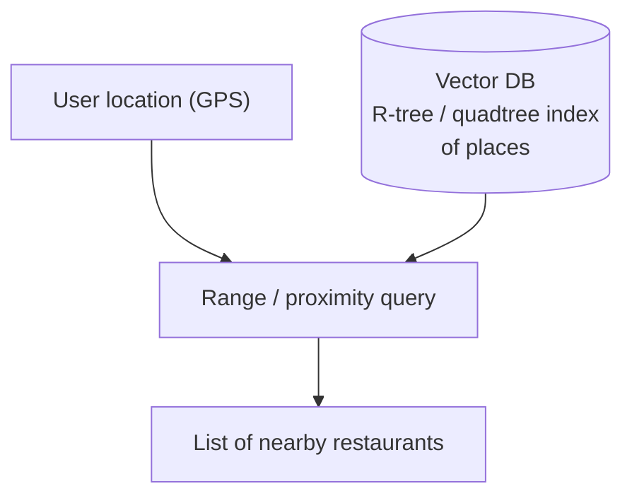
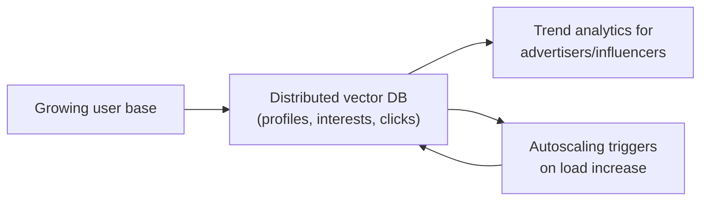
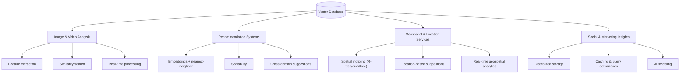

# Uses of Vector Databases

## Overview

Vector databases power data-driven applications across four major use-case areas:

Across all four areas, three core capabilities recur:

- **Feature extraction & representation** — storing high-dimensional feature vectors (embeddings)
- **Similarity search** — finding nearest/related vectors
- **Real-time, scalable data processing** — horizontal scalability for live workloads

---

## 1. Image and Video Analysis

Vector databases store high-dimensional feature vectors representing visual content — color histograms, texture descriptors, or deep-learning embeddings.

**Capabilities:**

| Capability | What it enables |
|---|---|
| Feature extraction & representation | Capture color, texture, and embedding-based aspects of images |
| Similarity search | Locate images, summarize videos, suggest similar content |
| Real-time processing | Video surveillance, object recognition, live event analysis |

**Example:** A photo-sharing app stores embeddings of user photos in a vector database. When a new photo is uploaded, its embedding is compared against stored embeddings — if it resembles existing photos, the app suggests tags or groups it into matching albums.

---

## 2. Recommendation Systems

Recommendation systems represent items/entities as **embeddings** and use **nearest-neighbor search** to power personalized suggestions.

**Capabilities:**

| Capability | What it enables |
|---|---|
| Embedded storage & nearest-neighbor search | Access likes/traits for personalized suggestions |
| Performance & scalability | Fast, scalable recommendations for many concurrent users |
| Cross-domain suggestions | Combine embeddings across domains for richer, more complete recommendations |

**Example:** A streaming service stores movie embeddings in a vector database. After you watch a movie, the system finds embeddings of related movies and recommends them.

---

## 3. Geospatial Analysis and Location-Based Services

Vector databases use spatial indexing methods — **R-tree**, **quadtree** — to store geospatial data (addresses, polygons, GPS coordinates).

**Capabilities:**

| Capability | What it enables |
|---|---|
| Efficient storage & indexing (R-tree, quadtree) | Spatial queries: proximity/closeness searches, range queries, spatial joins |
| Location-based suggestions | Combine geospatial data + user preferences to suggest nearby events, services, places |
| Real-time geospatial analytics | Spatial clustering, pattern recognition on streaming location data |

**Applications:** vehicle tracking, fleet management, dynamic vehicle routing, hotspot detection.

**Example:** A navigation app stores GPS locations of restaurants in a vector database. When you search while traveling, it queries the database for restaurants within a given distance of your current location.

---

## 4. Social and Marketing Insights

Vector databases provide **distributed storage** and **parallel processing** to handle the scale of social/marketing platforms.

**Capabilities:**

| Capability | What it enables |
|---|---|
| Distributed storage & parallel processing | Handle big data and simultaneous queries (e.g., SEO calculations, user profile management) |
| Optimized caching & query execution plans | Lower latency, faster delivery of trending analytics to influencers/advertisers |
| Autoscaling & dynamic resource allocation | Scale hardware/cloud usage with workload for best performance at lowest cost |

**Example:** A social platform tracks user profiles and interests (e.g., cycling, running, swimming). As the user base grows, the platform automatically adds hardware/resources so profile management and interest tracking (e.g., clicks on liked products) keep pace without slowing response times.

---

## 5. Summary Diagram

---

## 6. Key Takeaways

- Organizations use vector databases to build data-driven apps that perform well and scale across many domains, leveraging shared core strengths.
- **Image/video analysis**: feature extraction, similarity search, and real-time processing enable tagging, content summarization, and live surveillance/recognition.
- **Recommendation systems**: embeddings + nearest-neighbor search + cross-domain suggestions improve personalization and completeness of recommendations.
- **Geospatial services**: spatial indexing (R-tree, quadtree) powers GPS-based search, fleet management, and real-time traffic routing.
- **Social & marketing**: distributed storage, caching, and autoscaling let platforms manage user profiles, deliver trend analytics, and optimize cloud/hardware costs at scale.
