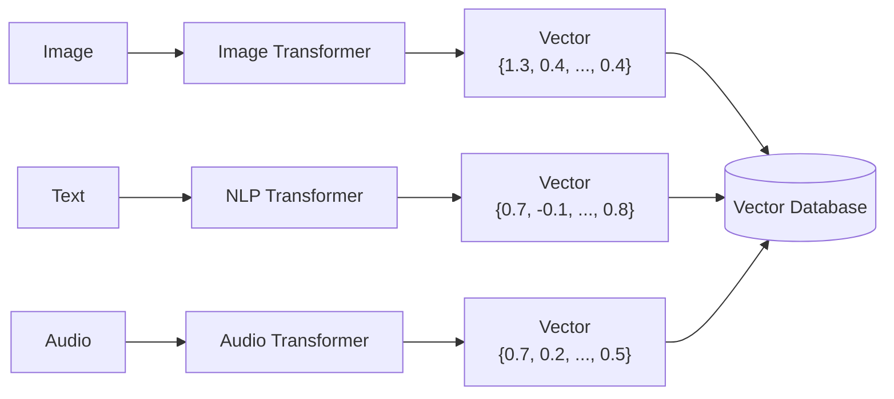
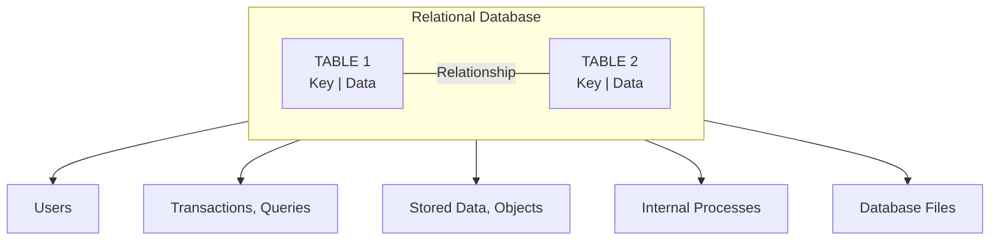
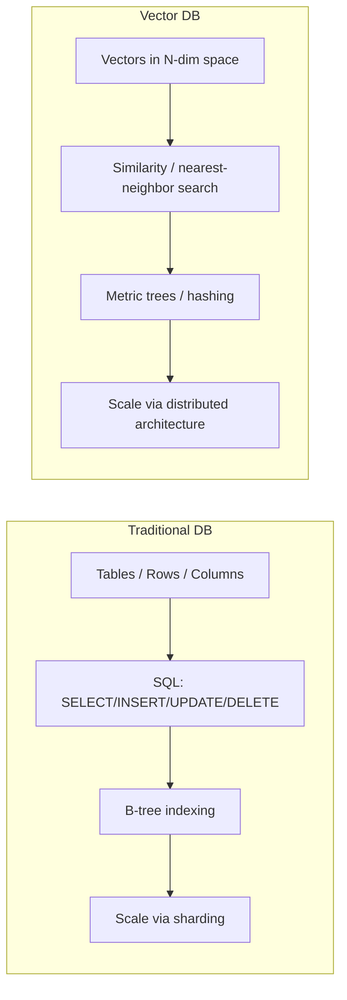

# Vector Databases vs. Traditional (Relational) Databases

Builds on [vector-dbs-intro.md](vector-dbs-intro.md). This note focuses on
a direct, side-by-side comparison: how each type of database represents
data, stores it, and lets you get it back out.

## Vector databases, recap

A **vector database** is a specialized database built to store and query
**vectorized data** rapidly. Instead of organizing data into tables, it
represents each data item as a **vector in a multi-dimensional space** —
numbers that capture the item's essential attributes, one dimension per
attribute. This makes vector databases ideal for:

- Similarity search
- Nearest-neighbor queries
- Assessing distance/similarity between items

### How data gets into a vector database

Raw data (images, text, audio, ...) is passed through the appropriate
**transformer/embedding model** for its type, producing a numerical
vector, which is then stored in the vector database.

Different data types, same idea: an image becomes a vector of (learned)
pixel/feature values, a piece of text becomes a vector capturing its
meaning (e.g. word/semantic frequencies), audio becomes a vector of
acoustic features — all landing in the same kind of multi-dimensional
space, where "close together" means "similar."

### Vector libraries vs. vector databases

These are often confused, but they're not the same thing:

| | Vector library | Vector database |
|---|---|---|
| Operations | Read + update (similarity search over an index) | Full **CRUD** — create, read, update, delete |
| Persistence | Typically **in-memory** | Built for persistent, production storage |
| Fit | Good for a fixed, pre-built similarity index | Built for **enterprise-level production deployments** with data that changes over time |

A vector library (e.g. a commercial similarity-search library) is a
narrower tool focused on search over a static/in-memory index. A vector
*database* is the fuller system: it can also persist data reliably and
let you insert, update, and delete records, not just search them.

## Relational (traditional) databases, recap

A **relational database** organizes data into **tables** using **rows
and columns**, and is queried with **SQL** — following the relational
model. It excels where data is structured and relationships between
entities are well defined.

- Each **row** = one record.
- Each **column** = one property/attribute.
- Tables connect to each other via **keys** — a **primary key** in one
  table matched by a **foreign key** in another — expressing
  relationships between entities.
- Users interact with the database through **transactions and queries**
  (`SELECT`, `INSERT`, `UPDATE`, `DELETE`) that manipulate rows and
  columns, backed by the underlying database files.

## Side-by-side comparison

| Function | Traditional (relational) databases | Vector databases |
|---|---|---|
| **Data representation** | Structured format: tables, rows, columns — ideal for relational data | Multi-dimensional vectors — efficiently encodes complex, unstructured data (images, text, sensor data) |
| **Search & retrieval** | SQL queries over structured data | Similarity search over vectorized data — image retrieval, recommendations, anomaly detection |
| **Indexing** | B-trees and similar, for efficient exact/range lookups | Metric trees, hashing, and similar structures suited to high-dimensional spaces — for nearest-neighbor search |
| **Scalability** | Harder to scale — often needs added resources or data sharding | Designed to scale, especially for large datasets + similarity search, via distributed architectures |
| **Typical applications** | Business/transactional systems processing structured data | Large-scale analysis: scientific research, NLP, multimedia analysis |

## Recap

- A **vector database** represents data numerically, as vectors in a
  multi-dimensional space.
- **Traditional (relational) databases** excel at structured data and
  transactional operations; **vector databases** excel at high-dimensional
  data and rapid similarity search.
- A **vector library** can read and update data (search over an index);
  a **vector database** additionally supports full **CRUD**.
- Vector databases store data so that a numerical **vector** represents
  each item.
- Relational databases organize data into **tables**, with rows and
  columns.
- Traditional databases retrieve data via **SQL queries**; vector
  databases retrieve data via **similarity search**.
