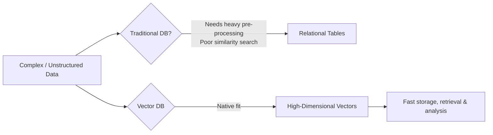
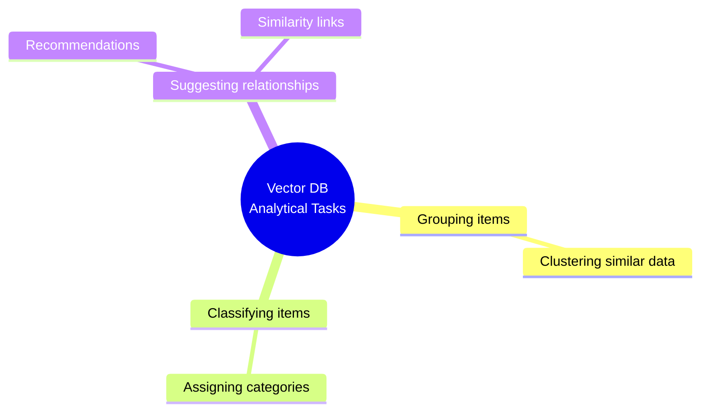
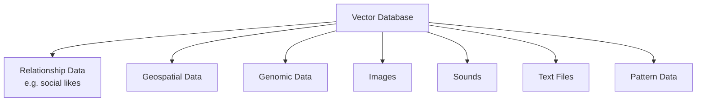
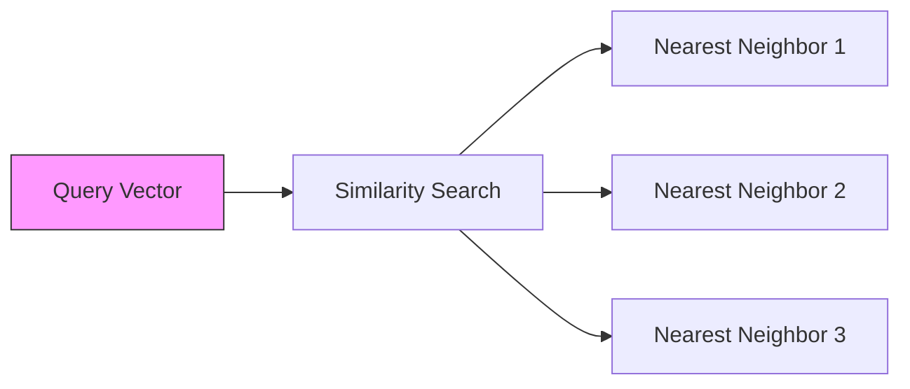
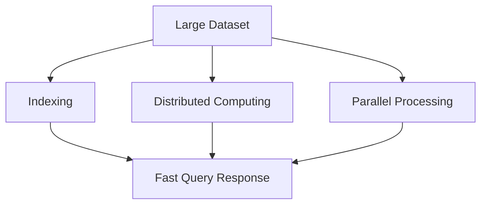
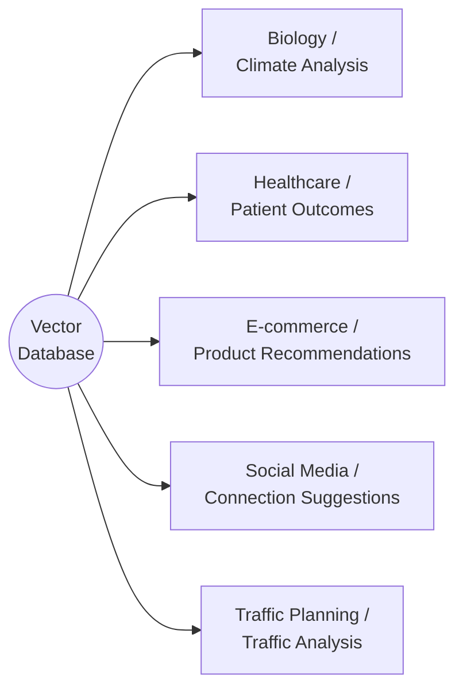
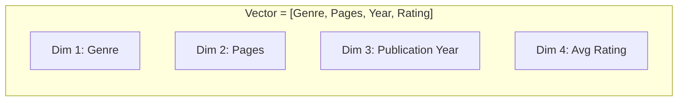
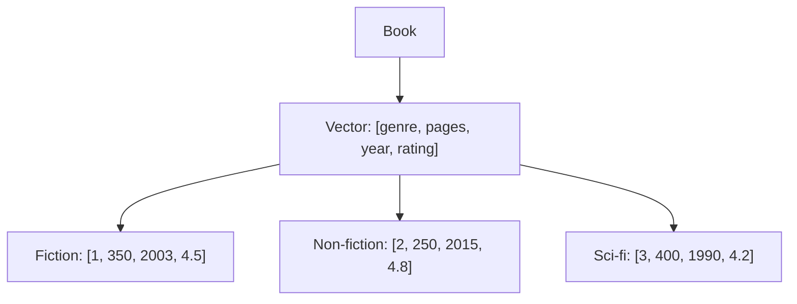
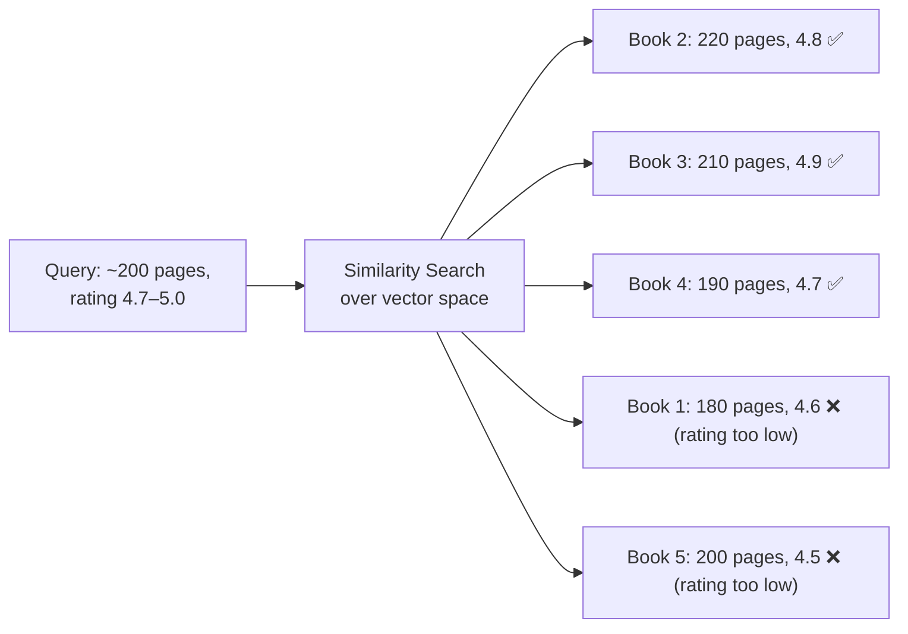
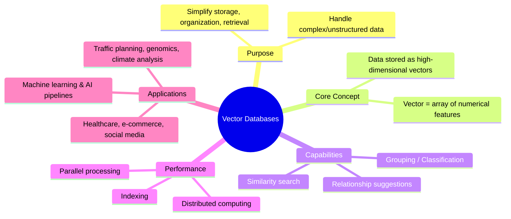

# Vector Databases — Introduction

## 1. Why Vector Databases?

Traditional (relational) databases store data in **tables** — great for structured,
tabular data but poorly suited to complex, high-dimensional, or unstructured data
such as images, audio, text, genomic sequences, geospatial data, and social
relationship (like/follow) data.

Vector databases emerged to fill this gap: they store data as **high-dimensional
vectors**, enabling fast storage, retrieval, and analysis of complex data types
without heavy pre-processing.

## 2. What Companies Use Vector Databases For

Vector databases act as **libraries** that let companies:

- Find information (search)
- Mine data
- Teach computers to learn (ML/AI)

They organize data points in a **multi-dimensional space** based on proximity,
enabling analytical tasks such as:

## 3. Key Characteristics

### 3.1 Handling Complex Data Types

Vector databases natively handle data that traditional systems struggle with:

### 3.2 Similarity Search

Vector databases quickly and accurately locate **related items** by measuring
the **proximity** of vectors in high-dimensional space. This is called a
**similarity search**.

Used for:

- Finding similar images / sounds
- Recommendation systems (products, content, connections)
- Genetic analysis

### 3.3 Performance at Scale

Vector databases rely on:

- **Distributed computing**
- **Indexing**
- **Parallel processing**

to manage big datasets and process queries quickly.

### 3.4 Industry Applications

### 3.5 Role in Machine Learning & AI

Vector databases are a **natural way to store and explore ML data**. They
integrate easily into ML pipelines and accelerate the development and
release of AI-powered applications.

## 4. What Is a Vector?

A **vector** is a mathematical object defined by **size (magnitude)** and
**direction**. In a vector database, a vector is an **array of numerical
values**, where each number (dimension) represents a feature or attribute
of the data point.

Vectors can represent: images, sounds, text files, pattern data, map data,
genomic information, and more.

## 5. Worked Example — Books as Vectors

Encoding scheme: `[genre, pages, publication_year, avg_rating]`
Genre codes: `1 = fiction`, `2 = non-fiction`, `3 = science fiction`

| Book Type       | Genre | Pages | Year | Rating |
|-----------------|:-----:|:-----:|:----:|:------:|
| Fiction         | 1     | 350   | 2003 | 4.5    |
| Non-fiction     | 2     | 250   | 2015 | 4.8    |
| Science fiction | 3     | 400   | 1990 | 4.2    |

### 5.1 Similarity Search in Action

**Goal:** Find science fiction books with ~200 pages and a rating between
4.7 and 5.0.

Candidate science fiction books (genre = 1 in this sub-list):

| Book   | Genre | Pages | Year | Rating |
|--------|:-----:|:-----:|:----:|:------:|
| Book 1 | 1     | 180   | 2010 | 4.6    |
| Book 2 | 1     | 220   | 2005 | 4.8    |
| Book 3 | 1     | 210   | 2015 | 4.9    |
| Book 4 | 1     | 190   | 2018 | 4.7    |
| Book 5 | 1     | 200   | 2012 | 4.5    |

Instead of scanning the **entire platform**, the vector database narrows the
search using proximity in vector space — faster and more relevant than a
full linear search.

## 6. Summary

**Key takeaways:**

1. Vector databases store data as high-dimensional vectors, not tables.
2. Each vector is an array of numbers representing features/attributes of a data point.
3. Similarity search finds related items based on proximity in vector space.
4. They scale via distributed computing, indexing, and parallel processing.
5. They are foundational infrastructure for modern ML/AI applications.
