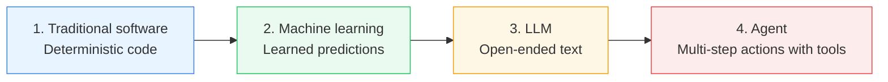
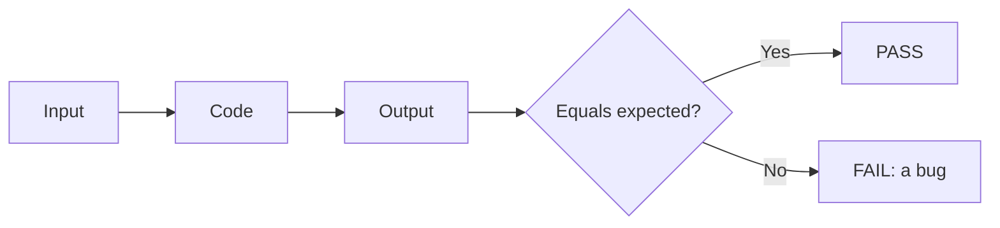
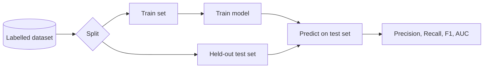
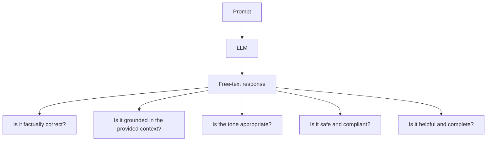
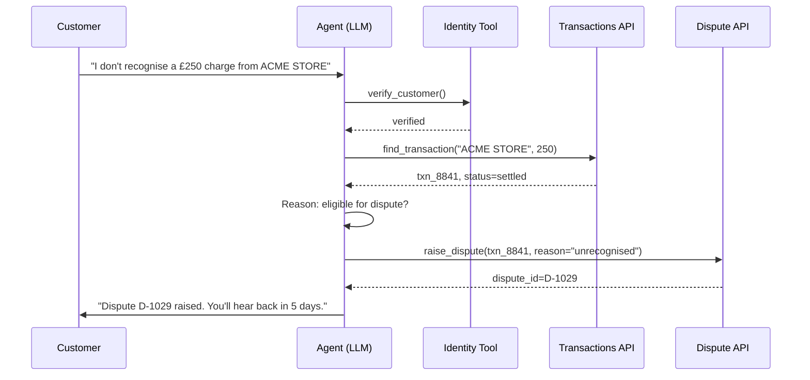
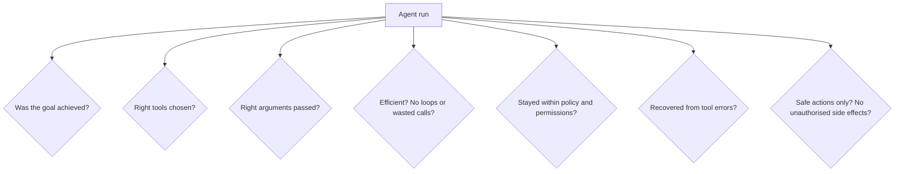
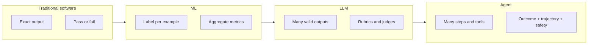
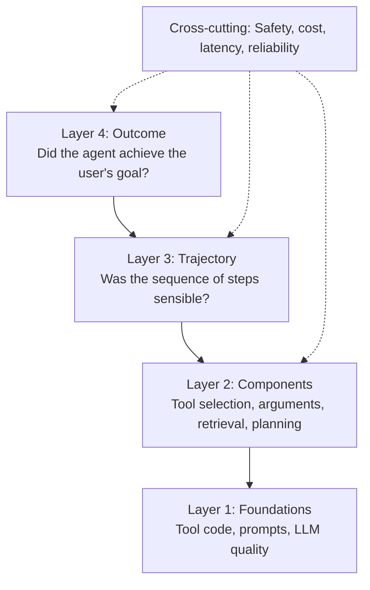
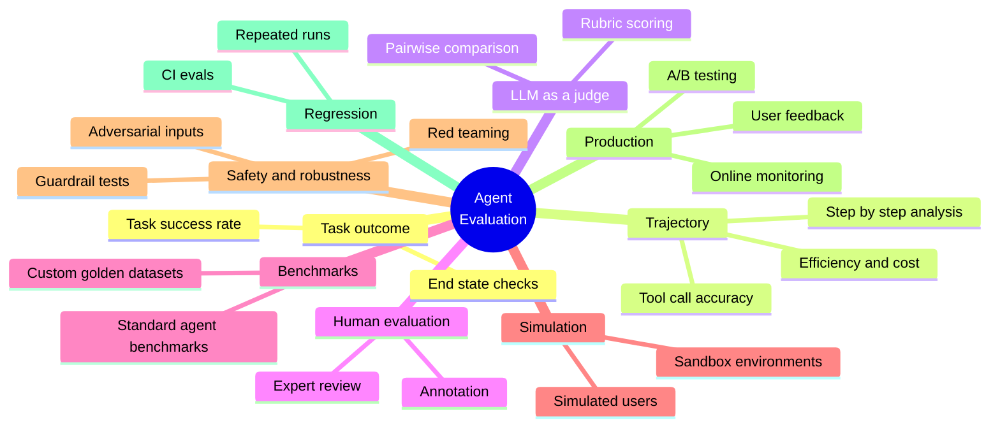
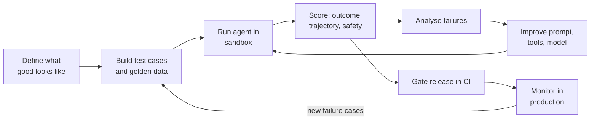

# Evaluating AI Agents: Overview

> **Goal of this note:** understand *why* evaluating an agent is a different problem from testing normal software, evaluating an ML model, or evaluating an LLM, and get a map of the popular approaches. Each approach gets its own note later.

**Running example used throughout:** a banking **Card Dispute Agent**. A customer says *"I don't recognise a £250 charge from 'ACME STORE' on 12 March."* The agent should verify identity, look up the transaction, decide if it is disputable, raise a dispute, and reply to the customer.

---

## The big picture



Each step **adds a new source of uncertainty**, so the previous way of evaluating is no longer enough. We do not throw the old methods away; we stack the new ones on top.

---

## Step 1: Traditional software testing

**Nature of the system:** deterministic. Same input, same output, every time.

**How we evaluate:** write a test with an exact expected value. It either passes or fails.

```python
def calculate_dispute_fee(amount: float) -> float:
    return 0.0 if amount < 500 else 5.0

assert calculate_dispute_fee(250) == 0.0     # always true or always false
assert calculate_dispute_fee(900) == 5.0
```



| Aspect | Traditional software |
|---|---|
| Correct answer | One exact answer |
| Result of a test | Binary: pass / fail |
| Failure means | A bug in the code |
| Repeatability | 100% |
| Typical tools | Unit, integration, E2E tests |

---

## Step 2: Machine learning evaluation

**What changes:** the logic is *learned from data*, not written by hand. The model is right *most of the time*, never always.

**How we evaluate:** hold out a labelled test set and measure **statistical metrics** over many examples.

**Example:** a fraud classifier decides if the £250 ACME STORE transaction is fraudulent. We run it on 100,000 labelled past transactions.



| Aspect | ML evaluation |
|---|---|
| Correct answer | Known label per example (ground truth) |
| Result | A score over a dataset (e.g. recall = 92%) |
| Failure means | Model is wrong on some fraction of inputs |
| New concerns | Data drift, class imbalance, overfitting, bias |
| Typical metrics | Accuracy, precision, recall, F1, ROC-AUC, RMSE |

**Key shift from Step 1:** we stop asking "does it pass?" and start asking "**how often** is it right, and on **which** slices of data?"

---

## Step 3: LLM evaluation

**What changes:** the output is **free-form language**. There is no single correct string, and many different answers can be equally good.

**Example:** ask the LLM *"Explain to the customer why their dispute needs 5 working days."*

- Answer A: "We'll review your case within 5 working days and update you by email."
- Answer B: "Disputes take up to five business days to investigate; we'll email you the outcome."

Both are correct, yet `A == B` is `False`, so exact-match testing breaks.



| Aspect | LLM evaluation |
|---|---|
| Correct answer | Often many valid answers, or none that is exact |
| Result | Quality scores across several **dimensions** |
| Failure means | Hallucination, off-tone, unsafe, incomplete |
| New concerns | Prompt sensitivity, non-determinism, hallucination, toxicity, prompt injection |
| Typical methods | Reference metrics, human review, **LLM-as-a-judge**, benchmarks |

**Key shift from Step 2:** the *metric itself* is now hard to define. Evaluating quality needs rubrics and judges, not just a label comparison.

---

## Step 4: Agent evaluation

**What changes:** an agent is an LLM that **plans, calls tools, observes results, and acts over many steps**, often changing the real world (e.g. raising a dispute, blocking a card).

**Example trajectory for the Card Dispute Agent:**



Now there are far more ways to go wrong than "is the final text good?":



**Failure examples that only appear at the agent level:**
- Final reply sounds perfect, but the agent **never actually raised** the dispute.
- Agent raised the dispute **twice** because it retried after a timeout.
- Agent skipped identity verification and went straight to the dispute (a compliance breach).
- Agent passed `amount=25.0` instead of `250` to the tool.
- Agent solved the task on Monday, but failed on Tuesday with the same input (non-determinism compounding across steps).

| Aspect | Agent evaluation |
|---|---|
| Unit of evaluation | A whole **trajectory** (many steps), not one output |
| Correct answer | Correct **outcome** and acceptable **path** |
| Result | Success rate, step accuracy, cost, latency, safety, over many runs |
| Failure means | Wrong plan, wrong tool, wrong args, unsafe action, bad recovery |
| New concerns | Error compounding, side effects, tool misuse, permissions, cost, loops |
| Environment | Needs a **sandbox / simulated tools** so tests do not hit real systems |

---

## Side-by-side comparison



| | Software | ML | LLM | Agent |
|---|---|---|---|---|
| **Output** | Exact value | Label / number | Free text | Actions + text + state changes |
| **Deterministic?** | Yes | Mostly | No | No, and it compounds over steps |
| **Ground truth** | Exact | Labelled data | Fuzzy / rubric | Goal state + allowed paths |
| **What is evaluated** | Function | Model on dataset | Response | Entire trajectory |
| **Pass criteria** | Equals expected | Metric above threshold | Quality score above threshold | Task success AND safe AND efficient |
| **Side effects** | Controlled | None | None | **Real, possibly irreversible** |
| **Run it once?** | Enough | Enough | Several times | Many times (measure reliability) |

> **Mental model:** each layer *contains* the previous one. An agent is software + (often) ML + an LLM. So we still unit-test the tools, still measure model metrics, still judge the language quality, **and** evaluate the end-to-end behaviour.

---

## What do we evaluate in an agent? (the layers)



---

## Popular approaches (overview only)

> Details and worked examples will come in the next notes. This is only the menu.



| # | Approach | One-line idea |
|---|---|---|
| 1 | **Task success / outcome evals** | Did the agent reach the goal state? |
| 2 | **Trajectory / tool-call evals** | Did it take the right steps with the right tools and arguments? |
| 3 | **LLM-as-a-judge** | Use another model with a rubric to score outputs and traces |
| 4 | **Human evaluation** | Experts review and label runs for nuanced quality |
| 5 | **Benchmarks and golden datasets** | Fixed sets of tasks with known expected results |
| 6 | **Simulation and sandboxing** | Run the agent against fake tools and simulated users |
| 7 | **Safety and red-teaming** | Probe for policy violations, injections, misuse |
| 8 | **Regression testing in CI** | Re-run the eval suite on every prompt, model, or tool change |
| 9 | **Production monitoring** | Observe real traffic: traces, feedback, drift, A/B tests |

---

## How these fit into one workflow



---

## Key takeaways

1. **Software** testing asks *"is it correct?"*, **ML** asks *"how often is it correct?"*, **LLM** asks *"how good is it?"*, **agent** asks *"did it do the right thing, the right way, safely, every time?"*
2. Agents must be evaluated on the **trajectory**, not only the final answer.
3. Because agents are non-deterministic and take real actions, we need **repeated runs, sandboxes, and safety checks**.
4. No single method is enough: combine **automated checks + LLM judges + human review + production monitoring**.

---

## Coming up in the next notes

1. Defining success criteria and building a golden dataset
2. Outcome and task-success evaluation
3. Trajectory and tool-call evaluation
4. LLM-as-a-judge: rubrics and pitfalls
5. Simulation and sandboxing
6. Safety, red-teaming, and guardrail testing
7. Regression evals in CI and production monitoring
