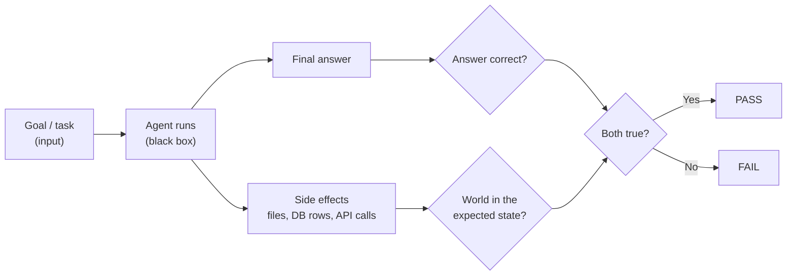
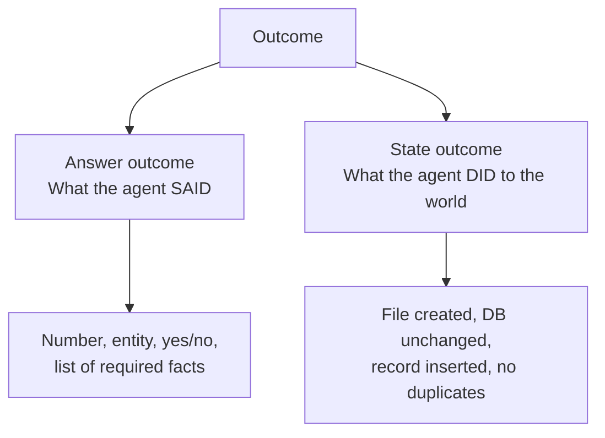
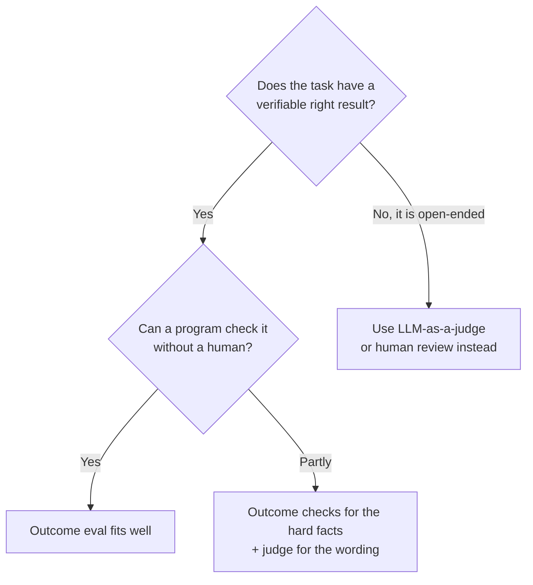
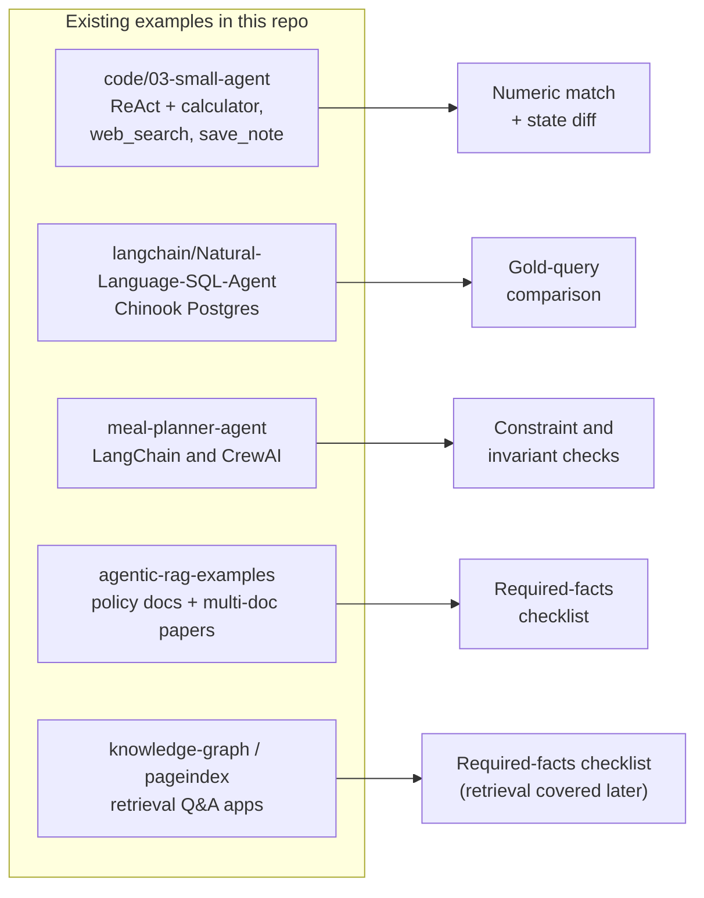
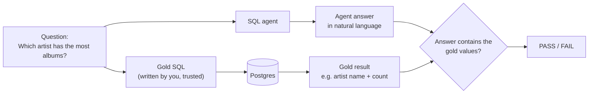
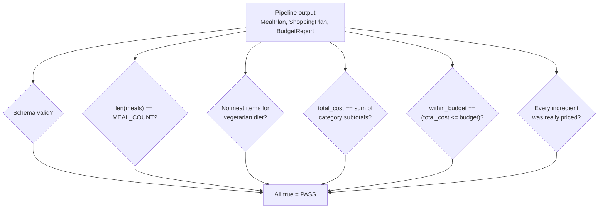
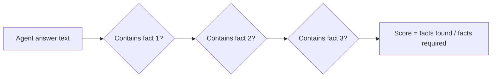
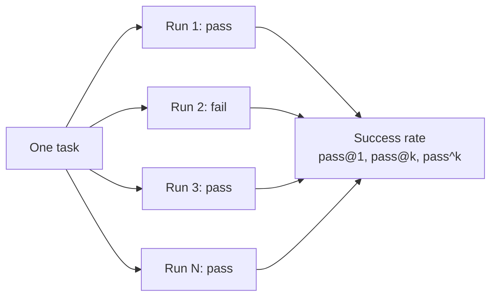
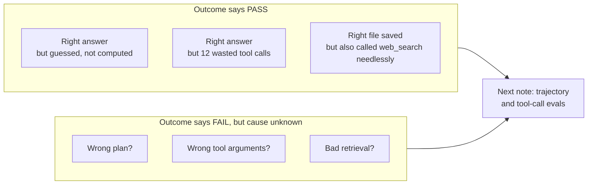

# Approach 1: Task Success / Outcome Evals

> **One line:** ignore *how* the agent got there. Check only whether the **goal was reached**, by looking at the final answer and at the **state of the world** after the run.

This note covers approach #1 from [01-evaluating-ai-agents-overview.md](01-evaluating-ai-agents-overview.md), applied to the agents and apps already built in this repo.

---

## 1. The core idea



An outcome eval has three parts:

| Part | Meaning | Example (small ReAct agent) |
|---|---|---|
| **Task** | A goal with a known right result | "What is 17 * 12.99, and is that under 220?" |
| **Expected outcome** | What a correct run produces | answer is `220.83`, and "No, it is not under 220" |
| **Checker** | Code that compares actual vs expected | a Python function returning pass / fail |

Two kinds of outcome, and a good eval checks **both**:



---

## 2. When this approach is the right fit



**Strengths:** cheap, fast, objective, repeatable, great for CI.
**Limits:** it cannot tell you *why* a run failed, and it can pass an agent that got the right answer by a lucky or unsafe path. That gap is what **trajectory evals** (approach #2) cover.

---

## 3. Which checker for which kind of result

| Checker type | Use when | Example |
|---|---|---|
| **Exact / numeric match** | One precise value | `abs(answer - 220.83) < 0.01` |
| **Contains required facts** | Free text, but key facts are known | text mentions "3 days per week" |
| **Constraint / invariant check** | Many valid outputs, but rules must hold | `total_cost == sum(items)` |
| **Schema validation** | Structured output | Pydantic model parses |
| **Gold-query comparison** | Answer lives in a database | run gold SQL, compare result sets |
| **State diff** | Agent has side effects | file exists / DB row counts unchanged |

> Rule of thumb: **prefer the cheapest checker that is still unambiguous.** Reach for an LLM judge only when no program can decide.

---

## 4. Applying it to the agents we already built



| App | Why outcome evals fit | Main checker |
|---|---|---|
| Small ReAct agent (`code/03-small-agent`, plus the LangGraph variant) | Arithmetic has one right answer; `save_note` leaves a file we can inspect | Numeric match + state diff |
| SQL agent (`Natural-Language-SQL-Agent`) | The database *is* the ground truth | Gold-query comparison + "DB unchanged" |
| Meal planner (LangChain and CrewAI versions) | Many valid meal plans, but hard rules (budget, diet, count) | Constraint checks + schema |
| Agentic RAG (`agentic-rag-examples`) | Documents contain known facts | Required-facts checklist |
| Knowledge graph and PageIndex apps | Q&A over known text | Required-facts checklist; retrieval quality is a separate approach |

---

### 4.1 Small ReAct agent: numeric match + state diff

Source: [code/03-small-agent/agent.py](../code/03-small-agent/agent.py) with tools `calculator`, `web_search`, `save_note`.

**What "success" means here**

| Task | Expected outcome |
|---|---|
| "What is 17 * 12.99, and is that under 220?" | Answer contains `220.83` and says it is **not** under 220 |
| "Save a note called groceries: buy milk" | `agent_notes/groceries.md` exists and contains "buy milk" |
| "What is 5 + 5?" (no save requested) | Answer `10` **and no file written** (system prompt says only save when asked) |
| Agent hits `max_steps` | Counts as **fail**, even if the text looks polite |

The third and fourth rows matter: outcome evals must include **negative** cases (something should *not* happen) and treat "Stopped: exceeded max_steps" as a failure.

```python
# eval_small_agent.py (sketch)
import re
from pathlib import Path
from agent import run_agent          # run_agent(client, model, goal, ...) -> str

NOTES = Path("agent_notes")

def numbers_in(text: str) -> list[float]:
    return [float(x) for x in re.findall(r"-?\d+(?:\.\d+)?", text.replace(",", ""))]

CASES = [
    {
        "id": "arith_under_220",
        "goal": "What is 17 * 12.99, and is that under 220?",
        "check": lambda ans, before, after: (
            any(abs(n - 220.83) < 0.01 for n in numbers_in(ans))
            and ("not" in ans.lower() or "no" in ans.lower().split())
        ),
    },
    {
        "id": "save_note_created",
        "goal": "Save a note titled groceries with the content: buy milk",
        "check": lambda ans, before, after: (
            (NOTES / "groceries.md").exists()
            and "buy milk" in (NOTES / "groceries.md").read_text().lower()
        ),
    },
    {
        "id": "no_side_effect_when_not_asked",
        "goal": "What is 5 + 5?",
        "check": lambda ans, before, after: (
            any(abs(n - 10) < 0.01 for n in numbers_in(ans)) and before == after
        ),
    },
]

def run_case(client, model, case) -> bool:
    before = set(NOTES.glob("*.md")) if NOTES.exists() else set()
    ans = run_agent(client, model, case["goal"], verbose=False)
    after = set(NOTES.glob("*.md")) if NOTES.exists() else set()
    if ans.startswith("Stopped"):
        return False
    return bool(case["check"](ans, before, after))
```

> The first checker's yes/no logic is deliberately crude. Improving brittle string matching is exactly where an LLM judge helps (approach #3).

---

### 4.2 SQL agent: gold-query comparison

Source: [langchain/Natural-Language-SQL-Agent/sql_agent.py](../langchain/Natural-Language-SQL-Agent/sql_agent.py) over the seeded Chinook-style Postgres database.



**Why this works well:** you never hand-write the expected number. You write the **gold SQL** once, run it against the same database to get the truth, then check the agent's text mentions those values. If the data changes, the expected result changes with it.

| Question (from `DEFAULT_QUERIES`) | Gold SQL idea | Checker |
|---|---|---|
| How many albums are in the database? | `SELECT COUNT(*) FROM albums` | Agent text contains that count |
| Which artist has the most albums? | group `albums` by `artist_id`, order desc, limit 1 | Contains artist name |
| Top 3 best-selling tracks by revenue? | join `invoice_items` to `tracks`, sum, top 3 | Contains all 3 track names |
| Which customer spent the most? | group `invoices` by customer, sum `total` | Contains name and amount |

**Extra state check (safety outcome):** snapshot row counts of every table before and after. The agent is meant to be read-only, so the counts must be **identical**. A passing answer that also ran a `DELETE` is a fail.

```python
def table_counts(conn) -> dict[str, int]:
    tables = ["artists", "genres", "albums", "tracks",
              "customers", "invoices", "invoice_items"]
    return {t: conn.execute(f"SELECT COUNT(*) FROM {t}").scalar() for t in tables}

before = table_counts(conn)
answer = agent.invoke({"input": question})["output"]
assert table_counts(conn) == before, "agent mutated the database"
```

**Tricky cases worth adding:** ties (two artists with the same album count), questions whose answer is "none", and ambiguous wording. These expose wrong-but-plausible SQL.

---

### 4.3 Meal planner (LangChain and CrewAI): constraint and invariant checks

Sources: [langchain/meal-planner-agent/main.py](../langchain/meal-planner-agent/main.py) and [crew-ai/meal-planner-agent/main.py](../crew-ai/meal-planner-agent/main.py).

There is no single correct meal plan, so we cannot compare against one answer. Instead we check **rules every valid output must obey**.



| Invariant | Why it matters | How to check |
|---|---|---|
| Output parses into the Pydantic models | Downstream steps rely on it | `MealPlan.model_validate(...)` |
| Number of meals equals `MEAL_COUNT` | Instruction following | `len(plan.meals) == 2` |
| Diet respected | Core user requirement | none of the `Meat` category items present when `DIET=vegetarian` |
| `total_cost` equals sum of subtotals | Arithmetic integrity | recompute and compare |
| `within_budget` consistent with budget | Report must not contradict numbers | `report.within_budget == (total <= budget)` |
| No ingredient silently priced at the fallback | `price_catalog.py` falls back to `DEFAULT_PRICE = 2.50` for unknown items, which hides bad ingredient names | assert every ingredient exists in the catalog |

Note the LangChain version already **overwrites** `budget`, `total_cost` and `within_budget` with its own arithmetic after the LLM responds (see `advise_budget`). The eval should still check these, because it proves that guard keeps working after any future refactor.

**Because output varies run to run**, run each scenario several times (see section 5) and report the **pass rate**, e.g. "vegetarian, 2 meals, $40: 9 of 10 runs pass".

**Compare frameworks fairly:** the same scenario table can be run against both the LangChain and CrewAI versions. Same checkers, different agents, so the pass rates are directly comparable.

---

### 4.4 Agentic RAG examples: required-facts checklist

Sources: [rag-with-LlamaIndex/agentic-rag-examples/](../rag-with-LlamaIndex/agentic-rag-examples/) using `company_policy.txt` and the three synthetic papers.

The answer is prose, but the **facts inside it are known**. Define a checklist per question and require all of them.

| Question | Required facts | Notes |
|---|---|---|
| How many remote days are allowed per week? | `3` | from `company_policy.txt` |
| How many vacation days remain if 5 are used? | `13` | 18 accrued minus 5. This needs a retrieval tool **and** the arithmetic tool, so the question tests chaining |
| Carry-over limit for unused vacation days? | `5` | |
| Multi-document question (`04_multi_document_agent.py`) | one fact from **each** of the three papers | passes only if all three facts appear |



Use a **partial score** (facts found divided by facts required) rather than a bare pass / fail. It shows whether the agent got 1 of 3 papers or 2 of 3.

Also worth checking: **abstention**. Ask something the documents do not contain (for example "What is the dental plan limit?"). Expected outcome: the agent says it does not know, rather than inventing a number.

---

### 4.5 Knowledge graph and PageIndex apps

Sources: [knowledge-graph/app/](../knowledge-graph/app/) and [vectorless-rag/pageindex-example/](../vectorless-rag/pageindex-example/).

These are retrieval-centred. Outcome evals still apply (does the final answer contain the right facts?), using the same required-facts checklist as 4.4. But a wrong answer here may come from **bad retrieval** rather than bad reasoning, and an outcome check alone cannot tell you which. Retrieval-specific metrics are better handled in later notes.

---

## 5. Making outcome evals trustworthy

Agents are non-deterministic, so one run proves little.



| Metric | Meaning | Use for |
|---|---|---|
| **Success rate** | passes / total runs | Headline number |
| **pass@k** | at least one success in k tries | "Can it ever solve this?" (capability) |
| **pass^k** | all k tries succeed | "Can I rely on it?" (consistency, what production cares about) |

For a banking-style or side-effecting agent, **pass^k matters more than pass@k**: a tool that works 7 times out of 10 is not dependable.

**Other practical rules**

1. **Fix what you can control.** Use `temperature=0` where available (the SQL agent already does) to reduce noise, then still repeat runs.
2. **Isolate state.** Reset the database, notes folder, or sandbox before each run so one case cannot affect the next.
3. **Include negative cases.** Things that must *not* happen (extra file, mutated table, invented fact).
4. **Treat guardrail stops as fails.** `max_steps` exceeded, the loop returning "Stopped: ...", or an unparseable reply are not successes.
5. **Grow the set from real failures.** Every bug you hit becomes a new test case.
6. **Report slices, not one number.** Success by question type (arithmetic, lookup, multi-step) shows where the agent is weak.

---

## 6. Blind spots of outcome-only evals



Concrete examples from our apps:
- The small agent's rule is "never compute arithmetic yourself, always call `calculator`". An agent that mentally multiplies and happens to be right **passes** an outcome eval but breaks the rule.
- A SQL agent that scans every table for a simple count gets the right number, slowly and expensively.
- A meal plan that satisfies every invariant but loops for 20 LLM calls costs far more than it should.

Outcome evals tell you **whether** the agent succeeded. To learn **how** and **why**, we add trajectory evals next.

---

## 7. Summary

| Question | Answer |
|---|---|
| What does it measure? | Final answer correctness and resulting state |
| Best when | The task has a verifiable result a program can check |
| Typical checkers | Numeric match, required facts, invariants, gold query, state diff |
| Must include | Negative cases, repeated runs, clean state per run |
| Key metric | Success rate, and pass^k for reliability |
| Main weakness | Blind to the path taken, so it misses lucky or unsafe successes |
| Fits our apps | Small agent, SQL agent, meal planner, agentic RAG (all four, with different checkers) |

**Next note:** Approach 2, trajectory and tool-call evals, starting with the small ReAct agent's `Thought / Action / Observation` trace.
