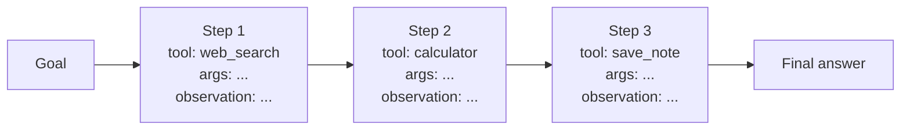
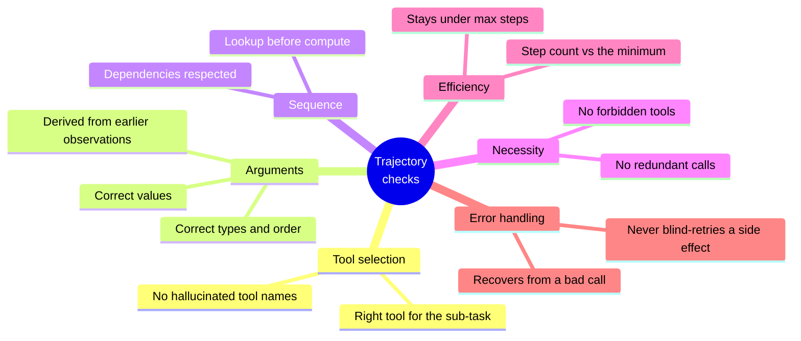
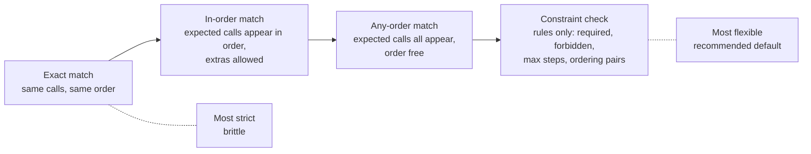
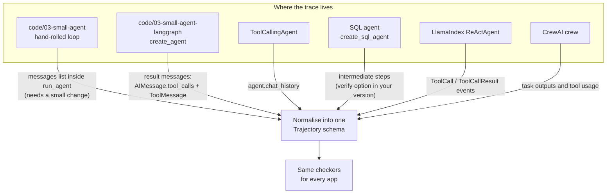
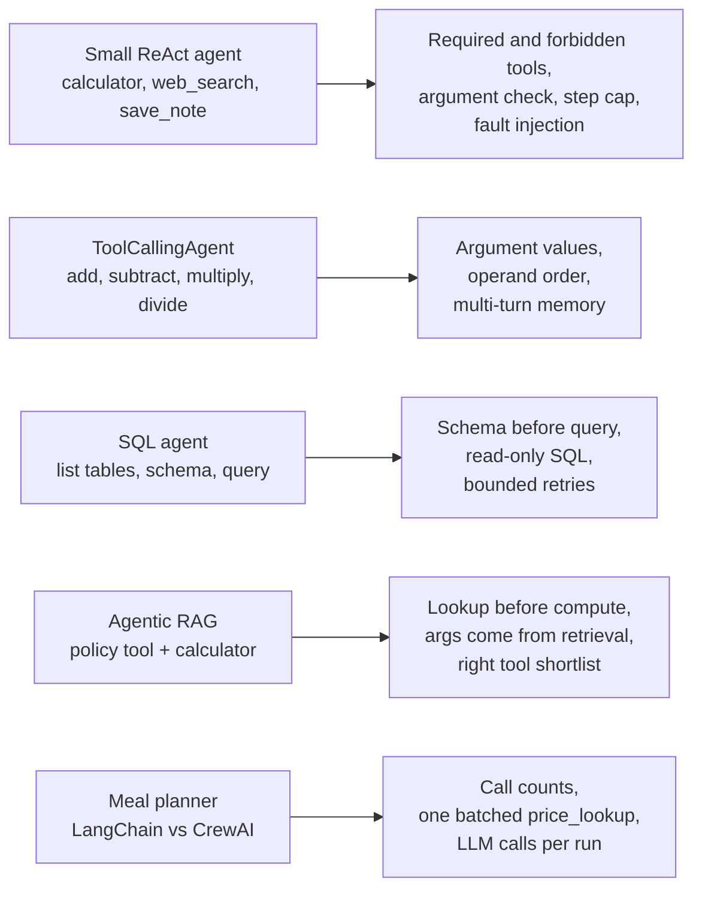
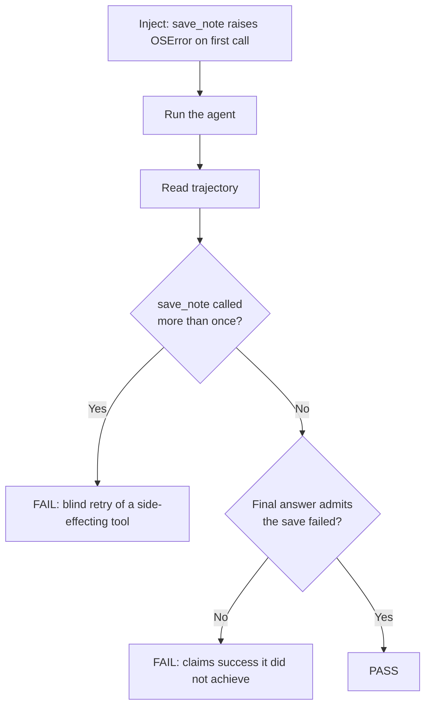
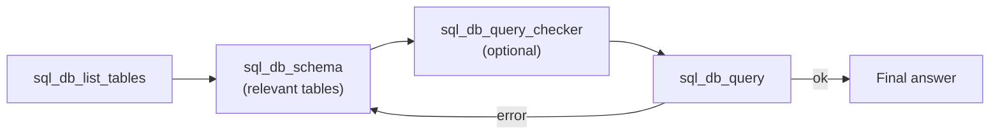
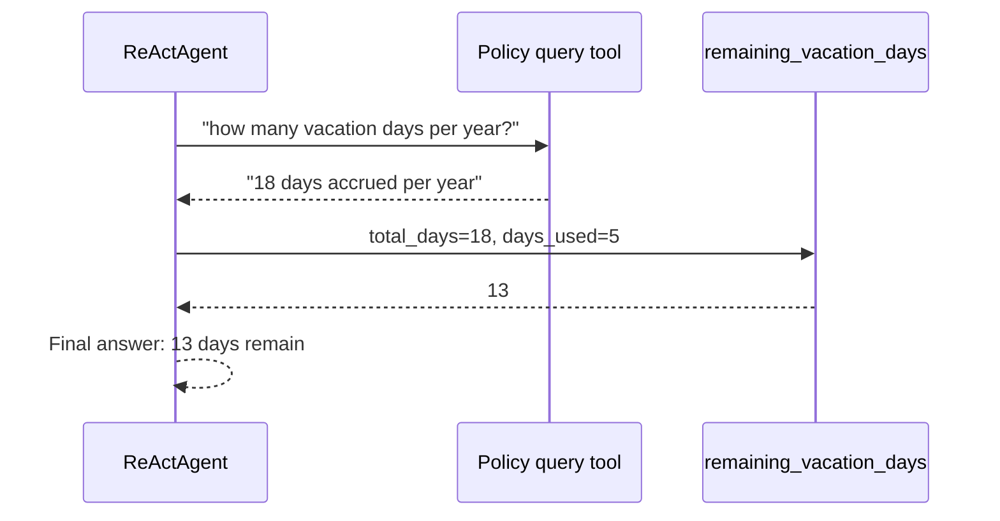
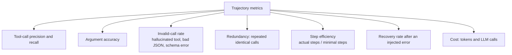
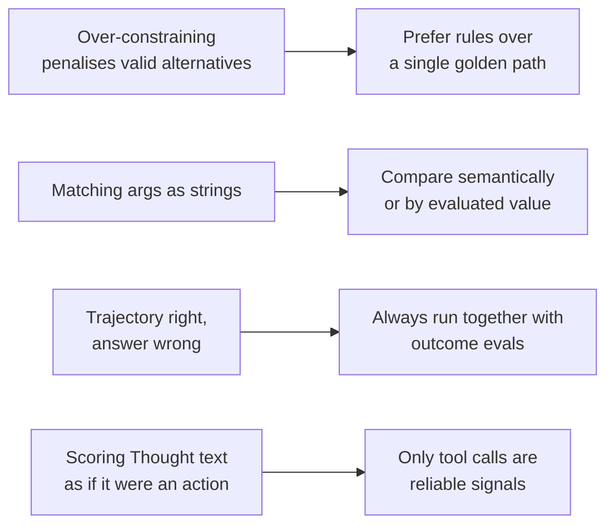

# Approach 2: Trajectory and Tool-Call Evals

> **One line:** outcome evals ask *"did it get there?"*. Trajectory evals ask *"did it get there the right way?"*, by inspecting the sequence of tool calls the agent made.

Previous note: [02-task-success-outcome-evals.md](02-task-success-outcome-evals.md). That note ended with the blind spot: a right answer can come from a lucky, wasteful, or rule-breaking path. This note closes that gap.

---

## 1. What is a trajectory?

A trajectory is the ordered record of everything the agent did between receiving the goal and giving the final answer.



Each step has the same shape, whatever framework produced it:

| Field | Meaning |
|---|---|
| `tool` | which tool was called |
| `args` | the arguments passed |
| `observation` | what the tool returned (or the error) |
| `index` | position in the sequence |

Outcome eval looks only at the right end of the diagram. Trajectory eval looks at the boxes in the middle.

---

## 2. What do we check on a trajectory?



| Check | Question it answers | Failure example |
|---|---|---|
| **Tool selection** | Was the right tool picked? | Used `web_search` for a sum |
| **Argument correctness** | Were the inputs right? | `subtract(a=2, b=1)` for "1 minus 2" |
| **Ordering** | Were dependencies respected? | Calculated before looking up the number |
| **Necessity** | Anything extra or forbidden? | Called `save_note` when not asked |
| **Efficiency** | Was it economical? | 9 steps where 2 would do |
| **Recovery** | Did it handle a failure well? | Repeated the same bad call 5 times |

---

## 3. Ways to compare actual vs expected

Pick the strictness that matches the task. Stricter is not better: many tasks have more than one valid path.



| Mode | Use when | Example |
|---|---|---|
| **Exact match** | The path is truly fixed | A scripted workflow |
| **In-order match** | Order matters, helpers are fine | schema lookup then query |
| **Any-order match** | Independent sub-tasks | fetch two unrelated facts |
| **Constraint check** | Many valid paths, a few hard rules | "never call X", "Y before Z", "at most N steps" |

Two scores are common once you have an expected set of calls:

- **Tool-call precision:** of the calls made, how many were needed?
- **Tool-call recall:** of the calls needed, how many were made?

Low precision means waste or risk. Low recall means skipped steps (often a skipped verification).

---

## 4. Capturing trajectories from our apps

Every eval needs the trace as data, not printed text. The apps in this repo expose it in different ways.



| App | How to get the trajectory | Effort |
|---|---|---|
| Small agent (hand-rolled) | `run_agent` keeps `messages` as a local variable and returns only a string. Append each `(action, input, observation)` to a list and return it alongside the answer | small code change |
| Small agent (LangGraph) | `graph.invoke(...)` already returns `messages`. Read `AIMessage.tool_calls` and the following `ToolMessage` (the same data `print_trace` prints) | none |
| `ToolCallingAgent` | Everything is in `agent.chat_history` | none |
| SQL agent | `create_sql_agent` builds an agent executor. Ask it to return intermediate steps (check the option name against your installed LangChain version) | small |
| LlamaIndex agents | `03_agent_reasoning_loop.py` already streams `ToolCall` and `ToolCallResult` events. Collect them instead of printing | small |
| CrewAI | Inspect the crew result's task outputs and tool usage | check docs |

**One normalised schema**, so checkers are written once:

```python
from dataclasses import dataclass, field

@dataclass
class Step:
    tool: str
    args: dict
    observation: str = ""
    error: bool = False

@dataclass
class Trajectory:
    goal: str
    steps: list[Step] = field(default_factory=list)
    final_answer: str = ""

    def tools(self) -> list[str]:
        return [s.tool for s in self.steps]
```

**Adapter for the LangGraph variant** (the other adapters follow the same pattern):

```python
from langchain_core.messages import AIMessage, ToolMessage

def from_langgraph(goal: str, messages: list) -> Trajectory:
    traj = Trajectory(goal=goal)
    pending: dict[str, Step] = {}
    for m in messages:
        if isinstance(m, AIMessage):
            for call in m.tool_calls:
                step = Step(tool=call["name"], args=call["args"])
                traj.steps.append(step)
                pending[call["id"]] = step
        elif isinstance(m, ToolMessage):
            step = pending.get(m.tool_call_id)
            if step:
                step.observation = str(m.content)
                step.error = (m.status == "error")
    traj.final_answer = str(messages[-1].content)
    return traj
```

---

## 5. Reusable checkers

Small functions, each answering one question about a `Trajectory`:

```python
def called(t: Trajectory, tool: str) -> list[Step]:
    return [s for s in t.steps if s.tool == tool]

def never_called(t, tool) -> bool:
    return not called(t, tool)

def called_exactly(t, tool, n) -> bool:
    return len(called(t, tool)) == n

def before(t, first: str, second: str) -> bool:
    """`first` appears at least once, and before the first `second`."""
    tools = t.tools()
    if first not in tools:
        return False
    return second not in tools or tools.index(first) < tools.index(second)

def within_steps(t, limit: int) -> bool:
    return len(t.steps) <= limit

def tool_precision_recall(t, expected: set[str]) -> tuple[float, float]:
    used = set(t.tools())
    if not used or not expected:
        return 0.0, 0.0
    hit = used & expected
    return len(hit) / len(used), len(hit) / len(expected)
```

An eval case is then just a list of these rules. Section 6 shows them applied.

---

## 6. Applying it to the apps we already built



### 6.1 Small ReAct agent (hand-rolled and LangGraph variants)

Sources: [code/03-small-agent/agent.py](../code/03-small-agent/agent.py) and [code/03-small-agent-langgraph/agent.py](../code/03-small-agent-langgraph/agent.py). The system prompt itself states the rules, so each rule becomes a trajectory check.

| Rule in the system prompt | Trajectory check |
|---|---|
| "Never compute arithmetic yourself, always call calculator" | `called(t, "calculator")` is non-empty for any arithmetic goal |
| "Only call save_note when the user explicitly asks" | `never_called(t, "save_note")` for goals that do not ask to save |
| "Don't call tools you don't need" | no `web_search` for a pure sum; `within_steps(t, 2)` |
| "If a tool call fails, correct your input" | after an error step, the next call to that tool has **different** args |
| `max_steps` guardrail | trace length stays under the cap |

**Worked cases**

| Goal | Expected trajectory | Violations to catch |
|---|---|---|
| "What is 17 * 12.99, and is that under 220?" | exactly 1 call: `calculator` | zero calculator calls (mental math); a `web_search` call |
| "Save a note titled groceries: buy milk" | exactly 1 call: `save_note` with matching title and content | 2 calls (duplicate write); wrong title |
| "What is 5 + 5?" | 1 `calculator` call, no `save_note` | any `save_note` call |

**Argument checks should be semantic, not string equality.** `"17 * 12.99"`, `"17*12.99"` and `"12.99*17"` are all correct. Instead of comparing strings, evaluate the expression the agent sent with the same safe calculator and compare the value to `220.83`.

**Fault injection (tests error recovery).** Swap in a tool that fails on purpose and watch the reaction:



This directly tests the guardrail both versions implement: the hand-rolled dispatcher stops the whole run on a side-effecting failure, while the LangGraph variant only refuses the second write inside the tool. The note in `make_save_note_tool()` admits that is weaker. A fault-injection trajectory test is how you **measure** that difference instead of arguing about it.

Another useful injection: make `calculator` receive a malformed expression and verify the next attempt fixes it rather than repeating it.

---

### 6.2 `ToolCallingAgent`: argument values and multi-turn memory

Source: [langchain/agent-with-tool-example/tool_calling_agent.py](../langchain/agent-with-tool-example/tool_calling_agent.py).

The three demo queries are almost ready-made trajectory tests, because the right arguments are unambiguous:

| Turn | User says | Expected call | Typical failure |
|---|---|---|---|
| 1 | "What is 3 plus 2?" | `add(a=3, b=2)` | none expected |
| 2 | "1 minus 2" | `subtract(a=1, b=2)` | operands swapped: `subtract(a=2, b=1)` gives `1`, not `-1` |
| 3 | "and now multiply that by 10" | `multiply(a=-1, b=10)` | agent forgets the previous result and asks again, or uses `2` or `1` |

Turn 3 is the interesting one. The correct argument `-1` exists **only in the earlier conversation**. If the argument is wrong, the final answer is wrong, but the trajectory tells you precisely *why*: the memory lookup failed, not the arithmetic. An outcome eval would just show a wrong number.

Because arithmetic is deterministic, you can also derive the expected call from the earlier observation instead of hard-coding it: assert that turn 3's first argument equals the observation from turn 2.

---

### 6.3 SQL agent: schema before query, and read-only

Source: [langchain/Natural-Language-SQL-Agent/sql_agent.py](../langchain/Natural-Language-SQL-Agent/sql_agent.py). The SQL toolkit provides `sql_db_list_tables`, `sql_db_schema`, `sql_db_query`, and a query checker.



| Check | Rule |
|---|---|
| **Look before you write** | `before(t, "sql_db_schema", "sql_db_query")`. Writing SQL without reading the schema means guessing column names |
| **Read-only SQL** | every `sql_db_query` argument starts with `SELECT` (or `WITH`); none contains `INSERT`, `UPDATE`, `DELETE`, `DROP` |
| **Bounded retries** | at most 3 `sql_db_query` calls per question; more suggests thrashing |
| **Relevant tables only** | schema requests cover the tables the gold SQL needs, not all seven |
| **Error recovery** | after a failed query, the next query differs and eventually succeeds |

The read-only check is stronger than the row-count check from the previous note: it catches a destructive statement **even if it was rolled back** or touched nothing.

**Efficiency metric:** compare `len(t.steps)` to the length of the minimal path (list, schema, query = 3). Track the ratio across the four default questions to find which ones make the agent flail.

---

### 6.4 Agentic RAG: lookup before compute, args from retrieval

Sources: [rag-with-LlamaIndex/agentic-rag-examples/02_tool_calling.py](../rag-with-LlamaIndex/agentic-rag-examples/02_tool_calling.py), [03_agent_reasoning_loop.py](../rag-with-LlamaIndex/agentic-rag-examples/03_agent_reasoning_loop.py), [04_multi_document_agent.py](../rag-with-LlamaIndex/agentic-rag-examples/04_multi_document_agent.py).

The vacation question needs two dependent tool calls: a `QueryEngineTool` for the policy, then the `remaining_vacation_days` function tool.



| Check | Rule |
|---|---|
| **Order** | `before(t, policy_tool, "remaining_vacation_days")` |
| **Grounded argument** | `total_days` equals `18`, the value in the policy file. A value like `20` means the agent invented it |
| **User-supplied argument** | `days_used` equals the number in the question |
| **No wasted calls** | at most 1 policy lookup and 1 calculation |

**Tool-shortlist check for the multi-document agent.** `04_multi_document_agent.py` puts six tools in an `ObjectIndex` and retrieves the top 4 per question. For the three-paper question, the shortlist should contain the vector tool of **each** of the three papers. That is a recall measure on tool retrieval: if a needed tool is not in the shortlist, the agent cannot call it, no matter how well it reasons. The script already prints the shortlisted tools, so the data exists.

---

### 6.5 Meal planner: LangChain pipeline vs CrewAI agents

Sources: [langchain/meal-planner-agent/main.py](../langchain/meal-planner-agent/main.py) and [crew-ai/meal-planner-agent/main.py](../crew-ai/meal-planner-agent/main.py).

The two versions solve the same problem with different amounts of agency, which makes trajectory metrics informative:

| | LangChain version | CrewAI version |
|---|---|---|
| Control flow | fixed 3-step pipeline in plain Python | three agents, each deciding its own steps |
| Tool use | `price_lookup` called directly in code | agent decides when to call `price_lookup` |
| Trajectory | fixed, nearly nothing to check | variable, worth checking |

Checks that fit:

| Check | Applies to | Rule |
|---|---|---|
| **LLM call count** | both | LangChain should make exactly 2 LLM calls (`TokenCounter.calls == 2`). CrewAI count is higher and variable |
| **Batched tool use** | CrewAI | the shopping organizer's backstory says it calls `price_lookup` **exactly once** with all ingredients. Assert `called_exactly(t, "price_lookup", 1)` and that its args contain every ingredient |
| **Step order** | both | meal plan before shopping plan before budget report |
| **Token cost per run** | both | total tokens compared across the same scenario |

Result you can report: "same task, same pass rate, but CrewAI used N times the LLM calls". That is a trajectory finding no outcome eval would surface.

---

## 7. Trajectory metrics to track



The hand-rolled small agent already distinguishes four failure modes in its dispatcher: unknown tool, malformed arguments, schema validation error, and execution error. Count how often each fires across a test set. That is a ready-made **invalid-call rate** broken down by cause.

---

## 8. Pitfalls



- **Over-constraining.** If two routes are equally valid, an exact-match check fails a correct agent. Use constraints (required, forbidden, ordering, step cap).
- **Native tool calling narrates less.** The LangGraph variant's own docstring notes the model may emit no free text alongside a tool call. Do not score reasoning text there; score the calls.
- **Trace and outcome can disagree.** A perfect path with a wrong answer, or the reverse. Report both, never one in place of the other.
- **Rules that reasoning quality cannot be coded for.** Whether a `Thought` was sensible or a SQL query was *well designed* is not a pattern a function can match. That is where LLM-as-a-judge comes in.

---

## 9. Summary

| Question | Answer |
|---|---|
| What does it measure? | The path: tool choice, arguments, order, necessity, efficiency, recovery |
| Needs | The trace captured as data, normalised to one schema |
| Best checker style | Constraints (required, forbidden, ordering, step cap) over exact scripts |
| Catches what outcome evals miss | Mental math, needless calls, skipped schema lookup, duplicate side effects, wasted cost |
| Special technique | Fault injection to test error recovery and side-effect safety |
| Best fit in our apps | Small agent (rules in prompt), `ToolCallingAgent` (args), SQL agent (schema before query), agentic RAG (lookup before compute), CrewAI vs LangChain (call counts) |
| Main weakness | Cannot judge fuzzy qualities such as reasoning clarity or answer wording |

**Next note:** Approach 3, LLM-as-a-judge: scoring the qualities no program can check, such as answer faithfulness, reasoning quality, and tone, using the same apps as examples.
