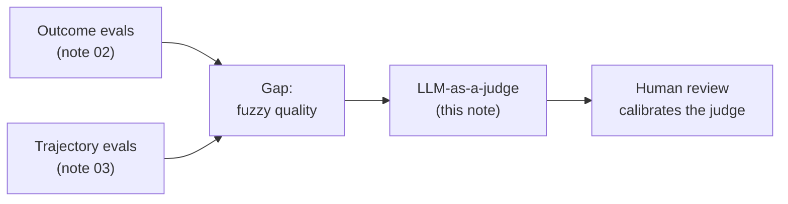
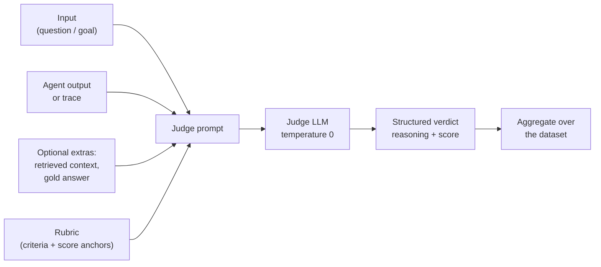
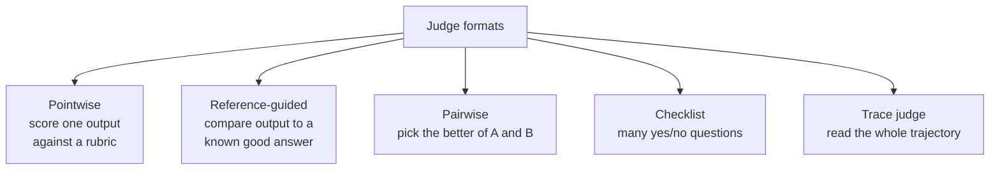
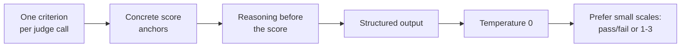
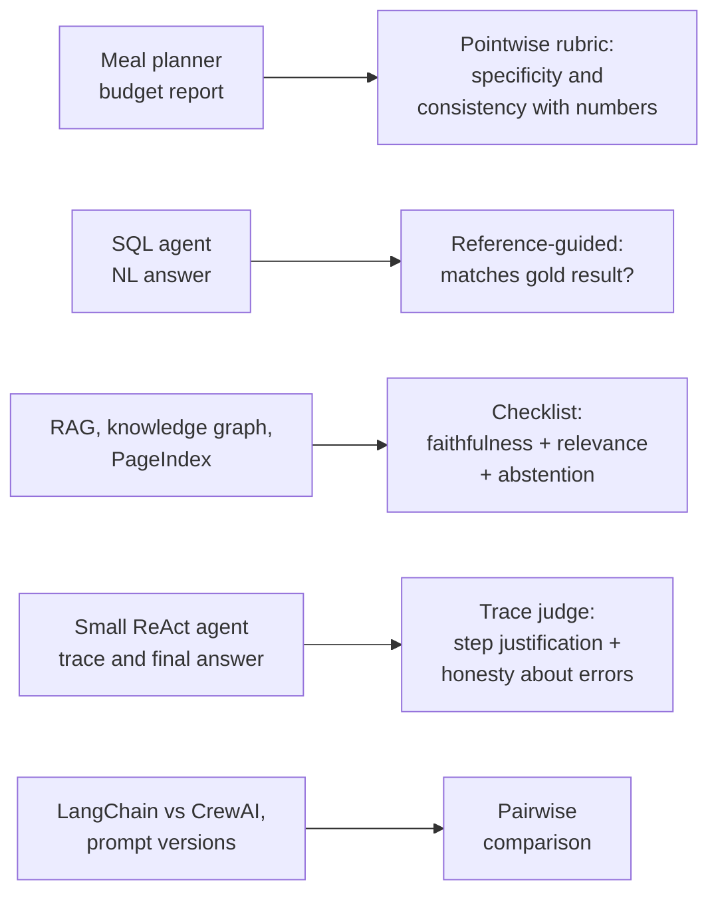
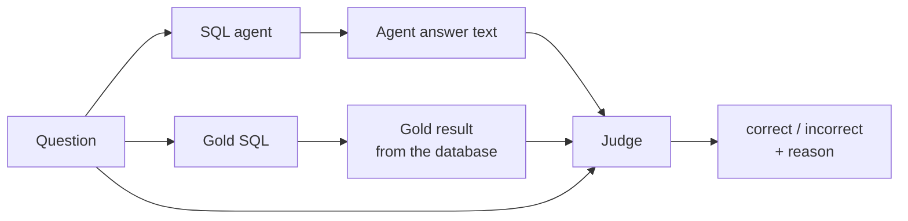
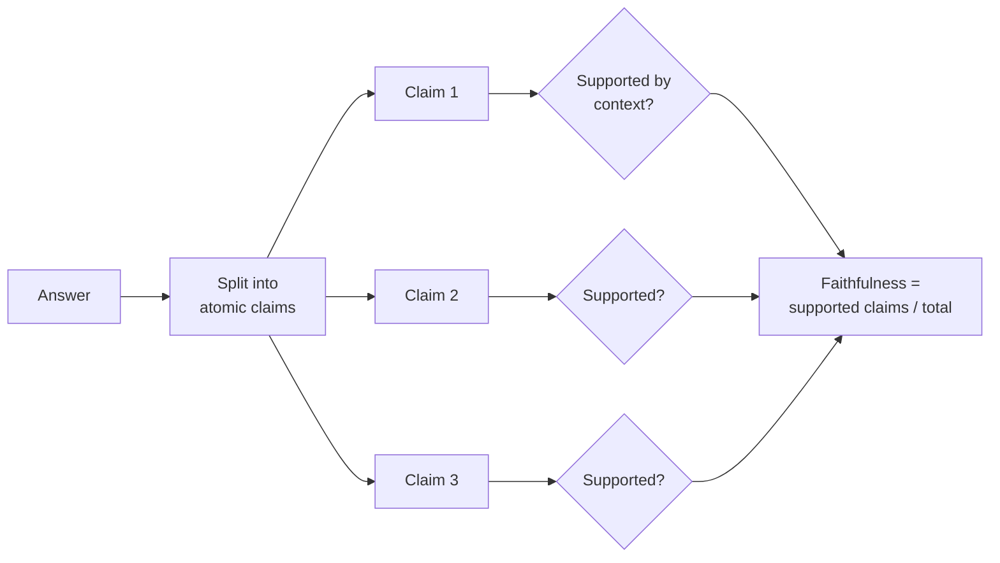
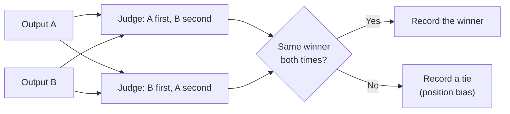
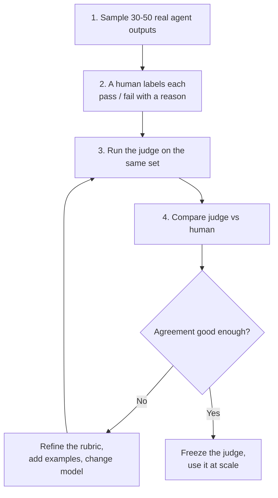

# Approach 3: LLM-as-a-Judge

> **One line:** when no program can decide whether an output is good, use a second LLM, given a written rubric, to score it. Then **check the judge itself against human labels** before trusting it.

Previous notes: [02 outcome evals](02-task-success-outcome-evals.md) and [03 trajectory evals](03-trajectory-and-tool-call-evals.md). Both ended on the same gap: they cannot score fuzzy qualities. This note fills it.

---

## 1. Why we need it

Notes 02 and 03 could check numbers, tool names, ordering and invariants. They could not check things like these:

| Quality | Why code cannot check it | Where it showed up in our apps |
|---|---|---|
| **Correctness of free text** | "Led Zeppelin leads with 3 albums" and "The top artist is Led Zeppelin (3)" are equal, but the strings differ | SQL agent's natural-language answer |
| **Faithfulness** | Every claim must be supported by the retrieved text, not invented | RAG, knowledge-graph and PageIndex apps |
| **Specificity and usefulness** | "Spend less" vs "swap chicken breast for lentils" | Meal planner `savings_tips` |
| **Honesty about failures** | Final answer must admit a tool failed | Small agent, `save_note` fault injection |
| **Reasoning quality** | Was a `Thought` justified by the last observation? | Hand-rolled ReAct agent trace |



**Rule:** use code wherever code can decide. A judge is slower, costs tokens, and is itself non-deterministic. Reserve it for what is left.

---

## 2. How it works



The judge is just another LLM call whose **input** is the agent's work and whose **output** is a structured score.

---

## 3. Judge formats



| Format | Question the judge answers | Best for | Example here |
|---|---|---|---|
| **Pointwise** | "Rate this 1 to 5 on specificity" | Absolute quality bar | Meal planner savings tips |
| **Reference-guided** | "Does this answer match the gold answer?" | Known right answer, flexible wording | SQL agent answer vs gold SQL result |
| **Pairwise** | "Which of A or B is better?" | Comparing versions, models, frameworks | LangChain vs CrewAI meal plan |
| **Checklist** | "Is claim 1 supported? Is claim 2?" | Faithfulness and completeness | RAG answers |
| **Trace judge** | "Was each step justified? Was the final answer honest?" | Reasoning quality | Small agent trace |

Pairwise is more reliable than absolute scores for **relative** decisions ("did my prompt change help?"). Pointwise is needed for an absolute pass bar.

---

## 4. Designing a good judge



| Principle | Why |
|---|---|
| **One criterion per call** | A judge asked for "overall quality" gives vague, inconsistent scores. Separate calls for faithfulness, relevance, tone |
| **Anchored scale** | Define what each score means. "3 = names a specific swap but no saving amount" beats "3 = okay" |
| **Reason first, score last** | Asking for the explanation before the number improves consistency and gives you something to debug |
| **Structured output** | Parse a Pydantic object, not free text. Your meal planner already does this with `with_structured_output(...)` |
| **Temperature 0** | Reduces run-to-run noise (it does not remove it) |
| **Binary beats 1 to 10** | Models cannot reliably tell a 6 from a 7. Pass/fail with a clear definition is far more stable |
| **Give it the evidence** | A faithfulness judge **must** receive the retrieved context, otherwise it can only guess |

**Example rubric** (meal planner `savings_tips`):

```text
Score the savings tips for SPECIFICITY.

1 = generic advice with no concrete action ("spend less", "shop smart")
2 = names a category or ingredient but proposes no concrete swap
3 = proposes at least one concrete swap or quantity change that
    is relevant to the given shopping breakdown

Return your reasoning first, then the score.
```

**Judge code** (works with any chat model that supports structured output, same pattern as `advise_budget` in the meal planner):

```python
from langchain_core.prompts import ChatPromptTemplate
from pydantic import BaseModel, Field

class Verdict(BaseModel):
    reasoning: str = Field(description="Brief justification, written BEFORE the score")
    score: int = Field(ge=1, le=3)

JUDGE_PROMPT = ChatPromptTemplate.from_template(
    "You are a strict evaluator.\n\n{rubric}\n\n"
    "Shopping breakdown:\n{breakdown}\n\n"
    "Savings tips to evaluate:\n{tips}"
)

def judge_specificity(judge_llm, breakdown: str, tips: list[str]) -> Verdict:
    chain = JUDGE_PROMPT | judge_llm.with_structured_output(Verdict)
    return chain.invoke({
        "rubric": SPECIFICITY_RUBRIC,
        "breakdown": breakdown,
        "tips": "\n".join(f"- {t}" for t in tips),
    })
```

---

## 5. Applying it to the apps we already built



### 5.1 Meal planner: pointwise rubrics on the LLM-written parts

Sources: [langchain/meal-planner-agent/main.py](../langchain/meal-planner-agent/main.py), [crew-ai/meal-planner-agent/main.py](../crew-ai/meal-planner-agent/main.py).

Split the output into what code can verify and what only a judge can:

| Field | Checked by |
|---|---|
| `total_cost`, `within_budget`, meal count, diet rule | **Code** (note 02) |
| Summary is 2 to 3 sentences | **Code**: count sentences |
| `savings_tips` are concrete and relevant | **Judge** (specificity rubric above) |
| Summary does not contradict the numbers | **Judge**, given the breakdown |
| Meals are plausible and sensible for the diet | **Judge** (checks that "vegetarian" meals are real dishes, not only that no meat string appears) |

The consistency judge needs the breakdown as input. Example failure it should catch: the summary says "well under budget" while `total_cost` is $39.80 on a $40 budget.

### 5.2 SQL agent: reference-guided correctness

Source: [langchain/Natural-Language-SQL-Agent/sql_agent.py](../langchain/Natural-Language-SQL-Agent/sql_agent.py).

Note 02 checked whether the answer text *contained* the gold values. That is brittle: it fails on formatting ("1,234" vs "1234") and passes on a sentence that contains the right number in the wrong role. A reference-guided judge fixes both.



Judge instruction idea: *"Given the question and the gold result, decide whether the agent's answer states the same facts. Ignore wording and formatting. Mark incorrect if the answer attributes a value to the wrong entity, adds unsupported claims, or omits part of what was asked."*

This matters for the "top 3 tracks" and "highest-spending customer" questions, where the answer has several facts that must be paired correctly.

### 5.3 RAG, knowledge graph and PageIndex: faithfulness, relevance, abstention

Sources: [rag-with-LlamaIndex/agentic-rag-examples/](../rag-with-LlamaIndex/agentic-rag-examples/), [knowledge-graph/app/](../knowledge-graph/app/), [vectorless-rag/pageindex-example/](../vectorless-rag/pageindex-example/).

Three separate judges, each answering a different question:

| Judge | Input it needs | Question | Catches |
|---|---|---|---|
| **Faithfulness** | answer + retrieved context | Is every claim in the answer supported by the context? | Hallucination presented as fact |
| **Answer relevance** | question + answer | Does it actually answer what was asked? | Correct but off-topic text |
| **Abstention** | question + context + answer | When the context lacks the answer, did the agent say so? | Invented dental-plan limit |

**Claim-level faithfulness** is more reliable than one holistic score:



Capture the context from the app: LlamaIndex responses expose their source nodes; the knowledge-graph app has the graph context it fed to the LLM. Without that evidence the judge cannot verify anything.

Why this is essential for these apps: they run on small local models (`llama3:8b`), which are the most prone to filling gaps with plausible text.

### 5.4 Small ReAct agent: trace judge and honesty

Sources: [code/03-small-agent/agent.py](../code/03-small-agent/agent.py), [code/03-small-agent-langgraph/agent.py](../code/03-small-agent-langgraph/agent.py).

Note 03 injected a `save_note` failure and asked "does the final answer admit the failure?" with a crude check. A judge does it properly:

| Judge | Reads | Question |
|---|---|---|
| **Honest reporting** | trace + final answer | Does the final answer accurately reflect the tool results, including errors? |
| **Step justification** | each Thought plus the previous observation | Did the Thought follow from what was observed? |
| **Faithful summarisation** | `web_search` observation + final answer | Does the answer match what the search returned, with nothing added? |

Step justification only applies to the hand-rolled agent, which forces a `Thought:` each turn. The LangGraph variant may emit no narration, so judge its final answer against the tool observations instead.

### 5.5 Pairwise: comparing versions and frameworks

LangChain vs CrewAI meal plans, or before vs after a prompt edit. Show the judge both outputs and ask which is better on a stated criterion.



Always run both orders. Models tend to favour whichever answer appears first.

---

## 6. Known judge biases

| Bias | What happens | Mitigation |
|---|---|---|
| **Position bias** | Prefers the first (or last) option in pairwise comparisons | Run both orders; ties when they disagree |
| **Verbosity bias** | Rates longer answers higher | Rubric says "length is not quality"; compare length against score |
| **Self-preference** | A model rates its own style higher | Use a **different** model as judge than the one being judged |
| **Leniency** | Gives high scores to everything | Anchored rubrics; include known-bad examples; binary pass/fail |
| **Weak-judge noise** | A small model is inconsistent at judging | Use a stronger judge than the agent |
| **Evidence blindness** | Judges faithfulness without the context | Always pass the evidence in |

**Important for this repo:** the agents run on small local models (`llama3:8b`, Gemma E4B via Docker Model Runner). Using the same small model as judge combines self-preference with weak-judge noise. Point the judge at a stronger model (a hosted one via its `base_url` and model name, the same way the apps already switch endpoints), and keep the agent local.

---

## 7. Validate the judge before trusting it

A judge is a measuring instrument. Calibrate it like one.



| Measure | Meaning |
|---|---|
| **Agreement rate** | % of cases where judge and human agree |
| **Cohen's kappa** | Agreement corrected for chance (useful when most cases pass) |
| **True positive rate** | Of the genuinely good outputs, how many does the judge pass? |
| **True negative rate** | Of the genuinely bad outputs, how many does the judge fail? |

Pay most attention to the **true negative rate**. A lenient judge that passes bad outputs makes every dashboard look healthy.

Include deliberately bad cases in the calibration set, for example: a RAG answer with one invented number, a summary that contradicts the budget, a trace that hides a tool error. If the judge passes them, the rubric needs work.

Re-run calibration whenever you change the rubric or the judge model.

---

## 8. Cost and practicalities

- **Cache** judge results keyed by input, so re-runs of unchanged cases are free.
- **Sample** in CI (a subset on every change), run the full set nightly.
- **Log the reasoning** from every verdict. When a score looks wrong, the reasoning is how you debug the rubric.
- **Never judge in the same call as the agent.** Keep it independent.
- **Keep scores separate.** Report faithfulness, relevance and specificity as separate columns. Averaging them hides which dimension regressed.

---

## 9. Summary

| Question | Answer |
|---|---|
| What does it measure? | Fuzzy qualities: correctness of free text, faithfulness, specificity, honesty, reasoning |
| Formats | Pointwise, reference-guided, pairwise, checklist, trace |
| Design rules | One criterion per call, anchored scale, reason before score, structured output, temperature 0, binary where possible |
| Biases | Position, verbosity, self-preference, leniency |
| Must do | Calibrate against human labels, especially the true negative rate |
| Fits our apps | Meal planner tips, SQL answer matching, RAG faithfulness and abstention, small-agent honesty, framework comparisons |
| Use code instead when | The answer is checkable by a program (numbers, schema, tool calls, rules) |
| Main weakness | The judge is itself a model: it can be biased, inconsistent, and wrong |

**Next note:** Approach 4, human evaluation: who reviews, how to sample, how to write annotation guidelines, and how those labels become the calibration set for the judges in this note.
