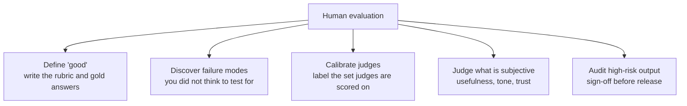
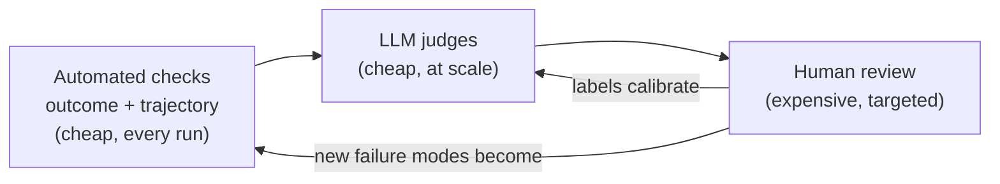
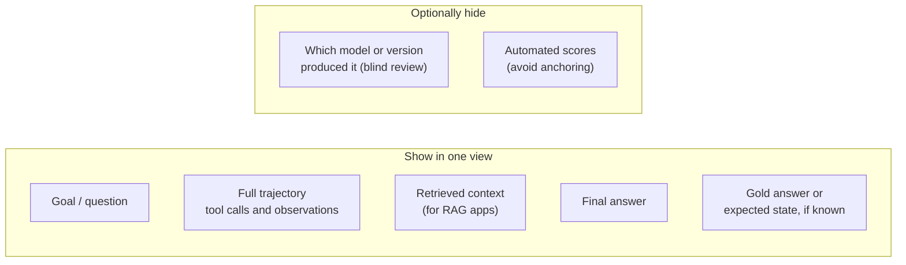
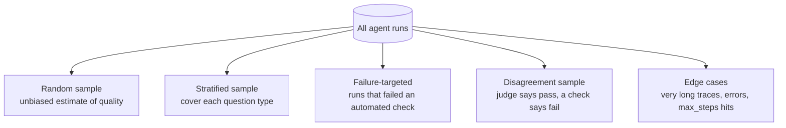
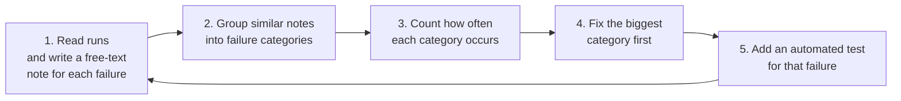
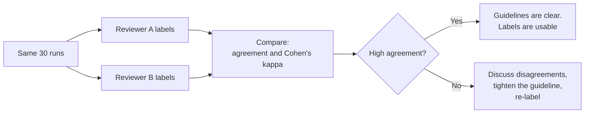
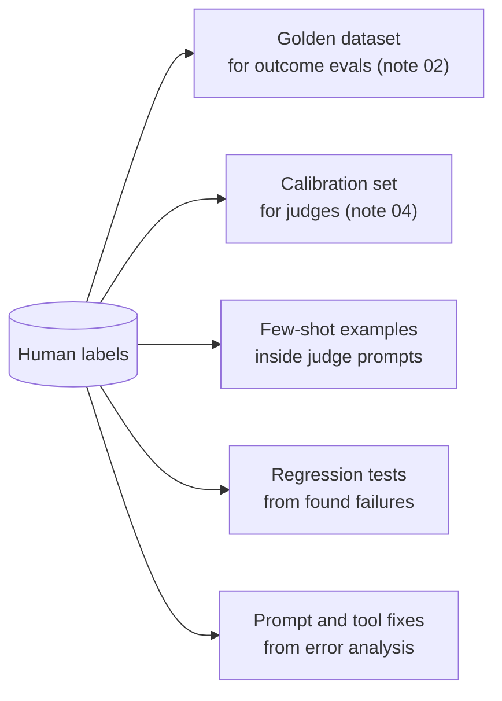
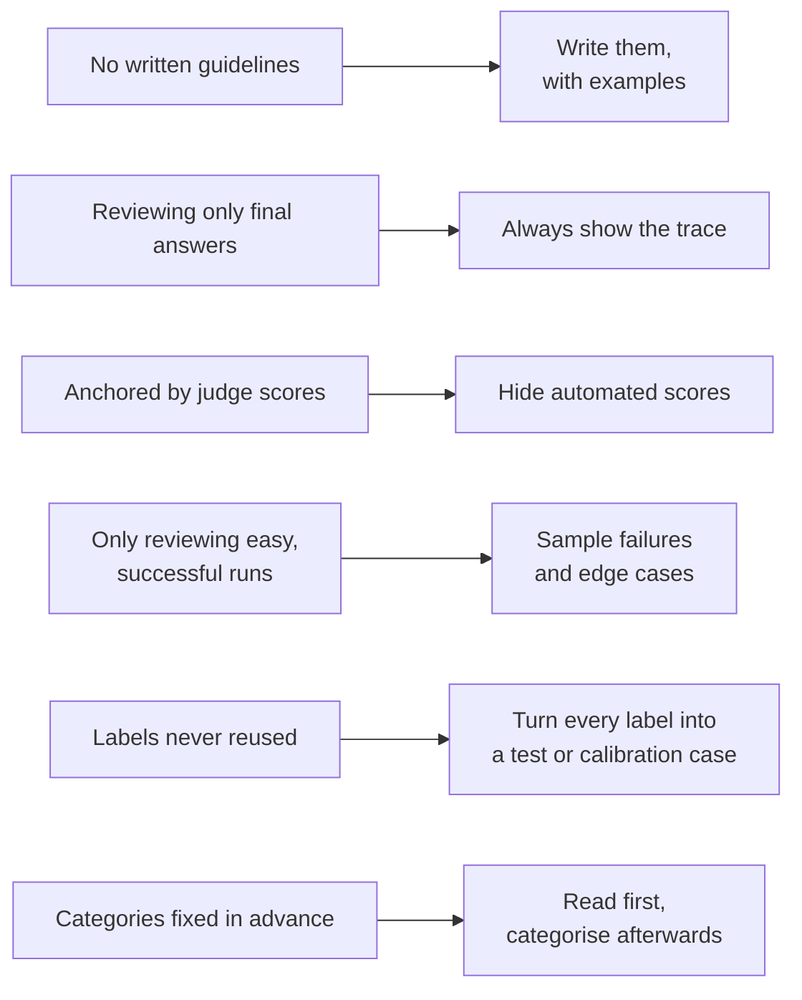

# Approach 4: Human Evaluation

> **One line:** people review real agent runs and label them. This is the slowest and most expensive method, and it is the **source of truth** that every automated check in notes 02 to 04 is ultimately measured against.

Previous note: [04-llm-as-a-judge.md](04-llm-as-a-judge.md). That note ended by saying a judge must be calibrated against human labels. This note covers where those labels come from.

---

## 1. What humans do that automation cannot



| Role | Why only a human can do it |
|---|---|
| **Define quality** | Code and judges can only enforce a definition someone wrote down |
| **Find unknown failures** | Automated checks test what you already suspect. Reading real runs reveals what you did not |
| **Ground truth for judges** | A judge's accuracy can only be measured against trusted labels |
| **Subjective quality** | Is the meal plan *appetising*? Is the answer *trustworthy*? |
| **Accountability** | In regulated settings a named person signs off, not a model |

Human review does not replace the other approaches. It sits **behind** them.



---

## 2. Who should review

| Reviewer | Strength | Weakness | Use for |
|---|---|---|---|
| **Domain expert** | Knows what a correct answer really is | Scarce, costly | Correctness of specialist output, final sign-off |
| **Developer / builder** | Understands traces and tools | Biased toward their own design | Trace review, error analysis |
| **End user / proxy** | Knows what is actually useful | Cannot judge correctness of technical detail | Helpfulness, tone, clarity |
| **Trained annotators** | Scalable, consistent with guidelines | Need training and spot checks | Large labelling rounds |

Practical advice: **start with yourself.** For a small project, the builder reading 30 to 50 real runs is the highest-value eval activity available, and costs nothing.

---

## 3. What to put in front of the reviewer

Reviewers should see enough to decide, and no more.



- **Always show the trace**, not only the final answer. Reviewing the output alone hides exactly the problems note 03 was built to expose.
- **Blind comparisons.** When comparing LangChain vs CrewAI or two prompt versions, hide which is which and randomise the order.
- **Hide the judge score** from the reviewer if the labels will be used to calibrate that judge. Otherwise you measure agreement with the judge, not with the truth.

---

## 4. How to label

### 4.1 Label formats

| Format | Question | Best for |
|---|---|---|
| **Pass / fail + reason** | "Did it succeed? Why or why not?" | Default. Fast, and the reason is the valuable part |
| **Failure category** | "Which of these things went wrong?" | Error analysis (section 6) |
| **Rubric score** | "Rate specificity 1 to 3" | Dimensions you track over time |
| **Pairwise preference** | "Which of A or B is better?" | Comparing versions or frameworks |
| **Edit / correction** | "Rewrite it the right way" | Producing gold answers and few-shot examples |

Keep scales small. Pass/fail plus a written reason beats a 1 to 10 slider for the same reason it does for judges: people cannot reliably tell a 6 from a 7 either.

### 4.2 Write annotation guidelines

Without guidelines two reviewers will quietly use two different definitions, and the labels become noise.

A guideline needs:

1. The **definition** of pass and fail for each criterion.
2. **Worked examples**: at least two clear passes, two clear fails, and the borderline cases with the decision made.
3. **Rules for ambiguity** ("if the answer is correct but also contains one unsupported claim, mark fail").
4. A place to record **uncertainty** ("unsure") so hard cases are not forced into a label.

**Example record** (one JSON line per reviewed run, easy to produce from the trajectory format in note 03):

```json
{
  "run_id": "sql-0042",
  "app": "sql_agent",
  "goal": "Which artist has the most albums?",
  "label": "fail",
  "failure_category": "wrong_aggregation",
  "reason": "Counted tracks instead of albums, so the answer names the wrong artist.",
  "reviewer": "ramanuj",
  "confidence": "high"
}
```

---

## 5. Which runs to review (sampling)

You cannot read everything. Choose deliberately.



| Strategy | Gives you |
|---|---|
| **Random** | An honest overall quality estimate |
| **Stratified** | Coverage of every task type (arithmetic, lookup, multi-step) instead of only the common one |
| **Failure-targeted** | Fast insight into *why* things fail |
| **Disagreement** | The cases where your automated methods contradict each other, which is where the bugs in the evals themselves live |
| **Edge cases** | Rare but costly behaviour |

A good default round: **20 random + 20 failure-targeted + 10 disagreement**, repeated whenever the agent changes meaningfully.

---

## 6. Error analysis: turning labels into fixes

This is the most valuable thing human review produces. The workflow:



Do it in this order. Read first, categorise second. If you start from a fixed list of categories you only find the problems you already imagined.

**Example taxonomy built from the apps in this repo** (each category points to the cheapest approach that can catch it again):

| App | Failure category | Typical symptom | Best automated catch |
|---|---|---|---|
| Small agent | `mental_math` | Answers an arithmetic goal without calling `calculator` | Trajectory rule (note 03) |
| Small agent | `unrequested_side_effect` | Calls `save_note` when not asked | Trajectory rule |
| Small agent | `dishonest_summary` | Final answer hides a tool error | Judge (note 04) |
| SQL agent | `wrong_aggregation` | Counts the wrong thing | Gold-query comparison (note 02) |
| SQL agent | `skipped_schema` | Writes SQL without reading the schema | Trajectory rule |
| Meal planner | `diet_violation` | Meat in a vegetarian plan | Invariant check (note 02) |
| Meal planner | `generic_tips` | Savings tips are vague | Judge |
| RAG / KG / PageIndex | `hallucinated_fact` | Number not in the context | Faithfulness judge |
| RAG / KG / PageIndex | `missed_retrieval` | The answer was in the data but not retrieved | Retrieval metrics (later note) |
| RAG / KG / PageIndex | `failed_to_abstain` | Invents an answer when the data lacks one | Abstention judge |

The last column is the point: **every failure a human finds should end up as an automated test**, so the human never has to find it twice.

A Pareto view is usually enough: usually two or three categories account for most failures. Fix those, re-run, re-count.

---

## 7. Measuring reviewer agreement

If two careful people disagree on a label, the criterion is unclear, not the people.



- A rough reading of kappa: below about 0.4 is weak, 0.6 to 0.8 is solid, above 0.8 is strong. Treat these as guide rails, not laws.
- **The disagreements are the useful output.** Each one reveals an ambiguous rule in the guidelines.
- If you are a solo builder, label the same 20 runs again a week later. Disagreement with your past self measures the same thing.
- The agreement between humans is the **ceiling** for any judge. If two experts agree only 75% of the time, a judge that agrees with them 75% of the time is already as good as a person.

---

## 8. Using human labels downstream



One review round feeds five different uses. That is why it is worth doing carefully.

---

## 9. Making it affordable

| Technique | Effect |
|---|---|
| **Review traces in a simple viewer** (a notebook, a markdown dump, or a spreadsheet with one row per run) | Fast without special tooling |
| **Pre-sort by automated signals** | Spend time on suspicious runs first |
| **Time-box rounds** (e.g. 45 minutes) | Prevents fatigue, which degrades label quality |
| **Reuse labelled cases** | Each labelled run becomes a permanent test case |
| **Review in batches after each meaningful change** | Not continuously |

Reviewer fatigue is real. Quality drops after an hour or so of labelling, and early and late labels drift apart. Short sessions with clear guidelines beat marathons.

---

## 10. Pitfalls



---

## 11. Summary

| Question | Answer |
|---|---|
| What does it provide? | Ground truth, discovery of unknown failures, calibration for judges, sign-off |
| Who | Domain experts for correctness, builders for traces, users for usefulness |
| What to show | Goal, full trace, context, final answer, and gold if known; hide model identity and judge scores when needed |
| Label format | Pass/fail plus a written reason, with a failure category |
| Sampling | Random + stratified + failure-targeted + disagreement |
| Core workflow | Read, group, count, fix the biggest category, add an automated test |
| Quality control | Written guidelines, inter-reviewer agreement, time-boxed sessions |
| Main weakness | Slow, costly, and inconsistent without guidelines |

**Next note:** Approach 5, benchmarks and golden datasets: how to build a test set for each of our apps from the human labels in this note, how big it needs to be, how to keep it from going stale, and when to use public agent benchmarks.
