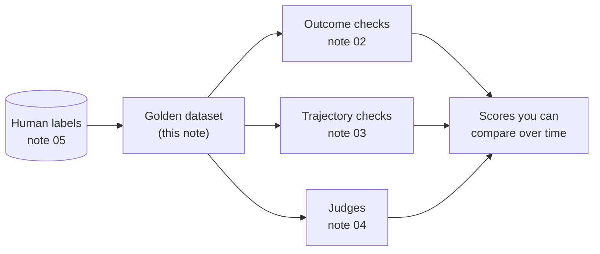
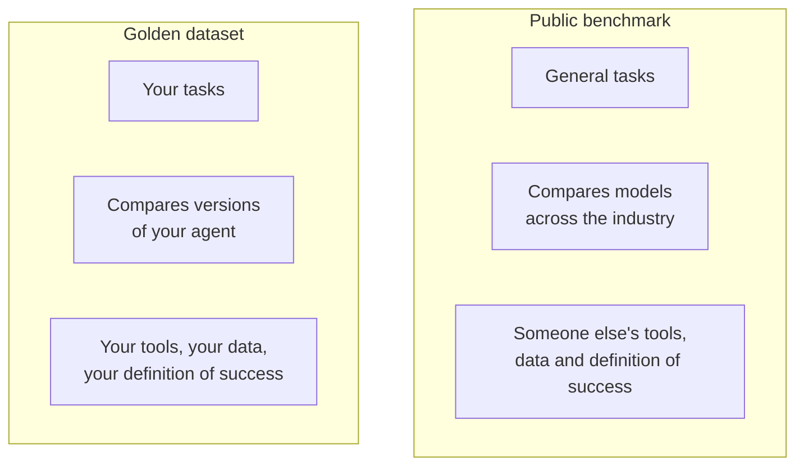
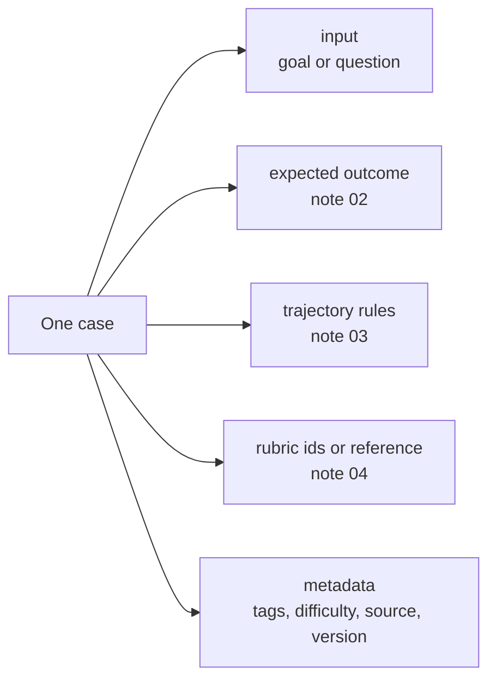
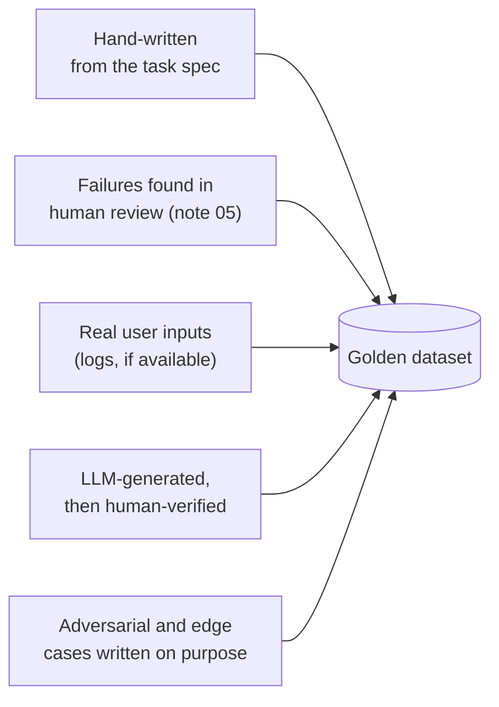
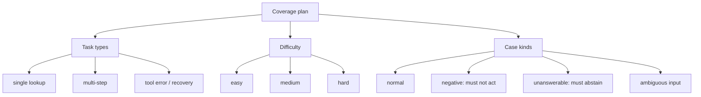
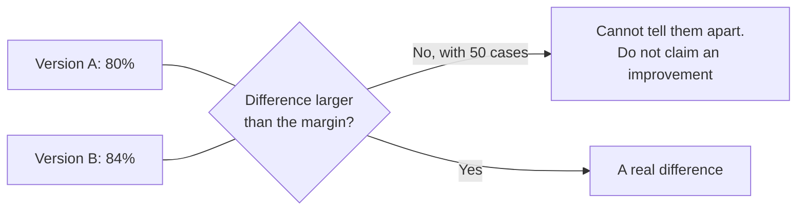
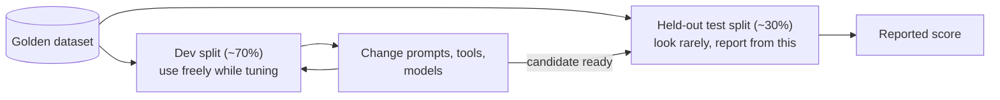
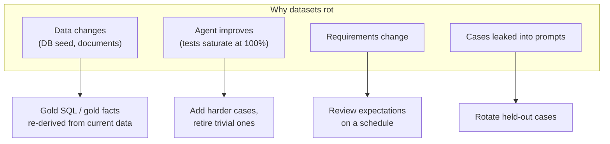
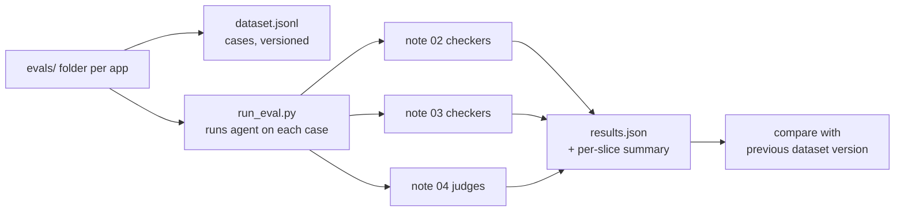

# Approach 5: Benchmarks and Golden Datasets

> **One line:** a benchmark is a fixed set of tasks with known expected results that you re-run to get comparable scores. **Public benchmarks** tell you how a *model* behaves in general. A **golden dataset** tells you how *your agent* behaves on *your* tasks. You need the second one; the first is only a reference.

Previous note: [05-human-evaluation.md](05-human-evaluation.md). Human review produced labelled runs. This note turns them into the test set that notes 02 to 04 run against.

---

## 1. The relationship to everything so far



Notes 02 to 04 described *how to score a run*. They all assumed a list of tasks to run. The golden dataset is that list, and each case carries the expected results the three methods need.

---

## 2. Public benchmarks vs your golden dataset



| | Public benchmark | Golden dataset |
|---|---|---|
| **Measures** | A model's general capability | Your agent on your job |
| **Use for** | Choosing which model to try | Deciding whether *your* change helped |
| **Tasks come from** | Benchmark authors | Your real usage and your labelled failures |
| **Risk** | May not resemble your task; models may have seen it in training (contamination) | Too small, goes stale, overfitted |
| **Cost to build** | None | Real effort, but it is the asset that matters |

**A high public-benchmark score does not predict your agent works.** The Chinook SQL agent, the meal planner and the policy-document RAG each depend on their own schema, tools and documents, which no public benchmark contains.

### Public benchmarks worth knowing (reference only)

Use them to shortlist models. Check each project's current page before relying on any detail; versions and leaderboards change.

| Benchmark family | What it tests | Closest app in this repo |
|---|---|---|
| **Text-to-SQL** (Spider, BIRD) | Turning questions into correct SQL | SQL agent |
| **Function / tool calling** (Berkeley Function Calling Leaderboard) | Picking the right tool and arguments | `ToolCallingAgent`, small agent |
| **Tool-agent-user tasks** (tau-bench) | Multi-turn tool use under policy rules | Small agent, with its rule-following |
| **General assistant tasks** (GAIA) | Multi-step reasoning with tools and search | Small agent with `web_search` |
| **Multi-hop QA** (HotpotQA and similar) | Combining facts from several documents | Multi-document agent |
| **Software engineering** (SWE-bench) | Fixing real repository issues | Not applicable here |

Typical use: *"Which local model should power the small agent: Gemma E4B or llama3:8b?"* A function-calling benchmark gives a first hint. Your golden dataset gives the answer.

---

## 3. Anatomy of a golden dataset case

One case carries everything the earlier approaches need, so each method plugs into the same record.



```json
{
  "id": "rag-policy-003",
  "app": "agentic_rag",
  "tags": ["multi_step", "retrieval_then_compute"],
  "difficulty": "medium",
  "input": "I have used 5 vacation days. How many do I have left?",
  "expected": { "required_facts": ["13"], "state": null },
  "trajectory": {
    "required_tools": ["policy_query", "remaining_vacation_days"],
    "ordering": [["policy_query", "remaining_vacation_days"]],
    "forbidden_tools": [],
    "max_steps": 4
  },
  "judges": ["faithfulness", "relevance"],
  "source": "hand_written",
  "added": "2026-10-04",
  "dataset_version": 1
}
```

The same shape works for every app; only the `expected` and `trajectory` contents change.

---

## 4. Where cases come from



| Source | Strength | Watch out for |
|---|---|---|
| **Hand-written** | Precise, covers requirements | You only test what you imagine |
| **Past failures** | Real, and prevents regressions | Skews toward old problems |
| **Real inputs** | Matches actual usage | Needs cleaning, and privacy care |
| **LLM-generated** | Fast and broad | Tends to produce easy, same-style cases; **always verify** |
| **Adversarial** | Probes weak spots | Can over-represent rare situations |

**Best single rule: every bug you fix becomes a case.** The dataset then grows in exactly the places the agent has been weak.

**Using an LLM to generate cases safely:**
- RAG: generate questions from each document section, then have a human check the question is answerable and the expected fact is real.
- SQL: generate a question *and* its gold SQL, then **run the gold SQL** to confirm it executes and returns something sensible.
- Never let the same model that powers the agent be the only author of its own test set.

---

## 5. Coverage: a dataset should be balanced, not just large

Plan the dataset as a grid of task types against difficulty, and make sure no important cell is empty.



**Example plans for the apps in this repo**

| App | Task types to cover | Cases that are easy to forget |
|---|---|---|
| **Small agent** | arithmetic, web lookup, save a note, combined goals | A goal that must **not** save a note; a calculator failure; a goal that tempts the agent to guess |
| **`ToolCallingAgent`** | each of add, subtract, multiply, divide; chained turns | Informal phrasing ("1 minus 2"), a follow-up that depends on the previous result, divide by zero |
| **SQL agent** | count, group-by, top-N, joins, sums | Ties; a question with no matching rows; a question about a column that does not exist; a request to modify data (must refuse) |
| **Meal planner** | scenarios by budget, diet and meal count | A budget too small to be feasible; an unusual diet; a request for ingredients missing from `price_catalog.py` |
| **Agentic RAG, KG, PageIndex** | single fact, multi-fact, multi-document, summary | A question the documents cannot answer; a question where two documents conflict; a paraphrased question that shares no keywords with the text |

The "easy to forget" column is where most real failures hide. A dataset of only happy-path cases produces a flattering score.

---

## 6. How big should it be?

There is no magic number, but the statistics tell you what size can detect what.

A pass rate measured on `n` independent cases has uncertainty. For a true pass rate near 80%, the approximate 95% margin of error is:

| Cases (`n`) | Margin of error |
|---|---|
| 50 | about ±11 points |
| 100 | about ±8 points |
| 200 | about ±6 points |



Practical guidance:

1. **Start small.** 20 to 50 well-chosen cases per app is a useful beginning, and far better than none.
2. **Grow where it hurts.** Add cases in the categories with the most failures.
3. **Read per-slice results.** Overall accuracy over 50 mixed cases hides that "multi-step" might be 40%.
4. **Repeated runs reduce run-to-run noise, not case-selection noise.** Running each case 5 times (note 02's pass^k) makes each case's result more reliable; it does not make 50 cases represent the world.
5. **Treat small differences with suspicion.** If A and B differ by less than the margin, say so.

---

## 7. Avoiding overfitting: split the data

If you tune prompts against the same cases you report on, the score rises while real quality does not.



- Keep the held-out part out of prompts, few-shot examples and debugging sessions.
- If you have looked at a test case in detail to fix a failure, **move it to dev** and replace it.
- **Few-shot examples in prompts must never come from the test split**, or the agent is simply being shown the answers.

---

## 8. Keeping it healthy over time



| Practice | Why |
|---|---|
| **Version the dataset** and record the version next to every score | A score is only comparable with the same dataset version |
| **Derive expectations from the source where possible** | The SQL gold result comes from running gold SQL, so a changed seed file does not silently break cases |
| **Watch for saturation** | If everything passes, the dataset has stopped giving information |
| **Remove or fix bad cases** | A case with a wrong gold answer punishes a correct agent. Investigate cases that *every* version fails |
| **Keep a changelog** | Which cases were added, removed, and why |
| **Never silently edit a case to make a score go up** | That defeats the purpose |

A useful habit: when a case fails for every model you try, check the **case** first. It is wrong more often than people expect.

---

## 9. Putting it together: a minimal setup for this repo



Suggested starting sizes, to be adjusted as failures appear:

| App | First dataset |
|---|---|
| Small agent (hand-rolled and LangGraph, same cases for both) | ~25 cases, including 5 negative |
| `ToolCallingAgent` | ~15 cases, several multi-turn |
| SQL agent | ~25 cases, including ties, empty results, and refusals |
| Meal planner (same scenarios for LangChain and CrewAI) | ~12 scenarios, repeated runs each |
| Agentic RAG / KG / PageIndex | ~30 questions, with ~6 unanswerable |

Reusing the **same cases across implementations** is what lets you compare small-agent vs LangGraph variant, or LangChain vs CrewAI, fairly.

---

## 10. Pitfalls

| Pitfall | Fix |
|---|---|
| Only happy-path cases | Mandatory negative, unanswerable and ambiguous cases |
| Trusting a public benchmark for your app | Treat it as a model-shortlisting aid only |
| Tuning on the test split | Dev/test split and discipline |
| One aggregate score | Report by slice |
| Claiming a win inside the margin of error | Compare the difference to the margin |
| Wrong gold answers | Review cases that all versions fail |
| LLM-generated cases left unverified | Human check every generated case |
| Dataset never updated | Add every fixed bug as a case; version it |

---

## 11. Summary

| Question | Answer |
|---|---|
| What is it? | A versioned set of tasks, each with expected outcome, trajectory rules and rubrics |
| Public benchmarks | Useful to shortlist models, not to judge your agent |
| Golden dataset | The core asset: your tasks, your tools, your definition of success |
| Sources | Hand-written, found failures, real inputs, verified generated cases, adversarial cases |
| Size | Start at 20 to 50 per app, grow where failures cluster, and respect the margin of error |
| Safeguards | Dev/test split, versioning, per-slice reporting, saturation checks |
| Main weakness | A static set cannot cover everything real users do, and it ages |

**Next note:** Approach 6, simulation and sandboxing: running agents against fake tools, a throwaway database and simulated users so that tests are repeatable and safe even when the agent can write files or modify data.
