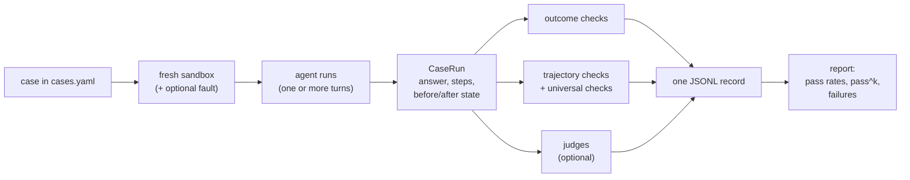

# Step 0 — Overview and Concepts

> [Back to index](README.md) · Next: [Setup and Agent Contract](02-setup-and-agent-contract.md)

## Goal

Build the mental model for the whole harness before writing any code: what the three kinds of check look at, what happens to one test case from start to finish, and the vocabulary used from here on.

## Why this matters

An agent run is not one thing you can mark right or wrong. It is a final answer, a set of side effects on the world, and a sequence of tool calls. Each of those can be fine while another is broken, and each needs a different kind of check:

- The agent can **say** "order placed" and have placed nothing. Only a check on the sandbox state catches it.
- The agent can reach the right state by **skipping the checks it was told to do first**. Only a check on the tool-call sequence catches it.
- The agent can do everything right and then **explain it dishonestly**. Only something that reads the wording catches it, and wording cannot be matched with `==`.

So the harness stacks three layers, cheapest first, and reports them as separate columns rather than one blended score (the notes explain why: averaging hides which dimension regressed). The rule that governs the whole design is from [the judge note](../../04-llm-as-a-judge.md): use code wherever code can decide, and spend a model call only on what is left.

The second idea is that the evals are **data-driven**. A test case is a few lines of YAML naming checks that already exist. Adding the fiftieth case should never need new Python. That is what makes the dataset easy to grow from real failures, which is where good eval sets come from.

The last idea is isolation. Every run gets a brand-new sandbox, so one case can never contaminate the next, and the sandbox can be snapshotted before and after to prove exactly what changed.

## 1. What you are evaluating

The Market Assistant is a paper-trading assistant for the Indian stock market. A client asks things like "What is my P&L on RELIANCE?" or "Buy 5 shares of INFY", and the agent picks tools (`get_quote`, `get_portfolio`, `calculator`, `place_order`, `search_knowledge`) in a loop until it answers. `place_order` changes cash and holdings, so mistakes there are real side effects, even in a sandbox. Full details are in [../README.md](../README.md); you do not need to read the agent code to follow this walkthrough.

## 2. The three kinds of check

| | Outcome (note 02) | Trajectory (note 03) | LLM judge (note 04) |
| --- | --- | --- | --- |
| **Looks at** | The final answer and the sandbox state | The ordered list of tool calls | The wording of the answer, given the evidence |
| **Question** | Did it reach the goal? | Did it get there the right way? | Is the text faithful, honest, appropriately careful? |
| **Decided by** | Code | Code | A second model with a written rubric |
| **Catches** | Wrong number, missing or extra order | Skipped lookup, duplicate order, wrong client, wasted calls | Invented facts, hidden failures, advice |
| **Blind to** | How it got there | Whether the answer was any good | Anything it was not shown as evidence |
| **Cost** | Free | Free | A model call each, and the judge itself can be wrong |

## 3. The life of one case



Everything to the right of "CaseRun" is a pure function of the recorded run. That is deliberate: it means every checker can be tested without ever calling a model (Step 11).

## 4. Vocabulary

| Term | Meaning |
| --- | --- |
| **Case** | One test: an input (or several turns), a logged-in client, and the checks it should pass. Lives in `cases.yaml`. |
| **Run / rep** | One execution of a case. The same case can be run `k` times to measure reliability. |
| **CaseRun** | The in-memory record of a run: answer, every tool call, and the sandbox before and after. |
| **Step** | One tool call the agent made: tool name, arguments, observation, error. |
| **Trajectory** | The ordered list of steps in a run. |
| **Outcome check** | A function on a `CaseRun` that looks at the answer and the state. |
| **Trajectory check** | A function on a `CaseRun` that looks at the steps. |
| **Universal check** | A trajectory check applied to every case, whatever its YAML says (`not_stopped`, `client_scope`). |
| **Gold value** | The expected value in a case. Computed from the sandbox, never typed from memory. |
| **Fault injection** | Replacing a tool with one that fails, to test how the agent reacts. |
| **Judge** | A model call with a rubric that returns a structured verdict. |
| **Calibration** | Measuring a judge against human labels before trusting it. |
| **pass@k / pass^k** | Succeeded at least once in `k` runs / succeeded in all `k` runs. |

## 5. What the finished tree looks like

```
market-assistant/
├── src/market_assistant/          # the agent (existing, untouched)
└── evals/
    ├── context.py                 Step 2
    ├── checkers/
    │   ├── outcome.py             Step 3
    │   ├── trajectory.py          Step 4
    │   └── __init__.py            Step 5
    ├── datasets/cases.yaml        Step 5
    ├── faults.py                  Step 6
    ├── runner.py                  Step 7, finished in Step 9
    ├── run_suite.py               Step 7, finished in Step 9
    ├── report.py                  Step 7
    ├── judges/
    │   ├── rubrics.py             Step 8
    │   ├── judge.py               Step 8
    │   ├── calibrate.py           Step 10
    │   └── calibration.yaml       Step 10
    └── tests/                     Step 11
```

Nothing in `evals/` is imported by the agent, and the agent contains no eval code. The only thing the evals touch in the agent's project is its `pyproject.toml`, to add a separate dependency group in Step 1.

Next: **[Setup and Agent Contract](02-setup-and-agent-contract.md)**.
