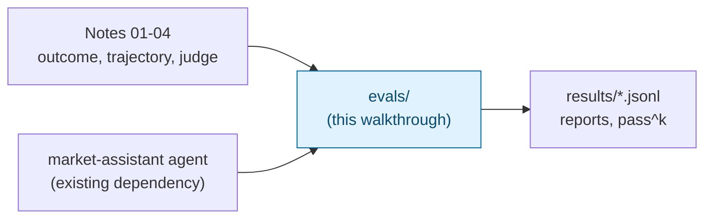

# Evaluating an Agent: Outcome, Trajectory and LLM-Judge Evals — Trainer Walkthrough

> A step-by-step build guide for [../evals](../evals/README.md), the eval harness for the Market Assistant agent. Follow it live in a workshop, or work through it solo. By the end you will have hand-built a harness that runs a golden dataset against an agent and scores every run three different ways, and you will have seen concretely what each way catches that the others miss.

This walkthrough is only about the evals. The agent itself (the `market_assistant` package: a ReAct loop on `llama3:8b` with five tools and RAG) is treated as an existing dependency. Its own README is [../README.md](../README.md).

## What you'll build

Starting from an empty `evals/` folder inside the finished agent project, you will incrementally build:

- `context.py`: the record of one case run that every checker reads.
- `checkers/outcome.py` and `checkers/trajectory.py`: pure-code checks on what the agent said and did, and on the path it took.
- `datasets/cases.yaml`: 44 declarative golden cases, with expected values verified against the sandbox.
- `faults.py`: fault injection that breaks a tool on purpose.
- `runner.py`, `run_suite.py`, `report.py`: run each case in a fresh sandbox, save every run as JSONL, and print pass rates, reliability, cost and every failure.
- `judges/`: five LLM judges (one criterion each) plus a calibration script that measures a judge against human labels.
- `tests/`: tests for the harness itself.

## Who this is for

- **Instructors** showing live how one agent run can pass an outcome check, fail a trajectory check and be judged dishonest, all at once.
- **Trainees** who have read the notes on outcome, trajectory and LLM-as-a-judge evals and want to build the thing rather than read it.

## Prerequisites

- Comfortable with basic Python: dataclasses, functions, dicts, list comprehensions.
- [`uv`](https://docs.astral.sh/uv/) installed, and [Ollama](https://ollama.com) running at `http://localhost:11434` with `llama3:8b` and `nomic-embed-text` pulled.
- The Market Assistant agent already built and working. Build it from [../README.md](../README.md); this walkthrough does not cover it. Step 1 lists the exact parts of the agent the evals depend on.
- The concepts, at the level of the notes: [outcome evals](../../02-task-success-outcome-evals.md), [trajectory evals](../../03-trajectory-and-tool-call-evals.md) and [LLM-as-a-judge](../../04-llm-as-a-judge.md). Step 0 recaps only what you need.
- About 4.5 to 5 hours end to end. It splits cleanly in two: Steps 0 to 7 (code-only checks and the first full suite run, about 3 hours) and Steps 8 to 13 (judges, calibration, tests and reliability).

## How this walkthrough is organized

Each step adds one capability and explains **why** it exists before showing **how** to build it. Every step ends with a **Checkpoint**: the complete file or files as they should look at that point. Steps 0 to 6 need no judge model at all; the first full suite run is in Step 7, and the LLM judges are added afterwards.

| Step | File | What you'll add | Est. time |
| --- | --- | --- | --- |
| 0 | [01-overview-and-concepts.md](01-overview-and-concepts.md) | Mental model: three kinds of check, the life of one case, vocabulary | 15 min |
| 1 | [02-setup-and-agent-contract.md](02-setup-and-agent-contract.md) | Separate eval dependency group, folder skeleton, what the evals need from the agent | 15 min |
| 2 | [03-capturing-a-run.md](03-capturing-a-run.md) | `context.py`: `CheckResult`, `CaseRun`, and the sandbox before/after snapshot | 20 min |
| 3 | [04-outcome-checks.md](04-outcome-checks.md) | `checkers/outcome.py`: numbers, facts, orders, cash, holdings, state diff | 25 min |
| 4 | [05-trajectory-checks.md](05-trajectory-checks.md) | `checkers/trajectory.py`: tool constraints, ordering, universal checks, metrics | 30 min |
| 5 | [06-declarative-cases.md](06-declarative-cases.md) | `checkers/__init__.py` dispatcher and the 44-case `cases.yaml` | 30 min |
| 6 | [07-fault-injection.md](07-fault-injection.md) | `faults.py`: break a tool on purpose and watch the agent react | 15 min |
| 7 | [08-runner-suite-and-report.md](08-runner-suite-and-report.md) | `runner.py`, `run_suite.py`, `report.py`: the first full run | 35 min |
| 8 | [09-llm-judges.md](09-llm-judges.md) | `judges/rubrics.py`, `judges/judge.py`: five single-criterion judges | 30 min |
| 9 | [10-wiring-judges-into-the-suite.md](10-wiring-judges-into-the-suite.md) | Judges added to `runner.py` and `run_suite.py` | 15 min |
| 10 | [11-calibrating-the-judges.md](11-calibrating-the-judges.md) | `judges/calibrate.py` and `calibration.yaml`: judge vs human labels | 20 min |
| 11 | [12-testing-the-harness.md](12-testing-the-harness.md) | `tests/`: tests for the checkers and the dataset | 20 min |
| 12 | [13-reliability-and-reading-results.md](13-reliability-and-reading-results.md) | pass^k runs, reading the JSONL, turning failures into new cases | 15 min |
| 13 | [14-recap-and-exercises.md](14-recap-and-exercises.md) | Quick-reference card, gotchas, exercises | 15 min |

## Relationship to the reference implementation

The finished code you arrive at matches every Python and YAML file in [../evals/](../evals/) exactly: `context.py`, `faults.py`, `runner.py`, `run_suite.py`, `report.py`, the two checker modules and the checker `__init__.py`, `datasets/cases.yaml`, the judges package and `calibration.yaml`, and the two test files. The empty `__init__.py` files are created with `touch`. [../evals/README.md](../evals/README.md) and [../evals/PLAN.md](../evals/PLAN.md) are documentation, not code, and are not rebuilt here.

Two files, `runner.py` and `run_suite.py`, are written twice: a first version in Step 7 that runs without any judges, and the final version in Step 9 once the judges exist. This lets you run the whole suite before you have built a single LLM call.

## Suggested demo flow (for instructors)

- Run case E1 ("Buy 5 shares of INFY") and put its three verdicts side by side: the state diff (outcome), the `before get_portfolio` rule (trajectory) and the honest-reporting judge. Then run I5 with the timeout fault. The contrast between a clean success and a safely failed order is the core lesson of the whole walkthrough.
- In Step 3, deliberately change an expected cash value in a scratch run so the failure message appears. Trainees remember a check they watched fail far better than one they watched pass.
- In Step 5, spend time on the gold numbers. The test in Step 11 recomputes them from the sandbox; showing that the numbers were never typed from memory is what makes the dataset trustworthy.
- In Step 7, open the saved JSONL before showing the report. The report is a summary; the JSONL line for a failed run (every tool call, every check detail) is what you actually debug from.
- In Step 10, make the abstention judge fail on the planted IPO example and let trainees see a judge be wrong. It is the most direct demonstration of why a judge must be calibrated before it is trusted.

## Where this fits

The notes explain the techniques, the agent is the thing under test, and this walkthrough is the harness that connects them.

Start here: **[01-overview-and-concepts.md](01-overview-and-concepts.md)**.
