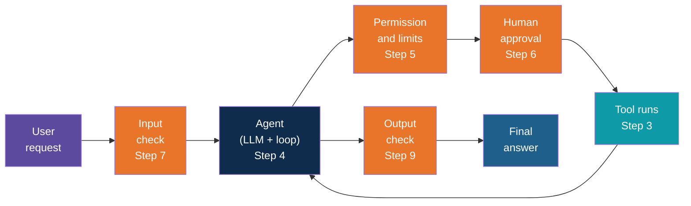
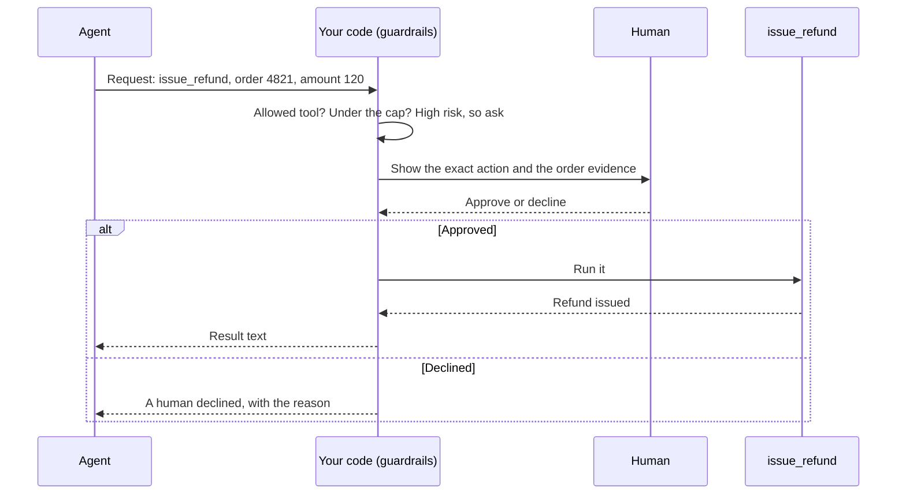

# Step 1 — Concepts Overview

> Back to index · Next: Project Setup

## Goal

Learn the words you need before writing any code, and see where each guardrail sits around
the tool-calling loop you already know.

## Why this matters

A chatbot that gives a wrong answer wastes a minute. An agent that takes a wrong **action**
can send the email, change the record or pay the refund, and it can do it quickly, many times
over, with nobody watching.

Think of a new employee on their first day. Smart and willing, but you would not hand them
the company credit card, the master keys and permission to email every customer. You give
them a limited role, check their early work and ask for sign-off on anything big. The agent
you build in this walkthrough is that new employee, and guardrails are how you set the role.

The most important idea: **a prompt is a request, code is enforcement**. You can tell a
model "never refund more than 500", and it will usually listen. But "usually" is not good
enough when money moves. So the rules that matter are written in Python, around the model,
where the model cannot argue with them.

## The Vocabulary

| Word | Meaning | Where you will see it |
|---|---|---|
| Guardrail | Any check or limit that stops the agent from doing something unsafe | `guardrails.py` |
| Soft guardrail | An instruction in the prompt. Often works, can be argued around | `SYSTEM_PROMPT` (Step 8) |
| Hard guardrail | A rule enforced in code. Cannot be talked out of | Everything else in `guardrails.py` |
| Risk level | How much damage a tool can do: low, medium or high | The `RISK` table (Step 5) |
| Limit | A cap on amount, count or steps | `MAX_REFUND`, `MAX_TICKETS_PER_RUN`, `MAX_ROUNDS` |
| Scope | Which data a tool can reach | `_find_order` (Step 3) |
| Approval | A person decides before a high-risk action runs | `ask_human` (Step 6) |
| Prompt injection | Planted text that tries to give the agent orders | Order 4823's delivery note |
| Trace | The tagged log of everything the agent did and every check it passed or failed | `RunState.log` (Step 5) |

## The Layers

No single check catches everything, so real systems stack several. The orange boxes below
are the guardrails you will add, one per step. They all sit in your code, between the
model's request and the real action.

The step cap (Step 10) and the injection warning (Step 8) are not boxes in this picture
because they act on the loop itself and on the tool results.

## The Three Tools

| Tool | What it does | Risk | Default control |
|---|---|---|---|
| `get_order_status` | Looks up an order | Low, read only | Allow and log |
| `create_support_ticket` | Asks a person to follow up | Medium, easy to undo | Allow within a count limit |
| `issue_refund` | Pays money back | High, hard to undo | Human approval, and a cap on the amount |

## What a Guarded Refund Looks Like

Whatever the human decides, the agent receives a readable sentence back and carries on. A
refusal is a result, not a crash.

## Check Yourself

Before moving on, you should be able to say which of the three tools has no guardrail except
logging, and why a prompt alone is not enough to protect the refund tool. The answers are
`get_order_status` (read only), and that a model can be fooled or simply mistaken, so the
rule has to live in code. Ask yourself again after Step 8.

Next: **Step 2 — Project Setup**.
