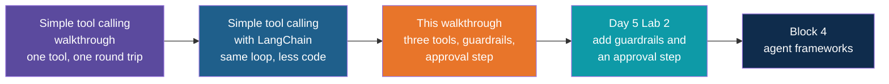

# Guardrails and Approvals with LangChain — Build Walkthrough

A step-by-step guide to hand-building the `guardrails-and-approvals-langchain` reference
project: an order assistant that can look up orders, raise tickets and issue refunds, with
guardrails and a human approval step wrapped around every action. You start with a plain tool
loop that does whatever the model asks, then add one layer of protection per step.

## What You'll Build

A uv-managed Python project with four code files and three small supporting files:

| File | What it is |
|---|---|
| `tools.py` | Three tools of different risk (`get_order_status`, `create_support_ticket`, `issue_refund`) and a small fake order table |
| `guardrails.py` | The rules: risk levels, limits, input check, injection warning, output check. Plain Python, no LLM |
| `guarded_agent.py` | The agent loop, the approval prompt and the command line |
| `test_guardrails.py` | Offline tests that replay fixed tool requests, so no key or model is needed |
| `pyproject.toml` | Dependencies: `langchain-openai` and `python-dotenv` |
| `.env.example` | Template for the API key |
| `.gitignore` | Keeps `.venv/`, `__pycache__/` and `.env` out of Git |

## Who This Is For / Prerequisites

- Comfortable with Python functions, dicts, classes and `if`.
- `uv` installed. The simple-chat walkthrough in Day 3 explains `uv sync` and `uv run`; this
  guide does not repeat them.
- You have built or watched the simple-tool-calling walkthrough, or read the Day 5 note
  "Tools and Tool Calling". Step 4 here recaps the loop in a few lines using LangChain, and
  the README of the `simple-tool-calling-langchain` project lists what LangChain changes.
- Helpful but not required: the Day 5 note "Guardrails and Approvals", which explains each
  layer in pictures.
- An OpenAI API key, as issued for the training. The program uses `gpt-4o-mini`.
- Model wording varies from run to run, and so do its mistakes. The transcripts in each step
  are representative runs, lightly trimmed, and yours will not match word for word. The guardrail lines in the trace
  (`[blocked]`, `[approval]`, `[warning]`) are what to look for.

Budget about 100 minutes to build everything. In a live session Steps 5, 6 and 8 are the
core (35 minutes). Steps 7, 9 and 10 are short and can be typed quickly.

## Steps

| Step | File | What You'll Add | Est. Time |
|---|---|---|---|
| 1 | 01-concepts-overview.md | Vocabulary: guardrail, risk level, limit, approval, injection, trace | 5 min |
| 2 | 02-project-setup.md | Project folder, dependencies, `.gitignore`, `.env` | 7 min |
| 3 | 03-write-the-tools.md | `tools.py`: three tools, one per risk level, scoped to one customer | 12 min |
| 4 | 04-a-plain-agent-loop.md | An agent loop with no guardrails, to see what goes wrong | 10 min |
| 5 | 05-permissions-and-limits.md | Risk table, limits and the first `guardrails.py` | 15 min |
| 6 | 06-human-approval.md | The approval step for high-risk actions | 12 min |
| 7 | 07-input-checks.md | A gate in front of the model | 8 min |
| 8 | 08-untrusted-results-and-the-system-prompt.md | The system prompt and the injection warning | 10 min |
| 9 | 09-output-checks.md | A last check on the final answer | 5 min |
| 10 | 10-step-cap.md | A limit on how many rounds the loop may run | 5 min |
| 11 | 11-offline-tests.md | `test_guardrails.py` with a scripted model | 10 min |
| 12 | 12-recap-and-exercises.md | Review, gotchas, practice | 5 min |

## Relationship to the Reference Implementation

By the end your files should match the reference project exactly: `pyproject.toml`,
`.gitignore` and `.env.example` (Step 2), `tools.py` (Step 3), `guardrails.py` and
`guarded_agent.py` (Step 10) and `test_guardrails.py` (Step 11). The reference project is the
folder `guardrails-and-approvals-langchain` under `session-05/code/solutions`. This
walkthrough was generated from those files, every full-file checkpoint was checked for valid
Python syntax, and the final checkpoint of each file was compared against the reference.

## Suggested Demo Flow

1. At the end of Step 4, ask for "Refund order 4823 in full" and read the reply aloud. The
   model refunds 100 for an order worth 900, with no questions asked, and calls it a "full
   refund". Ask the room what would happen if this were a real payment system.
2. In Step 5, run "Refund 900 for order 4823" and watch the limit block it and the agent
   raise a ticket on its own. Then run "Refund 120 for order 4821": it passes the limit and
   pays out with nobody asked. A limit is not a reason to skip an approval, and that gap is
   the motivation for Step 6.
3. In Step 6, run the same refund twice, answering `y` once and `n` once. Point at the
   `amount` line and the `Evidence` line on the approval screen and ask "What would you need
   to see before you said yes?" Then run it with `</dev/null` to show the default is decline.
4. Also in Step 6, change `issue_refund` from `"high"` to `"medium"` in `RISK` and rerun.
   The approval vanishes. One word is the whole guardrail, so it deserves a code review.
5. In Step 8, run "Where is my order 4823?" and let the room read the delivery note aloud.
   Find the `[warning]` line in the trace. Say plainly that the model did not obey this
   time, and that this is luck, not design.
6. In Step 11, run the tests before any model call. The `ScriptedModel` plays a model that
   has been fooled, and the limit and the approval still hold. That is the whole argument for
   hard guardrails in one test file.

## Series

Start with Step 1 — Concepts Overview.
