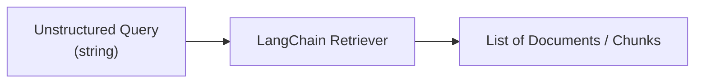
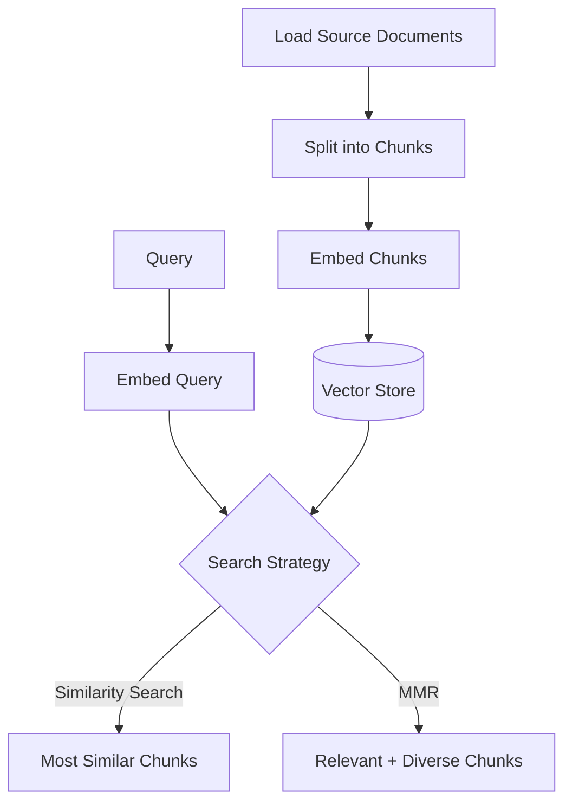
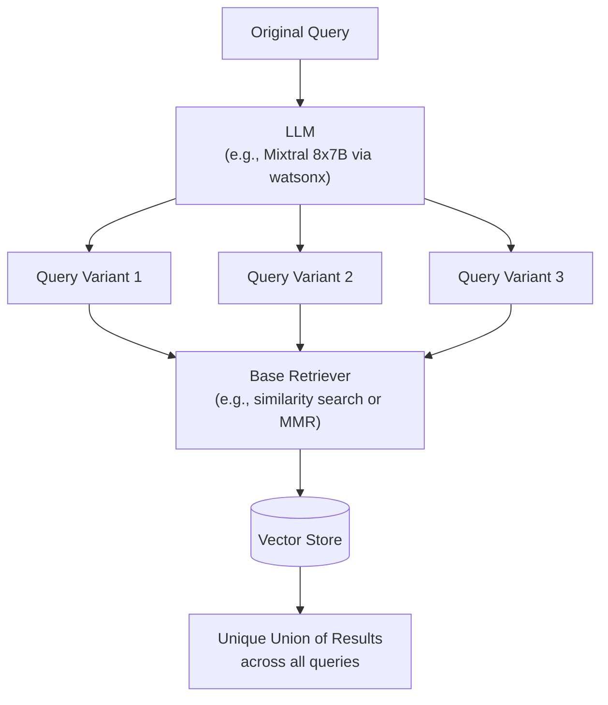
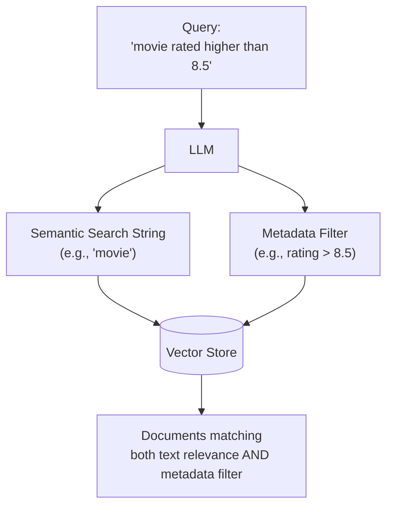
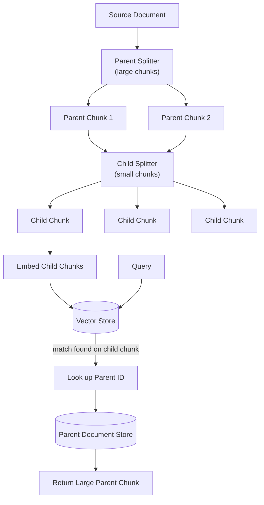
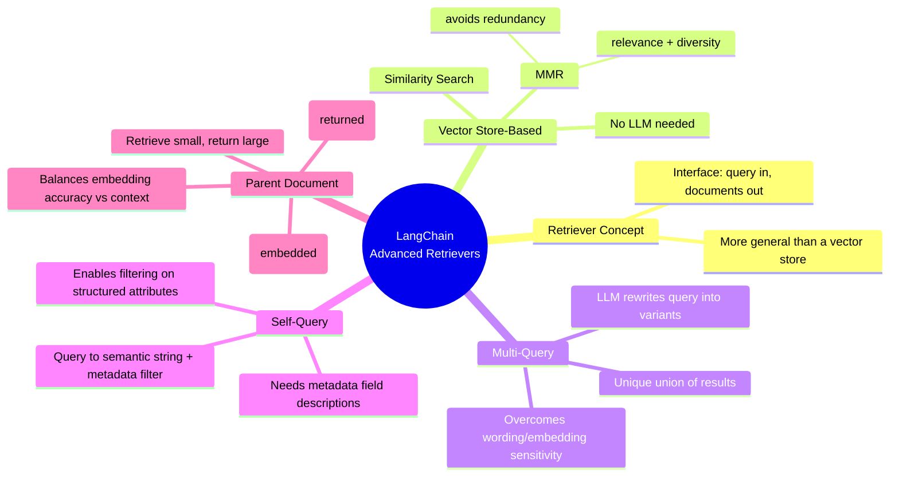

# Advanced Retrievers in LangChain

## Learning Objectives
- Explain what a LangChain retriever is and how it differs from a vector store
- Describe the vector store-based retriever and its two search modes (similarity search, MMR)
- Describe the multi-query, self-query, and parent document retrievers
- Identify the differences between these retriever types and when to use each

---

## 1. What Is a LangChain Retriever?

A **retriever** is an interface that returns documents (or chunks) based on an **unstructured query**.

- **Input**: a string query
- **Output**: a list of documents/chunks
- More **general** than a vector store — a retriever doesn't need to store documents itself; its only job is to retrieve them.
- Retrieval looks simple on the surface but can be implemented in several different ways, each suited to different problems.

---

## 2. Vector Store-Based Retriever

The simplest retriever type. It plugs into an **existing vector store** (built by loading source documents → splitting into chunks → embedding them) and retrieves the most similar chunks to a query.

- Created directly from a vector store object via its `.as_retriever()` method.
- **No LLM required** — it purely compares embeddings.

### 2.1 Similarity Search
- Embeds the query and returns the chunks whose embeddings are **most similar** to it.

### 2.2 Maximum Marginal Relevance (MMR)
- Balances **relevance** to the query with **diversity** among the results.
- Selects chunks that are relevant to the query but **minimally similar to chunks already selected**.
- Avoids redundant/near-duplicate results and gives broader coverage of different aspects of the query.

| Mode | Optimizes For | Risk if Not Used |
|---|---|---|
| Similarity Search | Closest match to query | May return redundant/near-duplicate chunks |
| MMR | Relevance **and** diversity | N/A — mitigates redundancy by design |

---

## 3. Multi-Query Retriever

Builds on the vector store-based retriever by using an **LLM to rewrite the query into multiple versions**, then retrieving for each version.

**Why**: a single query wording may not match how information is embedded — subtle phrasing differences or embeddings that don't fully capture semantics can cause relevant chunks to be missed. Multiple query variants increase the chance of recovering all relevant chunks.

- Constructed via `MultiQueryRetriever.from_llm(retriever=..., llm=...)`.
  - `retriever`: the underlying vector store-based retriever used per query variant (similarity search, MMR, etc.).
  - `llm`: used only to generate the alternate query phrasings.
- For each generated query, the base retriever fetches relevant chunks; the retriever then takes the **unique union** across all result sets — a larger, richer candidate pool than a single query would produce.

---

## 4. Self-Query Retriever

Designed for documents that carry **metadata** alongside text (e.g., movie documents with `year`, `director`, `rating`). Plain similarity/MMR/multi-query retrievers only look at document text — they cannot filter on metadata.

The self-query retriever splits a natural-language query into **two components**:
1. A string to look up **semantically** (against the document text).
2. A **metadata filter** to apply alongside it.

### Setup requirements
1. A **vector store** built from the documents (text + metadata).
2. **Metadata field descriptions** — for each field (e.g., `year: integer, the year the movie was released`), a description that tells the LLM what the field means, so it can build meaningful filters.
3. Construct via `SelfQueryRetriever.from_llm(llm, vectorstore, document_content_description, metadata_field_info)`.

**Example**: query *"I want to watch a movie rated higher than 8.5"* → the LLM extracts a semantic string plus the filter `rating > 8.5`, correctly returning only movies meeting that numeric threshold.

---

## 5. Parent Document Retriever

Addresses a tradeoff in chunking:
- **Small chunks** → more accurate embeddings (focused meaning), but risk losing surrounding context.
- **Large chunks** → retain context, but embeddings become less precise / harder to match.

**Approach**: split documents twice — retrieve using small chunks, but return their large parent chunks.

### Components
| Component | Role |
|---|---|
| Parent splitter | Splits text into **large chunks** — the unit actually returned |
| Child splitter | Splits text into **small chunks** — the unit that gets embedded for search |
| Vector store | Stores embeddings of the **child** chunks |
| Document store | Stores the **parent** chunks, keyed by ID |
| `ParentDocumentRetriever` | Ties it together; documents are added via `.add_documents()` |

### Retrieval flow
1. Query is matched against **small child chunk** embeddings in the vector store (accurate matching).
2. The retriever looks up the **parent ID** of the matched child chunk.
3. It returns the corresponding **larger parent chunk** from the document store (full context).

**Example**: for the query *"smoking policy"*, the retriever returns the full parent chunk containing the smoking policy section — not just the small fragment that matched — giving complete, usable context.

- Invoked with the same unified retriever syntax (`.invoke(query)` / `.get_relevant_documents(query)`) as every other retriever type.

---

## 6. Comparison of Retriever Types

| Retriever | Uses an LLM? | Handles Metadata? | Key Idea |
|---|---|---|---|
| Vector store-based | No | No | Similarity search or MMR directly over embedded chunks |
| Multi-query | Yes (to rewrite query) | No | Generates query variants → unique union of results |
| Self-query | Yes (to parse query) | Yes | Splits query into semantic string + metadata filter |
| Parent document | No | No | Retrieves on small child chunks, returns large parent chunks |

---

## 7. Summary Cheat Sheet

### Key Takeaways
1. A **retriever** is a general interface — query string in, documents/chunks out — distinct from a vector store's storage role.
2. The **vector store-based retriever** is the simplest form: similarity search or MMR directly over embeddings, no LLM involved.
3. **MMR** trades a little relevance for diversity, reducing redundant results.
4. The **multi-query retriever** uses an LLM to generate multiple phrasings of a query, then unions the retrieved results — helpful when wording or embedding quality would otherwise miss relevant chunks.
5. The **self-query retriever** is the only one that leverages document **metadata**, splitting a query into a semantic string plus a structured filter (e.g., rating > 8.5).
6. The **parent document retriever** resolves the small-vs-large chunk tradeoff by embedding small child chunks for precise matching while returning their large parent chunks for full context.
7. Choice of retriever depends on the problem: plain semantic search, query-robustness, metadata-aware filtering, or context preservation in long documents.
