# Advanced Retrievers in LlamaIndex

## Learning Objectives
- Identify the different index types in LlamaIndex and know when to use each
- Explore core and advanced retrievers that power flexible search strategies
- Understand fusion techniques that combine results from multiple queries
- Match retrievers to the most suitable use cases

---

## 1. Core Index Types

LlamaIndex offers three core index types, each optimized for a different retrieval strategy.

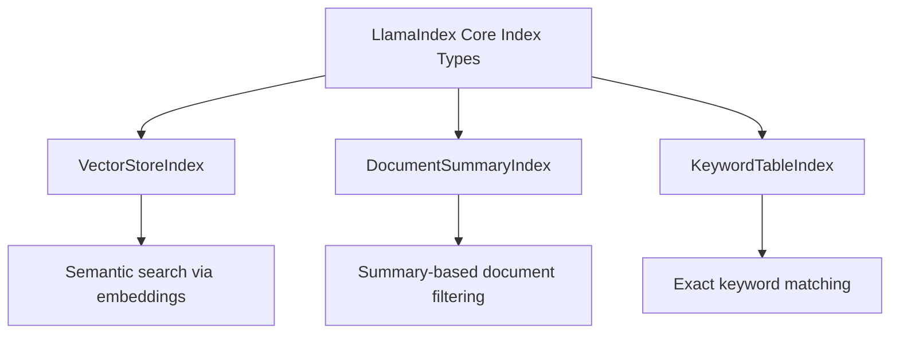

### 1.1 VectorStoreIndex
- Stores **vector embeddings** for each document chunk.
- Best suited for **semantic retrieval** (meaning-based, not exact word match).
- Commonly used in LLM-powered pipelines (RAG).

### 1.2 DocumentSummaryIndex
- Generates and stores **summaries of documents** at indexing time.
- Summaries are used to **filter documents** before retrieving full content.
- Especially useful for **large and diverse document sets** that can't fit into an LLM's context window.

### 1.3 KeywordTableIndex
- Extracts **keywords** from documents.
- Maps keywords to specific content chunks.
- Ideal for **exact keyword matching** and **hybrid/rule-based search** scenarios.

---

## 2. Core Retrievers

### 2.1 Vector Index Retriever
- Uses vector embeddings to find **semantically relevant** content.
- Ideal for **general-purpose search** and RAG pipelines.

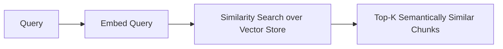

### 2.2 TF-IDF (Foundational Concept)
Before BM25, it helps to understand TF-IDF — the foundation of keyword-based search.

| Component | Meaning |
|---|---|
| **TF** (Term Frequency) | How often a word appears in a document |
| **IDF** (Inverse Document Frequency) | How rare that word is across all documents |
| **TF-IDF Score** | TF × IDF — highlights words frequent in one document but rare across the collection |

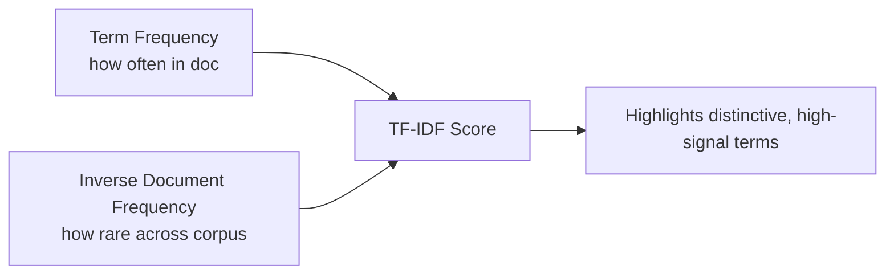

### 2.3 BM25 Retriever
- A **keyword-based** ranking method, built on TF-IDF foundations.
- Retrieves based on **exact keyword match**, not semantic similarity.
- Improvements over TF-IDF:
  - **Term frequency saturation** — reduces the impact of repeated terms.
  - **Document length normalization** — adjusts scoring for longer/shorter documents.

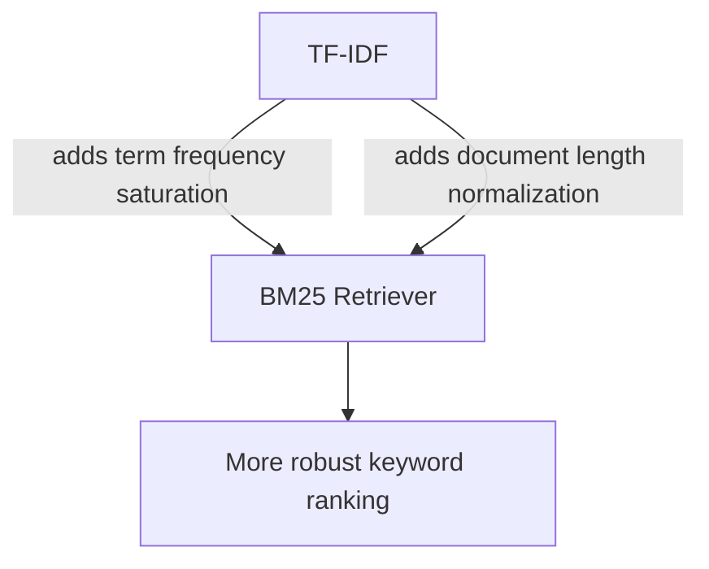

---

## 3. Advanced Retrievers

### 3.1 Document Summary Index Retriever
- Uses **document summaries** (not full documents) to find relevant content.
- Two variants:

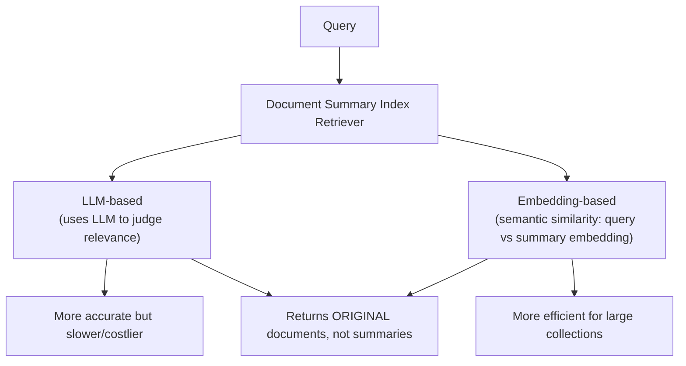

> Regardless of variant used, this retriever always **returns the original documents**, not their summaries — summaries are only used to select which docs to retrieve.

### 3.2 Auto Merging Retriever
- Preserves context in **long documents** using a **hierarchical structure**.
- Uses hierarchical chunking to create **parent** and **child** nodes.
- If enough child nodes from the same parent are retrieved, the retriever **merges up** and returns the parent node instead — consolidating related content and preserving broader context.

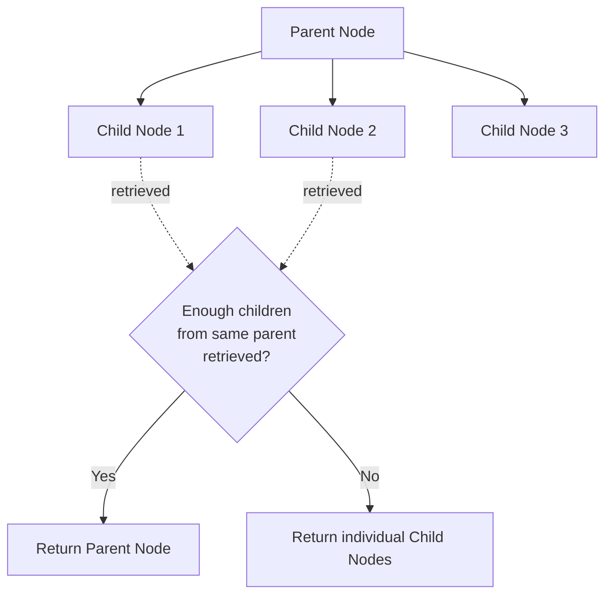

### 3.3 Recursive Retriever
- Follows **relationships between nodes** using references.
- Can follow references such as **citations** (academic papers) or **metadata links**.
- Supports both:
  - **Chunk references** (node-to-node within/across documents)
  - **Metadata references**
- Enables retrieval of related content across documents or layers of abstraction.

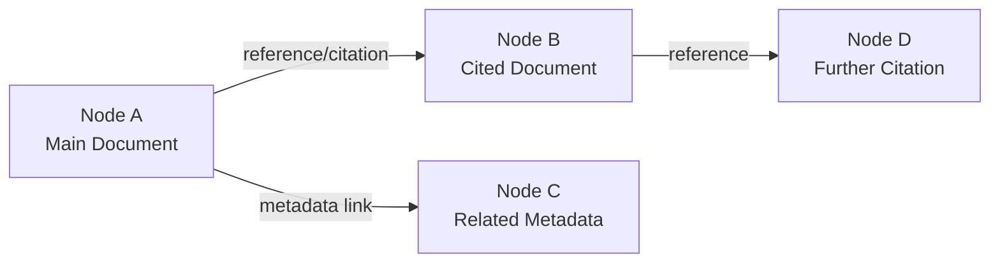

### 3.4 Query Fusion Retriever
- Combines results from **different retrievers** (e.g., vector-based + keyword-based).
- Optionally generates **multiple query variations** via an LLM to improve coverage.
- Merges results using a **fusion strategy** to improve recall.

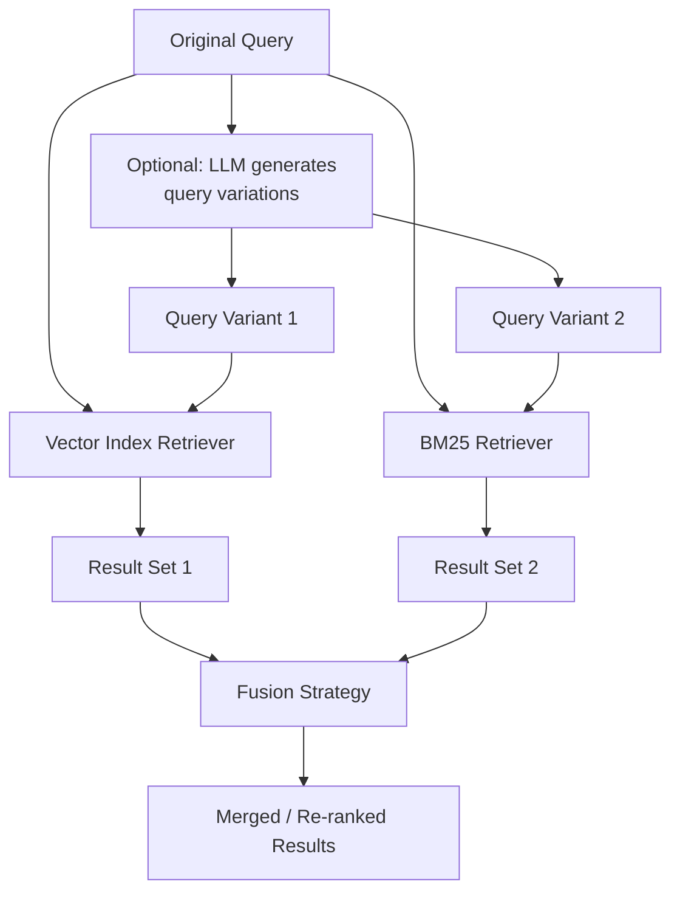

---

## 4. Fusion Strategies

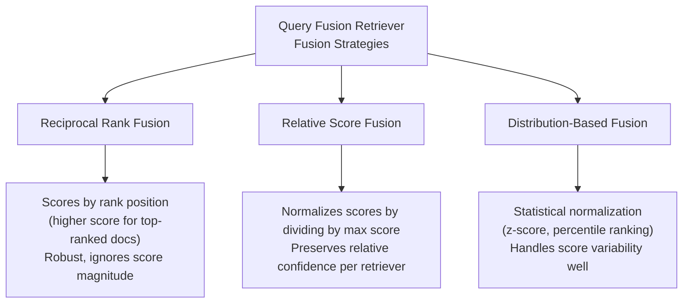

| Strategy | How it works | Best for |
|---|---|---|
| **Reciprocal Rank Fusion (RRF)** | Assigns higher scores to documents ranked near the top of any list | Robust fusion without relying on score magnitudes |
| **Relative Score Fusion** | Normalizes scores within each result set by dividing by the max score | Preserving each retriever's relative confidence |
| **Distribution-Based Fusion** | Uses z-score normalization / percentile ranking | Handling score variability across retrievers |

---

## 5. Use Case Recommendations

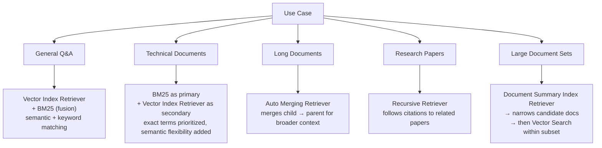

| Use Case | Recommended Retriever(s) | Why |
|---|---|---|
| General Q&A | Vector Index Retriever + BM25 | Combines semantic relevance with keyword matching |
| Technical documents (exact terms matter) | BM25 (primary) + Vector Index Retriever (secondary) | Prioritizes exact terms, adds contextual flexibility |
| Long documents | Auto Merging Retriever | Returns parent context only when enough child evidence is found |
| Research papers | Recursive Retriever | Follows citations to retrieve relevant cited content |
| Large document sets | Document Summary Index Retriever → Vector Search | Narrows candidates via summaries, then does precise search within the subset |

---

## 6. Summary Cheat Sheet

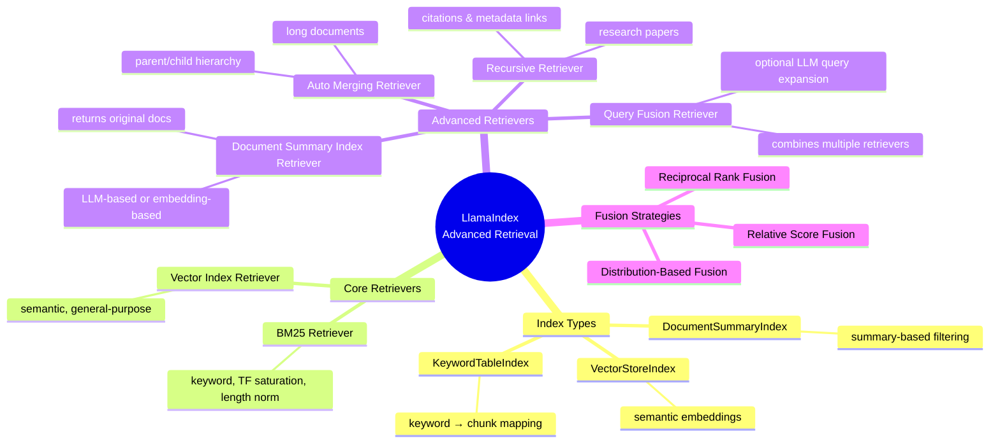

### Key Takeaways
1. **Three core indexes**: VectorStoreIndex (semantic), DocumentSummaryIndex (summary filtering), KeywordTableIndex (keyword mapping).
2. **Vector Index Retriever** = general-purpose semantic search, backbone of RAG.
3. **BM25** improves on TF-IDF via term frequency saturation + document length normalization.
4. **Document Summary Index Retriever** filters using summaries but always returns full original documents.
5. **Auto Merging Retriever** preserves context in long docs by merging child nodes into parent nodes.
6. **Recursive Retriever** follows citation/metadata references across documents.
7. **Query Fusion Retriever** combines multiple retrievers (and optionally LLM-generated query variants), merged via RRF, Relative Score, or Distribution-Based fusion.
8. Retriever choice should be driven by **document structure and query type** — general Q&A, technical precision, long-form context, citation-heavy research, or massive corpora each favor a different retriever (or combination).
