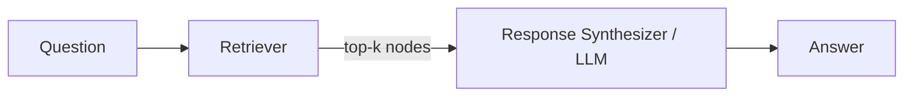
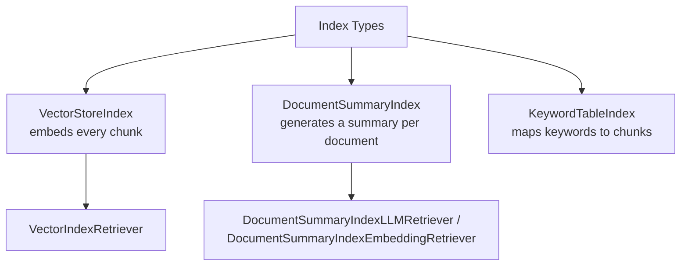

# Step 0 — Overview and Concepts

> [Back to index](README.md) · Next: [Environment Setup](02-environment-setup.md)

## Goal

Build a mental model of what a "retriever" actually is in LlamaIndex, why there isn't just one, and how the six scripts in this walkthrough relate to each other — before writing a single line.

## Why this matters

Every earlier example in this repo (`simple-rag-example` and friends) calls `index.as_query_engine()` and treats retrieval as an invisible step inside it. A query engine is really two things glued together:

This walkthrough only ever builds the **left half** — the retriever — and calls `.retrieve()` directly instead of `.query()`. That means every script prints raw nodes and scores, never a synthesized answer. This is deliberate: it's much easier to reason about *why* a retriever returned what it did when there's no LLM call downstream smoothing over the result.

## Index types vs. retrievers

LlamaIndex separates **how content is indexed** from **how it's searched**:

This walkthrough builds retrievers for the first two index types directly. It doesn't build a `KeywordTableIndex` script — instead, Step 3 uses `BM25Retriever`, a standalone keyword retriever that works directly off a list of nodes with no index object at all. Both are keyword-based; `BM25Retriever` is simply the more commonly used one in practice, and not needing an index to sit in front of it is itself a useful thing to see.

The remaining three retrievers you'll build — auto-merging, recursive, and fusion — aren't tied to a single index type. They're compositional: auto-merging works on top of a specially-chunked `VectorStoreIndex`, recursive retrieval wires several small retrievers together, and fusion combines two independent retrievers' results.

## Why six separate scripts instead of one growing file

Every retriever here solves a different retrieval problem — semantic vs. exact-keyword, single-document vs across-many-documents, flat chunks vs. hierarchical, isolated vs. cross-referenced. Bolting all six into one evolving `main.py` would obscure that each one is a complete, independent answer to a specific question, not an incremental feature on top of the last. So each retriever step builds its **own file, from scratch**, and — apart from two shared data files created once in Step 1 — none of the six scripts imports or depends on another.

They do get more conceptually involved as you go, which is why the build order in this walkthrough is:

1. **Vector** — the baseline everything else is contrasted against.
2. **BM25** — same shape, opposite retrieval signal (keyword instead of semantic).
3. **Document Summary Index** — retrieval at the document level instead of the chunk level.
4. **Auto-Merging** — chunks arranged in a hierarchy instead of flat.
5. **Recursive** — retrievers that call into *other* retrievers.
6. **Query Fusion** — combines steps 2 and 3's retrievers into one.

## Vocabulary you'll need

| Term | Meaning in this project |
| --- | --- |
| `Document` | One loaded source file, as a LlamaIndex object (text + metadata) |
| `Node` | A chunk of a `Document` — the unit that actually gets embedded or keyword-indexed |
| `Retriever` | An object with a `.retrieve(query) -> list[NodeWithScore]` method — no LLM call required |
| `similarity_top_k` | How many results a retriever should return |
| `Settings` | LlamaIndex's global config object — `Settings.llm` and `Settings.embed_model` are read implicitly by anything that needs them |
| `IndexNode` | A node that also carries an `index_id`, used by the Recursive Retriever to know which retriever to hand off to |
| Fusion strategy | The rule `QueryFusionRetriever` uses to merge two retrievers' ranked lists into one |

## What "done" looks like

By the end of this walkthrough, you'll have six scripts under `advanced-retrievers-examples/`, each runnable independently with `uv run 0N_script_name.py`, each printing the raw nodes its retriever chose for a hardcoded question — with enough `print()` output to see exactly *why* that retriever is a good or bad fit for that kind of query.

Next: **[Environment Setup](02-environment-setup.md)** — scaffold the project and get the shared sample data in place.
