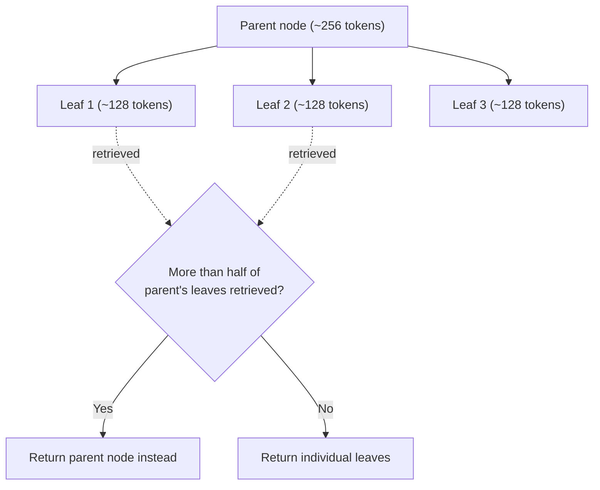

# Step 5 — Auto Merging Retriever

> [Back to index](README.md) · Previous: [Document Summary Index Retriever](05-document-summary-index-retriever.md) · Next: [Recursive Retriever](07-recursive-retriever.md)

## Goal

Build `04_auto_merging_retriever.py`: chunk a long document into a parent/child hierarchy, and watch small matching fragments get merged back into their larger parent when enough of them agree.

## Why this matters

Every retriever so far has used one fixed chunk size, which forces a tradeoff: small chunks retrieve precisely but lose surrounding context; large chunks preserve context but retrieve imprecisely, since a big chunk's embedding blurs together everything in it. `AutoMergingRetriever` sidesteps the tradeoff by chunking hierarchically — small leaf chunks for precise matching, larger parent chunks to fall back to for context — and merges automatically:



The merge rule is a simple ratio: if more than half of a parent's children show up among the retrieved leaves, `AutoMergingRetriever` deletes those children from the result and substitutes their parent instead. That ratio is why the chunk sizes you pick matter a lot — if a parent has, say, 20 children, no realistic `similarity_top_k` will ever retrieve 11 of them, and merging will silently never trigger. This walkthrough uses `chunk_sizes=[1024, 256, 128]` specifically because it gives each 256-token parent about 3 leaf children — so retrieving just 2 of them (a normal, likely outcome) already crosses the 50% threshold.

The other detail worth internalizing: the retriever's docstore has to contain **every** level of node — leaves, mid-level parents, and the top-level root — even though only the leaves get embedded and searched. Merging works by looking up a leaf's parent *by ID* in the docstore; if the docstore is missing that ID, there's nothing to merge into.

## 1. Create the long document

This step needs a document with real internal structure — multiple distinct sections — so a 3-level hierarchy actually means something. A single short paragraph like `company_policy.txt` can't demonstrate this; there just isn't enough text to split into a meaningful tree.

`data/long_handbook.txt`:

```text
Employee Handbook

Company Overview

Our company builds developer tools that help engineering teams ship
software faster and more reliably. Founded eight years ago, we now have
offices in three countries and a fully distributed engineering
organization. Our mission is to remove friction from the software
development lifecycle, from the first commit to production deployment.
We value transparency, ownership, and pragmatic decision-making over
process for its own sake. Every employee is expected to understand how
their work connects to the company's broader goals, and managers are
responsible for making sure that connection is clear.

Code of Conduct

All employees are expected to treat colleagues, customers, and partners
with respect. Harassment, discrimination, and retaliation of any kind
are strictly prohibited and will result in disciplinary action, up to
and including termination. Employees who witness or experience a
violation of this policy should report it to HR or use the anonymous
ethics hotline. Conflicts of interest, such as outside employment with a
competitor or financial relationships with vendors, must be disclosed to
your manager and the legal team. We take confidentiality seriously:
employees may not share proprietary source code, customer data, or
internal financial information outside the company without written
authorization.

Compensation and Benefits

Salaries are reviewed annually each March, with adjustments based on
performance, market benchmarks, and scope of role. All full-time
employees are eligible for the company's health insurance plan, which
covers medical, dental, and vision, starting on day one of employment.
The company matches 401(k) contributions up to 4% of base salary.
Employees accrue 18 days of paid vacation per year, in addition to 10
paid holidays and unlimited paid sick leave. Parental leave is offered
at 16 weeks fully paid for the primary caregiver and 8 weeks for the
secondary caregiver. Employees can also request a one-time $1,000
learning and development stipend each year for courses, books, or
conferences related to their role.

IT and Security Policy

All company laptops must have full-disk encryption and endpoint
monitoring software installed before they can access internal systems.
Employees must use multi-factor authentication for all company accounts,
including email, source control, and cloud infrastructure. Passwords
must be at least 14 characters and stored in the company-approved
password manager; password reuse across personal and work accounts is
prohibited. Any lost or stolen device must be reported to IT security
within one hour so that remote wipe procedures can be triggered. Access
to production systems is granted on a least-privilege basis and is
reviewed quarterly by the security team. Employees are required to
complete an annual security awareness training covering phishing,
social engineering, and safe handling of customer data.

Health and Safety

Employees working from a company office should familiarize themselves
with the building's emergency evacuation routes, posted near every
stairwell. In the event of a fire alarm, employees must evacuate
immediately and gather at the designated assembly point in the parking
lot. Any workplace injury, no matter how minor, must be reported to a
manager and to HR within 24 hours so that an incident report can be
filed. The company provides ergonomic assessments for home and office
workstations upon request, including adjustable chairs, monitor arms,
and external keyboards. Employees experiencing symptoms of illness are
encouraged to work from home and are not required to come into the
office while contagious.

Performance Reviews

Performance reviews happen twice a year, in June and December. Each
review cycle includes a self-assessment, peer feedback from at least
three colleagues, and a manager evaluation. Ratings are calibrated
across teams to ensure consistency before being shared with employees.
Employees who receive a "needs improvement" rating will be placed on a
structured improvement plan with clear, measurable goals and a defined
timeline, typically 60 to 90 days. Promotions are considered during the
December cycle and require manager nomination along with supporting
evidence of sustained impact at the next level. Compensation changes
resulting from performance reviews are typically reflected in the
following month's paycheck.

Offboarding

Employees who resign are asked to provide at least two weeks of notice
so that knowledge transfer and handover documentation can be completed.
On the employee's last day, IT will disable access to all company
systems, including email, source control, and internal tools, at the
end of business. Final paychecks, including any unused accrued vacation
days, are issued according to state law, typically within the next
regular pay cycle. Company equipment, including laptops, monitors, and
access badges, must be returned to the office or shipped back using a
prepaid return label provided by IT. Employees leaving the company are
invited to participate in an exit interview with HR to share feedback
about their experience.
```

## 2. Scaffold the file and build the hierarchy

```python
"""
Auto Merging Retriever.

Documents are chunked hierarchically into parent -> child nodes (e.g.
1024 -> 256 -> 64 tokens). A base vector retriever searches over the
smallest (leaf) chunks. If enough leaf children of the same parent get
retrieved, AutoMergingRetriever "merges" them back into their parent
node instead of returning the fragments separately - preserving broader
context for long documents.
"""

import os

from llama_index.core import Settings, SimpleDirectoryReader, StorageContext, VectorStoreIndex
from llama_index.core.node_parser import HierarchicalNodeParser, get_leaf_nodes
from llama_index.core.retrievers import AutoMergingRetriever
from llama_index.core.storage.docstore import SimpleDocumentStore
from llama_index.embeddings.ollama import OllamaEmbedding
from llama_index.llms.ollama import Ollama

DATA_DIR = os.path.join(os.path.dirname(__file__), "data")
OLLAMA_BASE_URL = os.environ.get("OLLAMA_BASE_URL", "http://localhost:11434")
LLM_MODEL = os.environ.get("OLLAMA_LLM_MODEL", "llama3:8b")
EMBED_MODEL = os.environ.get("OLLAMA_EMBED_MODEL", "nomic-embed-text")


def build_retrievers():
    Settings.llm = Ollama(model=LLM_MODEL, base_url=OLLAMA_BASE_URL, request_timeout=120.0)
    Settings.embed_model = OllamaEmbedding(model_name=EMBED_MODEL, base_url=OLLAMA_BASE_URL)

    documents = SimpleDirectoryReader(input_files=[
        os.path.join(DATA_DIR, "long_handbook.txt"),
    ]).load_data()

    # 3 levels: whole-doc nodes, ~256-token section nodes, ~128-token leaf
    # fragments (3 leaves per section on this document).
    node_parser = HierarchicalNodeParser.from_defaults(chunk_sizes=[1024, 256, 128])
    all_nodes = node_parser.get_nodes_from_documents(documents)
    leaf_nodes = get_leaf_nodes(all_nodes)
```

`HierarchicalNodeParser.from_defaults(chunk_sizes=[1024, 256, 128])` produces nodes at three sizes and wires up parent/child relationships between them automatically; `get_leaf_nodes` pulls out just the smallest (128-token) ones.

## 3. Store every level, embed only the leaves

```python
    # The docstore must hold ALL nodes (leaf + intermediate + root) so the
    # retriever can look up each leaf's ancestors to merge into.
    docstore = SimpleDocumentStore()
    docstore.add_documents(all_nodes)
    storage_context = StorageContext.from_defaults(docstore=docstore)

    # Only leaf nodes get embedded and searched directly.
    base_index = VectorStoreIndex(leaf_nodes, storage_context=storage_context)
    base_retriever = base_index.as_retriever(similarity_top_k=6)
    merging_retriever = AutoMergingRetriever(base_retriever, storage_context, verbose=True)

    return base_retriever, merging_retriever
```

`docstore.add_documents(all_nodes)` — every node from every level — but `VectorStoreIndex(leaf_nodes, ...)` only embeds the leaves. Embedding is the expensive part; storing the parent/root nodes' text for later lookup is comparatively free.

## 4. Compare base vs. merged retrieval

```python
def main():
    base_retriever, merging_retriever = build_retrievers()

    question = "What security requirements apply to company laptops and accounts?"

    print(f"Q: {question}\n")

    print("Base retriever (leaf chunks only, no merging):")
    leaf_results = base_retriever.retrieve(question)
    for n in leaf_results:
        print(f"  [{len(n.node.get_content())} chars] {n.node.get_content()[:90]}...")

    print("\nAutoMergingRetriever (merges siblings into parent when enough leaves match):")
    merged_results = merging_retriever.retrieve(question)
    for n in merged_results:
        print(f"  [{len(n.node.get_content())} chars] {n.node.get_content()[:90]}...")

    print(f"\nleaf chunks retrieved: {len(leaf_results)} -> merged nodes returned: {len(merged_results)}")


if __name__ == "__main__":
    main()
```

Running both retrievers on the exact same question, back to back, is what makes the merge visible: same query, same underlying leaf matches, different final node count.

## Try it

```bash
uv run 04_auto_merging_retriever.py
```

Expected output (character counts may shift slightly with different Ollama versions, but the shape — 6 leaves collapsing into fewer, larger nodes — should hold):

```
Q: What security requirements apply to company laptops and accounts?

Base retriever (leaf chunks only, no merging):
  [130 chars] company laptops must have full-disk encryption and endpoint
monitoring software installed ...
  [126 chars] and Security Policy
...
  (6 leaf-sized nodes total)

AutoMergingRetriever (merges siblings into parent when enough leaves match):
> Merging 3 nodes into parent node.
> Parent node id: ab77543f-ef17-4929-bd45-eff12a5614f5.
> Parent node text: Employees can also request a one-time $1,000
learning and development stipend each year for cours...

  [981 chars] Employees can also request a one-time $1,000
learning and development stipend each year fo...
  ...

leaf chunks retrieved: 6 -> merged nodes returned: 4
```

The `verbose=True` trace line ("Merging 3 nodes into parent node") only prints when a merge actually fires — that's your confirmation the ratio check passed for at least one parent.

## Checkpoint

<details>
<summary>Full <code>04_auto_merging_retriever.py</code></summary>

```python
"""
Auto Merging Retriever.

Documents are chunked hierarchically into parent -> child nodes (e.g.
1024 -> 256 -> 64 tokens). A base vector retriever searches over the
smallest (leaf) chunks. If enough leaf children of the same parent get
retrieved, AutoMergingRetriever "merges" them back into their parent
node instead of returning the fragments separately - preserving broader
context for long documents.
"""

import os

from llama_index.core import Settings, SimpleDirectoryReader, StorageContext, VectorStoreIndex
from llama_index.core.node_parser import HierarchicalNodeParser, get_leaf_nodes
from llama_index.core.retrievers import AutoMergingRetriever
from llama_index.core.storage.docstore import SimpleDocumentStore
from llama_index.embeddings.ollama import OllamaEmbedding
from llama_index.llms.ollama import Ollama

DATA_DIR = os.path.join(os.path.dirname(__file__), "data")
OLLAMA_BASE_URL = os.environ.get("OLLAMA_BASE_URL", "http://localhost:11434")
LLM_MODEL = os.environ.get("OLLAMA_LLM_MODEL", "llama3:8b")
EMBED_MODEL = os.environ.get("OLLAMA_EMBED_MODEL", "nomic-embed-text")


def build_retrievers():
    Settings.llm = Ollama(model=LLM_MODEL, base_url=OLLAMA_BASE_URL, request_timeout=120.0)
    Settings.embed_model = OllamaEmbedding(model_name=EMBED_MODEL, base_url=OLLAMA_BASE_URL)

    documents = SimpleDirectoryReader(input_files=[
        os.path.join(DATA_DIR, "long_handbook.txt"),
    ]).load_data()

    # 3 levels: whole-doc nodes, ~256-token section nodes, ~128-token leaf
    # fragments (3 leaves per section on this document).
    node_parser = HierarchicalNodeParser.from_defaults(chunk_sizes=[1024, 256, 128])
    all_nodes = node_parser.get_nodes_from_documents(documents)
    leaf_nodes = get_leaf_nodes(all_nodes)

    # The docstore must hold ALL nodes (leaf + intermediate + root) so the
    # retriever can look up each leaf's ancestors to merge into.
    docstore = SimpleDocumentStore()
    docstore.add_documents(all_nodes)
    storage_context = StorageContext.from_defaults(docstore=docstore)

    # Only leaf nodes get embedded and searched directly.
    base_index = VectorStoreIndex(leaf_nodes, storage_context=storage_context)
    base_retriever = base_index.as_retriever(similarity_top_k=6)
    merging_retriever = AutoMergingRetriever(base_retriever, storage_context, verbose=True)

    return base_retriever, merging_retriever


def main():
    base_retriever, merging_retriever = build_retrievers()

    question = "What security requirements apply to company laptops and accounts?"

    print(f"Q: {question}\n")

    print("Base retriever (leaf chunks only, no merging):")
    leaf_results = base_retriever.retrieve(question)
    for n in leaf_results:
        print(f"  [{len(n.node.get_content())} chars] {n.node.get_content()[:90]}...")

    print("\nAutoMergingRetriever (merges siblings into parent when enough leaves match):")
    merged_results = merging_retriever.retrieve(question)
    for n in merged_results:
        print(f"  [{len(n.node.get_content())} chars] {n.node.get_content()[:90]}...")

    print(f"\nleaf chunks retrieved: {len(leaf_results)} -> merged nodes returned: {len(merged_results)}")


if __name__ == "__main__":
    main()
```

This matches [../advanced-retrievers-examples/04_auto_merging_retriever.py](../advanced-retrievers-examples/04_auto_merging_retriever.py) exactly.

</details>

## Common mistakes

| Symptom | Cause | Fix |
| --- | --- | --- |
| Merged node count always equals leaf node count (merging never fires) | `chunk_sizes` chosen so each parent has too many children — no realistic `similarity_top_k` will ever retrieve over half of them | Use fewer, larger leaf chunks relative to their parent (e.g. `[1024, 256, 128]`, giving ~3 children per parent), or raise `similarity_top_k` enough to plausibly capture a majority of one parent's children |
| `KeyError` / node not found while merging | `docstore` was built from `leaf_nodes` only, instead of `all_nodes` | Always `docstore.add_documents(all_nodes)` — the full hierarchy, not just the leaves |
| `Metadata length (...) is close to chunk size` warning | Leaf `chunk_size` is small relative to the file-path metadata attached to every node | Harmless for this demo; increase leaf chunk size or trim metadata if it recurs on your own documents |

Next: **[Recursive Retriever](07-recursive-retriever.md)** — following references between documents instead of within one.
