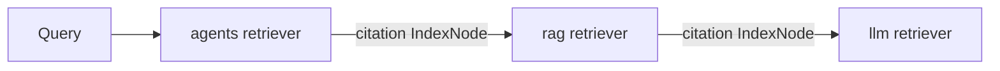

# Step 6 — Recursive Retriever

> [Back to index](README.md) · Previous: [Auto Merging Retriever](06-auto-merging-retriever.md) · Next: [Query Fusion Retriever](08-query-fusion-retriever.md)

## Goal

Build `05_recursive_retriever.py`: a small citation graph of three "papers," where retrieving from one paper can automatically follow a citation into another paper's own retriever.

## Why this matters

Every retriever so far searches one flat pool of nodes. `RecursiveRetriever` introduces a new kind of node — `IndexNode` — that behaves like a normal text node but also carries an `index_id`. When `RecursiveRetriever` retrieves an `IndexNode`, it doesn't stop there: it looks up `index_id` in a `retriever_dict` (a routing table of string key -> retriever) and re-retrieves from *that* retriever, recursively. A chunk found in one place can pull in chunks from somewhere else entirely — the same shape as following a citation, a cross-reference, or a "see also" link.

This example builds three tiny "papers" — on scaling language models, on retrieval-augmented generation, and on agentic systems — where the RAG paper cites the LLM paper, and the Agentic paper cites the RAG paper:



Each paper gets its **own** small `VectorStoreIndex` and retriever — not one combined index for all three. That separation is what makes "enter the rag retriever, then enter the llm retriever" a real, distinct retrieval step each time, rather than everything already sitting in one searchable pool from the start.

## 1. Create the three papers

`data/papers/paper_llm.txt`:

```text
Title: Scaling Transformer-Based Language Models

Abstract: This paper studies how the performance of transformer-based
language models improves as model size, training data, and compute
budget increase. We show that model quality follows a predictable
power-law relationship with these three factors, and that under-trained
models waste compute relative to their parameter count.

Large language models are trained by predicting the next token in a
sequence over massive text corpora. As the number of parameters grows
into the tens of billions, these models begin to exhibit emergent
capabilities such as few-shot learning, multi-step reasoning, and
in-context instruction following, none of which were explicitly
optimized for during training. However, scaling model size alone is not
sufficient: the ratio of training tokens to parameters strongly affects
final model quality, and many early large models were significantly
under-trained relative to their size.

A key limitation of these models is that their knowledge is frozen at
training time and confined to what was present in the training corpus.
They cannot access new information, private documents, or facts that
change after training concludes, and they have no mechanism to verify
their own outputs against a ground-truth source. This motivates
architectures that combine a language model's fluent generation
capabilities with an external mechanism for looking up relevant,
up-to-date information at inference time.
```

`data/papers/paper_rag.txt`:

```text
Title: Retrieval-Augmented Generation for Knowledge-Intensive Tasks

Abstract: We introduce a framework that pairs a pretrained language
model with a retriever over an external document store, allowing the
model to condition its generations on retrieved evidence rather than
relying solely on parameters learned at training time.

Building directly on prior work showing that large language models
develop strong general-purpose language understanding as they scale,
this paper addresses their central weakness: a fixed, frozen knowledge
base that cannot be updated without full retraining. Retrieval-augmented
generation, or RAG, addresses this by splitting the task into two
stages. First, a retriever encodes the user's query and searches an
external corpus for the most relevant passages, using either sparse
keyword matching or dense vector similarity. Second, the language model
generates its answer conditioned on both the original query and the
retrieved passages, rather than from parametric memory alone.

This architecture allows the underlying knowledge base to be updated
simply by adding or removing documents from the retrieval index, with
no retraining of the language model required. It also improves
factual accuracy and reduces hallucination, since the model can ground
its answer in retrieved text and expose the source passages for the
user to verify. RAG systems are now the dominant architecture for
building question-answering systems over private or rapidly changing
document collections, and later work builds further automation on top
of this retrieve-then-generate pattern.
```

`data/papers/paper_agents.txt`:

```text
Title: Agentic Systems: Planning and Tool Use on Top of Retrieval-Augmented Models

Abstract: We describe agentic architectures that extend
retrieval-augmented language models with planning, tool use, and
multi-step reasoning, enabling them to complete tasks that require more
than a single retrieve-and-generate step.

Retrieval-augmented generation improves factual grounding by letting a
language model condition its answers on retrieved passages, but many
real-world tasks require more than answering a single question from a
static document store. Agentic systems address this by wrapping a
language model in a control loop: the model decides which action to
take next, whether that is calling a retriever, invoking an external
tool such as a calculator or an API, or asking a clarifying question,
observes the result, and repeats until the task is complete.

This design allows an agent to decompose a complex request into
sub-tasks, gather evidence from multiple sources across several
retrieval steps rather than one, and combine information from tools
that a pure retrieve-then-generate pipeline could never call. Agentic
systems inherit the same grounding benefits described in prior work on
retrieval-augmented generation, but apply them iteratively, re-querying
the retriever as the plan evolves and new information is needed. The
main open challenges are reliably deciding when to stop iterating, and
recovering gracefully when an intermediate tool call or retrieval step
returns incorrect or irrelevant information.
```

## 2. Scaffold the file and define the citation graph

```python
"""
Recursive Retriever.

Follows references from one node to another - such as a citation in an
academic paper - instead of only searching within a single flat index.

Setup: three short "papers" (LLM scaling, RAG, and Agentic systems),
where the RAG paper cites the LLM paper and the Agentic paper cites both.
Each paper gets its own small vector retriever. Inside each paper's node
set we also insert a citation IndexNode - a node whose content mentions
the cited work, but whose `index_id` points at the CITED paper's
retriever. When a query matches that citation node, RecursiveRetriever
doesn't stop there: it follows the reference and re-retrieves from the
cited paper, pulling in cross-document content the flat index would
have missed.
"""

import os

from llama_index.core import Settings, SimpleDirectoryReader, VectorStoreIndex
from llama_index.core.retrievers import RecursiveRetriever
from llama_index.core.schema import IndexNode
from llama_index.embeddings.ollama import OllamaEmbedding
from llama_index.llms.ollama import Ollama

DATA_DIR = os.path.join(os.path.dirname(__file__), "data", "papers")
OLLAMA_BASE_URL = os.environ.get("OLLAMA_BASE_URL", "http://localhost:11434")
LLM_MODEL = os.environ.get("OLLAMA_LLM_MODEL", "llama3:8b")
EMBED_MODEL = os.environ.get("OLLAMA_EMBED_MODEL", "nomic-embed-text")

# citing_paper -> cited_paper (metadata reference, modeling a citation graph)
CITATIONS = {
    "rag": "llm",
    "agents": "rag",
}
PAPER_FILES = {
    "llm": "paper_llm.txt",
    "rag": "paper_rag.txt",
    "agents": "paper_agents.txt",
}
CITATION_BLURBS = {
    ("rag", "llm"): "This work builds on prior research about scaling transformer-based language models.",
    ("agents", "rag"): "This work extends prior research on retrieval-augmented generation with planning and tool use.",
}
```

These three dicts are the citation graph, hardcoded here to keep the example self-contained. In a real system, this would usually come from a parsed reference list or a metadata field already attached to each document — the mechanics of following it are the same either way.

## 3. Build one retriever per paper, plus a citation node

```python
def build_recursive_retriever() -> RecursiveRetriever:
    Settings.llm = Ollama(model=LLM_MODEL, base_url=OLLAMA_BASE_URL, request_timeout=120.0)
    Settings.embed_model = OllamaEmbedding(model_name=EMBED_MODEL, base_url=OLLAMA_BASE_URL)

    retriever_dict = {}
    for key, filename in PAPER_FILES.items():
        documents = SimpleDirectoryReader(input_files=[os.path.join(DATA_DIR, filename)]).load_data()
        nodes = list(VectorStoreIndex.from_documents(documents).docstore.docs.values())

        # Add an explicit citation node for any paper this one cites. Its
        # index_id names the retriever_dict entry to recurse into.
        if key in CITATIONS:
            cited_key = CITATIONS[key]
            citation_node = IndexNode(
                text=CITATION_BLURBS[(key, cited_key)],
                index_id=cited_key,
            )
            nodes = nodes + [citation_node]

        index = VectorStoreIndex(nodes)
        retriever_dict[key] = index.as_retriever(similarity_top_k=2)
```

The `list(VectorStoreIndex.from_documents(documents).docstore.docs.values())` line is worth reading slowly: it builds a throwaway index just to get back the plain list of nodes that index produced from this one paper's text (its default chunking). That list is then extended with one synthetic `IndexNode` — the citation — before building the *real* index this paper's retriever will use. The first index is discarded; only its nodes survive.

## 4. Wire up RecursiveRetriever

```python
    # Entry point: querying the "agents" paper's retriever. It can recurse
    # into "rag", which can in turn recurse into "llm".
    return RecursiveRetriever(
        "agents",
        retriever_dict=retriever_dict,
        verbose=True,
    )
```

The first positional argument, `"agents"`, is the key in `retriever_dict` to start from — not a special root object. `RecursiveRetriever` just looks it up like any other recursion step.

## 5. Query and read the trace

```python
def main():
    retriever = build_recursive_retriever()

    question = "How does this system stay grounded in up-to-date facts?"
    print(f"Q: {question}\n")

    nodes = retriever.retrieve(question)
    for n in nodes:
        print(f"  score={n.score}")
        print(f"  text: {n.node.get_content()[:150]}...")
        print()


if __name__ == "__main__":
    main()
```

## Try it

```bash
uv run 05_recursive_retriever.py
```

With `verbose=True`, watch for these two lines in particular — they're the whole point of the step:

```
Retrieved node with id, entering: rag
Retrieving with query id rag: How does this system stay grounded in up-to-date facts?
...
Retrieved node with id, entering: llm
Retrieving with query id llm: How does this system stay grounded in up-to-date facts?
```

That's a two-hop chain: the query started against the `agents` retriever, matched the citation node pointing at `rag`, recursed in and matched *another* citation node pointing at `llm`, and recursed again. The final printed results include content from all three papers — content the `agents` paper's own retriever alone could never have returned.

## Checkpoint

<details>
<summary>Full <code>05_recursive_retriever.py</code></summary>

```python
"""
Recursive Retriever.

Follows references from one node to another - such as a citation in an
academic paper - instead of only searching within a single flat index.

Setup: three short "papers" (LLM scaling, RAG, and Agentic systems),
where the RAG paper cites the LLM paper and the Agentic paper cites both.
Each paper gets its own small vector retriever. Inside each paper's node
set we also insert a citation IndexNode - a node whose content mentions
the cited work, but whose `index_id` points at the CITED paper's
retriever. When a query matches that citation node, RecursiveRetriever
doesn't stop there: it follows the reference and re-retrieves from the
cited paper, pulling in cross-document content the flat index would
have missed.
"""

import os

from llama_index.core import Settings, SimpleDirectoryReader, VectorStoreIndex
from llama_index.core.retrievers import RecursiveRetriever
from llama_index.core.schema import IndexNode
from llama_index.embeddings.ollama import OllamaEmbedding
from llama_index.llms.ollama import Ollama

DATA_DIR = os.path.join(os.path.dirname(__file__), "data", "papers")
OLLAMA_BASE_URL = os.environ.get("OLLAMA_BASE_URL", "http://localhost:11434")
LLM_MODEL = os.environ.get("OLLAMA_LLM_MODEL", "llama3:8b")
EMBED_MODEL = os.environ.get("OLLAMA_EMBED_MODEL", "nomic-embed-text")

# citing_paper -> cited_paper (metadata reference, modeling a citation graph)
CITATIONS = {
    "rag": "llm",
    "agents": "rag",
}
PAPER_FILES = {
    "llm": "paper_llm.txt",
    "rag": "paper_rag.txt",
    "agents": "paper_agents.txt",
}
CITATION_BLURBS = {
    ("rag", "llm"): "This work builds on prior research about scaling transformer-based language models.",
    ("agents", "rag"): "This work extends prior research on retrieval-augmented generation with planning and tool use.",
}


def build_recursive_retriever() -> RecursiveRetriever:
    Settings.llm = Ollama(model=LLM_MODEL, base_url=OLLAMA_BASE_URL, request_timeout=120.0)
    Settings.embed_model = OllamaEmbedding(model_name=EMBED_MODEL, base_url=OLLAMA_BASE_URL)

    retriever_dict = {}
    for key, filename in PAPER_FILES.items():
        documents = SimpleDirectoryReader(input_files=[os.path.join(DATA_DIR, filename)]).load_data()
        nodes = list(VectorStoreIndex.from_documents(documents).docstore.docs.values())

        # Add an explicit citation node for any paper this one cites. Its
        # index_id names the retriever_dict entry to recurse into.
        if key in CITATIONS:
            cited_key = CITATIONS[key]
            citation_node = IndexNode(
                text=CITATION_BLURBS[(key, cited_key)],
                index_id=cited_key,
            )
            nodes = nodes + [citation_node]

        index = VectorStoreIndex(nodes)
        retriever_dict[key] = index.as_retriever(similarity_top_k=2)

    # Entry point: querying the "agents" paper's retriever. It can recurse
    # into "rag", which can in turn recurse into "llm".
    return RecursiveRetriever(
        "agents",
        retriever_dict=retriever_dict,
        verbose=True,
    )


def main():
    retriever = build_recursive_retriever()

    question = "How does this system stay grounded in up-to-date facts?"
    print(f"Q: {question}\n")

    nodes = retriever.retrieve(question)
    for n in nodes:
        print(f"  score={n.score}")
        print(f"  text: {n.node.get_content()[:150]}...")
        print()


if __name__ == "__main__":
    main()
```

This matches [../advanced-retrievers-examples/05_recursive_retriever.py](../advanced-retrievers-examples/05_recursive_retriever.py) exactly.

</details>

## Common mistakes

| Symptom | Cause | Fix |
| --- | --- | --- |
| Retriever never recurses — only the entry-point paper's own chunks come back | The citation `IndexNode`'s text isn't semantically close enough to the query to land in that paper's own top-`similarity_top_k` | Raise `similarity_top_k` on that paper's retriever, or phrase the query closer to the citation blurb's wording |
| `KeyError` inside `RecursiveRetriever` | An `index_id` on a citation node doesn't exactly match a key in `retriever_dict` | Keep `CITATIONS`, `PAPER_FILES`, and `CITATION_BLURBS` keys consistent whenever you edit the citation graph |
| Retrieval seems to hang or recurses much longer than expected | A citation cycle (A cites B, B cites A) | Keep the citation graph acyclic — `llm` here cites nothing, which is what terminates the recursion |

Next: **[Query Fusion Retriever](08-query-fusion-retriever.md)** — combining Steps 2 and 3's retrievers into one.
