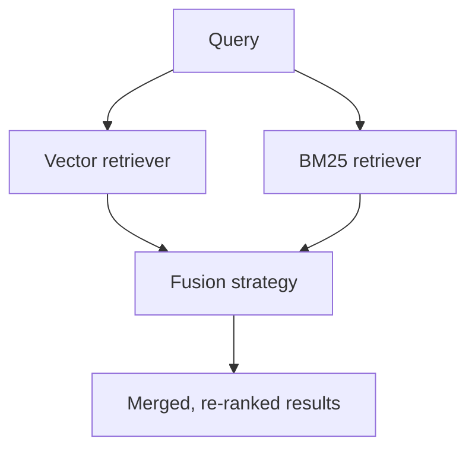

# Step 7 — Query Fusion Retriever

> [Back to index](README.md) · Previous: [Recursive Retriever](07-recursive-retriever.md) · Next: [Recap and Exercises](09-recap-and-exercises.md)

## Goal

Build `06_query_fusion_retriever.py`: combine the vector retriever from Step 2 and the BM25 retriever from Step 3, and compare all three of LlamaIndex's fusion strategies on the same query.

## Why this matters

Steps 2 and 3 fail in complementary ways: vector search can drift toward a topically-similar but wrong chunk when no chunk uses the query's exact words; BM25 finds nothing useful when the query is phrased differently from the source text, no matter how relevant the content actually is. `QueryFusionRetriever` runs a query through both and merges their ranked lists into one:



It can optionally also generate several LLM paraphrases of the query first (`num_queries > 1`) and run every retriever against every paraphrase, improving recall at the cost of extra LLM calls — this script keeps `num_queries=1` throughout so the three fusion strategies can be compared in isolation, with no query-expansion noise mixed in.

The three strategies differ only in how they turn two separately-scored ranked lists into one:

| Mode | How it combines scores |
| --- | --- |
| `reciprocal_rerank` | Scores by rank position (1st, 2nd, ...) in each list, ignoring the original score's scale entirely |
| `relative_score` | Normalizes each retriever's scores by dividing by that retriever's own maximum, then combines |
| `dist_based_score` | Z-score normalizes each retriever's scores before combining — useful when the two retrievers' raw scores are on very different scales |

## 1. Scaffold the file

```python
"""
Query Fusion Retriever.

Combines results from multiple retrievers - here, a semantic
VectorIndexRetriever and a keyword-based BM25Retriever - and merges their
ranked lists into one. Optionally, an LLM can first generate several
paraphrases of the query (num_queries > 1) so each retriever is run
against more phrasings, improving recall.

Three fusion strategies from LlamaIndex are demonstrated:
  - reciprocal_rerank: scores by rank position, ignoring raw score scale.
  - relative_score:    normalizes each result set by its own max score.
  - dist_based_score:  z-score normalizes scores before combining, which
                        handles score-scale variability across retrievers.
"""

import os

from llama_index.core import Settings, SimpleDirectoryReader, VectorStoreIndex
from llama_index.core.node_parser import SentenceSplitter
from llama_index.core.retrievers import QueryFusionRetriever
from llama_index.embeddings.ollama import OllamaEmbedding
from llama_index.llms.ollama import Ollama
from llama_index.retrievers.bm25 import BM25Retriever

DATA_DIR = os.path.join(os.path.dirname(__file__), "data")
OLLAMA_BASE_URL = os.environ.get("OLLAMA_BASE_URL", "http://localhost:11434")
LLM_MODEL = os.environ.get("OLLAMA_LLM_MODEL", "llama3:8b")
EMBED_MODEL = os.environ.get("OLLAMA_EMBED_MODEL", "nomic-embed-text")

FUSION_MODES = ["reciprocal_rerank", "relative_score", "dist_based_score"]
```

This is the first script to import from both `llama_index.core.retrievers` (vector, fusion) and `llama_index.retrievers.bm25` (BM25) at once — everything you built in Steps 2 and 3 is being reused here, just re-declared in one file rather than actually imported from those scripts.

## 2. Build both base retrievers from one shared node list

```python
def build_base_retrievers():
    Settings.llm = Ollama(model=LLM_MODEL, base_url=OLLAMA_BASE_URL, request_timeout=120.0)
    Settings.embed_model = OllamaEmbedding(model_name=EMBED_MODEL, base_url=OLLAMA_BASE_URL)

    documents = SimpleDirectoryReader(input_files=[
        os.path.join(DATA_DIR, "company_policy.txt"),
        os.path.join(DATA_DIR, "onboarding_faq.txt"),
    ]).load_data()

    splitter = SentenceSplitter(chunk_size=256, chunk_overlap=20)
    nodes = splitter.get_nodes_from_documents(documents)

    vector_index = VectorStoreIndex(nodes)
    vector_retriever = vector_index.as_retriever(similarity_top_k=2)
    bm25_retriever = BM25Retriever.from_defaults(nodes=nodes, similarity_top_k=2)

    return vector_retriever, bm25_retriever
```

Both retrievers are built from the *same* `nodes` list, split once. That matters: fusion merges results by matching node IDs across both retrievers' outputs, so both need to be scoring the same underlying units of text — not, say, one retriever working off 256-token chunks and the other off 512-token chunks.

## 3. Run one query through all three fusion modes

```python
def main():
    vector_retriever, bm25_retriever = build_base_retrievers()

    question = "expense reimbursement receipts"
    print(f"Q: {question}\n")

    for mode in FUSION_MODES:
        fusion_retriever = QueryFusionRetriever(
            [vector_retriever, bm25_retriever],
            similarity_top_k=2,
            num_queries=1,  # set > 1 to have an LLM generate query paraphrases too
            mode=mode,
            use_async=False,
            verbose=False,
        )
        nodes = fusion_retriever.retrieve(question)
        print(f"[{mode}]")
        for n in nodes:
            print(f"  score={n.score:.4f} file={n.node.metadata.get('file_name')}")
            print(f"  text: {n.node.get_content()[:100]}...")
        print()


if __name__ == "__main__":
    main()
```

A fresh `QueryFusionRetriever` is constructed per mode rather than reused, since `mode` is set at construction time.

## Try it

```bash
uv run 06_query_fusion_retriever.py
```

Expected output:

```
Q: expense reimbursement receipts

[reciprocal_rerank]
  score=0.0333 file=company_policy.txt
  ...
  score=0.0328 file=onboarding_faq.txt
  ...

[relative_score]
  score=1.0000 file=company_policy.txt
  ...
  score=0.0000 file=onboarding_faq.txt
  ...

[dist_based_score]
  score=0.6667 file=company_policy.txt
  ...
  score=0.3333 file=onboarding_faq.txt
  ...
```

The ranking (which file comes first) is identical across all three modes here — what changes is the score scale and spread. `relative_score` pushes the top result all the way to `1.0` and the runner-up to `0.0`, exaggerating the gap; `dist_based_score` keeps them closer together; `reciprocal_rerank`'s numbers are small because they're rank-based, not similarity-based. Comparing raw scores *across* modes is meaningless — only the rank order within a single mode is meant to be read that way.

## Checkpoint

<details>
<summary>Full <code>06_query_fusion_retriever.py</code></summary>

```python
"""
Query Fusion Retriever.

Combines results from multiple retrievers - here, a semantic
VectorIndexRetriever and a keyword-based BM25Retriever - and merges their
ranked lists into one. Optionally, an LLM can first generate several
paraphrases of the query (num_queries > 1) so each retriever is run
against more phrasings, improving recall.

Three fusion strategies from LlamaIndex are demonstrated:
  - reciprocal_rerank: scores by rank position, ignoring raw score scale.
  - relative_score:    normalizes each result set by its own max score.
  - dist_based_score:  z-score normalizes scores before combining, which
                        handles score-scale variability across retrievers.
"""

import os

from llama_index.core import Settings, SimpleDirectoryReader, VectorStoreIndex
from llama_index.core.node_parser import SentenceSplitter
from llama_index.core.retrievers import QueryFusionRetriever
from llama_index.embeddings.ollama import OllamaEmbedding
from llama_index.llms.ollama import Ollama
from llama_index.retrievers.bm25 import BM25Retriever

DATA_DIR = os.path.join(os.path.dirname(__file__), "data")
OLLAMA_BASE_URL = os.environ.get("OLLAMA_BASE_URL", "http://localhost:11434")
LLM_MODEL = os.environ.get("OLLAMA_LLM_MODEL", "llama3:8b")
EMBED_MODEL = os.environ.get("OLLAMA_EMBED_MODEL", "nomic-embed-text")

FUSION_MODES = ["reciprocal_rerank", "relative_score", "dist_based_score"]


def build_base_retrievers():
    Settings.llm = Ollama(model=LLM_MODEL, base_url=OLLAMA_BASE_URL, request_timeout=120.0)
    Settings.embed_model = OllamaEmbedding(model_name=EMBED_MODEL, base_url=OLLAMA_BASE_URL)

    documents = SimpleDirectoryReader(input_files=[
        os.path.join(DATA_DIR, "company_policy.txt"),
        os.path.join(DATA_DIR, "onboarding_faq.txt"),
    ]).load_data()

    splitter = SentenceSplitter(chunk_size=256, chunk_overlap=20)
    nodes = splitter.get_nodes_from_documents(documents)

    vector_index = VectorStoreIndex(nodes)
    vector_retriever = vector_index.as_retriever(similarity_top_k=2)
    bm25_retriever = BM25Retriever.from_defaults(nodes=nodes, similarity_top_k=2)

    return vector_retriever, bm25_retriever


def main():
    vector_retriever, bm25_retriever = build_base_retrievers()

    question = "expense reimbursement receipts"
    print(f"Q: {question}\n")

    for mode in FUSION_MODES:
        fusion_retriever = QueryFusionRetriever(
            [vector_retriever, bm25_retriever],
            similarity_top_k=2,
            num_queries=1,  # set > 1 to have an LLM generate query paraphrases too
            mode=mode,
            use_async=False,
            verbose=False,
        )
        nodes = fusion_retriever.retrieve(question)
        print(f"[{mode}]")
        for n in nodes:
            print(f"  score={n.score:.4f} file={n.node.metadata.get('file_name')}")
            print(f"  text: {n.node.get_content()[:100]}...")
        print()


if __name__ == "__main__":
    main()
```

This matches [../advanced-retrievers-examples/06_query_fusion_retriever.py](../advanced-retrievers-examples/06_query_fusion_retriever.py) exactly.

</details>

## Common mistakes

| Symptom | Cause | Fix |
| --- | --- | --- |
| Fusion results look identical to plain vector search | Only one retriever actually returns useful results for this query — the other is contributing nothing to merge | Confirm both `vector_retriever.retrieve(question)` and `bm25_retriever.retrieve(question)` independently return something relevant first |
| Retrieval is much slower than Steps 2/3, or fails without a reachable LLM | `num_queries > 1` triggers LLM-based query paraphrasing before retrieval even starts | Keep `num_queries=1` while iterating; only raise it once you specifically want to test paraphrasing's effect on recall |
| Scores look wildly different between modes for the "same" result | Each mode normalizes on a different scale by design (rank-based vs. max-normalized vs. z-score) | Compare rank *order* within one mode, not raw score magnitude across modes |

Next: **[Recap and Exercises](09-recap-and-exercises.md)**.
