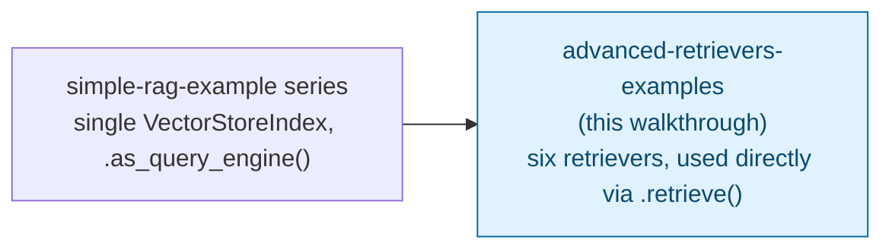

# Advanced LlamaIndex Retrievers — Trainer Walkthrough

> A step-by-step build guide for [../advanced-retrievers-examples](../advanced-retrievers-examples/README.md). Follow it live in a workshop, or work through it solo — by the end you will have hand-built six small scripts, each demonstrating a different LlamaIndex retriever, and understand exactly when to reach for which one.

## What you'll build

Six independent, runnable scripts, all reading from a shared `data/` folder and running fully locally through [Ollama](https://ollama.com):

| Script | Retriever |
| --- | --- |
| `01_vector_index_retriever.py` | `VectorIndexRetriever` — semantic search |
| `02_bm25_retriever.py` | `BM25Retriever` — keyword search |
| `03_document_summary_index_retriever.py` | `DocumentSummaryIndexLLMRetriever` / `...EmbeddingRetriever` |
| `04_auto_merging_retriever.py` | `AutoMergingRetriever` — hierarchical chunking |
| `05_recursive_retriever.py` | `RecursiveRetriever` — citation following |
| `06_query_fusion_retriever.py` | `QueryFusionRetriever` — combines the two above |

## How this walkthrough is shaped

This is different from a typical single-file walkthrough: instead of one `main.py` growing feature by feature, each retriever step builds one **complete, independent script** from an empty file. After Step 1 (environment setup), the six retriever steps do not depend on each other's code — only on the shared `data/` files and, in Step 3, one extra dependency added along the way. You can do them in order (recommended — complexity builds up) or jump straight to whichever retriever matches what you're trying to learn.

## Who this is for

- **Instructors** demonstrating how LlamaIndex's retriever choices map to real retrieval problems (semantic vs. keyword, single-document vs. document-level, flat vs. hierarchical vs. cross-referenced).
- **Trainees** typing each script themselves rather than reading finished files top to bottom.

## Prerequisites

- Comfortable with basic Python: functions, dicts, list comprehensions, `for` loops.
- [`uv`](https://docs.astral.sh/uv/) installed.
- [Ollama](https://ollama.com) installed, running, and reachable at `http://localhost:11434`, with `llama3:8b` and `nomic-embed-text` pulled — if you haven't done this yet, follow "1. Install and start Ollama" in [the Chroma walkthrough's environment setup step](../simple-rag-example-chromadb-walkthrough/02-environment-setup.md); it's the same two models, and this walkthrough doesn't repeat those instructions.
- No prior experience with LlamaIndex retrievers assumed. For the concepts behind *why* each retriever exists, [../../advanced-rag/llamaindex-advanced-retrievers.md](../../advanced-rag/llamaindex-advanced-retrievers.md) covers the same material with diagrams; this walkthrough explains what's needed inline as you build.
- About 2 hours end to end (roughly 15-20 minutes per retriever step), or shorter if you skip around.

| Step | File | What you'll add | Est. time |
| --- | --- | --- | --- |
| 0 | [01-overview-and-concepts.md](01-overview-and-concepts.md) | Mental model: index types vs. retrievers, and why this walkthrough is six scripts, not one | 10 min |
| 1 | [02-environment-setup.md](02-environment-setup.md) | uv project scaffolded, shared HR data files created | 10 min |
| 2 | [03-vector-index-retriever.md](03-vector-index-retriever.md) | `01_vector_index_retriever.py` — baseline semantic retrieval | 15 min |
| 3 | [04-bm25-retriever.md](04-bm25-retriever.md) | `02_bm25_retriever.py` — keyword retrieval, BM25 dependency added | 15 min |
| 4 | [05-document-summary-index-retriever.md](05-document-summary-index-retriever.md) | `03_document_summary_index_retriever.py` — summary-filtered, two-stage retrieval | 20 min |
| 5 | [06-auto-merging-retriever.md](06-auto-merging-retriever.md) | `04_auto_merging_retriever.py` — hierarchical chunking + parent merging | 20 min |
| 6 | [07-recursive-retriever.md](07-recursive-retriever.md) | `05_recursive_retriever.py` — cross-document citation following | 20 min |
| 7 | [08-query-fusion-retriever.md](08-query-fusion-retriever.md) | `06_query_fusion_retriever.py` — combining vector + BM25 across 3 fusion strategies | 15 min |
| 8 | [09-recap-and-exercises.md](09-recap-and-exercises.md) | Quick-reference card, gotchas, exercises | 10 min |

## Relationship to the reference implementation

Each retriever step's final checkpoint matches its script in [../advanced-retrievers-examples/](../advanced-retrievers-examples/) exactly: Step 2 → `01_vector_index_retriever.py`, Step 3 → `02_bm25_retriever.py`, Step 4 → `03_document_summary_index_retriever.py`, Step 5 → `04_auto_merging_retriever.py`, Step 6 → `05_recursive_retriever.py`, Step 7 → `06_query_fusion_retriever.py`. This walkthrough's verification pass confirmed every checkpoint matches its source file byte-for-byte (aside from comments referencing this checkout's own history, which were rewritten to stand alone).

## Suggested demo flow (for instructors)

- Since the six retriever steps are independent, feel free to reorder after Step 1 based on what the audience cares about most.
- Step 3 (BM25): before building it, re-run Step 2's vector retriever on the same keyword-heavy phrase you'll use for BM25 (e.g. "reimbursement receipts 30 days") and note its ranking, so the semantic-vs-keyword contrast lands when BM25 ranks it differently.
- Step 5 (auto-merging): run `base_retriever.retrieve()` and `merging_retriever.retrieve()` back to back on the same query and count the returned nodes live — 6 leaves collapsing into fewer, larger nodes is the entire point of the step, and it's easy to blink and miss it in a wall of printed text.
- Step 6 (recursive): set `verbose=True` from the start (the reference script already does) and read the trace aloud line by line — `Retrieved node with id, entering: rag` followed later by `entering: llm` is the payoff of the whole step.
- Step 7 (fusion): run one mode at a time rather than all three back to back, and have the group compare the score *column* to the previous mode's before moving on — the scores are normalized differently by design, and that's easy to gloss over if all three outputs scroll past at once.

## Where this fits in the series

The `simple-rag-example*` walkthroughs build one query engine end to end. This one goes one level lower: it works directly with **retrievers** (the piece a query engine wraps internally) so you can see exactly what each one returns before an LLM ever touches it.

Start here: **[01-overview-and-concepts.md](01-overview-and-concepts.md)**.
