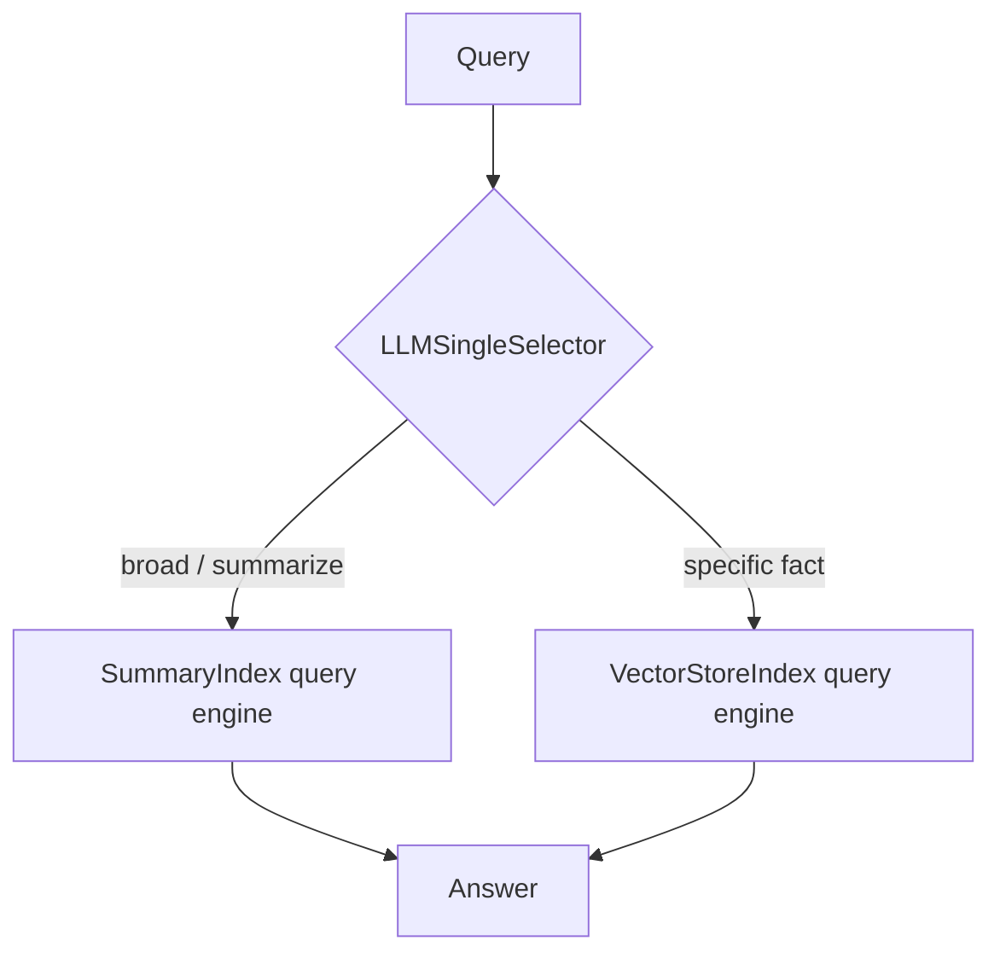
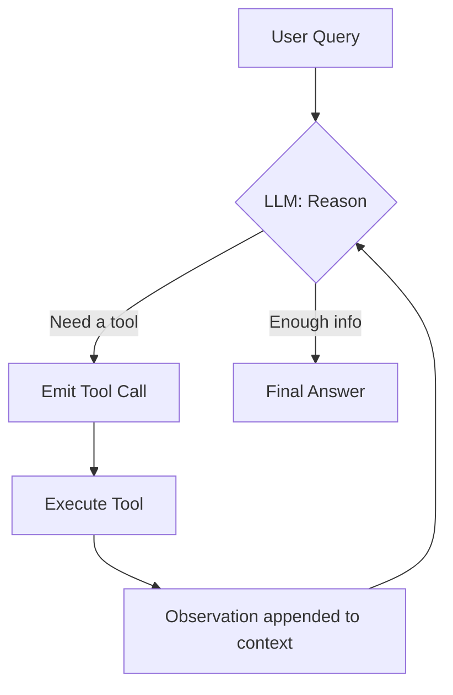
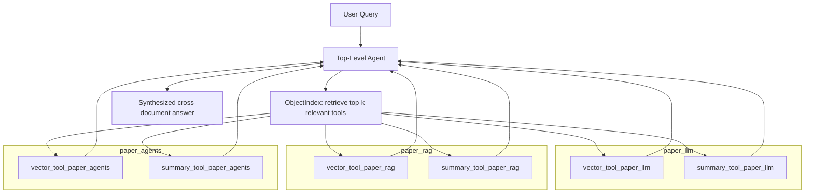

# agentic-rag-examples

One small, runnable script per agentic LlamaIndex building block,
matching the concepts in
[../../agentic-rag/notes.md](../../agentic-rag/notes.md) and
[../../agentic-rag/llamaindex-notes.md](../../agentic-rag/llamaindex-notes.md).
Like the other examples in this repo, everything runs fully locally
through [Ollama](https://ollama.com) — no API key, no data leaving your
machine.

## Setup

1. Make sure [Ollama](https://ollama.com) is installed and running.
2. Pull the models used by these examples (one-time):

   ```bash
   ollama pull llama3:8b
   ollama pull nomic-embed-text
   ```

3. Install Python deps:

   ```bash
   uv sync
   ```

4. Run any example:

   ```bash
   uv run 01_router_query_engine.py
   ```

Override `OLLAMA_LLM_MODEL`, `OLLAMA_EMBED_MODEL`, or `OLLAMA_BASE_URL`
as environment variables to point at different models or a remote Ollama
instance.

> **Why ReActAgent, not native function calling?** The plain `llama3:8b`
> model pulled above doesn't reliably support native tool-calling
> templates in Ollama. `ReActAgent` reasons in plain text
> (`Thought:`/`Action:`/`Observation:`) and works with any chat-capable
> model, so every agent example here uses it. If you swap in a model with
> native tool support (e.g. `llama3.1`, `qwen2.5`, `mistral`), you can
> switch to `FunctionAgent` from `llama_index.core.agent.workflow` for
> more reliable, structured tool calls.

## Examples

| Script | Concept | What it shows |
|---|---|---|
| [01_router_query_engine.py](01_router_query_engine.py) | `RouterQueryEngine` | One routing decision, no iteration: an `LLMSingleSelector` picks between a `SummaryIndex` (broad questions) and a `VectorStoreIndex` (specific facts) over the same documents. |
| [02_tool_calling.py](02_tool_calling.py) | `FunctionTool` / `QueryEngineTool` | What a "tool" is — calls one directly with no LLM involved, then lets a `ReActAgent` decide on its own to chain a `QueryEngineTool` (policy lookup) into a `FunctionTool` (arithmetic). |
| [03_agent_reasoning_loop.py](03_agent_reasoning_loop.py) | Agent Reasoning Loop | Same two tools as `02`, but streams the agent's internal `ToolCall`/`ToolCallResult` events to make the reason → act → observe → repeat loop visible, across two sequential, dependent tool calls. |
| [04_multi_document_agent.py](04_multi_document_agent.py) | Multi-Document Agent | Three short "papers" (`paper_llm` → `paper_rag` → `paper_agents`, the same citation-chain dataset used by `../advanced-retrievers-examples`), each exposed as a vector + summary tool pair. An `ObjectIndex` over the 6 tools lets the top-level agent retrieve only the relevant ones per query instead of seeing every tool. |

## Data

- `data/company_policy.txt`, `data/onboarding_faq.txt` — short HR docs,
  reused from `../simple-rag-example`, used by the Router Query Engine,
  Tool Calling, and Agent Reasoning Loop examples.
- `data/papers/` — the same three synthetic "papers" with an explicit
  citation chain used by `../advanced-retrievers-examples`'s Recursive
  Retriever example, reused here for the Multi-Document Agent so a query
  can require synthesizing facts across all three.

## Notes on each concept

### Router Query Engine

A single, one-shot decision on *which* engine should answer — no
retries, no loop. `response.metadata["selector_result"]` exposes which
tool was picked and why, printed by the script for both a summary-style
and a fact-style question.

### Tool Calling
The primitive underneath every agent: a `name`, a `description` (the
actual interface contract the LLM reads), an argument schema, and a
callable. `02_tool_calling.py` first calls the `FunctionTool` directly
to show that it's just a wrapped Python function, then hands it — plus a
`QueryEngineTool` — to an agent that decides for itself which to invoke.

### Agent Reasoning Loop

`03_agent_reasoning_loop.py` asks a question whose second tool call
depends on the first tool's result (total vacation days → days
remaining), so the agent must plan a real multi-step chain rather than
calling one tool and stopping.

### Multi-Document Agent

Instead of one flat index over all documents (which loses per-document
boundaries), each document gets its own small tool set, and an
`ObjectIndex` (a vector index *over the tools themselves*) lets the
top-level agent's tool list scale past what would fit in one prompt. The
script prints which tools got shortlisted for the query before running
the agent, so you can see the retrieval-over-tools step happen
separately from the reasoning loop.
