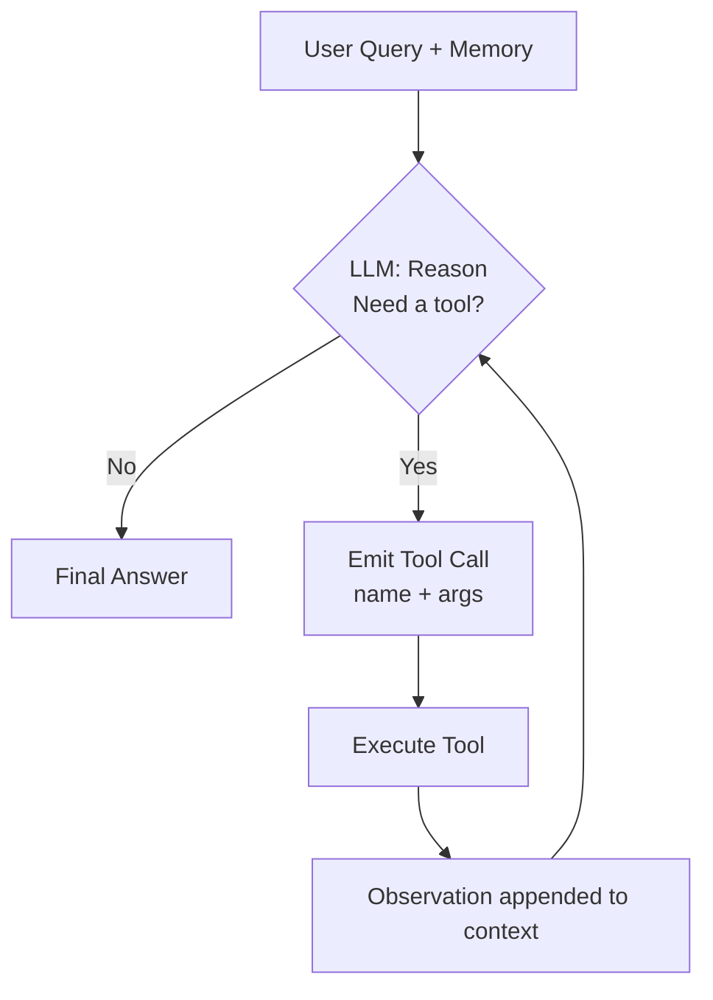
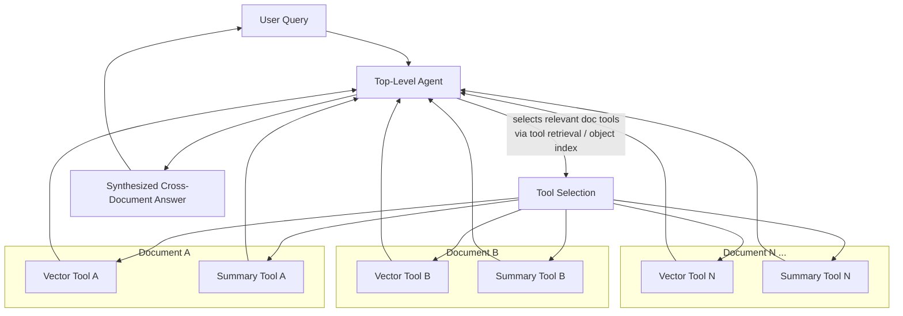
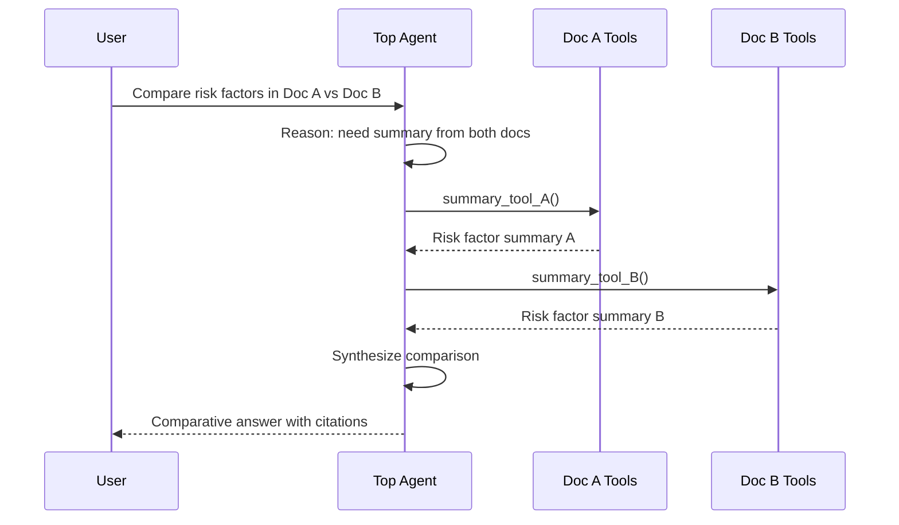

# LlamaIndex — Router Query Engine, Tool Calling, Agent Reasoning Loop, Multi-Document Agent

Companion to [notes.md](./notes.md) (Agentic RAG concepts). These notes cover the concrete LlamaIndex building blocks used to *implement* agentic RAG.

Runnable examples for all four concepts (against a local Ollama model, no API key) live in [../rag-with-LlamaIndex/agentic-rag-examples/](../rag-with-LlamaIndex/agentic-rag-examples/).

---

## 1. Router Query Engine

### What it is
A `RouterQueryEngine` sits in front of multiple candidate query engines (or retrievers/tools) and uses an LLM to **pick which one(s) to send the query to**. It's the simplest form of "agentic" behavior — a single routing decision, not a full reasoning loop.

### Why it exists
A single index/query engine is rarely optimal for all query types. Example: one index is a vector store good for semantic/"what does X mean" questions, another is a summary index good for "summarize the whole document" questions. Forcing every query through one engine degrades quality for the other type.

### How it works
1. Each candidate query engine is wrapped in a `QueryEngineTool` with a `name` and a `description` (the description is critical — the router LLM reads it to decide relevance).
2. A `Selector` (LLM-based or embedding-based) scores the query against each tool's description.
3. The router forwards the query to the selected engine(s) and returns its response.

### Selector types
- `LLMSingleSelector` — LLM picks exactly one tool.
- `LLMMultiSelector` — LLM can pick multiple tools; results get combined/synthesized.
- `PydanticSingleSelector` / `PydanticMultiSelector` — same, but uses structured/function-calling output for more reliable parsing (recommended over raw text parsing).
- Embedding-based selectors — cheaper, no LLM call, but less nuanced than LLM selectors.

### Minimal example

```python
from llama_index.core.tools import QueryEngineTool
from llama_index.core.query_engine import RouterQueryEngine
from llama_index.core.selectors import LLMSingleSelector

summary_tool = QueryEngineTool.from_defaults(
    query_engine=summary_query_engine,
    description="Useful for summarization questions about the document",
)
vector_tool = QueryEngineTool.from_defaults(
    query_engine=vector_query_engine,
    description="Useful for retrieving specific facts or details from the document",
)

router_query_engine = RouterQueryEngine(
    selector=LLMSingleSelector.from_defaults(),
    query_engine_tools=[summary_tool, vector_tool],
)

response = router_query_engine.query("Summarize the introduction section")
```

### Where it fits in the agentic RAG spectrum
Router Query Engine = **one-shot tool selection**, no iteration, no memory, no re-querying. It's the building block that later gets embedded *inside* an agent's tool set (see §3–4) to give the agent more than one "smart" retrieval option to choose from.

---

## 2. Tool Calling

### What it is
The mechanism by which an LLM decides, mid-generation, to invoke a function (a "tool") with structured arguments, receive its output, and continue reasoning — LlamaIndex's `FunctionTool` / `QueryEngineTool` abstractions plus a `FunctionCallingLLM` (or a generic agent worker) drive this.

### Anatomy of a Tool in LlamaIndex
Every tool has:
- **name** — identifier the LLM uses to call it.
- **description** — natural-language explanation of *when* to use it (this is effectively the prompt engineering surface for tool selection — vague descriptions cause wrong/no tool calls).
- **fn_schema** — the argument schema (usually auto-inferred from a Python function's type hints, or a Pydantic model).

### Two common tool types
- `FunctionTool` — wraps an arbitrary Python function (e.g., `get_weather(city: str)`, `multiply(a: int, b: int)`, a web-search call).
- `QueryEngineTool` — wraps a query engine (vector index, summary index, SQL engine, or even a `RouterQueryEngine`) so an *agent* can call retrieval itself as a tool, rather than retrieval being hardcoded.

### Example: wrapping a function

```python
from llama_index.core.tools import FunctionTool

def multiply(a: float, b: float) -> float:
    """Multiply two numbers and return the product."""
    return a * b

multiply_tool = FunctionTool.from_defaults(fn=multiply)
```

### Example: wrapping a query engine as a tool

```python
from llama_index.core.tools import QueryEngineTool

vector_tool = QueryEngineTool.from_defaults(
    query_engine=vector_index.as_query_engine(),
    name="paper_search",
    description="Search the research paper for specific facts, numbers, or quotes.",
)
```

### Tool calling flow (conceptually)
1. LLM receives the user message + list of available tool schemas.
2. LLM (if it decides a tool is needed) emits a structured tool call: `{"tool": "multiply", "args": {"a": 3, "b": 4}}`.
3. Runtime executes the actual Python function/query engine with those args.
4. Tool's return value is appended to the conversation as an observation.
5. LLM continues generating — either calls another tool, or produces a final answer.

This "emit call → execute → observe → continue" cycle is exactly what the **Agent Reasoning Loop** (§3) formalizes and repeats.

### Practical notes
- Tool **descriptions are the actual interface contract** with the LLM — treat them like docstrings for a human colleague who has *only* the description to go on.
- Keep each tool narrowly scoped (single responsibility) — an LLM chooses better between "search_policy_docs" and "search_financial_data" than a single generic "search_everything".
- Return concise, structured tool outputs — dumping huge raw text back into context wastes tokens and confuses the next reasoning step.

---

## 3. Agent Reasoning Loop

### What it is
The control loop that lets an LLM go beyond one-shot tool calling into **multi-step reasoning**: call a tool, look at the result, decide whether more steps are needed, call another tool (possibly informed by the previous result), and only then produce a final answer. This is the core of what makes something an "agent" rather than a router.

### The loop, step by step
1. **Input**: user query + conversation memory + list of tools.
2. **Reason**: LLM decides — answer directly, or call a tool (and with what arguments)?
3. **Act**: if a tool call is chosen, the runtime executes it.
4. **Observe**: tool output is fed back into the LLM's context as an "observation."
5. **Repeat** steps 2–4 until the LLM decides it has enough information.
6. **Respond**: LLM emits the final answer to the user.

This is the classic **ReAct** (Reason + Act) pattern, though LlamaIndex also supports pure function-calling agent loops (no explicit "Thought:" text — relies on the model's native tool-calling / function-calling capability, e.g. OpenAI/Anthropic tool use), which tends to be more reliable than text-parsed ReAct.

### LlamaIndex constructs
- `ReActAgent` — implements the classic think/act/observe text-based loop; model-agnostic (works even with models lacking native function calling).
- `FunctionCallingAgent` / `FunctionAgent` (newer `AgentWorkflow` APIs) — relies on the LLM provider's native structured tool-calling instead of parsing free text — generally more robust.
- `AgentRunner` + `AgentWorker` — lower-level split: the `Worker` executes a single step of the loop, the `Runner` manages the overall task state/looping/memory across steps.

### Minimal example (function-calling agent)

```python
from llama_index.core.agent import FunctionCallingAgent
from llama_index.llms.openai import OpenAI

agent = FunctionCallingAgent.from_tools(
    tools=[multiply_tool, vector_tool],
    llm=OpenAI(model="gpt-4o"),
    verbose=True,
)

response = agent.chat("What is 12 times the page count mentioned in the report?")
# Loop: agent calls vector_tool to find page count -> observes result
#       -> calls multiply_tool with (12, page_count) -> observes result
#       -> responds with final number
```

### Mermaid: the reasoning loop



### Why loops need bounding
Without a `max_iterations` (or equivalent step cap), a confused agent can call tools indefinitely on an ambiguous/unanswerable query. Always set an iteration limit and a fallback ("I don't have enough information") response path.

### Memory in the loop
Agents carry a `ChatMemoryBuffer` (or similar) across turns so that tool outputs and prior reasoning persist within a conversation, not just within a single query's loop.

---

## 4. Multi-Document Agent

### What it is
An architecture for answering questions that may span **many separate documents**, where you cannot simply dump all documents into one vector index without losing per-document structure (e.g., "compare Q1 vs Q2 revenue across these 10 filings" needs per-filing summarization *and* cross-document synthesis).

### The pattern (LlamaIndex's canonical "multi-document agent" design)
Two layers:

1. **Per-document agent (or tool set)**: for each document, build:
   - A vector index (for fact lookup within that doc) → `QueryEngineTool`
   - A summary index (for "summarize this doc" questions) → `QueryEngineTool`
   - Optionally wrap both in a small `RouterQueryEngine` or a per-document agent, so each document effectively becomes one smart callable unit — often literally exposed as a single tool named `"vector_tool_<doc_name>"` / `"summary_tool_<doc_name>"`, or as a per-document agent wrapped as a single `QueryEngineTool`.

2. **Top-level orchestrating agent**: a single agent whose tool list contains **one entry per document** (or per document-agent). Given a query, it decides:
   - Which document(s) are relevant.
   - Whether it needs a fact (→ vector tool) or an overview (→ summary tool) from each.
   - How to combine answers from multiple documents into one response (multi-hop synthesis across docs).

### Why not one giant index?
- Losing document boundaries breaks "summarize document X" style questions (chunks get mixed across docs in a flat vector index).
- Retrieval precision drops as the corpus grows — a two-level structure (route to doc → retrieve within doc) scales far better than flat top-k over everything.
- It mirrors how a human would work: first figure out *which* report to open, then look *inside* it.

### Example structure

```python
from llama_index.core.tools import QueryEngineTool
from llama_index.core.agent import FunctionCallingAgent

# Assume doc_summaries: dict[doc_name -> summary_index], doc_vectors: dict[doc_name -> vector_index]
all_tools = []
for doc_name in doc_names:
    vector_tool = QueryEngineTool.from_defaults(
        query_engine=doc_vectors[doc_name].as_query_engine(),
        name=f"vector_tool_{doc_name}",
        description=f"Use for specific facts/details within the {doc_name} document.",
    )
    summary_tool = QueryEngineTool.from_defaults(
        query_engine=doc_summaries[doc_name].as_query_engine(),
        name=f"summary_tool_{doc_name}",
        description=f"Use for high-level summaries of the {doc_name} document.",
    )
    all_tools.extend([vector_tool, summary_tool])

top_agent = FunctionCallingAgent.from_tools(
    tools=all_tools,
    llm=OpenAI(model="gpt-4o"),
    system_prompt="You have access to tools over multiple documents. "
                   "Select the correct document tool(s) to answer the user's question.",
)

response = top_agent.chat(
    "Compare the risk factors mentioned in Document A and Document B."
)
```

At scale (dozens/hundreds of documents), the top-level tool list itself becomes too large for one prompt — LlamaIndex addresses this with an **object index** (a vector index *over the tools themselves*, so tool retrieval becomes semantic search rather than listing every tool in the prompt) feeding a `RetrieverTool`/`ToolRetriever`, so the top agent only sees the top-k relevant document tools per query instead of all of them.

### Mermaid: multi-document agent architecture



### Mermaid: sequence for a cross-document comparison query



---

## 5. How these four pieces compose

- **Tool Calling** is the primitive (a single function/query-engine call with structured args).
- **Router Query Engine** is a *degenerate, single-step* agent that only does tool **selection**, no iteration.
- **Agent Reasoning Loop** generalizes the router into a full think→act→observe→repeat cycle, enabling multi-step, multi-tool reasoning.
- **Multi-Document Agent** is an *applied architecture*: a two-level hierarchy of tools (per-document engines) driven by a top-level agent reasoning loop, using tool retrieval/routing to scale to many documents.

In short: Router Query Engine and Tool Calling are the building blocks; the Agent Reasoning Loop is the engine that uses them iteratively; the Multi-Document Agent is a real-world pattern assembled from all three to handle large, multi-source corpora — a concrete implementation of the "agentic RAG" ideas in [notes.md](./notes.md).
