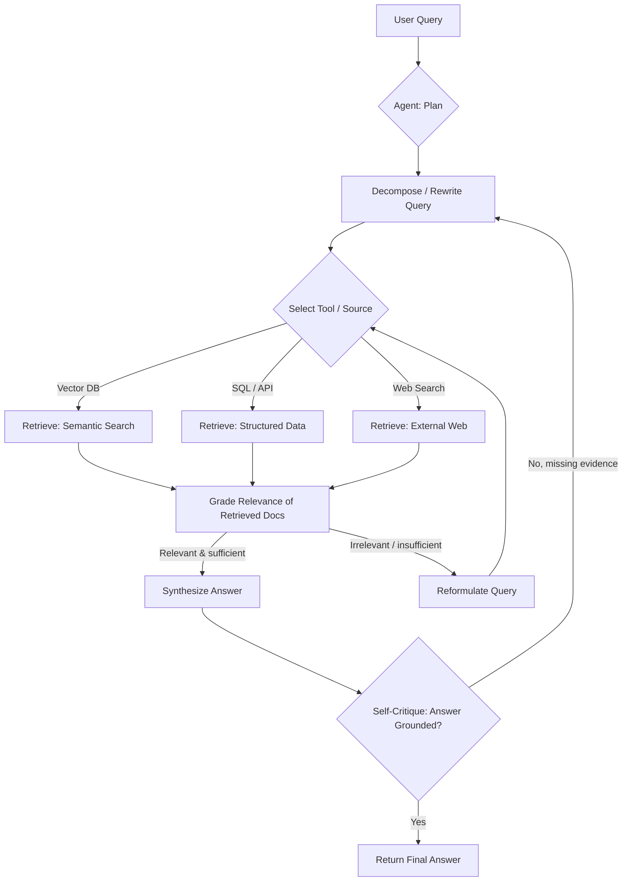
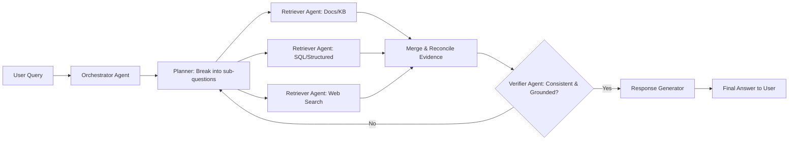
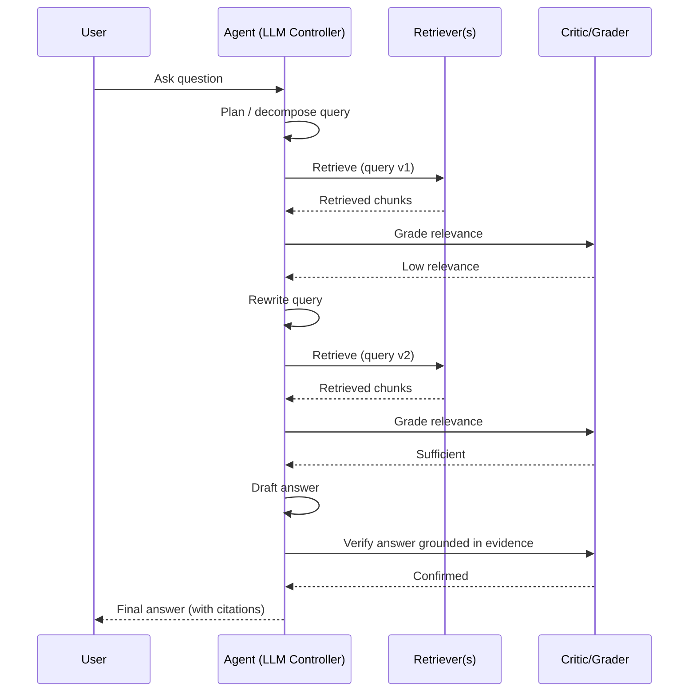

# Agentic RAG — Notes

## 1. What is RAG (recap)

**Retrieval-Augmented Generation (RAG)** grounds an LLM's response in external knowledge instead of relying purely on parametric memory. The classic pipeline is linear and fixed:

1. User query comes in.
2. Query is embedded and used to retrieve top-k chunks from a vector store (or hybrid search).
3. Retrieved chunks are stuffed into the prompt as context.
4. LLM generates an answer conditioned on that context.

This is a **single-pass, deterministic pipeline**: retrieve once, generate once. There's no mechanism to notice that retrieval was poor, that the question needs decomposition, or that a different data source should have been consulted.

## 2. What is Agentic RAG

**Agentic RAG** wraps the retrieval-generation loop inside an **agent** that can reason, plan, and act — using tools (retrievers, APIs, calculators, code execution) iteratively, deciding *what* to retrieve, *when* to retrieve, *whether* the retrieved evidence is sufficient, and *how* to combine multiple sources before answering.

Instead of "retrieve → generate," the loop becomes:

**observe → think → act (retrieve/tool-call) → observe result → think → ... → answer**

Core capabilities that make it "agentic":

- **Query planning/decomposition** — break a complex question into sub-questions.
- **Tool/source selection** — choose among multiple retrievers (vector DB, SQL, web search, internal APIs) based on the question.
- **Iterative/self-corrective retrieval** — re-query if retrieved context is irrelevant or insufficient (reflection, grading retrieved docs).
- **Multi-hop reasoning** — chain retrievals together when one answer depends on facts found in a prior step.
- **Verification/critique** — check the draft answer against retrieved evidence before returning it (reduces hallucination).
- **Memory** — carry state across turns/steps (short-term scratchpad, long-term conversation memory).
- **Multi-agent orchestration** (optional) — a planner/orchestrator agent delegates to specialist retriever agents (e.g., one per data domain) and synthesizes their outputs.

## 3. Regular RAG vs Agentic RAG

| Aspect | Regular RAG | Agentic RAG |
|---|---|---|
| Control flow | Fixed, linear pipeline | Dynamic loop, agent decides next step |
| Retrieval | Single retrieval pass | Iterative, possibly multiple rounds/sources |
| Query handling | Uses raw/embedded query as-is | Can rewrite, decompose, or expand the query |
| Source selection | One predefined retriever/index | Chooses among multiple tools/retrievers dynamically |
| Error handling | No self-check; bad retrieval → bad answer | Can grade retrieved docs, detect irrelevance, retry |
| Reasoning depth | Single-hop (context → answer) | Multi-hop reasoning across chained retrievals |
| Verification | None (answer generated directly) | Can critique/verify draft against evidence |
| Complexity/cost | Low latency, cheap, simple to build | Higher latency & cost, more moving parts |
| Best for | Simple factual Q&A over a known corpus | Complex, ambiguous, multi-source, multi-step questions |
| Failure mode | Silently wrong on bad retrieval | Can loop/over-call tools if not bounded |

**In short:** regular RAG is a *pipeline*; agentic RAG is a *policy* — an LLM-driven controller that decides how to use retrieval (and other tools) as part of a reasoning process, rather than retrieval being a hardcoded preprocessing step.

## 4. Use Cases of Agentic RAG

1. **Enterprise knowledge assistants spanning multiple systems**
   Question needs data from a wiki, a ticketing system, and a database — agent decides which tool(s) to query and merges results (e.g., "Why did ticket #4521 get escalated, and what's the current SLA policy for its category?").

2. **Multi-hop / compositional research questions**
   "What was the revenue growth of the company that acquired [Startup X] in 2022?" — requires first retrieving who acquired the startup, then retrieving that company's financials.

3. **Financial / regulatory research (relevant to banking contexts)**
   Cross-referencing internal policy documents, regulatory filings, and market data; agent verifies figures across sources before answering, reducing hallucination risk in compliance-sensitive answers.

4. **Customer support with self-correction**
   If the first retrieval returns low-relevance docs (e.g., wrong product version), the agent detects this and re-queries with a refined search instead of answering from bad context.

5. **Coding assistants / codebase Q&A**
   Agent decides whether to search docs, grep the codebase, or run a test, chaining tool calls to build up enough context before answering "why is this function failing?"

6. **Long-document / large-corpus synthesis**
   Summarizing or comparing across many documents where a single retrieval pass can't fit everything — agent iteratively pulls sections, tracks what's been read, and stitches a synthesized answer.

7. **Deep research / report generation agents**
   Iteratively searches the web/internal docs, drafts sections, checks for gaps, retrieves more, and produces a cited report (e.g., "deep research" style products).

8. **Conversational agents needing memory + retrieval**
   Combines long-term memory (past interactions) with on-demand retrieval, deciding per-turn whether new retrieval is even needed.

## 5. Agentic RAG Workflow (Mermaid)

### 5.1 High-level agent loop

### 5.2 Multi-agent orchestration variant

### 5.3 Sequence view (single query, corrective loop)

## 6. Key Trade-offs / Considerations

- **Latency & cost**: every reasoning/retry step is an extra LLM call — agentic RAG can be 3–10x more expensive/slower than plain RAG. Use it only when query complexity justifies it (consider routing: simple queries → plain RAG, complex → agentic RAG).
- **Loop bounding**: must cap max iterations/tool calls to avoid infinite retrieval loops on unanswerable questions.
- **Evaluation complexity**: harder to evaluate than plain RAG since there are multiple intermediate decisions (retrieval quality, tool choice, reasoning trace), not just final-answer accuracy.
- **Observability**: needs tracing of the full agent trajectory (which tools called, why, what was retrieved) for debugging and trust, especially important in regulated domains.
- **When plain RAG is enough**: simple FAQ-style retrieval over a single well-curated corpus rarely needs agentic overhead.
