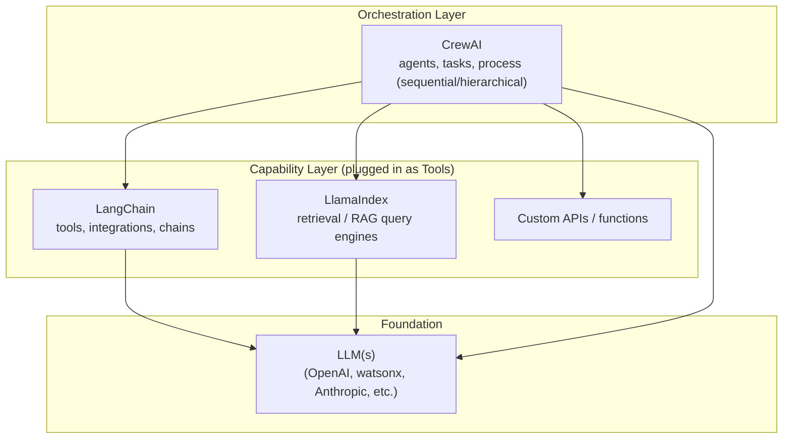
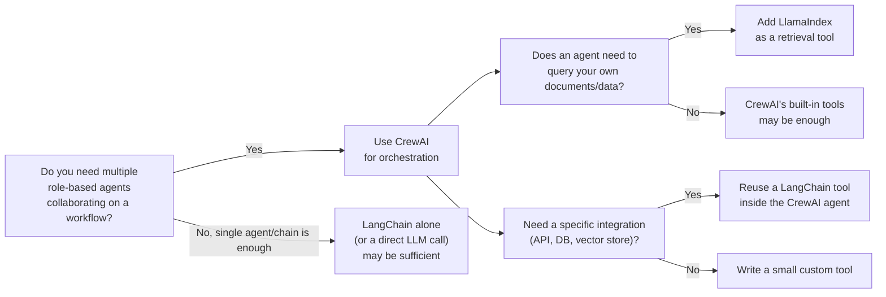

# CrewAI vs LangChain vs LlamaIndex — Why CrewAI?

## The short answer

**They aren't competitors — they operate at different layers of an agentic system.**

| Framework | Primarily solves | Think of it as |
|---|---|---|
| LangChain | Building LLM apps generally: chains, prompts, memory, huge tool/integration ecosystem, low-level agent loops (LangGraph) | The **general toolkit** |
| LlamaIndex | Connecting LLMs to *your data* for retrieval (RAG): loaders, indexes, query engines | The **data/retrieval layer** |
| CrewAI | Coordinating *multiple* role-based agents to collaborate on a multi-step goal | The **orchestration layer** |

## Why reach for CrewAI specifically?

CrewAI gives you **multi-agent collaboration as a first-class concept**, out of the box:

- **Role-based agents** — `role` / `goal` / `backstory` give each agent a persona and scope, instead of one giant prompt trying to do everything.
- **Built-in process models** — `sequential` and `hierarchical` execution are configured with one parameter (`process=Process.sequential`), instead of hand-wiring a state machine.
- **Task-to-task handoff** — output of one agent automatically becomes input to the next (a reflection-style pattern), with far less boilerplate than composing this in raw LangChain.
- **Lower ceremony** — you can stand up a working "team of agents" (researcher → writer, e.g.) in ~20 lines, where the equivalent in LangGraph/LangChain requires explicitly defining nodes, edges, and state.

What CrewAI does **not** try to be:

- It's not a retrieval/indexing framework (that's LlamaIndex's specialty).
- It doesn't have LangChain's breadth of pre-built integrations (though it can *use* LangChain tools directly, since CrewAI tools are compatible with the LangChain tool interface).

## So — do we still need LangChain / LlamaIndex?

**Usually yes, underneath CrewAI, not instead of it:**

- Need real **RAG over your own documents/DB**? Build the query engine in **LlamaIndex**, then wrap it as a **CrewAI tool** an agent can call.
- Need a **niche integration** (a specific API, vector store, or connector) that already exists in **LangChain's** ecosystem? Reuse it as a CrewAI tool rather than reinventing it.
- Need **fine-grained control** over a custom agent loop / branching graph beyond what CrewAI's sequential/hierarchical processes offer? **LangGraph** gives you that lower-level control.

## Rule of thumb

- **Can you build agents with CrewAI only?** Yes — for many workflows, CrewAI's own tools (web search, file I/O, code execution, etc.) are enough.
- **Should you?** Only if you don't need heavy custom retrieval or a long tail of niche integrations. The moment real RAG or unusual APIs enter the picture, you'll likely pull in LlamaIndex and/or LangChain *as tools inside your CrewAI agents* — not as a replacement for CrewAI's orchestration.

**Bottom line:** CrewAI answers "*who does what, in what order*." LangChain and LlamaIndex answer "*what can each agent actually do, and how does it reach your data*." Most production agent systems end up using CrewAI on top of LangChain/LlamaIndex components, not one instead of the other.
