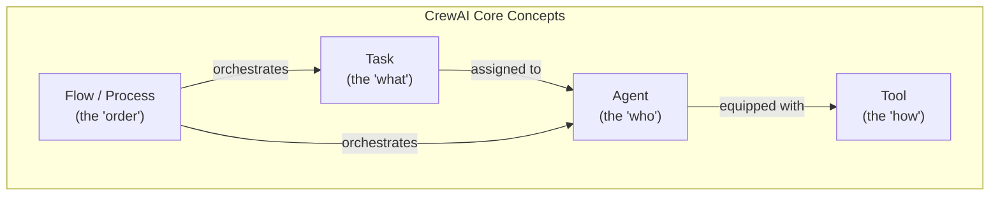
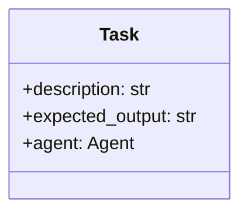
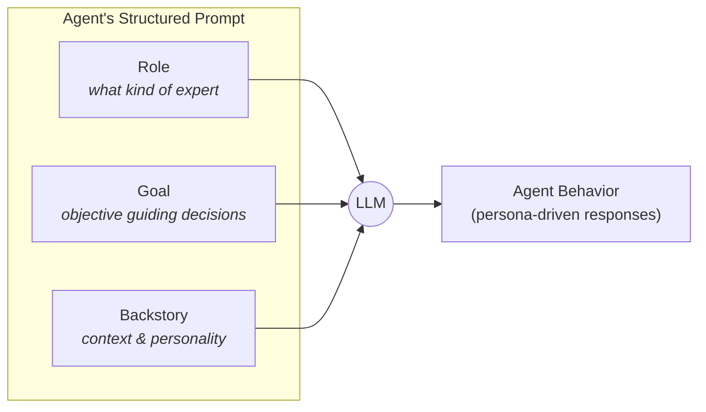
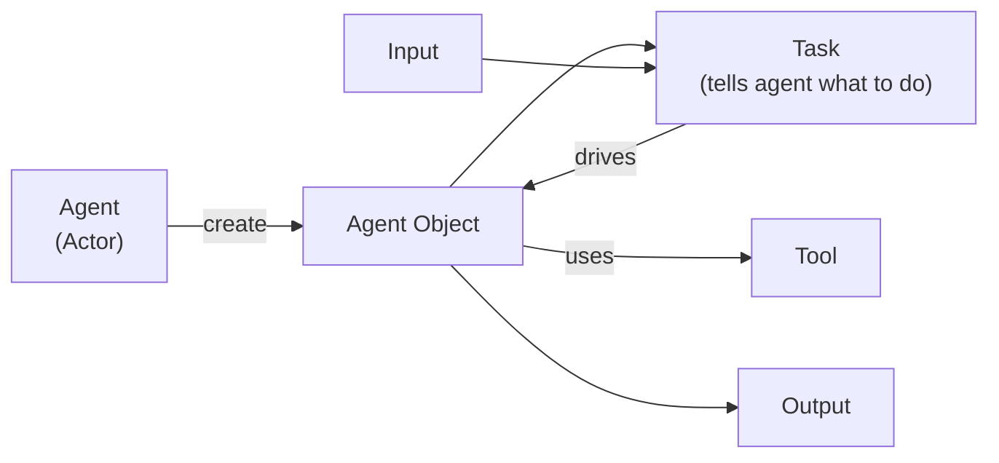
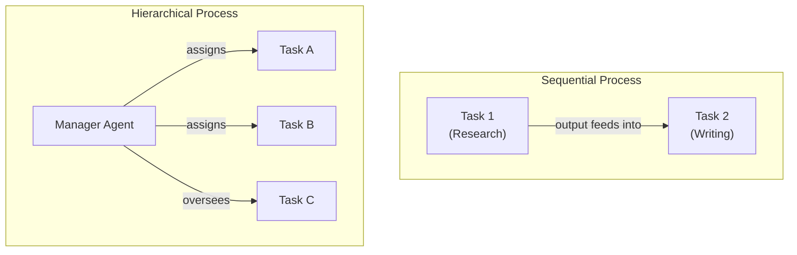
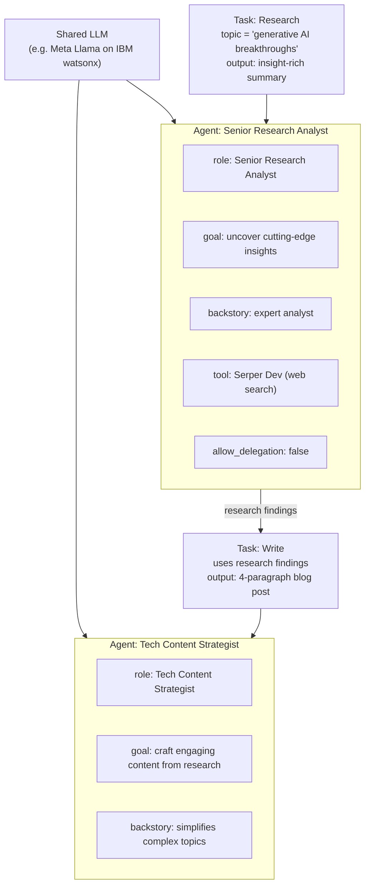
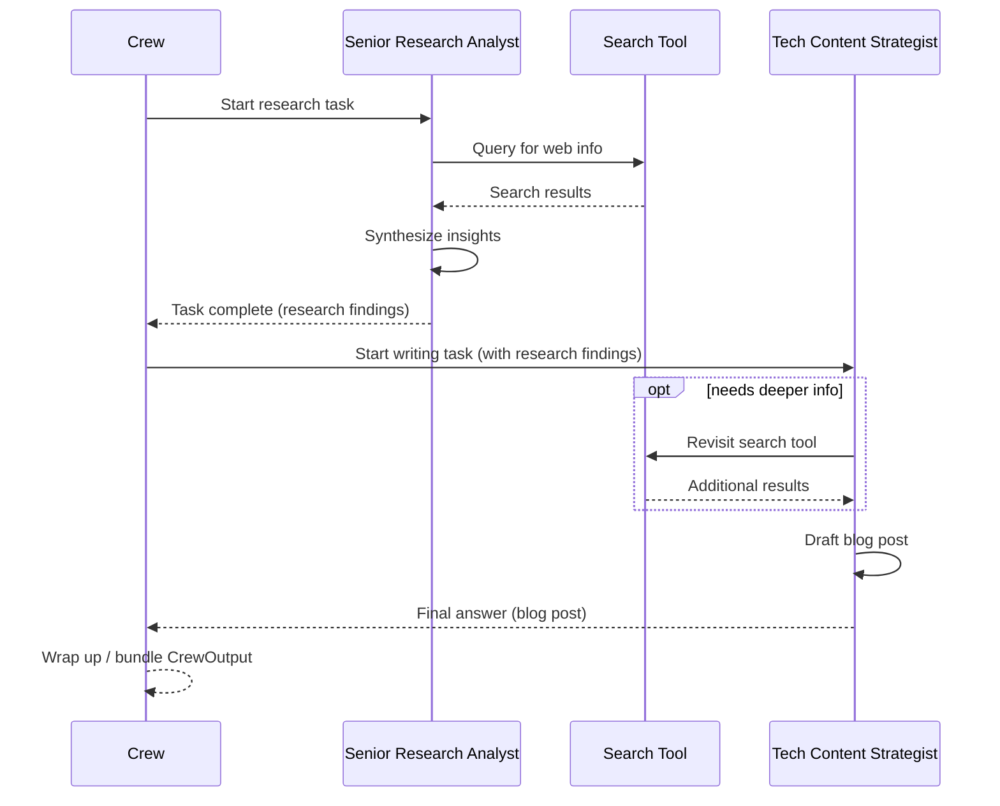
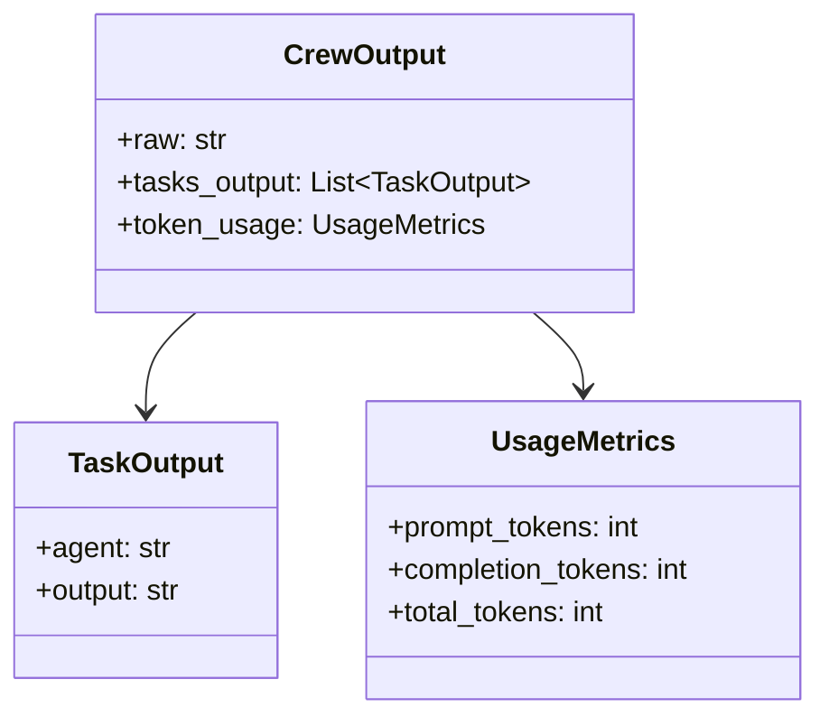

# Designing AI Agent Workflows with CrewAI

## What is CrewAI?

CrewAI is a framework for **multi-agent collaboration**. Instead of one LLM prompt trying to do everything, you assemble a *crew* of specialized AI agents, each with a clearly defined role, goal, and backstory, and give them tasks to complete — individually or together — to simulate human-like teamwork.

It's built around **four core concepts**:

| Concept | Analogy | Role |
|---|---|---|
| **Task** | Director | Defines *what* needs to be accomplished |
| **Agent** | Actor | Defines *who* does it and *how* they behave |
| **Tool** | Props/equipment | Gives agents and tasks the capability to act (search, APIs, etc.) |
| **Flow (Process)** | Shooting schedule | Defines the *order* in which tasks/agents run |



---

## 1. Task — the Director

A task is like a director with a clear vision of what needs to be accomplished. In CrewAI, a task is primarily defined by:

- **`description`** — what you want the agent to do (e.g., *"make an eye-catching commercial that will sell our car"*)
- **`expected_output`** — the specific requirements for success (e.g., *"a 30-second car commercial"*)
- **`agent`** — which agent is responsible for it

The description and expected output can contain **variable parameters** (e.g., swap "30 seconds" / "car commercial" for "20 seconds" / "boat commercial") so the same task template is reusable.

> Note: although task is conceptually explained first, in practice you typically **define the agent before the task** that will be assigned to it.



---

## 2. Agent — the Actor

An agent is an AI system powered by an LLM. Unlike a bare LLM call, CrewAI agents are given **structured prompts** that grant them a persona — skills and a role, but still needing direction (the task) to act.

An agent's structured prompt has three parts:

- **`role`** — what kind of expert the agent is (e.g., *"a cool guy driving a car"*)
- **`goal`** — the objective guiding its decisions (e.g., *"drive the car smoothly and look confident"*)
- **`backstory`** — context that shapes behavior and tone (e.g., *"a successful entrepreneur who drives expensive cars and exudes confidence"*)



---

## 3. Tools — Props & Equipment

Tools are standard components (APIs, search engines, calculators, etc.) that extend what an agent — or a task — can actually do. They can be attached at the **agent** level (available for everything that agent does) or the **task** level (available only for that specific task).

- Actor's tools: a car, stylish clothing
- Director's tools: a camera, a microphone



---

## 4. Flow (Process) — Orchestration

The **flow** (set via the `process` parameter on the `Crew` object) defines how tasks run and how agents interact.

### Sequential
Tasks run one after another in linear order — the output of one agent/task becomes the input to the next. This resembles a **reflection pattern** (feedback loop between steps), not simple prompt chaining.

### Hierarchical
A **manager agent** dynamically assigns and oversees tasks among other agents — used when more autonomy and flexibility is needed.



---

## Worked Example: A CrewAI Content Pipeline

Goal: two agents work **sequentially** — a **Research Analyst** gathers web info, and a **Content Strategist** turns it into a blog post.



### Code sketch (conceptual)

```python
from crewai import Agent, Task, Crew, Process, LLM

# Shared LLM, passed to every agent
llm = LLM(model="watsonx/meta-llama/llama-3-70b-instruct")

# Agent 1: does the research
research_analyst = Agent(
    role="Senior Research Analyst",
    goal="Uncover cutting-edge insights on {topic}",
    backstory="An expert analyst skilled at synthesizing complex information.",
    llm=llm,
    verbose=True,
    tools=[serper_dev_tool],       # real-time web search
    allow_delegation=False,        # handles only its own tasks
)

# Agent 2: turns research into content
writer = Agent(
    role="Tech Content Strategist",
    goal="Craft well-structured, engaging content based on research findings",
    backstory="Translates complex topics into simple language for wide audiences.",
    llm=llm,
    verbose=True,
)

research_task = Task(
    description="Analyze the latest generative AI breakthroughs in {topic}.",
    expected_output="A detailed, insight-rich summary.",
    agent=research_analyst,
)

writer_task = Task(
    description="Using the research findings, write an engaging blog post.",
    expected_output="An engaging, tech-savvy, 4-paragraph blog post.",
    agent=writer,
)

crew = Crew(
    agents=[research_analyst, writer],
    tasks=[research_task, writer_task],
    process=Process.sequential,   # research first, then writing
)

result = crew.kickoff(inputs={"topic": "generative AI breakthroughs"})
print(result.raw)
```

---

## Runtime Walkthrough (Sequential Crew)



> This is just **one possible path** — execution details (tool calls, clarification requests) can differ run to run.

---

## The `CrewOutput` Object

After `crew.kickoff()` completes, results are bundled into a `CrewOutput` object:

| Field | Contains |
|---|---|
| `raw` | The final, unified output from the whole crew (usually the last task's result) |
| `tasks_output` | A list of individual results per task (e.g., research report, blog post) |
| `token_usage` | Prompt / completion / total tokens — for performance & cost tracking |



To get just the final answer without task details or metadata:

```python
result = crew.kickoff(inputs={"topic": "generative AI breakthroughs"})
print(result.raw)   # combined result, e.g. covering multimodal AI, drug discovery, emerging tools
```

Since output is generated dynamically by an LLM, **rerunning the same crew can produce slightly different results**.

---

## Summary

- **CrewAI** enables multi-agent collaboration via clearly defined roles and tasks, simulating human-like teamwork.
- A **Task** defines what an agent should do: `description`, `expected_output`, and the assigned `agent`.
- An **Agent** is powered by an LLM and shaped by a structured prompt: `role`, `goal`, `backstory`.
- **Tools** (APIs, search engines, etc.) extend agent/task capability and can be assigned at either level.
- The **Crew** object ties agents, tasks, tools, and the process/flow together into one coordinated system.
- **`CrewOutput`** captures the final result (`raw`), per-task results (`tasks_output`), and cost/performance data (`token_usage`).
