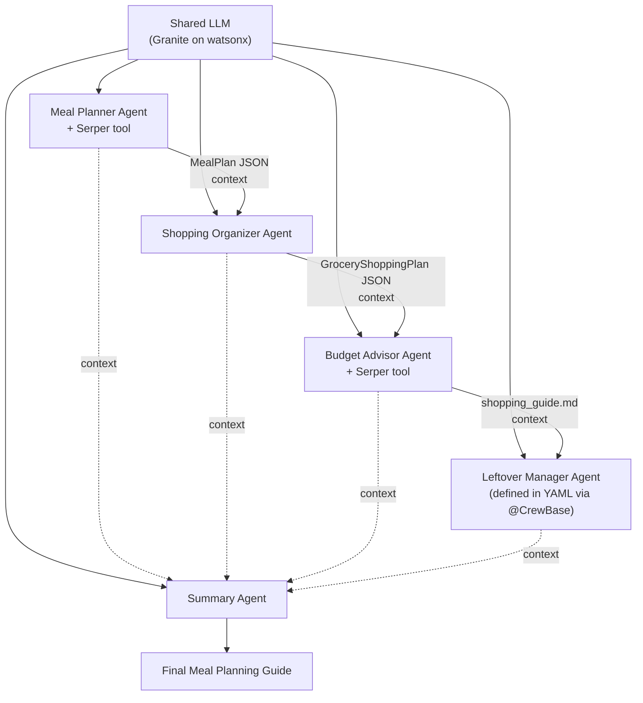
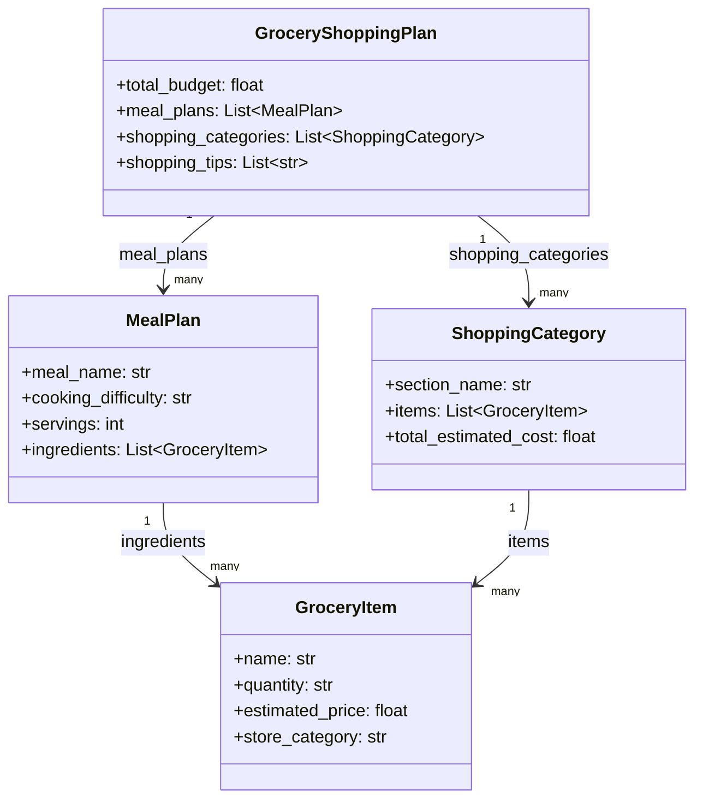
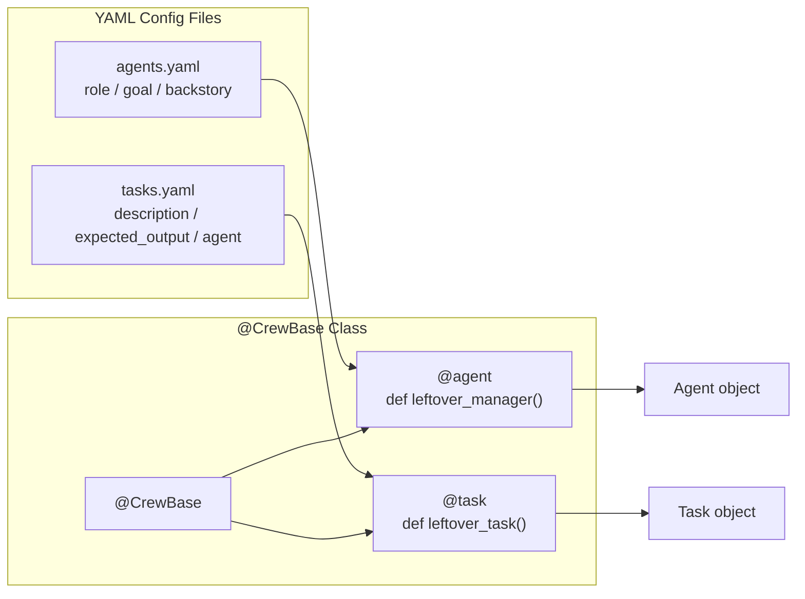
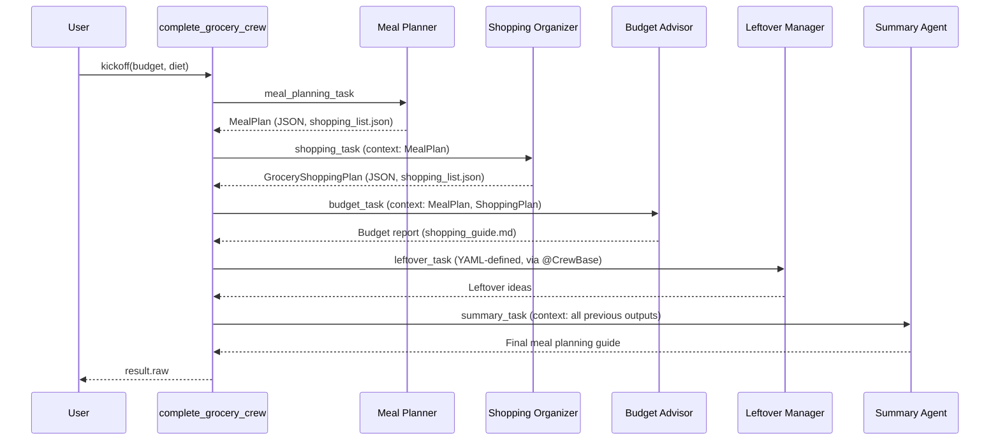

# CrewAI: Structured Outputs, YAML, and @CrewBase

## The system: a multi-agent meal planner

Five specialized agents collaborate **sequentially** to produce a complete meal-planning + shopping + budget guide:

| Agent | Responsibility | Tools |
|---|---|---|
| Meal Planner | Find recipes matching budget & dietary needs | Serper web search |
| Shopping Organizer | Turn ingredients into a grouped shopping list | none (uses `context`) |
| Budget Advisor | Keep the plan within budget, suggest savings | Serper web search |
| Leftover Manager | Suggest what to do with leftovers | defined in **YAML** via `@CrewBase` |
| Summary Agent | Compile everything into one final guide | none (uses `context` from all others) |

All agents share **one LLM instance** (Granite on watsonx) for consistent reasoning. Most agents/tasks are defined directly in Python — the **Leftover Manager** is defined in **YAML** and loaded via the `@CrewBase` class, to show the config-driven alternative.



---

## Why structured outputs (Pydantic)?

Some tasks need specific, machine-usable data — prices, quantities, dietary constraints — not free-form text. **Pydantic models** force each agent's output into a clean, validated, JSON-like shape that the *next* agent can reliably consume via `context`.

### The model hierarchy



- **`GroceryItem`** — one shopping-list line: `name`, `quantity`, `estimated_price`, `store_category`.
- **`MealPlan`** — one full meal: `meal_name`, `cooking_difficulty`, `servings`, plus a list of researched `GroceryItem` ingredients.
- **`ShoppingCategory`** — groups items by store section (e.g. "Produce"): `section_name`, its `items`, and a computed `total_estimated_cost`.
- **`GroceryShoppingPlan`** — the top-level container: introduces `total_budget`, and otherwise composes `MealPlan`s and `ShoppingCategory`s. The arrows in the diagram represent objects passed into each class's constructor.

### Code

```python
from pydantic import BaseModel
from typing import List

class GroceryItem(BaseModel):
    name: str
    quantity: str
    estimated_price: float
    store_category: str

# example
chicken = GroceryItem(
    name="Chicken Breast",
    quantity="2 lbs",
    estimated_price=8.99,
    store_category="Meat",
)

class MealPlan(BaseModel):
    meal_name: str
    cooking_difficulty: str
    servings: int
    ingredients: List[GroceryItem]

class ShoppingCategory(BaseModel):
    section_name: str
    items: List[GroceryItem]
    total_estimated_cost: float

class GroceryShoppingPlan(BaseModel):
    total_budget: float
    meal_plans: List[MealPlan]
    shopping_categories: List[ShoppingCategory]
    shopping_tips: List[str]
```

Because these inherit from Pydantic's `BaseModel`, CrewAI gets **automatic validation and serialization** — every agent's output is guaranteed to match the schema before it's handed to the next agent.

---

## Wiring structured output into a Task: `output_pydantic`

Setting `output_pydantic=<Model>` on a `Task` tells CrewAI to coerce/validate the agent's final answer into that Pydantic model instead of leaving it as raw text.

```python
from crewai import Agent, Task, Crew, Process, LLM

llm = LLM(model="watsonx/ibm/granite-13b-instruct-v2")

# --- Meal Planner ---
meal_planner = Agent(
    role="Meal Planner",
    goal="Find recipes that match the user's budget and dietary needs",
    backstory="An expert home cook who plans balanced, affordable meals.",
    tools=[serper_search_tool],
    llm=llm,
)

meal_planning_task = Task(
    description="Research meals that fit the budget of {budget} and dietary needs of {diet}.",
    expected_output="A structured meal plan with ingredients.",
    agent=meal_planner,
    output_pydantic=MealPlan,       # <-- structured output
    output_file="shopping_list.json",
)

# --- Shopping Organizer ---
shopping_organizer = Agent(
    role="Shopping Organizer",
    goal="Turn meal ingredients into a clean, categorized shopping list",
    backstory="A meticulous organizer who groups items by store section.",
    llm=llm,
)

shopping_task = Task(
    description="Group ingredients by store section, estimate quantities, and respect budget/dietary needs.",
    expected_output="A structured shopping plan grouped by section.",
    agent=shopping_organizer,
    context=[meal_planning_task],   # receives the MealPlan as input
    output_pydantic=GroceryShoppingPlan,
    output_file="shopping_list.json",
)

# --- Budget Advisor ---
budget_advisor = Agent(
    role="Budget Advisor",
    goal="Ensure the plan stays within budget and suggest savings",
    backstory="A frugal expert who finds the best prices and cost-cutting swaps.",
    tools=[serper_search_tool],
    llm=llm,
)

budget_task = Task(
    description="Analyze the meal plan and shopping list to keep total costs within budget.",
    expected_output="A markdown budget report with savings suggestions.",
    agent=budget_advisor,
    context=[meal_planning_task, shopping_task],   # pulls data from both prior tasks
    output_file="shopping_guide.md",               # markdown, not JSON, this time
)
```

Key points:
- **`context=[...]`** explicitly wires which prior tasks' outputs feed into a task — this is how data flows through the sequential crew.
- Output format is per-task: `output_pydantic` for structured JSON-like data, or a plain `output_file` (e.g. `.md`) when a human-readable report is more appropriate.

---

## Moving config out of Python: YAML + `@CrewBase`

So far, agents/tasks were defined in Python. YAML separates **configuration from code**, so non-engineers (or quick iterations) don't require touching the codebase.



### `config/agents.yaml`

```yaml
leftover_manager:
  role: >
    Leftover Manager
  goal: >
    Suggest creative, low-waste ways to use leftover ingredients
  backstory: >
    A resourceful home chef who hates food waste and turns
    leftovers into new, tasty meals.
```

### `config/tasks.yaml`

```yaml
leftover_task:
  description: >
    Using the shopping list and meal plan, suggest what to do
    with likely leftover ingredients.
  expected_output: >
    A short list of leftover-reuse ideas.
  agent: leftover_manager
```

### The `@CrewBase` class

`@CrewBase` marks a class as a crew container. CrewAI's decorators — `@agent`, `@task`, `@crew` — mark methods that must return valid `Agent`, `Task`, or `Crew` objects respectively. `@CrewBase` automatically locates the `config/` folder next to the class, so YAML is loaded with no manual file-reading code.

```python
from crewai import Agent, Task, Crew, Process
from crewai.project import CrewBase, agent, task, crew

@CrewBase
class LeftoverCrew:
    agents_config = "config/agents.yaml"
    tasks_config = "config/tasks.yaml"

    def __init__(self, llm):
        self.llm = llm

    @agent
    def leftover_manager(self) -> Agent:
        return Agent(config=self.agents_config["leftover_manager"], llm=self.llm)

    @task
    def leftover_task(self) -> Task:
        return Task(config=self.tasks_config["leftover_task"])

    @crew
    def crew(self) -> Crew:
        return Crew(
            agents=self.agents,
            tasks=self.tasks,
            process=Process.sequential,
        )
```

> **Jupyter note:** `@CrewBase` classes should be defined in a `.py` file alongside the `config/` folder, then imported into the notebook — CrewBase's auto-discovery of `config/` relies on file-based paths.

### Using it

```python
from leftover_crew import LeftoverCrew

leftovers_cb = LeftoverCrew(llm=llm)

leftover_agent = leftovers_cb.leftover_manager()   # returns the Agent object
leftover_task_obj = leftovers_cb.leftover_task()   # returns the Task object
```

---

## Tying it all together: the Summary Agent + final Crew

The **Summary Agent** gathers outputs from *all four* prior agents (Meal Planner, Shopping Organizer, Budget Advisor, Leftover Manager) as `context`, and compiles them into one complete report — recipes, shopping list, budget tips, and leftover ideas.

```python
summary_agent = Agent(
    role="Meal Plan Summarizer",
    goal="Compile all planning outputs into one cohesive guide",
    backstory="A clear communicator who turns raw data into a readable final report.",
    llm=llm,
)

summary_task = Task(
    description="Combine the meal plan, shopping list, budget advice, and leftover ideas into one guide.",
    expected_output="A complete, well-formatted meal planning guide.",
    agent=summary_agent,
    context=[meal_planning_task, shopping_task, budget_task, leftover_task_obj],
)

complete_grocery_crew = Crew(
    agents=[meal_planner, shopping_organizer, budget_advisor, leftover_agent, summary_agent],
    tasks=[meal_planning_task, shopping_task, budget_task, leftover_task_obj, summary_task],
    process=Process.sequential,
)

result = complete_grocery_crew.kickoff(inputs={"budget": "$100", "diet": "vegetarian"})
print(result.raw)
```



---

## Summary

- CrewAI builds multi-agent workflows by defining agents with clear `role` / `goal` / `backstory`, grouping them with their tasks in a `Crew`, and running them (typically `Process.sequential`).
- A **shared LLM** (e.g., Granite on watsonx) powers every agent for consistent reasoning across the pipeline.
- **Pydantic models** (`GroceryItem`, `MealPlan`, `ShoppingCategory`, `GroceryShoppingPlan`) give validated, structured data that agents can reliably pass to each other via `output_pydantic` and `context`.
- Tools like **Serper web search** let agents pull real-time external data (recipes, prices).
- Task output isn't limited to JSON — `output_file` can target `.json` for structured data or `.md` for a human-readable guide, depending on the task.
- **YAML** lets you define agents/tasks outside Python, decoupling config from code for easier updates.
- **`@CrewBase`** (with `@agent`, `@task`, `@crew` decorators) loads YAML-defined components as callable methods on a class, auto-discovering the `config/` folder.
- The workflow ends with a **Summary Agent** that uses `context` from every other task to produce one consolidated final guide.
